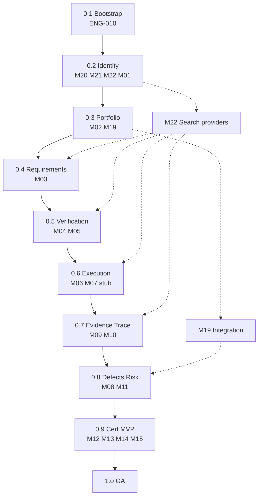
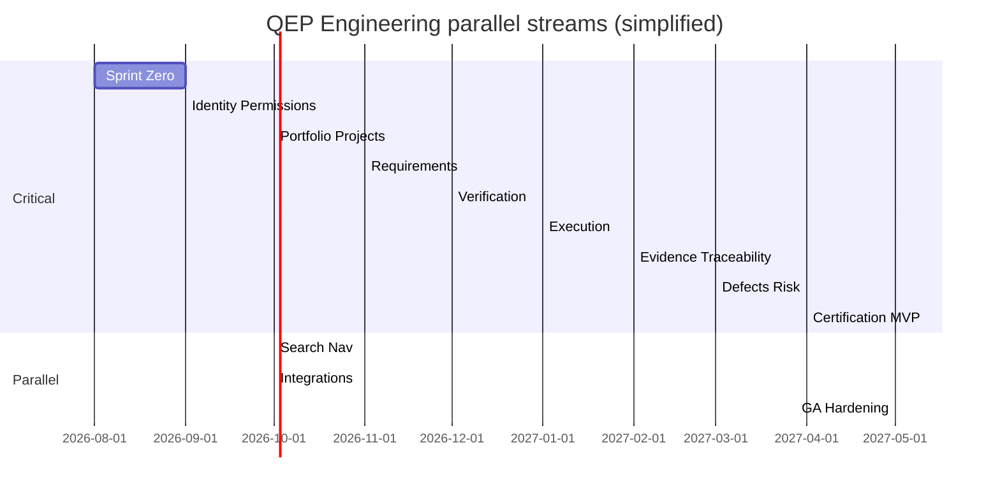
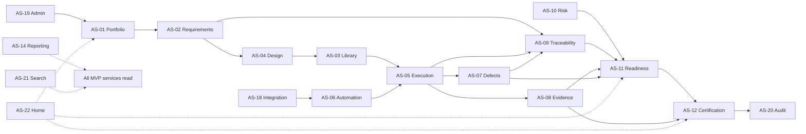

# APZQEP-PLAN-001 — Dependency Map

> **Programme:** APZQEP-PLAN-001  
> **Title:** APZ QEP Engineering Plan — Cross-Release Dependency Map  
> **Classification:** ENGINEERING PLANNING  
> **Status:** PLANNED  
> **Baseline:** APZQEP-ARCH-001 · APZQEP-DEF-002 · Platform 1.4  
> **Rule:** Planning only — no implementation

## Purpose

This document maps **dependencies, parallelism, blockers, and risk** across QEP Engineering releases **0.1 through 1.0**. It governs sequencing for module delivery (M01–M22), platform service bootstrap (AS-01–AS-22), and MVP certification path completion.

Release numbering aligns with semantic pre-release tags: `0.x` = incremental Engineering drops; **`0.9` = MVP** (DEF-002 manual certification path complete, AI/MCP OFF); **`1.0.0` = General Availability**.

## Release overview

| Release | Theme                                        | Primary modules                             | Primary services                                       | MVP path contribution                          |
| ------- | -------------------------------------------- | ------------------------------------------- | ------------------------------------------------------ | ---------------------------------------------- |
| **0.1** | Bootstrap & CI (ENG-010)                     | Registration stubs M01–M22                  | Manifest stubs AS-01–AS-22                             | Engineering foundation                         |
| **0.2** | Identity, tenant, permissions                | M20, M21, M22, M01 (stub)                   | AS-19, AS-20, AS-21, AS-22 (stub)                      | Authenticated workspace; permission-driven nav |
| **0.3** | Portfolio & projects                         | M02, M19, M01 (widgets)                     | AS-01, AS-18, AS-22                                    | Project quality workspace exists               |
| **0.4** | Requirements                                 | M03, M10 (stub), M22                        | AS-02, AS-09 (stub)                                    | Approved requirements baselined                |
| **0.5** | Verification library & design                | M04, M05, M10 (links)                       | AS-03, AS-04, AS-09                                    | Approved verifications in library              |
| **0.6** | Execution & sessions                         | M06, M07 (stub)                             | AS-05, AS-06, AS-09                                    | Manual sessions with step results              |
| **0.7** | Evidence & traceability                      | M09, M10                                    | AS-08, AS-09 (full)                                    | Evidence capture; coverage gaps visible        |
| **0.8** | Defects & risk                               | M08, M11, M19 (extension)                   | AS-07, AS-10, AS-18                                    | Closed-loop quality; risk register             |
| **0.9** | Certification, readiness, basic QI — **MVP** | M12, M13, M14 (basic), M15, M01 (full), M21 | AS-11, AS-12, AS-13, AS-14, AS-22 (full), AS-08 (lock) | Human certification with locked evidence pack  |
| **1.0** | General Availability                         | M01–M22 hardened; M16–M18 scaffolds (OFF)   | AS-01–AS-22 production readiness                       | GA — hardened MVP; Phase 2 scaffolds gated     |

**Post-1.0 (deferred):** M14 advanced QI, M16 Knowledge depth, M17 AI Workspace, M18 MCP runtime — Phase 2+ per DEF-002.

## Critical path

The **MVP certification critical path** is the longest dependent chain required for human certification without AI/MCP:

```text
0.1 Bootstrap (ENG-010)
  → 0.2 Identity + permissions (M20, M21, M22, M01 stub)
    → 0.3 M02 Portfolio + M19 Integration foundation
      → 0.4 M03 Requirements
        → 0.5 M05 Design → M04 Library
          → 0.6 M06 Execution
            → 0.7 M09 Evidence + M10 Traceability
              → 0.8 M08 Defects + M11 Risk
                → 0.9 M12 Readiness → M13 Certification (MVP)
                  → 1.0 GA hardening
```

Any slip on **0.4 (Requirements)**, **0.5 (Verification)**, or **0.9 (Certification)** directly delays MVP.

## Dependency graph (releases 0.1–1.0)



## Module dependency matrix

| Module                        | Depends on                   | Blocks                       |
| ----------------------------- | ---------------------------- | ---------------------------- |
| M20 Administration            | Platform IAM, 0.1 bootstrap  | All modules                  |
| M21 Audit                     | Platform Audit, 0.2 auth     | M13 cert investigation (0.9) |
| M22 Search                    | Platform Search, 0.2 facade  | UX (parallel per release)    |
| M01 Home                      | Read models from MVP modules | —                            |
| M02 Portfolio                 | M20                          | M03, M06, M12                |
| M03 Requirements              | M02                          | M05, M10                     |
| M04 Verification Library      | M05 (approve-in)             | M06                          |
| M05 Verification Design       | M03                          | M04, M06                     |
| M06 Execution                 | M04, M02                     | M08, M09, M12                |
| M07 Automation                | M19, M06                     | — (MVP registry stub only)   |
| M09 Evidence                  | M06                          | M13 (lock at 0.9)            |
| M10 Traceability              | M03, M04, M06, M08           | M12, M13                     |
| M08 Defects                   | M06                          | M12, M13                     |
| M11 Risk                      | M02, M03                     | M12, M13                     |
| M12 Release Readiness         | M08, M09, M10, M11           | M13                          |
| M13 Certification             | M09, M12                     | 0.9 MVP                      |
| M14 Quality Intelligence      | Upstream events 0.6–0.8      | M01 dashboards (0.9)         |
| M15 Reporting                 | All MVP SoR read             | Cert export (0.9)            |
| M19 Integration Centre        | M20, Platform connectors     | M07, M08 external links      |
| M14, M16, M17, M18 (advanced) | 0.9 MVP complete             | Phase 2                      |

## Work classification

### Critical path work

| Work item                                    | Release | Risk if delayed          |
| -------------------------------------------- | ------- | ------------------------ |
| Platform IAM + QEP permission model          | 0.2     | Entire product blocked   |
| Project quality workspace                    | 0.3     | No scoped domain context |
| Requirement approval workflow                | 0.4     | No verifiable scope      |
| Verification design → library                | 0.5     | No executable procedures |
| Manual execution sessions                    | 0.6     | No evidence source       |
| Evidence capture + traceability matrix       | 0.7     | Cert claims unsupported  |
| Traceability gap detection                   | 0.7     | Cert claims unsupported  |
| Defect retest + risk register                | 0.8     | Readiness incomplete     |
| Release readiness gates                      | 0.9     | No cert input            |
| Human certification workflow + evidence lock | 0.9     | MVP outcome missing      |

### Independent work (parallelisable)

| Work item                           | Release                   | Can run parallel with         |
| ----------------------------------- | ------------------------- | ----------------------------- |
| M22 Search provider registration    | 0.2–0.9                   | Any module after M20          |
| M01 Home composition service        | 0.3–0.9                   | After first read models exist |
| M19 Integration Centre UI           | 0.3 foundation; 0.8 depth | 0.4–0.7 core path             |
| M07 Automation registry (no runner) | 0.6                       | 0.7–0.8 if M19 stub exists    |
| Documentation & test fixtures       | All                       | Continuous                    |
| a11y audit prep                     | 0.7–0.9                   | Hardening                     |
| Performance baseline                | 0.9–1.0                   | GA hardening                  |

### Parallel work streams (recommended)



### Blocked work

| Work item                | Blocked until                               | Blocker                                   |
| ------------------------ | ------------------------------------------- | ----------------------------------------- |
| M13 Certification UI     | AS-12 service contract + M09 evidence model | Evidence + readiness aggregates (0.7–0.8) |
| Evidence pack lock       | 0.9 CertificationService                    | Capture + traceability complete (0.7)     |
| M17 AI Workspace runtime | 0.9 MVP + Owner AI programme                | AI default OFF                            |
| M18 MCP write tools      | 1.0 GA + MCP maturity gate                  | Governance + audit pipeline               |
| M14 Advanced QI          | 1.0 GA + sufficient SoR volume              | Derived analytics need data               |
| M16 Full Knowledge Base  | Phase 2 prioritisation                      | MVP optional minimal only                 |
| Production deploy        | 1.0 GA hardening pass                       | E2E cert path green at 0.9                |
| Kiwi migration tooling   | Owner decision post-MVP                     | Not in MVP scope                          |

### High-risk work

| Work item                             | Risk                          | Mitigation                                                |
| ------------------------------------- | ----------------------------- | --------------------------------------------------------- |
| Evidence pack lock + immutability     | Data integrity; audit failure | Early spike in 0.7; lock contract in 0.9; CERT-ARCH-01–06 |
| Multi-approver certification workflow | Policy complexity             | Workflow service + tenant policy in 0.2 admin             |
| Traceability graph at scale           | Performance                   | Derived read model; async indexing                        |
| Permission model (22 modules)         | Authz bugs                    | Permission matrix tests; server authoritative             |
| Platform Search indexing lag          | Stale search results          | Event-driven index; acceptance thresholds in 0.9          |
| GitHub ingest (M07/M19)               | Connector flakiness           | Circuit breaker; manual path unaffected                   |
| Modular monolith boundaries           | Coupling creep                | Bounded context reviews each release                      |
| E2E certification Playwright          | Flaky long-path tests         | Idempotent fixtures; tagged `@mvp-cert` at 0.9            |

## Platform dependencies (external to QEP releases)

| Platform capability   | Required by            | Release                           |
| --------------------- | ---------------------- | --------------------------------- |
| BetterAuth sessions   | All modules            | 0.2                               |
| PermissionService     | All modules            | 0.2                               |
| API Gateway routing   | All services           | 0.2                               |
| Platform Audit events | M21                    | 0.2 stub, 0.9 cert investigation  |
| Platform Search       | M22                    | 0.2 facade, providers per release |
| Attention Engine      | Notifications          | 0.6+                              |
| Event Bus             | All async side effects | 0.4+                              |
| PostgreSQL (platform) | QEP metadata           | 0.2 (schema in ENG-011)           |
| S3-compatible storage | M09 evidence blobs     | 0.7                               |

Platform 1.4 is **CERTIFIED** — QEP consumes; no platform redesign.

## Service dependency graph (logical)



## Release gate criteria (summary)

| Release | Gate                                                                |
| ------- | ------------------------------------------------------------------- |
| 0.1     | CI green; packages discoverable; no business logic                  |
| 0.2     | Platform auth + QEP permissions; admin policy; audit/search stubs   |
| 0.3     | Project CRUD; project-scoped permissions; Integration Centre health |
| 0.4     | Requirement approve + baseline; traceability stub                   |
| 0.5     | Design approve + library publish; req→verification links            |
| 0.6     | Manual session complete with step results                           |
| 0.7     | Evidence attach + traceability matrix; coverage gaps visible        |
| 0.8     | Defect retest + risk acceptance                                     |
| 0.9     | Human certification with locked pack — **MVP**                      |
| 1.0     | Owner GA acceptance; AI/MCP OFF confirmed; production readiness     |

## Cross-reference

- Sprint Zero detail: [SPRINT-ZERO.md](./SPRINT-ZERO.md)
- MVP scope: [MVP-PLAN.md](./MVP-PLAN.md)
- Team allocation: [TEAM-PLAN.md](./TEAM-PLAN.md)
- Test gates: [TESTING-ROADMAP.md](./TESTING-ROADMAP.md)

---

| Version    | Date       | Change                                      |
| ---------- | ---------- | ------------------------------------------- |
| 1.0.0-plan | 2026-07-24 | Initial dependency map — APZQEP-PLAN-001    |
| 1.0.1-plan | 2026-07-24 | Release mappings aligned to RELEASE-PLAN.md |
