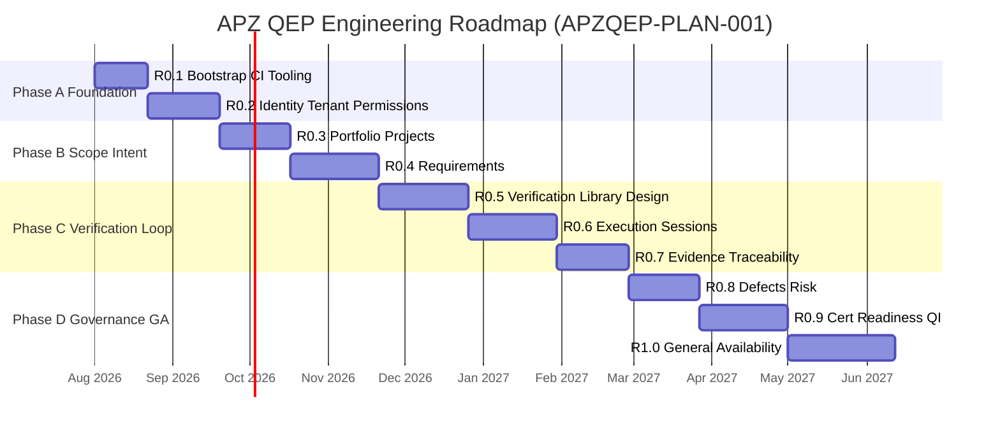

# APZQEP-PLAN-001 — Engineering Roadmap

> **Programme:** APZQEP-PLAN-001  
> **Classification:** ENGINEERING PLANNING  
> **Baseline:** APZQEP-ARCH-001 (**ACCEPTED**) · APZQEP-DEF-002 (**ACCEPTED**)  
> **Rule:** Roadmap and sequencing only — no implementation

## Purpose

This document defines the **full engineering roadmap** for APZ QEP from repository bootstrap through **Version 1.0 General Availability**. It establishes phases, vertical delivery slices, milestone gates, and the strategic sequencing rationale that downstream release and epic documents detail.

The roadmap answers: _in what order shall QEP be built so that each increment is releasable, architecture-compliant, and moves the product toward certifiable manual MVP and GA?_

---

## Roadmap principles

| Principle                 | Roadmap application                                                                                                       |
| ------------------------- | ------------------------------------------------------------------------------------------------------------------------- |
| Vertical slices           | Each phase closes a user-visible capability chain, not a technical layer in isolation                                     |
| Dependency respect        | Portfolio before requirements; requirements before verification; execution before evidence; evidence before certification |
| Platform composition      | Phases 0.1–0.2 establish QEP on Platform 1.4 without re-platforming                                                       |
| Manual-first              | Phases through 0.9 deliver full manual QE lifecycle; AI/MCP phases are explicitly post-MVP                                |
| Extraction-ready monolith | Service boundaries (AS-01–AS-22) align to releases but co-deploy until GA                                                 |
| Test pyramid              | Each phase exit requires defined test gates per [TESTING-ROADMAP.md](./TESTING-ROADMAP.md)                                |

---

## Strategic overview

APZ QEP engineering proceeds in **four macro phases** spanning ten numbered releases:

```text
Phase A — Foundation (Releases 0.1–0.2)
  Monorepo bootstrap · CI/CD · QEP shell registration · platform IAM reuse · QEP RBAC policy

Phase B — Scope & Intent (Releases 0.3–0.4)
  Portfolio/projects · integration foundation · requirements lifecycle

Phase C — Verification Loop (Releases 0.5–0.7)
  Verification library/design · execution/sessions · evidence · traceability

Phase D — Governance & GA (Releases 0.8–1.0)
  Defects/risk · readiness · human certification · reporting · hardening · GA
```

Phase 2 capabilities (AI workspace, MCP, advanced QI, knowledge depth) are **scheduled after MVP closure** at release 0.9 and hardened for GA at 1.0 as gated, OFF-by-default surfaces — not on the MVP critical path.

---

## Release timeline (mermaid)



_Durations are planning estimates for sequencing — not committed delivery dates. Actual programme authorisation sets sprint calendars._

---

## Phase and release map

| Phase | Release | Engineering theme              | Vertical slice outcome                                                       |
| ----- | ------- | ------------------------------ | ---------------------------------------------------------------------------- |
| A     | **0.1** | Bootstrap & quality gates      | QEP packages build; CI green; no domain features                             |
| A     | **0.2** | Platform identity + QEP policy | Authenticated users; tenant scope; permission-driven shell; admin foundation |
| B     | **0.3** | Portfolio & project scope      | Quality workspace with project context; external link foundation             |
| B     | **0.4** | Requirements lifecycle         | Approve and baseline requirements linked to project                          |
| C     | **0.5** | Verification assets            | Design, review, approve manual verifications into library                    |
| C     | **0.6** | Execution                      | Plan and complete manual sessions with step results                          |
| C     | **0.7** | Evidence & traceability        | Capture evidence; traceability matrix; coverage gaps visible                 |
| D     | **0.8** | Defects & risk                 | Raise defects; risk register; retest linkage                                 |
| D     | **0.9** | Certification path             | Readiness gates; human certification; basic reporting/QI                     |
| D     | **1.0** | GA                             | Production readiness; performance; security; docs; all MVP modules hardened  |

---

## Vertical slice strategy

Each release after 0.1 must deliver a **demonstrable slice** verifiable by QA and Product:

| Release | Vertical slice narrative                                                    | Demo script (planning)                              |
| ------- | --------------------------------------------------------------------------- | --------------------------------------------------- |
| 0.2     | User logs in; sees permission-filtered QEP nav; admin configures QEP policy | Login → shell → admin policy screen                 |
| 0.3     | Admin creates project quality workspace with owners and environment         | Create project → assign owner → dashboard stub      |
| 0.4     | BA approves requirement with acceptance criteria in project                 | Author → review → approve → baseline                |
| 0.5     | QA designs verification from requirement; approves to library               | Design → peer review → library asset                |
| 0.6     | Tester completes manual session with pass/fail per step                     | Plan run → execute → complete session               |
| 0.7     | Evidence attached; traceability shows link req→verification→result          | Execute with evidence → open matrix → gap visible   |
| 0.8     | Defect raised from failed step; risk recorded; retest planned               | Fail step → defect → link → retest queue            |
| 0.9     | Readiness snapshot; human certifies with locked evidence pack               | Readiness review → cert decision → audit trail      |
| 1.0     | Enterprise deploy; full regression; GA documentation                        | End-to-end cert path in staging/production-like env |

Slices **accumulate** — no release removes prior slice capability except by explicit Owner decision.

---

## Module scheduling across roadmap

All **22 modules** from DEF-002 appear in the roadmap. MVP-critical modules deliver in Phases B–D; Phase 2 modules deliver scaffolds or depth per band below.

| Module | Name                         | Primary release                       | Secondary / depth          |
| ------ | ---------------------------- | ------------------------------------- | -------------------------- |
| M01    | Home and Command Centre      | 0.2 (stub) → 0.9 (full widgets)       | 1.0 polish                 |
| M02    | Portfolio and Projects       | 0.3                                   | 1.0 multi-portfolio depth  |
| M03    | Requirements                 | 0.4                                   | 1.0 import hardening       |
| M04    | Verification Library         | 0.5                                   | 1.0 suite templates        |
| M05    | Verification Design          | 0.5                                   | Phase 2 AI draft (gated)   |
| M06    | Execution and Sessions       | 0.6                                   | 1.0 handover polish        |
| M07    | Automation Management        | 0.6 (registry stub)                   | Post-1.0 ingest depth      |
| M08    | Defects and Quality Issues   | 0.8                                   | 1.0 external sync          |
| M09    | Evidence                     | 0.7                                   | 1.0 pack templates         |
| M10    | Traceability                 | 0.7                                   | 1.0 gap analytics          |
| M11    | Risk Management              | 0.8                                   | Phase 2 treatment depth    |
| M12    | Release Readiness            | 0.9                                   | 1.0 waiver workflows       |
| M13    | Certification                | 0.9                                   | 1.0 multi-approver         |
| M14    | Quality Intelligence         | 0.9 (basic indicators)                | Phase 2+ advanced (AI OFF) |
| M15    | Reporting and Analytics      | 0.9 (core dashboards)                 | 1.0 scheduled exports      |
| M16    | Knowledge and Learning       | 1.0 (scaffold, optional)              | Phase 2 full               |
| M17    | AI Quality Workspace         | 1.0 (disabled scaffold)               | Phase 2+ when authorised   |
| M18    | MCP and Developer Experience | 1.0 (catalogue stub)                  | Phase 2+ when authorised   |
| M19    | Integration Centre           | 0.3 (foundation)                      | 0.8–1.0 connector depth    |
| M20    | Administration               | 0.2 → 0.9                             | 1.0 entitlements           |
| M21    | Audit and Compliance         | 0.2 (consume platform)                | 0.9 investigation views    |
| M22    | Search and Navigation        | 0.2 (platform) → per-module providers | 1.0 saved searches         |

---

## Logical service rollout (AS-01–AS-22)

Services from APPLICATION-ARCHITECTURE align to releases as **implementation units** inside the modular monolith:

| Service ID | Service                      | First release      | Notes                              |
| ---------- | ---------------------------- | ------------------ | ---------------------------------- |
| AS-19      | QEPAdministrationService     | 0.2                | QEP policy on platform IAM         |
| AS-20      | QEPAuditService              | 0.2                | Investigation views expand 0.9     |
| AS-21      | QEPSearchFacadeService       | 0.2                | Providers register as modules ship |
| AS-22      | HomeCompositionService       | 0.2 stub → 0.9     | Read-model aggregation             |
| AS-01      | PortfolioService             | 0.3                |                                    |
| AS-18      | IntegrationManagementService | 0.3                |                                    |
| AS-02      | RequirementService           | 0.4                |                                    |
| AS-03      | VerificationLibraryService   | 0.5                |                                    |
| AS-04      | VerificationDesignService    | 0.5                |                                    |
| AS-05      | ExecutionService             | 0.6                |                                    |
| AS-06      | AutomationManagementService  | 0.6 stub           |                                    |
| AS-08      | EvidenceService              | 0.7                |                                    |
| AS-09      | TraceabilityService          | 0.7                |                                    |
| AS-07      | DefectService                | 0.8                |                                    |
| AS-10      | RiskService                  | 0.8                |                                    |
| AS-11      | ReleaseReadinessService      | 0.9                |                                    |
| AS-12      | CertificationService         | 0.9                |                                    |
| AS-13      | QualityIntelligenceService   | 0.9 basic          |                                    |
| AS-14      | ReportingService             | 0.9                |                                    |
| AS-15      | KnowledgeService             | 1.0 scaffold       |                                    |
| AS-16      | AIQualityService             | 1.0 scaffold (OFF) |                                    |
| AS-17      | MCPGatewayService            | 1.0 scaffold (OFF) |                                    |

---

## Engineering milestones

| Milestone   | Target release | Meaning                                      |
| ----------- | -------------- | -------------------------------------------- |
| **M-BOOT**  | 0.1 complete   | ENG-010 done; CI green; QEP package skeleton |
| **M-AUTH**  | 0.2 complete   | Platform auth + QEP permissions operational  |
| **M-SCOPE** | 0.3 complete   | Project quality workspace usable             |
| **M-REQ**   | 0.4 complete   | Approved requirements baselined              |
| **M-VER**   | 0.5 complete   | Approved verifications in library            |
| **M-EXEC**  | 0.6 complete   | Manual session end-to-end                    |
| **M-EVID**  | 0.7 complete   | Evidence + traceability matrix               |
| **M-GOV**   | 0.8 complete   | Defects and risk in loop                     |
| **M-CERT**  | 0.9 complete   | **MVP achieved** — human certification path  |
| **M-GA**    | 1.0 complete   | General Availability                         |

---

## Parallel workstreams

While the **critical path** is sequential through domain dependencies (see [DEPENDENCY-MAP.md](./DEPENDENCY-MAP.md)), these workstreams may proceed in parallel within release bands:

| Workstream                   | Parallel with         | Constraint                              |
| ---------------------------- | --------------------- | --------------------------------------- |
| Shell/module registration    | 0.2+ domain work      | Must not bypass PermissionService       |
| Search provider registration | Module implementation | Async indexing only                     |
| Reporting read models        | Domain releases       | No SoR in reporting layer               |
| Documentation & manifests    | All releases          | Manifest before code (024–029)          |
| Playwright E2E scenarios     | From 0.4              | One vertical scenario per release       |
| Integration connector stubs  | 0.3+                  | ACL only; no engine coupling in modules |
| Performance baselines        | 0.8+                  | Non-blocking until 1.0                  |
| Phase 2 scaffolds (AI/MCP)   | 1.0 band              | Feature flags OFF; no MVP dependency    |

---

## Future phases (post-1.0 roadmap sketch)

Planning beyond 1.0 GA is **indicative only** — requires new Owner-approved programme.

| Phase   | Theme                         | Modules  | Gate                            |
| ------- | ----------------------------- | -------- | ------------------------------- |
| **1.1** | Automation ingest depth       | M07      | CI connector maturity           |
| **1.2** | ALM synchronisation           | M03, M19 | Owner integration approval      |
| **1.3** | Advanced risk & QI            | M11, M14 | AI policy review if ML-assisted |
| **2.0** | AI Quality Workspace          | M17      | AI Constitution authorisation   |
| **2.1** | MCP developer experience      | M18      | MCP security review             |
| **2.2** | Knowledge & learning          | M16      | Content governance approval     |
| **3.0** | Continuous verification modes | M06, M12 | Maturity L7 per DEF-002         |

---

## Risk-aware sequencing decisions

| Decision                          | Rationale                                           | Alternative rejected                                  |
| --------------------------------- | --------------------------------------------------- | ----------------------------------------------------- |
| Platform IAM in 0.2 before domain | Every domain operation requires authz               | Custom QEP auth (violates platform-first)             |
| Requirements before verification  | Verification designs trace to approved requirements | Library-first (breaks traceability chain)             |
| Evidence with traceability in 0.7 | Cert requires evidence lineage + coverage gaps      | Cert before traceability (violates Constitution)      |
| Certification in 0.9 not 0.7      | Readiness needs defects, risk, evidence             | Early cert demo (false confidence)                    |
| AI/MCP after MVP                  | Manual-first MVP; AI OFF default                    | AI-assisted design in MVP (violates guardrails)       |
| Monorepo in existing APZHUB repo  | Platform 1.4 certified; shared tooling              | Separate QEP repository (duplicate CI/platform drift) |

---

## Architecture compliance checkpoints

Each release exit validates:

| Checkpoint                      | Source                             |
| ------------------------------- | ---------------------------------- |
| Layer model respected           | ARCH 003 alignment                 |
| Module→Service→Connector path   | ARCH 008, 009                      |
| SoR ownership                   | INFORMATION-ARCHITECTURE           |
| Events not direct notify/search | ARCH 012, 019, 020                 |
| Human certification gates       | Constitution + CERTIFICATION-MODEL |
| AI/MCP disabled unless flagged  | AI-ARCHITECTURE, MCP-ARCHITECTURE  |
| Zero Trust on all mutations     | SECURITY-ARCHITECTURE              |

---

## Relationship to engineering programmes

| Programme           | Roadmap span                                          |
| ------------------- | ----------------------------------------------------- |
| APZQEP-ENG-010      | Implements Phase A release 0.1 (Sprint Zero)          |
| APZQEP-ENG-011+     | One or more programmes per release band (Owner-named) |
| Platform programmes | None required for MVP — reuse 1.4                     |

---

## Document control

| Version    | Date       | Change                            |
| ---------- | ---------- | --------------------------------- |
| 1.0.0-plan | 2026-07-24 | Initial roadmap — APZQEP-PLAN-001 |
