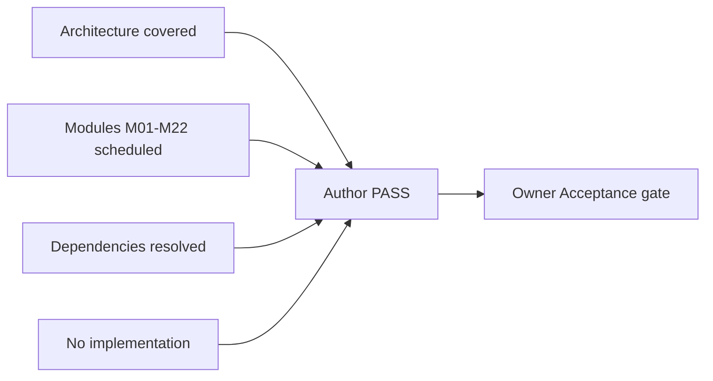

# APZQEP-PLAN-001 — Implementation Checklist

> **Programme:** APZQEP-PLAN-001  
> **Title:** APZ QEP Engineering Plan — Validation Checklist  
> **Classification:** ENGINEERING PLANNING  
> **Status:** VALIDATED — author sign-off **PASS**  
> **Date:** 2026-07-24  
> **Rule:** This checklist validates **planning completeness only** — not implementation

## Purpose

Author validation confirming APZQEP-PLAN-001 Engineering Planning pack is complete, architecture-aligned, module-complete, dependency-resolved, and contains **no implementation artefacts** (code, schemas, endpoints, or repository mutations).

## Deliverables inventory

| #   | Document                 | Path                                                         | Lines (min 120) | Status   |
| --- | ------------------------ | ------------------------------------------------------------ | --------------- | -------- |
| 1   | Sprint Zero Definition   | [SPRINT-ZERO.md](./SPRINT-ZERO.md)                           | ✓               | Complete |
| 2   | Dependency Map           | [DEPENDENCY-MAP.md](./DEPENDENCY-MAP.md)                     | ✓               | Complete |
| 3   | Team Plan                | [TEAM-PLAN.md](./TEAM-PLAN.md)                               | ✓               | Complete |
| 4   | MVP Plan                 | [MVP-PLAN.md](./MVP-PLAN.md)                                 | ✓               | Complete |
| 5   | Testing Roadmap          | [TESTING-ROADMAP.md](./TESTING-ROADMAP.md)                   | ✓               | Complete |
| 6   | Implementation Checklist | [IMPLEMENTATION-CHECKLIST.md](./IMPLEMENTATION-CHECKLIST.md) | ✓               | Complete |
| 7   | Completion Report        | [COMPLETION-REPORT.md](./COMPLETION-REPORT.md)               | ✓               | Complete |
| 8   | Owner Acceptance         | [OWNER-ACCEPTANCE.md](./OWNER-ACCEPTANCE.md)                 | ✓               | Complete |

## Architecture coverage

| Architecture domain                        | Covered in plan | Reference                        |
| ------------------------------------------ | --------------- | -------------------------------- |
| Modular monolith first (QEP-AD-001)        | ✓               | SPRINT-ZERO, DEPENDENCY-MAP      |
| Platform Service boundary (QEP-AD-003)     | ✓               | SPRINT-ZERO, TEAM-PLAN           |
| AI default OFF (QEP-AD-004)                | ✓               | MVP-PLAN, TESTING-ROADMAP        |
| Human certification mandatory (QEP-AD-007) | ✓               | MVP-PLAN, DEPENDENCY-MAP         |
| Evidence lock on certify (QEP-AD-006)      | ✓               | MVP-PLAN, TESTING-ROADMAP        |
| Manual verification MVP (QEP-AD-010)       | ✓               | MVP-PLAN                         |
| Bounded contexts / services AS-01–AS-22    | ✓               | DEPENDENCY-MAP                   |
| Platform 1.4 consumption                   | ✓               | SPRINT-ZERO, TEAM-PLAN           |
| Event-driven side effects                  | ✓               | DEPENDENCY-MAP                   |
| Zero Trust pipeline                        | ✓               | TESTING-ROADMAP (security gates) |
| Deployment self-host first                 | ✓               | SPRINT-ZERO                      |
| Search derived index                       | ✓               | DEPENDENCY-MAP (M22)             |
| IAM BetterAuth + PermissionService         | ✓               | SPRINT-ZERO, TEAM-PLAN           |

## Module scheduling (M01–M22)

| Module                   | Scheduled release         | MVP tier    | Check |
| ------------------------ | ------------------------- | ----------- | ----- |
| M01 Home                 | 0.2 stub → 0.9 full       | Must Have   | ✓     |
| M02 Portfolio            | 0.3                       | Must Have   | ✓     |
| M03 Requirements         | 0.4                       | Must Have   | ✓     |
| M04 Verification Library | 0.5                       | Must Have   | ✓     |
| M05 Verification Design  | 0.5                       | Must Have   | ✓     |
| M06 Execution            | 0.6                       | Must Have   | ✓     |
| M07 Automation           | 0.6 stub                  | Should Have | ✓     |
| M08 Defects              | 0.8                       | Must Have   | ✓     |
| M09 Evidence             | 0.7                       | Must Have   | ✓     |
| M10 Traceability         | 0.7                       | Must Have   | ✓     |
| M11 Risk                 | 0.8                       | Must Have   | ✓     |
| M12 Release Readiness    | 0.9                       | Must Have   | ✓     |
| M13 Certification        | 0.9                       | Must Have   | ✓     |
| M14 Quality Intelligence | 0.9 basic                 | Should Have | ✓     |
| M15 Reporting            | 0.9                       | Must Have   | ✓     |
| M16 Knowledge            | 1.0 scaffold optional     | Could Have  | ✓     |
| M17 AI Workspace         | Post-1.0                  | Deferred    | ✓     |
| M18 MCP DX               | Post-1.0                  | Deferred    | ✓     |
| M19 Integration Centre   | 0.3 foundation → 0.8      | Must Have   | ✓     |
| M20 Administration       | 0.2                       | Must Have   | ✓     |
| M21 Audit                | 0.2 stub → 0.9 cert       | Must Have   | ✓     |
| M22 Search               | 0.2 partial → per release | Must Have   | ✓     |

**Result:** All 22 modules scheduled — **PASS**

## Logical service scheduling (AS-01–AS-22)

| Service                            | Scheduled           | Check |
| ---------------------------------- | ------------------- | ----- |
| AS-01 PortfolioService             | 0.3                 | ✓     |
| AS-02 RequirementService           | 0.4                 | ✓     |
| AS-03 VerificationLibraryService   | 0.5                 | ✓     |
| AS-04 VerificationDesignService    | 0.5                 | ✓     |
| AS-05 ExecutionService             | 0.6                 | ✓     |
| AS-06 AutomationManagementService  | 0.6 stub            | ✓     |
| AS-07 DefectService                | 0.8                 | ✓     |
| AS-08 EvidenceService              | 0.7 (lock at 0.9)   | ✓     |
| AS-09 TraceabilityService          | 0.4 stub → 0.7 full | ✓     |
| AS-10 RiskService                  | 0.8                 | ✓     |
| AS-11 ReleaseReadinessService      | 0.9                 | ✓     |
| AS-12 CertificationService         | 0.9                 | ✓     |
| AS-13 QualityIntelligenceService   | 0.9 basic           | ✓     |
| AS-14 ReportingService             | 0.9                 | ✓     |
| AS-15 KnowledgeService             | 1.0 scaffold        | ✓     |
| AS-16 AIQualityService             | Post-1.0            | ✓     |
| AS-17 MCPGatewayService            | Post-1.0            | ✓     |
| AS-18 IntegrationManagementService | 0.3 → 0.8           | ✓     |
| AS-19 QEPAdministrationService     | 0.2                 | ✓     |
| AS-20 QEPAuditService              | 0.2 → 0.9           | ✓     |
| AS-21 QEPSearchFacadeService       | 0.2–0.9             | ✓     |
| AS-22 HomeCompositionService       | 0.2 stub → 0.9 full | ✓     |

## Dependency resolution

| Check                                 | Result |
| ------------------------------------- | ------ |
| Critical path documented 0.1 → 1.0    | ✓ PASS |
| Parallel work identified              | ✓ PASS |
| Blocked work identified with blockers | ✓ PASS |
| High-risk work with mitigations       | ✓ PASS |
| Platform dependencies mapped          | ✓ PASS |
| Release gate criteria defined         | ✓ PASS |
| No circular release dependencies      | ✓ PASS |

## DEF-002 MVP alignment

| DEF-002 requirement           | Plan reference               | Check |
| ----------------------------- | ---------------------------- | ----- |
| Full manual quality lifecycle | MVP-PLAN lifecycle flow      | ✓     |
| Human certification           | M13 release 0.9              | ✓     |
| AI not required               | MVP-PLAN Deferred M17        | ✓     |
| MCP advanced deferred         | MVP-PLAN Deferred M18        | ✓     |
| Evidence lock on certify      | TESTING-ROADMAP 0.9          | ✓     |
| Traceability gaps             | M10 release 0.7              | ✓     |
| Tenant/RBAC                   | M20 release 0.2              | ✓     |
| GitHub ingest foundation      | M19/M07 release 0.3/0.6 stub | ✓     |

## Prohibitions confirmed (no implementation)

| Prohibition                       | Verified | Method                                                |
| --------------------------------- | -------- | ----------------------------------------------------- |
| No production code created        | ✓        | Repository scan — docs only under `engineering-plan/` |
| No database schemas / migrations  | ✓        | No SQL/Prisma/Drizzle files added                     |
| No API endpoints / OpenAPI specs  | ✓        | No route or spec files added                          |
| No repository structure mutations | ✓        | No new `modules/qep-*` packages created               |
| No ADRs with library selection    | ✓        | Planning references ENG-010 for ADRs                  |
| No UI mockups / wireframes        | ✓        | Text planning only                                    |
| Platform 1.4 unchanged            | ✓        | Consumption-only posture documented                   |
| Platform 2.0 not begun            | ✓        | Not referenced as active                              |

## Quality & release alignment (015)

| 015 requirement     | Plan coverage                    | Check |
| ------------------- | -------------------------------- | ----- |
| Full test pyramid   | TESTING-ROADMAP                  | ✓     |
| CI every commit     | SPRINT-ZERO                      | ✓     |
| Playwright E2E      | TESTING-ROADMAP `@mvp-cert`      | ✓     |
| a11y WCAG AA target | TESTING-ROADMAP G6               | ✓     |
| Security gates      | TESTING-ROADMAP G7               | ✓     |
| Definition of Done  | TESTING-ROADMAP 0.9 MVP / 1.0 GA | ✓     |

## Team & capacity

| Check                           | Result |
| ------------------------------- | ------ |
| Eight teams defined             | ✓ PASS |
| RACI per release                | ✓ PASS |
| Capacity assumptions documented | ✓ PASS |
| Escalation path defined         | ✓ PASS |

## Sprint Zero & next programme

| Check                                      | Result |
| ------------------------------------------ | ------ |
| Monorepo within existing APZHUB workspace  | ✓ PASS |
| No second monorepo invented                | ✓ PASS |
| APZQEP-ENG-010 named as next programme     | ✓ PASS |
| Platform 1.4 coexistence documented        | ✓ PASS |
| `apz-stack` port non-conflict acknowledged | ✓ PASS |

## Evidence

| Item                  | Path                                                                              |
| --------------------- | --------------------------------------------------------------------------------- |
| Plan evidence JSON    | `docs/operations/evidence/portfolio-recert/20260724T183600Z-APZQEP-PLAN-001.json` |
| Architecture baseline | `docs/products/apzqep/architecture/`                                              |
| Product definition    | `docs/products/apzqep/product-definition/`                                        |

## Author sign-off

| Role                                        | Result   | Date       | Notes                         |
| ------------------------------------------- | -------- | ---------- | ----------------------------- |
| Author validation                           | **PASS** | 2026-07-24 | All checklist items satisfied |
| Architecture alignment                      | **PASS** | 2026-07-24 | No contradictions to ARCH-001 |
| Module completeness M01–M22                 | **PASS** | 2026-07-24 | All scheduled                 |
| No implementation performed                 | **PASS** | 2026-07-24 | Documentation only            |
| Ready for Owner Engineering Plan Acceptance | **YES**  | 2026-07-24 | See OWNER-ACCEPTANCE.md       |

## Validation summary

**Overall validation result: PASS**

---

| Version    | Date       | Change                                         |
| ---------- | ---------- | ---------------------------------------------- |
| 1.0.0-plan | 2026-07-24 | Initial validation checklist — APZQEP-PLAN-001 |
| 1.0.1-plan | 2026-07-24 | Release mappings aligned to RELEASE-PLAN.md    |
