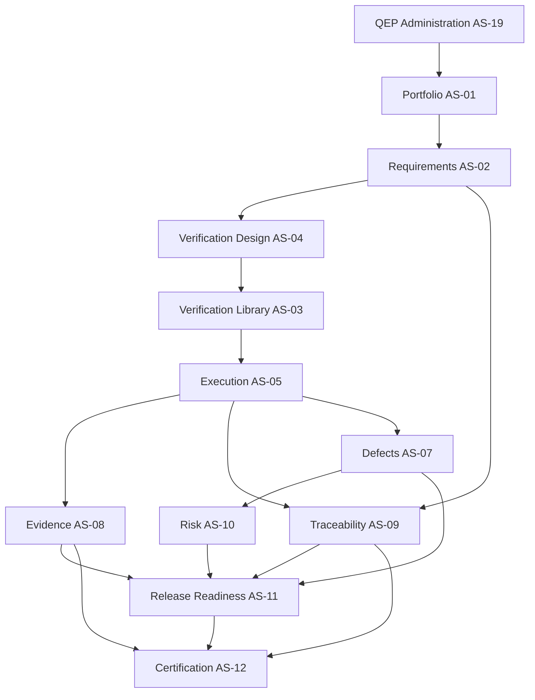

# APZQEP-PLAN-001 — Implementation Plan

> **Programme:** APZQEP-PLAN-001  
> **Classification:** ENGINEERING PLANNING  
> **Baseline:** APZQEP-ARCH-001 (**ACCEPTED**) · APZQEP-DEF-002 (**ACCEPTED**)  
> **Rule:** Implementation strategy only — no code, schemas, or API specs

## Purpose

This document defines the **implementation strategy** for APZ QEP — how engineering will bootstrap the product within the APZHUB monorepo, reuse Platform 1.4 capabilities, sequence domain services and modules, integrate with external engines, test, migrate, and release through Version 1.0 GA.

It is the strategic companion to [ENGINEERING-ROADMAP.md](./ENGINEERING-ROADMAP.md) and [RELEASE-PLAN.md](./RELEASE-PLAN.md).

---

## Strategic posture

| Dimension                 | Strategy                                                                                                |
| ------------------------- | ------------------------------------------------------------------------------------------------------- |
| **Deployment unit**       | Modular monolith — single QEP deployable co-located with APZHUB stack                                   |
| **Code organisation**     | QEP packages under existing pnpm workspace (`modules/qep-*`, `services/qep-*`, shared `packages/qep-*`) |
| **Platform relationship** | Consumer — extend, do not fork identity, shell, search, notifications                                   |
| **Integration**           | Connector-first; modules never call engines                                                             |
| **Data**                  | QEP PostgreSQL schema for QEP SoR; platform DB for platform metadata only                               |
| **AI/MCP**                | Scaffold with feature flags OFF; no MVP dependency                                                      |

---

## Repository bootstrap order

Bootstrap occurs under **APZQEP-ENG-010** following [SPRINT-ZERO.md](./SPRINT-ZERO.md). Planned creation order:

| Step | Artefact                                                         | Purpose                                                    | Depends on             |
| ---- | ---------------------------------------------------------------- | ---------------------------------------------------------- | ---------------------- |
| 1    | `modules/qep/` root manifest                                     | Product registration with Module Registry                  | Platform SDK 025       |
| 2    | `services/qep/` root manifest                                    | Service Registry entry                                     | Platform SDK 027       |
| 3    | `packages/qep-domain/`                                           | Shared domain types, enums, value objects (no persistence) | Step 1–2               |
| 4    | `packages/qep-contracts/`                                        | Service interface definitions (TypeScript interfaces only) | Step 3                 |
| 5    | `packages/qep-testing/`                                          | Test fixtures, factories, mock connectors                  | Step 3                 |
| 6    | Per-module `module.yaml` stubs (M01–M22)                         | Manifest-first registration                                | Step 1                 |
| 7    | Per-service `service.yaml` stubs (AS-01–AS-22)                   | Service manifest registration                              | Step 2                 |
| 8    | CI workflow entries for QEP packages                             | Lint, typecheck, unit test gates                           | Platform CI pattern    |
| 9    | Storybook workspace entries (module shells)                      | UI SDK 028 compliance                                      | Design system packages |
| 10   | Documentation scaffold under `docs/products/apzqep/engineering/` | ADR folder; runbooks placeholder                           | PLAN-001 acceptance    |

**Rule:** No domain business logic until release 0.2 programme authorised. ENG-010 stops at skeleton + green CI.

---

## Package creation order (by release)

Packages gain **implementation depth** in release order, not all at bootstrap:

| Release | New / active packages                                            | Implementation depth                 |
| ------- | ---------------------------------------------------------------- | ------------------------------------ |
| 0.1     | Skeleton only                                                    | Manifests, empty modules, CI         |
| 0.2     | `qep-admin`, `qep-audit-facade`, `qep-search-facade`, `qep-home` | Platform integration; policy CRUD    |
| 0.3     | `qep-portfolio`, `qep-integrations`                              | Project CRUD; connector health views |
| 0.4     | `qep-requirements`                                               | Requirement lifecycle                |
| 0.5     | `qep-verification-library`, `qep-verification-design`            | Library + design workflows           |
| 0.6     | `qep-execution`, `qep-automation` (stub)                         | Sessions; automation registry        |
| 0.7     | `qep-evidence`, `qep-traceability`                               | Evidence capture; link graph         |
| 0.8     | `qep-defects`, `qep-risk`                                        | Defect lifecycle; risk register      |
| 0.9     | `qep-readiness`, `qep-certification`, `qep-qi`, `qep-reporting`  | Governance closure                   |
| 1.0     | `qep-knowledge`, `qep-ai`, `qep-mcp` (scaffold)                  | GA hardening; gated scaffolds        |

Naming aligns to module slugs from MODULE-CATALOGUE; exact folder names confirmed in ENG-010 ADRs.

---

## Shared platform reuse strategy

QEP **must not rebuild** these Platform 1.4 capabilities. Engineering implements **adapters and configuration** only.

| Platform capability                        | QEP usage                                | QEP-specific work                                              |
| ------------------------------------------ | ---------------------------------------- | -------------------------------------------------------------- |
| **BetterAuth / Identity**                  | User login, sessions, SSO                | QEP tenant scoping rules; service identities for workers       |
| **PermissionService**                      | All authz decisions                      | QEP permission catalogue; role templates; cert authority roles |
| **Desktop Shell**                          | Activity bar, sidebar, workspace regions | Module registration; nav from manifests                        |
| **SearchService**                          | Unified search infrastructure            | QEP search providers per domain module                         |
| **NotificationService / Attention Engine** | Delivery                                 | QEP event types; subscription templates                        |
| **EventBus**                               | Async cross-cutting                      | QEP domain events per EVENT-ARCHITECTURE                       |
| **AuditService**                           | Immutable audit store                    | QEP audit enrichment; investigation views (M21)                |
| **DocumentService / Storage**              | Blob storage for evidence files          | Evidence references; retention policy hooks                    |
| **API Gateway**                            | Single client API                        | QEP route registration; correlation IDs                        |
| **Observability stack**                    | Metrics, logs, traces                    | QEP service instrumentation                                    |

### Platform reuse verification

Each release programme must include a **platform reuse checklist**:

| Check                                  | Pass criteria                       |
| -------------------------------------- | ----------------------------------- |
| No duplicate auth implementation       | All routes through platform session |
| No module-local notification subsystem | Events → Attention Engine only      |
| No standalone search index UI          | SearchService providers only        |
| No bypass of PermissionService         | Server-side authz on every mutation |
| No secrets in QEP repo                 | Platform secret refs pattern        |

---

## Domain implementation order

Domain services implement bounded contexts from ARCH-001 in **dependency order**:

### Per-domain implementation pattern

Every domain service follows the same **implementation ladder** within its release programme:

| Ladder step | Deliverable                                               |
| ----------- | --------------------------------------------------------- |
| 1           | `service.yaml` manifest complete                          |
| 2           | Domain model + validation rules (unit tested)             |
| 3           | Service interface + orchestration                         |
| 4           | Persistence adapter (schema in separate schema programme) |
| 5           | Event publication (post-commit)                           |
| 6           | Search provider registration                              |
| 7           | Module UI (presentation only)                             |
| 8           | Integration tests + API tests                             |
| 9           | Playwright slice scenario                                 |

---

## Integration strategy

| Integration class          | MVP approach                       | Engine examples | Connector ownership              |
| -------------------------- | ---------------------------------- | --------------- | -------------------------------- |
| **ALM / Projects**         | External link + optional read sync | Plane, Jira     | ProjectAdapter via AS-01/AS-18   |
| **CI / Automation ingest** | Reference + stub ingest            | GitHub Actions  | CI Connector via AS-06           |
| **Defect trackers**        | External link                      | GitHub Issues   | DefectAdapter via AS-07          |
| **Document storage**       | Platform DocumentService           | S3-compatible   | Platform connector               |
| **AI providers**           | Disabled scaffold                  | LLM APIs        | AI Connector via AS-16 (Phase 2) |
| **MCP clients**            | Catalogue only                     | IDE agents      | MCP Gateway AS-17 (Phase 2)      |

### Integration principles

| Principle           | Implementation rule                                        |
| ------------------- | ---------------------------------------------------------- |
| ACL at connector    | External models never leak into domain                     |
| Async ingest        | CI/automation results via events, not blocking UI          |
| Health visibility   | Integration Centre (M19) shows connector health from AS-18 |
| No engine in module | Modules call Platform Services only                        |
| CE OSS first        | Self-hosted connectors; no mandatory enterprise SKUs       |

---

## Testing strategy

Aligned with APZHUB Quality Standard (015) and [TESTING-ROADMAP.md](./TESTING-ROADMAP.md):

| Layer              | Scope                              | When introduced | Gate                                |
| ------------------ | ---------------------------------- | --------------- | ----------------------------------- |
| **Unit**           | Domain rules, validators           | 0.2+            | 80%+ on domain packages             |
| **Component**      | Service orchestration with mocks   | 0.3+            | Required per service                |
| **Integration**    | DB + event bus + platform services | 0.4+            | Required before release exit        |
| **API**            | Gateway routes, authz, envelope    | 0.4+            | Contract tests (no OpenAPI in PLAN) |
| **Playwright E2E** | Vertical slice scenarios           | 0.4+            | One new scenario per release        |
| **Accessibility**  | WCAG AA on module UI               | 0.5+            | axe checks in CI                    |
| **Security**       | Authz bypass, tenant isolation     | 0.2+            | SAST + targeted tests               |
| **Regression**     | Full pyramid                       | 0.9+            | Required for MVP sign-off           |
| **Performance**    | Baseline benchmarks                | 0.8+            | Non-regression at 1.0               |

### Test-driven where practical

| Domain                     | TDD emphasis                     |
| -------------------------- | -------------------------------- |
| Requirement approval rules | High — state machine tests first |
| Certification immutability | High — lock/evidence rules       |
| Traceability gap detection | High — graph logic               |
| Permission mapping         | High — role matrix tests         |
| UI layout                  | Moderate — component tests + E2E |

---

## Migration strategy

| Migration type            | Strategy                                                                                    |
| ------------------------- | ------------------------------------------------------------------------------------------- |
| **Legacy APZ TCMS**       | Not in MVP scope — greenfield QEP product                                                   |
| **Platform version**      | Pin to Platform 1.4 certified baseline; upgrade via separate platform programme             |
| **Data import**           | Requirements CSV/JSON import in 0.4; verification import in 0.5 — not bulk legacy migration |
| **Tenant onboarding**     | Standard platform tenant provisioning; QEP policy templates in 0.2                          |
| **Environment promotion** | dev → staging → production via release tags; schema migrations idempotent                   |

Future legacy migration, if required, demands a **separate Owner-approved programme** with mapping specification — not assumed in this plan.

---

## Release strategy

| Aspect              | Approach                                                                      |
| ------------------- | ----------------------------------------------------------------------------- |
| **Versioning**      | Semantic versioning: 0.x pre-GA, 1.0.0 GA                                     |
| **Branching**       | Trunk-based; short-lived feature branches; release branches for stabilization |
| **Tagging**         | Git tag per release: `qep-v0.4.0`, etc.                                       |
| **Changelog**       | Product CHANGELOG updated each release                                        |
| **Dogfooding**      | Internal APZ use from 0.6 (execution slice)                                   |
| **MVP declaration** | Release 0.9 tagged `qep-v0.9.0-mvp`                                           |
| **GA**              | Release 1.0.0 with production readiness pack                                  |
| **Rollback**        | Blue/green or previous tag; DB migrations reversible where feasible           |

### Release artefact checklist (every release)

| Artefact                         | Owner        |
| -------------------------------- | ------------ |
| Release notes                    | Product      |
| Migration notes (if schema)      | Backend      |
| Test evidence summary            | QA           |
| Architecture compliance sign-off | Architecture |
| Security review (0.8+)           | Security     |
| Updated module/service manifests | Engineering  |

---

## Manifest-first compliance

All QEP extensions comply with Platform SDK (024) manifest-first rules:

| SDK                      | Manifest           | Application                           |
| ------------------------ | ------------------ | ------------------------------------- |
| 025 Module SDK           | `module.yaml`      | Every M01–M22 before UI code          |
| 027 Platform Service SDK | `service.yaml`     | Every AS-01–AS-22 before service code |
| 026 Integration SDK      | `integration.yaml` | Every connector before adapter code   |
| 029 Event SDK            | `event.yaml`       | Every domain event before publisher   |
| 028 UI Component SDK     | `component.yaml`   | Shared QEP UI before Storybook merge  |

Registry discovery must succeed in CI before merge to main.

---

## Coexistence with Platform 1.4

| Concern             | Resolution                                                    |
| ------------------- | ------------------------------------------------------------- |
| Port conflicts      | Follow ENVIRONMENT.md — non-conflicting with legacy apz-stack |
| Shared dependencies | Align to platform pnpm lockfile versions                      |
| Shell real estate   | QEP registers as product workspace; no shell fork             |
| CI runners          | Shared self-hosted runners; QEP jobs additive                 |
| Database            | Separate QEP schema namespace in platform PostgreSQL          |

---

## Implementation anti-patterns (prohibited)

| Anti-pattern                    | Correct approach                            |
| ------------------------------- | ------------------------------------------- |
| Module calls connector          | Module → Platform Service → Connector       |
| Business logic in UI            | Service layer only                          |
| Duplicate PermissionService     | QEP policy config only                      |
| Module-local search             | Register SearchService provider             |
| AI writes SoR silently          | Proposal queue + human accept               |
| Auto-certification on readiness | Human CertificationService decision         |
| Premature microservices         | Modular monolith until extraction justified |

---

## Document control

| Version    | Date       | Change                                        |
| ---------- | ---------- | --------------------------------------------- |
| 1.0.0-plan | 2026-07-24 | Initial implementation plan — APZQEP-PLAN-001 |
