# APZQEP-PLAN-001 — MVP Plan

> **Programme:** APZQEP-PLAN-001  
> **Title:** APZ QEP Engineering Plan — MVP Scope & Release Mapping  
> **Classification:** ENGINEERING PLANNING  
> **Status:** PLANNED  
> **Baseline:** APZQEP-DEF-002 MVP Definition (DEF-002) · APZQEP-ARCH-001  
> **Rule:** Planning only — aligns to DEF-002; does not expand MVP scope

## Purpose

This document defines the **exact MVP scope** for QEP release **0.9** using MoSCoW prioritisation. MVP delivers the **full manual quality lifecycle to human certification** without requiring AI or MCP runtime (DEF-D-002, DEF-D-005, QEP-AD-004, QEP-AD-010). Release **1.0** is General Availability — production hardening of the MVP, not a scope expansion.

## MVP outcome (DEF-002 aligned)

An organisation can:

1. Create a project quality workspace  
2. Approve requirements  
3. Design and approve **manual** verifications  
4. Execute sessions with evidence  
5. Raise and retest defects  
6. See traceability and coverage gaps  
7. Assess release readiness  
8. **Human-certify** with locked evidence pack  
9. Audit the decision  

**Zero dependency on AI for MVP certification path.** MCP advanced write tools deferred.

## MoSCoW summary

| Priority | Count | Rule |
| -------- | ----- | ---- |
| **Must Have** | 18 modules (MVP core) | Required for 0.9 certification path |
| **Should Have** | 2 modules (foundation depth) | In 0.9 if capacity; minimal acceptable if not |
| **Could Have** | 1 module (optional KB) | 1.0 scaffold optional; full depth Phase 2 |
| **Deferred** | 4 modules | Post-1.0 Phase 2+ |

## Must Have (0.9 MVP — non-negotiable)

| ID | Module | MVP capability | Release |
| -- | ------ | -------------- | ------- |
| M20 | Administration | Tenants; users; roles; permissions; retention/cert policies | 0.2 |
| M21 | Audit and Compliance | Search; export; cert/approval history (cert investigation at 0.9) | 0.2 stub → 0.9 |
| M22 | Search and Navigation | Global search; recent; pins; breadcrumbs; providers per release | 0.2 → 0.9 |
| M02 | Portfolio and Projects | Projects; environments; owners; external links | 0.3 |
| M19 | Integration Centre | Platform + connector catalogue; health; config UI | 0.3 foundation → 0.8 |
| M03 | Requirements | CRUD; acceptance criteria; approve; baseline; import | 0.4 |
| M04 | Verification Library | Library CRUD; suites; templates; manual procedures | 0.5 |
| M05 | Verification Design | Manual/template design; peer review; approve; coverage impact | 0.5 |
| M06 | Execution and Sessions | Manual sessions; runs; results; retest | 0.6 |
| M09 | Evidence | Capture; pack; export; **lock on certify (0.9)** | 0.7 |
| M10 | Traceability | Matrix; gaps; orphans; export | 0.7 |
| M08 | Defects and Quality Issues | Full lifecycle; link verification; retest; external link ref | 0.8 |
| M11 | Risk Management | Basic register; accept; link to release | 0.8 |
| M12 | Release Readiness | Gates; score; waivers; explanation; executive view | 0.9 |
| M13 | Certification | Human certify; qualifications; reject; history; reproduce | 0.9 |
| M01 | Home and Command Centre | Personal dashboard; assignments; alerts; cert/readiness widgets | 0.2 stub → 0.9 full |
| M15 | Reporting and Analytics | Standard dashboards; cert/report export | 0.9 |
| Platform | IAM + Gateway + Events | Auth; authz; audit; search providers | 0.2+ |

## Should Have (0.9 target — acceptable minimal)

| ID | Module | MVP capability | Release | Fallback if constrained |
| -- | ------ | -------------- | ------- | ----------------------- |
| M07 | Automation Management | Register assets; metadata stub; health view | 0.6 stub | Defer ingest depth to 1.0; keep registration only |
| M14 | Quality Intelligence | Basic indicators; explainability stubs (non-AI) | 0.9 | Dashboard widgets only; defer AS-13 depth to 1.0 |

## Could Have (1.0 optional)

| ID | Module | MVP capability | Release | Note |
| -- | ------ | -------------- | ------- | ---- |
| M16 | Knowledge and Learning | Minimal KB CRUD (optional) | 1.0 scaffold | DEF-002 marks as optional; not on MVP critical path |

## Deferred (explicitly post-1.0)

| ID | Module | Reason | Target |
| -- | ------ | ------ | ------ |
| M17 | AI Quality Workspace | AI default OFF; not required for MVP value | Phase 2 |
| M18 | MCP and Developer Experience | Advanced write tools deferred; catalogue only in planning | Phase 2 |
| M14 (advanced) | Quality Intelligence | Predictive signals; advanced debt | Phase 2 |
| M16 (full) | Knowledge and Learning | Full KB; prompt library | Phase 2 |

## MVP lifecycle flow (manual path)

```mermaid
flowchart LR
  A[M02 Project workspace] --> B[M03 Approve requirements]
  B --> C[M05 Design verifications]
  C --> D[M04 Library publish]
  D --> E[M06 Execute manual session]
  E --> F[M09 Capture evidence]
  E --> G[M08 Raise defect]
  G --> H[M06 Retest]
  F --> I[M10 Traceability gaps]
  H --> I
  I --> J[M11 Risk accept]
  J --> K[M12 Release readiness]
  K --> L[M13 Human certification]
  L --> M[M09 Evidence lock]
  M --> N[M21 Audit trail]
  N --> O[M15 Export cert pack]
```

## Capability mapping (DEF-002 → Engineering)

| DEF-002 MVP area | Modules | Must/Should | AI required |
| ---------------- | ------- | ----------- | ----------- |
| Tenant and user management | M20 | Must | No |
| Project quality workspace | M02 | Must | No |
| Requirements | M03 | Must | No |
| Manual verification | M05, M06 | Must | No |
| Verification library | M04 | Must | No |
| Verification runs/sessions | M06 | Must | No |
| Evidence | M09 | Must | No |
| Defects | M08 | Must | No |
| Traceability | M10 | Must | No |
| Release readiness | M12 | Must | No |
| Human certification | M13 | Must | No |
| Dashboards | M01, M15 | Must | No |
| Audit | M21 | Must | No |
| Basic integrations | M19, M07 | Must / Should | No |
| Import and export | M03, M15 | Must | No |
| Automation health view | M07 | Should | No |
| Quality Intelligence basic | M14 | Should | No |
| Knowledge minimal | M16 | Could | No |

## Explicitly NOT required ON for MVP (DEF-002)

| Area | Engineering posture |
| ---- | ------------------- |
| AI Quality Workspace runtime | Feature flag OFF; M17 stub only at 1.0 |
| Advanced MCP write tools | M18 catalogue; no runtime |
| Continuous verification/cert modes | Not in 0.9 schema/workflow |
| Full ALM sync | Link foundation only (M19) |
| Marketplace | Out of scope |
| Quality Intelligence advanced | Phase 2 |
| Knowledge base full | Phase 2 |

## Persona coverage (MVP)

| Persona | MVP path role | Modules |
| ------- | ------------- | ------- |
| Release Manager | Primary certifier | M12, M13, M01 |
| QA Engineer | Manual execution | M05, M06, M08 |
| Business Analyst / Product Owner | Requirements | M03, M10 |
| Developer | Defect/retest | M08, M06 |
| Administrator | Tenancy/RBAC | M20, M19 |
| Auditor | Investigation | M21, M15 |
| Automation Engineer | Asset registry | M07 (Should) |
| Executive | Readiness view | M12, M01 |

Other DEF-002 personas have documented workspaces; full depth for all 21 personas is product definition obligation, not all MVP runtime scope.

## Release-to-MVP mapping

| Release | MVP modules delivered | Cumulative MVP % |
| ------- | --------------------- | ---------------- |
| 0.1 | Stubs only | 0% functional |
| 0.2 | M20, M21, M22, M01 stub | 10% |
| 0.3 | M02, M19 foundation, M01 widgets | 20% |
| 0.4 | M03 | 30% |
| 0.5 | M04, M05 | 45% |
| 0.6 | M06, M07 stub | 55% |
| 0.7 | M09, M10 | 70% |
| 0.8 | M08, M11, M19 extension | 80% |
| 0.9 | M12, M13, M14 basic, M15, M01 full, M21 cert | **100% functional — MVP** |
| 1.0 | GA hardening; M16–M18 scaffolds (OFF) | Production readiness |

## MVP success measures (DEF-002 → testable)

| Measure | Validation method | Release |
| ------- | ----------------- | ------- |
| Manual session end-to-end | Playwright `@mvp-cert` | 0.9 |
| Certification with named human actor | Audit log assertion | 0.9 |
| Zero AI dependency on cert path | Feature flag OFF test | 0.9 / 1.0 |
| Traceability coverage gaps visible | UI + export test | 0.7+ |
| Audit searchable for cert decision | M21 search test | 0.9 |
| Readiness reflects defects/risk/gates | M12 snapshot test | 0.9 |
| Evidence pack locked on approve | Immutability test | 0.9 |

## MVP exclusions (0.9)

- AI-generated verification auto-approve  
- MCP autonomous write without human approval  
- Continuous certification changing formal status  
- Kiwi TCMS migration  
- Full ITSM / ALM replacement  
- Marketplace  
- Mobile-native apps  
- Multi-region active-active (deployment intent only)  

## Post-MVP horizon (informing backlog, not 0.9)

| Phase | Modules | Owner gate |
| ----- | ------- | ---------- |
| 1.0 | GA hardening; Should Have gaps; M16 scaffold | Engineering |
| 1.0.x | Hardening patches | Engineering |
| 1.1 | M14 depth, M16 KB | Product |
| 2.0 | M17 AI, M18 MCP write maturity | Owner AI programme |

---

| Version | Date | Change |
| ------- | ---- | ------ |
| 1.0.0-plan | 2026-07-24 | Initial MVP plan — APZQEP-PLAN-001 |
| 1.0.1-plan | 2026-07-24 | Release mappings aligned to RELEASE-PLAN.md (MVP at 0.9) |
