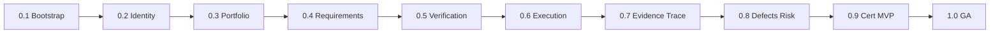

# APZQEP-PLAN-001 — Release Plan

> **Programme:** APZQEP-PLAN-001  
> **Classification:** ENGINEERING PLANNING  
> **Baseline:** APZQEP-ARCH-001 (**ACCEPTED**) · APZQEP-DEF-002 (**ACCEPTED**)  
> **Rule:** Release planning only — no implementation

## Purpose

This document defines **concrete implementation releases 0.1 through 1.0** for APZ QEP. Each release specifies scope, modules touched, services activated, exit criteria, and dependencies. The sequence is justified by domain dependencies, vertical slice delivery, and MVP closure at 0.9.

Release numbering follows semantic pre-release conventions: **0.x** = pre-GA increments; **1.0** = General Availability.

---

## Release sequence rationale

The Owner example sequence (bootstrap → identity → portfolio → requirements → verification → execution → evidence/traceability → defects/risk → certification/readiness/QI → GA) is **accepted with the following adjustments**:

| Adjustment | Justification |
| ---------- | ------------- |
| Verification library and design combined in **0.5** | AS-03 and AS-04 share Verification bounded context; design publishes to library atomically |
| Traceability paired with evidence in **0.7** | Certification requires coverage gaps visible before 0.9; trace links need execution results |
| Basic QI in **0.9** not 1.0 | MVP dashboards need derived indicators; advanced AI QI remains Phase 2 |
| M01 Home expands across releases | Composition service requires upstream read models |
| Phase 2 modules (M16–M18) scaffold at **1.0** | GA ships disabled surfaces; no MVP dependency |

---

## Release summary matrix

| Release | Theme | MVP critical | Engineering programmes (indicative) |
| ------- | ----- | ------------ | ------------------------------------- |
| **0.1** | Bootstrap & CI | No | APZQEP-ENG-010 |
| **0.2** | Identity, tenant, permissions | Yes | APZQEP-ENG-011 |
| **0.3** | Portfolio & projects | Yes | APZQEP-ENG-012 |
| **0.4** | Requirements | Yes | APZQEP-ENG-013 |
| **0.5** | Verification | Yes | APZQEP-ENG-014 |
| **0.6** | Execution | Yes | APZQEP-ENG-015 |
| **0.7** | Evidence & traceability | Yes | APZQEP-ENG-016 |
| **0.8** | Defects & risk | Yes | APZQEP-ENG-017 |
| **0.9** | Certification & readiness | Yes — **MVP** | APZQEP-ENG-018 |
| **1.0** | General Availability | Yes — **GA** | APZQEP-ENG-019 |

*Programme IDs are indicative placeholders until Owner names authoritative ENG programmes.*

---

## Release 0.1 — Repository Bootstrap, Developer Tooling, CI, Quality Gates

### Scope

Establish QEP product skeleton within APZHUB monorepo. No domain features. Sprint Zero implementation per [SPRINT-ZERO.md](./SPRINT-ZERO.md).

| In scope | Out of scope |
| -------- | ------------ |
| Package/module/service manifest stubs | Domain CRUD |
| CI lint, typecheck, unit test harness | Database migrations |
| Build pipeline for QEP packages | Shell module UI beyond registration stub |
| Local dev documentation | Authentication flows |
| Docker compose alignment | Connector implementations |
| Secrets management pattern docs | E2E scenarios |

### Modules touched

| Module | Touch type |
| ------ | ---------- |
| *(none functional)* | Manifest stubs only for M01–M22 |

### Services touched

| Service | Touch type |
| ------- | ---------- |
| *(none functional)* | `service.yaml` stubs for AS-01–AS-22 |

### Dependencies

| Dependency | Status |
| ---------- | ------ |
| APZQEP-PLAN-001 Owner Acceptance | Required |
| Platform 1.4 certified monorepo | Available |
| APZHUB CI patterns | Available |

### Exit criteria

| # | Criterion |
| - | --------- |
| 1 | `pnpm install` and `pnpm build` succeed with QEP packages |
| 2 | QEP CI workflow runs lint, types, unit tests (empty suites pass) |
| 3 | All module and service manifests validate against SDK schemas |
| 4 | Local development guide complete |
| 5 | No domain schema or API routes introduced |
| 6 | Architecture compliance review PASS for bootstrap scope |

---

## Release 0.2 — Identity, Tenant, Users, Permissions (Platform Reuse + QEP Policy)

### Scope

Integrate QEP with Platform 1.4 identity and PermissionService. Deliver QEP administration foundation, audit consumption, search facade registration, and shell navigation stub.

| In scope | Out of scope |
| -------- | ------------ |
| QEP tenant scoping on platform identity | Custom auth provider |
| QEP permission catalogue and role templates | Full ALM user sync |
| M20 administration policy screens | Domain modules |
| M21 audit investigation shell | Cert audit packs |
| M22 search provider registration (empty) | Domain search content |
| M01 home stub (nav + placeholder dashboard) | Full widgets |
| Platform shell module registration | AI/MCP surfaces |

### Modules touched

| Module | Deliverable |
| ------ | ----------- |
| M20 | Administration — QEP policy, entitlements skeleton, retention config UI |
| M21 | Audit — platform audit search/export integration |
| M22 | Search — facade service; provider registry; global search shell |
| M01 | Home — login landing; placeholder widgets; quick nav |

### Services touched

| Service | Deliverable |
| ------- | ----------- |
| AS-19 | QEPAdministrationService — policy CRUD |
| AS-20 | QEPAuditService — investigation views (read platform audit) |
| AS-21 | QEPSearchFacadeService — provider registry |
| AS-22 | HomeCompositionService — stub aggregation |

### Dependencies

| Dependency | Release |
| ---------- | ------- |
| 0.1 bootstrap complete | 0.1 |
| Platform Identity API stable | Platform 1.4 |
| PermissionService role API | Platform 1.4 |

### Exit criteria

| # | Criterion |
| - | --------- |
| 1 | User authenticates via platform SSO; QEP shell visible |
| 2 | Permission-driven nav hides unauthorised modules |
| 3 | QEP admin can configure QEP policy templates |
| 4 | Audit events visible in M21 from platform store |
| 5 | Search infrastructure accepts provider registration |
| 6 | Unit + integration tests for authz rules PASS |
| 7 | Security review: tenant isolation verified |

---

## Release 0.3 — Portfolio and Projects

### Scope

Deliver quality scope contexts: portfolios, projects, applications, environments, teams, owners. Integration Centre foundation for external project links.

| In scope | Out of scope |
| -------- | ------------ |
| M02 full MVP scope | Multi-portfolio enterprise depth |
| M19 connection catalogue and health | Full ALM bidirectional sync |
| Project-scoped permissions | Requirements module |
| External project link (URL/reference) | CI ingest |
| Project quality profile stub | Certification |

### Modules touched

| Module | Deliverable |
| ------ | ----------- |
| M02 | Portfolio, projects, environments, owners, basic dashboard |
| M19 | Integration Centre — connector list, health, config UI |
| M01 | Project context widgets on home |

### Services touched

| Service | Deliverable |
| ------- | ----------- |
| AS-01 | PortfolioService — project CRUD, lifecycle Draft→Active→Archived |
| AS-18 | IntegrationManagementService — catalogue, health polling |
| AS-22 | Home — project summary widgets |

### Dependencies

| Dependency | Release |
| ---------- | ------- |
| 0.2 authz and tenant scope | 0.2 |
| Platform project link pattern (optional) | Platform 1.4 |

### Exit criteria

| # | Criterion |
| - | --------- |
| 1 | Project quality workspace creatable with owner assignment |
| 2 | Project-scoped permissions enforce isolation |
| 3 | Integration Centre shows connector health states |
| 4 | External project link attachable to project |
| 5 | Playwright: create project vertical slice PASS |
| 6 | Audit trail for project configuration changes |

---

## Release 0.4 — Requirements

### Scope

Quality-relevant requirements lifecycle: CRUD, hierarchy, types, acceptance criteria, review, approval, baselines, import foundation.

| In scope | Out of scope |
| -------- | ------------ |
| M03 MVP capabilities | AI ambiguity analysis |
| Requirement approval workflow | Verification design |
| Baseline creation | Full ALM sync |
| CSV/JSON import | AI-assisted authoring |
| Traceability links (stub) | Coverage matrix |

### Modules touched

| Module | Deliverable |
| ------ | ----------- |
| M03 | Requirements repository, approval, baselines, import |
| M01 | Pending approval widgets |
| M22 | Requirements search provider |

### Services touched

| Service | Deliverable |
| ------- | ----------- |
| AS-02 | RequirementService — full MVP lifecycle |
| AS-09 | TraceabilityService — link stub (requirement records only) |
| AS-21 | Search provider for requirements |

### Dependencies

| Dependency | Release |
| ---------- | ------- |
| 0.3 project context | 0.3 |
| Approved requirement → verification rule | Informs 0.5 |

### Exit criteria

| # | Criterion |
| - | --------- |
| 1 | Requirement progresses Draft → In review → Approved |
| 2 | Acceptance criteria mandatory before approval |
| 3 | Baseline created from approved set |
| 4 | Import succeeds for defined CSV/JSON format |
| 5 | Author vs approver role separation enforced |
| 6 | Playwright: approve requirement slice PASS |
| 7 | Domain events published on approval |

---

## Release 0.5 — Verification Library and Design

### Scope

Verification bounded context: reusable library, design workflow, peer review, approval to library, manual procedures first-class.

| In scope | Out of scope |
| -------- | ------------ |
| M04 library MVP | Runner binary storage |
| M05 design MVP | AI draft generation |
| Manual and template procedures | Bulk AI creation |
| Coverage impact (basic) | Continuous verification |
| Suite and folder organisation | Automation execution |

### Modules touched

| Module | Deliverable |
| ------ | ----------- |
| M04 | Verification library — CRUD, versions, suites, templates |
| M05 | Design — create from requirement, peer review, approve |
| M22 | Verification search provider |
| M01 | Verification progress widgets |

### Services touched

| Service | Deliverable |
| ------- | ----------- |
| AS-03 | VerificationLibraryService |
| AS-04 | VerificationDesignService |
| AS-09 | TraceabilityService — req→verification links |

### Dependencies

| Dependency | Release |
| ---------- | ------- |
| 0.4 approved requirements | 0.4 |
| Design publishes to library | Internal AS-04→AS-03 |

### Exit criteria

| # | Criterion |
| - | --------- |
| 1 | Verification designed from approved requirement |
| 2 | Peer review and approver workflow completes |
| 3 | Approved verification appears in library with version |
| 4 | Manual procedure type fully supported |
| 5 | Traceability link req→verification established |
| 6 | Playwright: design-to-library slice PASS |
| 7 | Template reuse demonstrated |

---

## Release 0.6 — Execution and Sessions

### Scope

Plan and execute verification runs and manual sessions. Step-level results. Automation registry stub.

| In scope | Out of scope |
| -------- | ------------ |
| M06 MVP execution | Full automation ingest pipeline |
| Manual and hybrid session types | External runner orchestration |
| Assign, pause, handover | AI flaky analysis |
| M07 automation asset registry stub | Promotion queues depth |
| Result mutations audited | CI webhook processing |

### Modules touched

| Module | Deliverable |
| ------ | ----------- |
| M06 | Runs, sessions, step results, retest queue |
| M07 | Automation registry stub — metadata only |
| M01 | Active session widgets |
| M22 | Execution search provider |

### Services touched

| Service | Deliverable |
| ------- | ----------- |
| AS-05 | ExecutionService |
| AS-06 | AutomationManagementService — registry stub |
| AS-09 | TraceabilityService — verification→result links |

### Dependencies

| Dependency | Release |
| ---------- | ------- |
| 0.5 approved library verifications | 0.5 |
| Project and environment context | 0.3 |

### Exit criteria

| # | Criterion |
| - | --------- |
| 1 | Manual session planned, assigned, executed to completion |
| 2 | Step-level pass/fail/block recorded |
| 3 | Session pause and handover functional |
| 4 | Results linked to verification and project |
| 5 | Playwright: execute manual session slice PASS |
| 6 | Audit trail for result mutations |
| 7 | Internal dogfood begins |

---

## Release 0.7 — Evidence and Traceability

### Scope

Evidence capture and pack assembly. Traceability matrix, coverage gaps, requirement→verification→result linkage.

| In scope | Out of scope |
| -------- | ------------ |
| M09 evidence MVP | Cert evidence lock (0.9) |
| M10 traceability MVP | Advanced gap analytics |
| Evidence attach during execution | Legal hold (basic audit only) |
| Coverage matrix views | AI coverage suggestions |
| Blob storage via platform | |

### Modules touched

| Module | Deliverable |
| ------ | ----------- |
| M09 | Evidence items, attach, pack assembly, pre-cert review |
| M10 | Traceability matrix, gaps, link management |
| M01 | Coverage gap alerts |
| M22 | Evidence search provider |

### Services touched

| Service | Deliverable |
| ------- | ----------- |
| AS-08 | EvidenceService |
| AS-09 | TraceabilityService — full matrix |
| AS-05 | ExecutionService — evidence attach hooks |

### Dependencies

| Dependency | Release |
| ---------- | ------- |
| 0.6 execution results | 0.6 |
| Platform DocumentService | Platform 1.4 |

### Exit criteria

| # | Criterion |
| - | --------- |
| 1 | Evidence captured during and after session |
| 2 | Traceability matrix shows req→verification→result |
| 3 | Coverage gaps visible before cert path |
| 4 | Evidence pack assemblable for review |
| 5 | Playwright: evidence + matrix slice PASS |
| 6 | No evidence claims without attachment lineage |

---

## Release 0.8 — Defects and Risk

### Scope

Defect lifecycle from failed verification. Risk register. Retest linkage. External defect link foundation.

| In scope | Out of scope |
| -------- | ------------ |
| M08 defects MVP | Full ITSM |
| M11 risk MVP foundation | Enterprise GRC replacement |
| Retest cycle | Advanced risk treatment |
| External tracker link | Bidirectional sync depth |
| Risk acceptance human gate | AI risk scoring |

### Modules touched

| Module | Deliverable |
| ------ | ----------- |
| M08 | Defect CRUD, link to verification, retest |
| M11 | Risk register, scoring, treatment, acceptance |
| M19 | Defect tracker connector config |
| M01 | Defect and risk highlight widgets |

### Services touched

| Service | Deliverable |
| ------- | ----------- |
| AS-07 | DefectService |
| AS-10 | RiskService |
| AS-18 | IntegrationManagementService — defect connector |
| AS-09 | TraceabilityService — defect links |

### Dependencies

| Dependency | Release |
| ---------- | ------- |
| 0.6 execution failures | 0.6 |
| 0.7 evidence for defect context | 0.7 |

### Exit criteria

| # | Criterion |
| - | --------- |
| 1 | Defect raised from failed step with trace link |
| 2 | Retest queues and completes |
| 3 | Risk recorded with human acceptance |
| 4 | Open defects surface in project dashboard |
| 5 | Playwright: defect + retest slice PASS |
| 6 | Security review PASS |

---

## Release 0.9 — Certification, Release Readiness, Quality Intelligence (Basic)

### Scope

**MVP release.** Readiness gates, waivers, snapshots. Human certification with locked evidence pack. Basic reporting and QI indicators. Full home dashboard.

| In scope | Out of scope |
| -------- | ------------ |
| M12 readiness MVP | Continuous cert modes |
| M13 certification MVP | Auto-certification |
| M14 basic QI indicators | AI-driven QI |
| M15 core dashboards | Advanced analytics |
| M01 full command centre | NL summary widgets |
| Full regression suite | |

### Modules touched

| Module | Deliverable |
| ------ | ----------- |
| M12 | Release scope, gates, waivers, readiness snapshot |
| M13 | Cert request, multi-step approval, immutable decision |
| M14 | Derived indicators — non-binding explanations |
| M15 | Project, release, cert dashboards |
| M01 | Full role-aware command centre |
| M21 | Cert decision audit investigation |

### Services touched

| Service | Deliverable |
| ------- | ----------- |
| AS-11 | ReleaseReadinessService |
| AS-12 | CertificationService |
| AS-13 | QualityIntelligenceService — basic |
| AS-14 | ReportingService |
| AS-22 | HomeCompositionService — full |
| AS-08 | EvidenceService — lock on cert |

### Dependencies

| Dependency | Release |
| ---------- | ------- |
| 0.7 evidence and traceability | 0.7 |
| 0.8 defects and risk | 0.8 |
| All upstream MVP modules | 0.2–0.8 |

### Exit criteria — MVP

| # | Criterion |
| - | --------- |
| 1 | **Full manual certification path** completable without AI/MCP |
| 2 | Named human certifier recorded; decision immutable |
| 3 | Evidence pack locked at certification |
| 4 | Readiness snapshot reflects defects, risk, gates, trace gaps |
| 5 | Audit trail searchable for cert decision |
| 6 | Full regression pyramid PASS |
| 7 | MVP sign-off by Product and QA |
| 8 | Tag: `qep-v0.9.0-mvp` |

---

## Release 1.0 — General Availability

### Scope

Production hardening. Performance baselines. Security certification. Documentation complete. Phase 2 scaffolds (M16–M18) present but **OFF**. Enterprise deployment readiness.

| In scope | Out of scope |
| -------- | ------------ |
| All MVP modules hardened | AI runtime enablement |
| M16 knowledge scaffold (optional) | MCP write tools |
| M17/M18 disabled scaffolds | Phase 3 continuous modes |
| Production deployment pack | Marketplace |
| SLA and support runbooks | |
| Performance non-regression | |

### Modules touched

| Module | Deliverable |
| ------ | ----------- |
| M01–M15 | Hardening, a11y, performance |
| M16 | Knowledge scaffold — optional KB |
| M17 | AI workspace — feature flag OFF |
| M18 | MCP DX — catalogue stub, OFF |
| M19–M22 | Connector depth, admin entitlements, audit exports |

### Services touched

| Service | Deliverable |
| ------- | ----------- |
| AS-01–AS-22 | Production readiness review each |
| AS-15 | KnowledgeService — scaffold |
| AS-16 | AIQualityService — scaffold OFF |
| AS-17 | MCPGatewayService — scaffold OFF |

### Dependencies

| Dependency | Release |
| ---------- | ------- |
| 0.9 MVP complete | 0.9 |
| Production readiness assessment | Ops programme |

### Exit criteria — GA

| # | Criterion |
| - | --------- |
| 1 | All MVP modules meet Definition of Done (015) |
| 2 | Production deployment successful in staging and production-like env |
| 3 | Security assessment PASS |
| 4 | Performance baselines documented; no critical regressions |
| 5 | User and operator documentation complete |
| 6 | AI/MCP confirmed OFF by default |
| 7 | Owner GA Acceptance recorded |
| 8 | Tag: `qep-v1.0.0` |

---

## Cross-release dependency graph

---

## Module coverage confirmation (M01–M22)

| Module | 0.1 | 0.2 | 0.3 | 0.4 | 0.5 | 0.6 | 0.7 | 0.8 | 0.9 | 1.0 |
| ------ | --- | --- | --- | --- | --- | --- | --- | --- | --- | --- |
| M01 | stub | stub | ● | ● | ● | ● | ● | ● | ●● | harden |
| M02 | | | ●● | | | | | | | harden |
| M03 | | | | ●● | | | | | | harden |
| M04 | | | | | ●● | | | | | harden |
| M05 | | | | | ●● | | | | | harden |
| M06 | | | | | | ●● | | | | harden |
| M07 | | | | | | stub | | | | depth |
| M08 | | | | | | | | ●● | | harden |
| M09 | | | | | | | ●● | | ● | harden |
| M10 | | | | stub | ● | ● | ●● | ● | ● | harden |
| M11 | | | | | | | | ●● | ● | harden |
| M12 | | | | | | | | | ●● | harden |
| M13 | | | | | | | | | ●● | harden |
| M14 | | | | | | | | | basic | harden |
| M15 | | | | | | | | | ●● | harden |
| M16 | | | | | | | | | | scaffold |
| M17 | | | | | | | | | | OFF |
| M18 | | | | | | | | | | OFF |
| M19 | | | stub | | | | | ● | | harden |
| M20 | | ●● | | | | | | | ● | harden |
| M21 | | ● | | | | | | | ● | harden |
| M22 | | ● | ● | ● | ● | ● | ● | ● | ● | harden |

Legend: stub = infrastructure only; ● = functional increment; ●● = primary release; basic = minimal QI; harden = GA polish; OFF = scaffold disabled.

---

## Document control

| Version | Date | Change |
| ------- | ---- | ------ |
| 1.0.0-plan | 2026-07-24 | Initial release plan — APZQEP-PLAN-001 |
