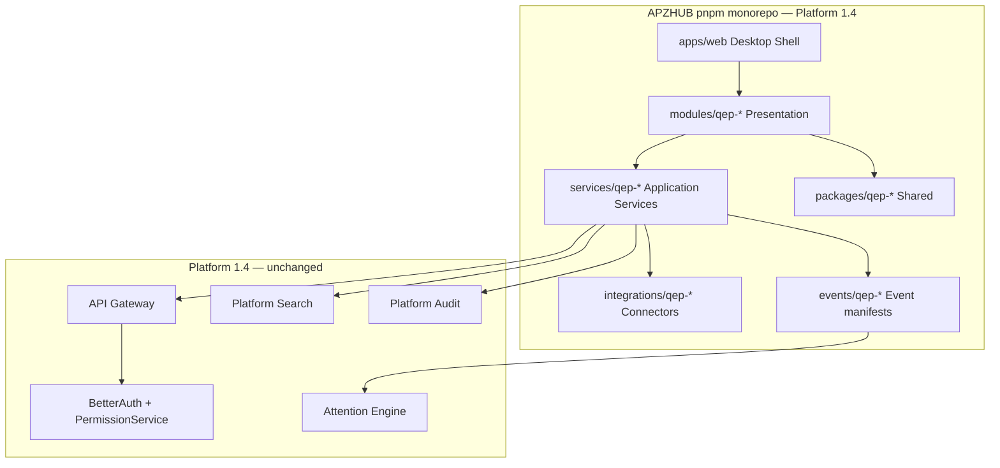
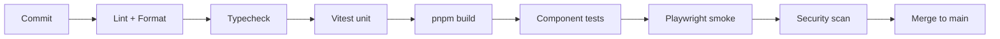

# APZQEP-PLAN-001 — Sprint Zero Definition

> **Programme:** APZQEP-PLAN-001  
> **Title:** APZ QEP Engineering Plan — Sprint Zero  
> **Classification:** ENGINEERING PLANNING  
> **Status:** PLANNED — execution under **APZQEP-ENG-010** after Owner Plan Acceptance  
> **Baseline:** APZQEP-ARCH-001 (1.0.0-arch) · APZQEP-DEF-002 (1.0.0-def) · Platform 1.4 **CERTIFIED**  
> **Rule:** Planning only — no code, schemas, endpoints, or repository mutations in this document

## Purpose

Sprint Zero establishes the **QEP engineering foundation inside the existing APZHUB pnpm monorepo**. It delivers no business functionality. Its sole purpose is a stable, repeatable, enterprise-grade development substrate upon which QEP modules, services, and integrations will be built in subsequent Engineering programmes.

Sprint Zero is **not** a second monorepo. QEP extends the certified Platform 1.4 repository layout. All QEP packages register within the same workspace, CI pipeline, and quality gates as the platform shell.

## Programme gate

```text
APZQEP-PLAN-001 Owner Acceptance
  → APZQEP-ENG-010 Repository Bootstrap & Sprint Zero (named Approval)
    → APZQEP-ENG-011+ (module/service implementation programmes)
```

## Monorepo posture

| Principle | Decision |
| --------- | -------- |
| Repository model | **Single monorepo** — existing `/home/ubuntu/apz-portal` APZHUB workspace |
| Package manager | pnpm workspaces (existing `pnpm-workspace.yaml`) |
| QEP scope | Additive packages only — no platform redesign |
| Platform coexistence | Non-conflicting ports, shared auth, PermissionService, gateway path per `ENVIRONMENT.md` |
| Legacy stack | `apz-stack` and Kiwi TCMS remain operational; QEP is a **native product**, not a Kiwi fork |

### Intended package layout (planning intent)

QEP work lands under standard APZHUB roots defined in Document 004. Exact folder names are resolved in APZQEP-ENG-010 ADRs; this table expresses **structural intent only**.

| Root | QEP intent | Examples (illustrative) |
| ---- | ---------- | ----------------------- |
| `apps/web` | QEP module routes register into existing Desktop Shell | Module nav, workspace regions |
| `modules/qep-*` | Presentation modules M01–M22 per Module SDK 025 | `modules/qep-requirements`, `modules/qep-certification` |
| `services/qep-*` | Application services AS-01–AS-22 per Service SDK 027 | `services/qep-requirement`, `services/qep-certification` |
| `packages/qep-*` | Shared types, domain contracts, UI composites | `packages/qep-types`, `packages/qep-ui` |
| `integrations/qep-*` | Connectors per Integration SDK 026 | GitHub ingest, future ALM |
| `events/qep-*` | Event manifests per Event SDK 029 | `requirement.approved`, `certification.decided` |
| `docs/products/apzqep/` | Product, architecture, engineering documentation | This pack |
| `testing/qep/` | QEP-specific test fixtures and E2E scenarios | Certification path fixtures |



## Sprint Zero deliverables (APZQEP-ENG-010 scope)

| # | Deliverable | Acceptance criterion |
| - | ----------- | -------------------- |
| 1 | QEP workspace package stubs | `pnpm install` succeeds; packages discoverable |
| 2 | Module manifest placeholders | Every MVP module has `module.yaml` skeleton per SDK 025 |
| 3 | Service manifest placeholders | Every MVP logical service has `service.yaml` skeleton per SDK 027 |
| 4 | Event manifest placeholders | Core lifecycle events have `event.yaml` skeleton per SDK 029 |
| 5 | TypeScript strict baseline | QEP packages inherit root `tsconfig`; strict mode enforced |
| 6 | ESLint + Prettier | QEP paths included in root lint/format; zero new violations |
| 7 | Vitest scaffold | Unit test runner wired for `services/qep-*` and `packages/qep-*` |
| 8 | Storybook scaffold | QEP UI package registered; token-only components per SDK 028 |
| 9 | Playwright scaffold | QEP E2E project defined; no business scenarios yet |
| 10 | CI pipeline extension | QEP jobs added to existing GitHub Actions; gates per Document 015 |
| 11 | Local development guide | Documented in `docs/products/apzqep/engineering/` (ENG-010) |
| 12 | Docker Compose extension | QEP dev services non-conflicting with `apz-stack` ports |
| 13 | Secrets policy | No secrets in repo; env template documented; connector refs only |
| 14 | Health reporting | QEP service health hooks stubbed; platform health unchanged |
| 15 | Documentation index | Engineering README under `docs/products/apzqep/engineering/` |

## CI, lint, and formatting

| Gate | Tool | Scope |
| ---- | ---- | ----- |
| Lint | ESLint (root config) | All `modules/qep-*`, `services/qep-*`, `packages/qep-*` |
| Format | Prettier (root config) | Same paths |
| Types | `tsc --noEmit` | Per-package and workspace aggregate |
| Unit | Vitest | Services and packages |
| Component | Vitest + Testing Library | `packages/qep-ui` |
| Build | `pnpm build` | Workspace must pass before merge |
| Security | Existing CI security stage | Dependency audit; secret scan |

CI runs on **every commit** to QEP paths. Failing build never reaches main (Document 015).

## Testing framework (Sprint Zero)

Sprint Zero wires frameworks only — no business test scenarios.

| Layer | Framework | Sprint Zero outcome |
| ----- | --------- | ------------------- |
| Unit | Vitest | Example passing test per QEP service stub |
| Component | Vitest + RTL | Storybook story renders in test harness |
| Integration | Vitest + test containers (plan) | Scaffold only; PostgreSQL/Redis connectivity test |
| API | Supertest or route-handler tests (plan) | Health stub only |
| E2E | Playwright | Shell navigation smoke; QEP module slot visible |
| a11y | axe-core in component/E2E pipeline | Wired; no module pages yet |
| Security | CI SAST/dependency scan | Inherited from platform |
| Regression | Playwright tagged `@smoke` | Platform shell regression baseline |

Full pyramid mapping: [TESTING-ROADMAP.md](./TESTING-ROADMAP.md).

## Build pipeline



Build order respects workspace dependencies: `packages/qep-*` → `services/qep-*` → `modules/qep-*` → `apps/web` registration.

## Secrets and configuration

| Rule | Implementation intent |
| ---- | --------------------- |
| No secrets in repository | `.env.example` only; real values in host/CI secret store |
| Connector credentials | Platform connector config refs; encrypted at rest |
| Local development | Documented env vars; Docker Compose for PostgreSQL/Redis dev |
| AI provider keys | Not required for Sprint Zero; feature flags default OFF |
| GitHub integration | PAT or app credentials via Integration Centre config (post-MVP wiring) |

## Local development

| Concern | Approach |
| ------- | -------- |
| Prerequisites | Node LTS, pnpm, Docker (optional), existing platform `.env` |
| Start command | Extend platform `pnpm dev`; QEP modules hot-reload via shell registration |
| Database | Platform PostgreSQL for QEP metadata (schema design in ENG-011+, not Sprint Zero) |
| Redis | Platform Redis for sessions/cache |
| Port coexistence | QEP dev ports documented in `ENVIRONMENT.md` addendum; no collision with `apz-stack` |
| Identity | BetterAuth session; PermissionService for QEP permissions |

## Containerisation

| Environment | Container strategy |
| ----------- | ------------------ |
| Local dev | Docker Compose services alongside or shared with platform dev stack |
| CI | Ephemeral PostgreSQL/Redis for integration scaffold |
| Staging | QEP co-deployed in platform container image (modular monolith) |
| Production | Self-hosted first; air-gap compatible per ARCH deployment architecture |

Sprint Zero does **not** deploy to production. It validates compose definitions and health stubs only.

## Platform 1.4 coexistence

| Constraint | QEP Sprint Zero behaviour |
| ---------- | ------------------------- |
| Platform shell | QEP registers modules; does not replace DEF regions |
| IAM | BetterAuth authn; APZHUB PermissionService authz; no Authentik in QEP path |
| Gateway | All QEP traffic through APZHUB API Gateway |
| Search | QEP registers Search Providers; no standalone search UI |
| Events | QEP publishes via Platform Event Bus |
| Legacy Kiwi | Reference only; no migration tooling in Sprint Zero |
| `apz-stack` ports | Documented non-conflict matrix in ENG-010 |

## Documentation (Sprint Zero)

| Document | Location | Owner |
| -------- | -------- | ----- |
| Engineering README | `docs/products/apzqep/engineering/README.md` | ENG-010 |
| Local setup guide | `docs/products/apzqep/engineering/local-development.md` | ENG-010 |
| Package layout ADR | `docs/products/apzqep/engineering/decisions/` | ENG-010 |
| CI runbook | `docs/products/apzqep/engineering/ci.md` | ENG-010 |

## Explicit exclusions (Sprint Zero)

- Business module UI or workflows  
- Database schemas, migrations, or ERD  
- REST paths, OpenAPI, or protobuf contracts  
- Production QEP feature flags beyond registration stubs  
- AI/MCP runtime (default OFF; no provider wiring)  
- Kiwi TCMS data migration  
- Platform 2.0 changes  

## Success measures

| Measure | Target |
| ------- | ------ |
| Clone-to-green | New developer runs `pnpm install && pnpm build && pnpm test` in under 30 minutes |
| CI green | All Sprint Zero gates pass on main |
| Module registration | At least one QEP module slot visible in Desktop Shell (empty workspace) |
| Zero platform regression | Platform 1.4 smoke tests unchanged |
| Documentation | ENG-010 local setup guide complete |

## Next programme

After **APZQEP-PLAN-001 Owner Acceptance** and **APZQEP-ENG-010** named Approval: execute Repository Bootstrap & Sprint Zero. First business implementation programme: **APZQEP-ENG-011** (Identity, Tenant, Permissions — release 0.2) per [RELEASE-PLAN.md](./RELEASE-PLAN.md).

---

| Version | Date | Change |
| ------- | ---- | ------ |
| 1.0.0-plan | 2026-07-24 | Initial Sprint Zero definition — APZQEP-PLAN-001 |
| 1.0.1-plan | 2026-07-24 | ENG-011 reference aligned to RELEASE-PLAN (0.2 identity) |
