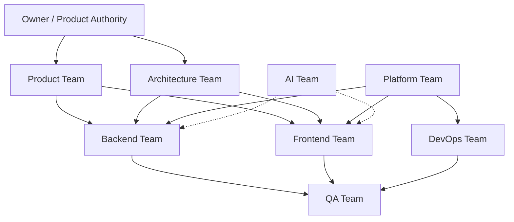
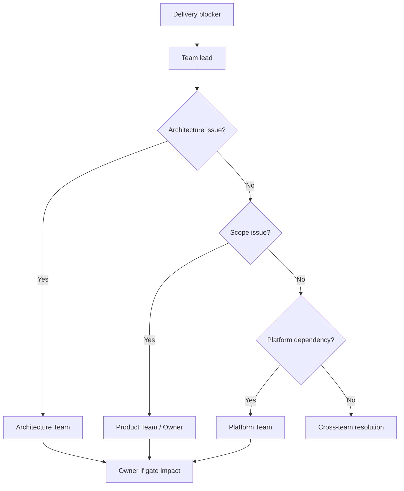

# APZQEP-PLAN-001 — Team Plan

> **Programme:** APZQEP-PLAN-001  
> **Title:** APZ QEP Engineering Plan — Team Structure & Capacity  
> **Classification:** ENGINEERING PLANNING  
> **Status:** PLANNED  
> **Baseline:** APZQEP-ARCH-001 · APZQEP-DEF-002 · Platform 1.4  
> **Rule:** Planning only — no hiring actions or org changes in this document

## Purpose

This document defines **recommended Engineering teams**, responsibilities, capacity assumptions, and **RACI-style accountability** for QEP delivery across releases 0.1–1.0. Teams operate within the existing APZHUB monorepo; Platform 1.4 Maintenance Mode continues under separate ownership.

## Team topology

## Recommended teams

### Platform Team

| Attribute | Definition |
| --------- | ---------- |
| **Mission** | Ensure QEP integrates correctly with certified Platform 1.4 capabilities without platform redesign |
| **Scope** | Gateway routing, IAM consumption, PermissionService mappings, Search provider registration, Event Bus, Audit, Attention Engine, shell module registration |
| **Out of scope** | QEP business logic; Platform 2.0; legacy `apz-stack` changes |
| **Key releases** | 0.1 (registration), 0.2 (authz), 0.2–0.9 (search providers), 0.9 (audit cert investigation) |
| **FTE assumption** | 1.0 FTE (shared with APZHUB maintenance) |

### Backend Team

| Attribute | Definition |
| --------- | ---------- |
| **Mission** | Implement QEP application services AS-01–AS-22 within modular monolith boundaries |
| **Scope** | Service manifests, domain logic, orchestration, validation, events, connector coordination, read models |
| **Out of scope** | UI components; direct engine calls; AI inference |
| **Key releases** | 0.2–0.9 (all service delivery) |
| **FTE assumption** | 3.0 FTE |

### Frontend Team

| Attribute | Definition |
| --------- | ---------- |
| **Mission** | Implement QEP presentation modules M01–M22 in Desktop Shell with permission-driven UI |
| **Scope** | Module manifests, routes, workspace views, forms, DataTables, shared QEP UI in `packages/qep-ui` |
| **Out of scope** | Business logic in components; standalone page layouts; backend calls bypassing gateway |
| **Key releases** | 0.2–0.9 |
| **FTE assumption** | 2.5 FTE |

### QA Team

| Attribute | Definition |
| --------- | ---------- |
| **Mission** | Own quality pyramid execution, MVP certification path validation, regression gates |
| **Scope** | Test strategy, fixtures, Playwright MVP path, a11y verification, release sign-off evidence |
| **Out of scope** | Feature implementation; production deploy |
| **Key releases** | Continuous; 0.9 MVP cert path lead |
| **FTE assumption** | 1.5 FTE |

### AI Team

| Attribute | Definition |
| --------- | ---------- |
| **Mission** | Prepare AI/MCP governance plumbing; **no MVP runtime delivery** |
| **Scope** | Feature flag architecture review; M17/M18 stub manifests; provider abstraction alignment with ARCH |
| **Out of scope** | AI-enabled MVP path; autonomous certification; production AI keys |
| **Key releases** | Advisory 0.1–1.0; implementation post-1.0 only |
| **FTE assumption** | 0.25 FTE (advisory) |

### DevOps Team

| Attribute | Definition |
| --------- | ---------- |
| **Mission** | CI/CD extension, containerisation, secrets management, observability hooks, non-conflict with `apz-stack` |
| **Scope** | GitHub Actions QEP jobs, Docker Compose dev, staging deploy, health dashboards |
| **Out of scope** | Application code; platform cert re-run |
| **Key releases** | 0.1 (CI), 0.9 (staging MVP), 1.0 (GA release pipeline) |
| **FTE assumption** | 0.5 FTE (shared) |

### Architecture Team

| Attribute | Definition |
| --------- | ---------- |
| **Mission** | Guard bounded contexts, review ADRs, enforce layering, approve service/module boundaries |
| **Scope** | Design reviews per release; ADR catalogue maintenance; architecture compliance gates |
| **Out of scope** | Day-to-day implementation; product prioritisation |
| **Key releases** | Gate on every release |
| **FTE assumption** | 0.5 FTE |

### Product Team

| Attribute | Definition |
| --------- | ---------- |
| **Mission** | Prioritise backlog, accept release increments, maintain DEF-002 traceability |
| **Scope** | Release scope, persona acceptance, MVP sign-off preparation |
| **Out of scope** | Technical implementation; architecture decisions |
| **Key releases** | 0.3–0.9 acceptance ceremonies; 1.0 GA sign-off |
| **FTE assumption** | 0.5 FTE (Owner-aligned) |

## Capacity summary

| Team | FTE | Peak release | Notes |
| ---- | --- | ------------ | ----- |
| Platform | 1.0 | 0.2 | Shared maintenance load |
| Backend | 3.0 | 0.4–0.9 | Critical path heavy |
| Frontend | 2.5 | 0.4–0.9 | Module delivery |
| QA | 1.5 | 0.9 | E2E MVP cert path |
| AI | 0.25 | — | Advisory only until post-1.0 |
| DevOps | 0.5 | 0.1, 0.9, 1.0 | CI + staging + GA |
| Architecture | 0.5 | All | Review gates |
| Product | 0.5 | 0.9, 1.0 | MVP + GA acceptance |
| **Total** | **~9.75 FTE** | | Blended; some roles shared |

Capacity assumes **one MVP track** to 1.0. Parallel Phase 2 (AI/MCP) requires separate Owner authorisation and additional capacity.

## RACI by release

**Legend:** R = Responsible · A = Accountable · C = Consulted · I = Informed

### Release 0.1 — Sprint Zero (APZQEP-ENG-010)

| Activity | Platform | Backend | Frontend | QA | DevOps | Arch | Product |
| -------- | -------- | ------- | -------- | -- | ------ | ---- | ------- |
| Package stubs | C | R | R | I | A | C | I |
| CI extension | C | C | C | C | A/R | I | I |
| Test scaffold | I | C | C | A/R | C | I | I |
| Manifest skeletons | C | R | R | I | I | A | I |

### Release 0.2 — Identity, Tenant, Permissions

| Activity | Platform | Backend | Frontend | QA | DevOps | Arch | Product |
| -------- | -------- | ------- | -------- | -- | ------ | ---- | ------- |
| Permission model | A/R | C | C | C | I | C | C |
| M20 Administration | C | R | R | C | I | A | C |
| M21 Audit facade | A | R | R | C | I | C | I |
| M22 Search facade | A | R | R | C | I | C | I |
| M01 Home stub | C | R | R | C | I | C | I |
| IAM integration | A/R | C | I | C | I | C | I |

### Release 0.3 — Portfolio & Projects

| Activity | Platform | Backend | Frontend | QA | DevOps | Arch | Product |
| -------- | -------- | ------- | -------- | -- | ------ | ---- | ------- |
| M02 Portfolio | C | R | R | C | I | C | A |
| M19 Integration Centre | A | R | R | C | C | C | C |
| Project-scoped permissions | C | A/R | C | C | I | C | C |
| M01 project widgets | C | R | R | C | I | C | I |

### Release 0.4 — Requirements

| Activity | Platform | Backend | Frontend | QA | DevOps | Arch | Product |
| -------- | -------- | ------- | -------- | -- | ------ | ---- | ------- |
| M03 Requirements | C | R | R | C | I | A | C |
| Approval workflows | C | A/R | C | C | I | C | C |
| Baselines and import | C | R | R | C | I | C | A |
| Traceability stub (M10) | C | R | C | C | I | C | I |
| Requirements search provider | A | R | R | C | I | C | I |

### Release 0.5 — Verification Library & Design

| Activity | Platform | Backend | Frontend | QA | DevOps | Arch | Product |
| -------- | -------- | ------- | -------- | -- | ------ | ---- | ------- |
| M04 Verification Library | C | R | R | C | I | C | C |
| M05 Verification Design | C | R | R | C | I | C | A |
| Design → library publish | C | A/R | C | C | I | C | C |
| Req→verification trace links | C | R | C | C | I | C | I |
| Verification search provider | A | R | R | C | I | C | I |

### Release 0.6 — Execution & Sessions

| Activity | Platform | Backend | Frontend | QA | DevOps | Arch | Product |
| -------- | -------- | ------- | -------- | -- | ------ | ---- | ------- |
| M06 Execution | C | A/R | R | C | I | C | C |
| M07 Automation registry stub | C | R | R | C | I | C | C |
| Session UX | I | C | A/R | C | I | I | C |
| Execution trace links | C | R | C | C | I | C | I |

### Release 0.7 — Evidence & Traceability

| Activity | Platform | Backend | Frontend | QA | DevOps | Arch | Product |
| -------- | -------- | ------- | -------- | -- | ------ | ---- | ------- |
| M09 Evidence | C | A/R | R | C | C | C | C |
| M10 Traceability | C | A/R | R | C | I | C | A |
| Storage integration | C | R | I | C | A | C | I |
| Gap detection | C | R | C | A | I | C | C |
| Coverage gap alerts (M01) | C | R | R | C | I | C | I |

### Release 0.8 — Defects & Risk

| Activity | Platform | Backend | Frontend | QA | DevOps | Arch | Product |
| -------- | -------- | ------- | -------- | -- | ------ | ---- | ------- |
| M08 Defects | C | A/R | R | C | I | C | C |
| M11 Risk | C | R | R | C | I | C | C |
| M19 defect connector config | A | R | R | C | C | C | C |
| Retest linkage | C | R | C | A | I | C | C |

### Release 0.9 — Certification, Readiness, Basic QI — **MVP**

| Activity | Platform | Backend | Frontend | QA | DevOps | Arch | Product |
| -------- | -------- | ------- | -------- | -- | ------ | ---- | ------- |
| M12 Release Readiness | C | A/R | R | C | I | C | C |
| M13 Certification | C | A/R | R | A | I | A | A |
| M14 Quality Intelligence (basic) | C | R | R | C | I | C | C |
| M15 Reporting | C | R | R | C | I | C | A |
| M01 full command centre | C | R | A/R | C | I | C | C |
| M21 cert audit investigation | A | R | R | C | I | C | C |
| Evidence lock | C | A/R | C | A | I | A | C |
| MVP E2E path (`@mvp-cert`) | I | C | C | A/R | C | C | C |
| Workflow notifications | A | R | I | C | I | C | I |

### Release 1.0 — General Availability

| Activity | Platform | Backend | Frontend | QA | DevOps | Arch | Product |
| -------- | -------- | ------- | -------- | -- | ------ | ---- | ------- |
| MVP module hardening | C | R | R | A/R | C | C | C |
| M16–M18 scaffolds (OFF) | C | R | R | C | I | A | C |
| M19 integration depth | A | R | R | C | C | C | C |
| Owner GA acceptance prep | I | C | C | C | I | C | A/R |
| AI/MCP OFF verification | C | C | C | A | I | A | A |
| Production deploy | C | I | I | C | A/R | C | A |

## Communication cadence

| Ceremony | Frequency | Participants | Output |
| -------- | ----------- | ------------ | ------ |
| Release planning | Per release start | All teams + Product | Scoped backlog |
| Architecture review | Per release | Arch, BE, FE leads | ADR approvals |
| Critical path standup | Daily during 0.4–0.9 | BE, FE, QA | Blocker resolution |
| Demo | End of each release | All + Owner (optional) | Increment acceptance |
| QA sign-off | Pre-release tag | QA, BE, FE | Test evidence |
| Retrospective | Per release | All teams | Process improvements |

## Escalation path

## Cross-team dependencies

| From | To | Dependency |
| ---- | -- | ---------- |
| Backend | Platform | Permission keys, gateway routes, event topics |
| Frontend | Backend | Service contracts (interfaces only at plan stage) |
| Frontend | Platform | Shell registration, nav framework |
| QA | DevOps | CI job stability, test env provisioning |
| All | Architecture | Bounded context compliance |
| AI | Backend/Frontend | Feature flags only; no MVP runtime |

## Post-1.0 team shift

After MVP 0.9 and GA 1.0, recommend:

| Team | Shift |
| ---- | ----- |
| AI | Increase to 1.0+ FTE for M17/M18 Phase 2 |
| Backend | Split stream: maintenance vs Phase 2 features |
| QA | Expand automation coverage for AI governance tests |
| Product | Phase 2 roadmap prioritisation |

---

| Version | Date | Change |
| ------- | ---- | ------ |
| 1.0.0-plan | 2026-07-24 | Initial team plan — APZQEP-PLAN-001 |
| 1.0.1-plan | 2026-07-24 | Release mappings aligned to RELEASE-PLAN.md |
