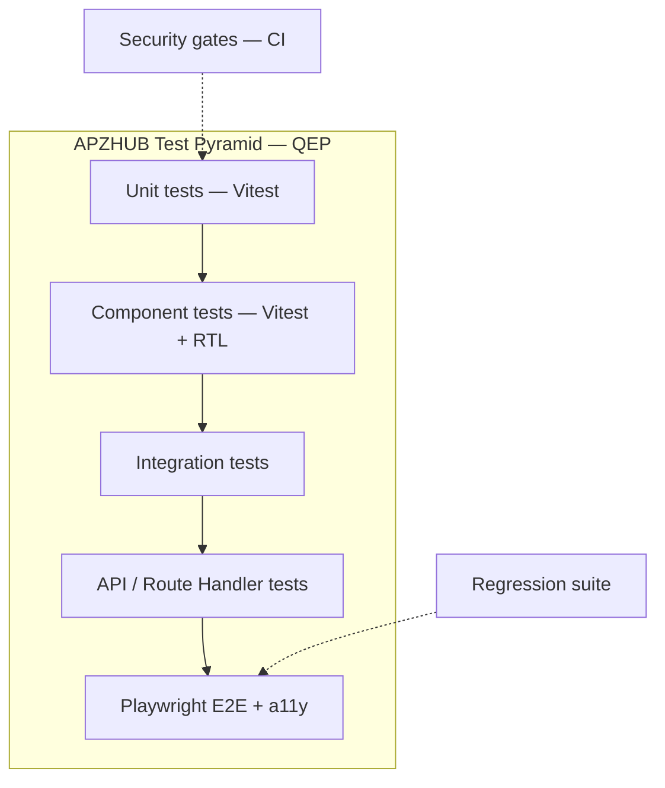

# APZQEP-PLAN-001 — Testing Roadmap

> **Programme:** APZQEP-PLAN-001  
> **Title:** APZ QEP Engineering Plan — Testing Roadmap  
> **Classification:** ENGINEERING PLANNING  
> **Status:** PLANNED  
> **Baseline:** Document 015 Quality & Release · APZQEP-DEF-002 · APZQEP-ARCH-001  
> **Rule:** Planning only — no test code in this document

## Purpose

This document maps QEP Engineering **releases 0.1–1.0** to the **full test pyramid** mandated by APZHUB Document 015: unit, component, integration, API, Playwright E2E, accessibility, security, and regression gates. Every release has explicit quality entry and exit criteria.

## Test pyramid (015 alignment)



## Gate model

| Gate              | Tooling                             | Blocking?            | When introduced         |
| ----------------- | ----------------------------------- | -------------------- | ----------------------- |
| G1 Unit           | Vitest                              | Yes                  | 0.1                     |
| G2 Component      | Vitest + RTL + Storybook            | Yes                  | 0.1                     |
| G3 Integration    | Vitest + test DB/Redis              | Yes                  | 0.2                     |
| G4 API            | Route handler / contract tests      | Yes                  | 0.3                     |
| G5 Playwright E2E | Playwright                          | Yes                  | 0.2 smoke; 0.9 MVP path |
| G6 a11y           | axe-core                            | Yes (WCAG AA target) | 0.4+                    |
| G7 Security       | SAST, dependency audit, secret scan | Yes                  | 0.1 inherited           |
| G8 Regression     | Tagged Playwright `@regression`     | Yes                  | 0.7+                    |

**Definition of Done (015):** all gates pass before merge to main; release tags require full pyramid for in-scope modules.

## Release testing matrix

### Release 0.1 — Bootstrap & CI (ENG-010)

| Layer       | Scope                 | Target                           | Exit criterion                |
| ----------- | --------------------- | -------------------------------- | ----------------------------- |
| Unit        | Package/service stubs | ≥1 passing test per stub package | 100% stub packages green      |
| Component   | Storybook smoke       | Shell + empty QEP slot render    | No a11y critical on stub      |
| Integration | DB connectivity       | PostgreSQL/Redis ping            | Connect succeeds in CI        |
| API         | Health stub           | Platform health unchanged        | 200 response                  |
| E2E         | Platform smoke        | Login + shell regions visible    | Existing SPR-001 smoke passes |
| a11y        | Baseline              | Shell regions                    | No new violations vs baseline |
| Security    | Inherited CI          | Full workspace scan              | Zero high/critical new        |
| Regression  | Platform only         | `@smoke` tag                     | Green                         |

### Release 0.2 — Identity, Tenant, Permissions

| Layer       | Scope                                | Target                     | Exit criterion              |
| ----------- | ------------------------------------ | -------------------------- | --------------------------- |
| Unit        | AS-19, AS-20, AS-21 permission logic | 80% line coverage new code | Coverage gate met           |
| Component   | M20, M21, M22, M01 stub              | Admin, audit, search shell | Storybook + component tests |
| Integration | Auth + tenant persistence            | Session + RBAC scenarios   | All roles tested            |
| API         | Admin + audit + search routes        | Auth, authz, validation    | 401/403/422 cases covered   |
| E2E         | Login + permission-filtered nav      | `@smoke` identity path     | QEP shell visible after SSO |
| a11y        | M20, M21 pages                       | WCAG AA automated          | Zero serious axe violations |
| Security    | Permission bypass attempts           | Negative tests             | No authz bypass             |
| Regression  | 0.1 + 0.2                            | `@regression`              | Green                       |

### Release 0.3 — Portfolio & Projects

| Layer       | Scope                               | Target                              | Exit criterion              |
| ----------- | ----------------------------------- | ----------------------------------- | --------------------------- |
| Unit        | AS-01 portfolio rules; AS-18 health | Project lifecycle; connector health | All transitions tested      |
| Component   | M02, M19 views                      | Project forms; integration centre   | Component coverage ≥80%     |
| Integration | Project CRUD + permissions          | Cross-service flow                  | Project-scoped isolation    |
| API         | Portfolio + integration routes      | Full CRUD                           | Envelope + error categories |
| E2E         | Create project + integration health | `@portfolio`                        | Project visible in shell    |
| a11y        | Forms and tables                    | Keyboard nav                        | Pass axe on new pages       |
| Security    | Project-scoped RBAC                 | Role matrix tests                   | Isolation enforced          |
| Regression  | 0.1–0.3                             | Cumulative                          | Green                       |

### Release 0.4 — Requirements

| Layer       | Scope                          | Target                          | Exit criterion              |
| ----------- | ------------------------------ | ------------------------------- | --------------------------- |
| Unit        | AS-02 domain rules; AS-09 stub | Approval state machine          | All transitions tested      |
| Component   | M03 views                      | Requirement editor; approval UI | Component coverage ≥80%     |
| Integration | Requirement lifecycle          | Cross-service flow              | Event published on approve  |
| API         | Requirements endpoints         | Full CRUD + approve             | Envelope + error categories |
| E2E         | Approve requirement + baseline | `@requirements`                 | End-to-end green            |
| a11y        | Forms and tables               | Keyboard nav                    | Pass axe on new pages       |
| Security    | Author vs approver separation  | Role matrix tests               | SoD enforced                |
| Regression  | 0.1–0.4                        | Cumulative                      | Green                       |

### Release 0.5 — Verification Library & Design

| Layer       | Scope                                 | Target                         | Exit criterion              |
| ----------- | ------------------------------------- | ------------------------------ | --------------------------- |
| Unit        | AS-03, AS-04 domain rules             | Design→library publish         | All transitions tested      |
| Component   | M04, M05 views                        | Library browser; design wizard | Component tests             |
| Integration | Requirement → design → library        | Cross-service flow             | Trace link established      |
| API         | Library + design endpoints            | CRUD + approve                 | Validation on all mutations |
| E2E         | Design verification → library publish | `@verification`                | Approved asset in library   |
| a11y        | Design wizard UI                      | Focus management               | WCAG AA                     |
| Security    | Peer review SoD                       | Role matrix tests              | SoD enforced                |
| Regression  | 0.1–0.5                               | Cumulative                     | Green                       |

### Release 0.6 — Execution & Sessions

| Layer       | Scope                                    | Target                       | Exit criterion                 |
| ----------- | ---------------------------------------- | ---------------------------- | ------------------------------ |
| Unit        | AS-05 session state; AS-06 registry stub | Step results; pause/handover | Edge cases covered             |
| Component   | M06 session UI; M07 registry stub        | Step capture; session list   | Component tests                |
| Integration | Session lifecycle                        | Cross-module                 | Results linked to verification |
| API         | Execution endpoints                      | Session lifecycle            | Validation on all mutations    |
| E2E         | Complete manual session                  | `@execution`                 | Session Completed              |
| a11y        | Session step UI                          | Focus management             | WCAG AA                        |
| Security    | Session access control                   | Cross-tenant denial          | No data leak                   |
| Regression  | 0.1–0.6                                  | Cumulative                   | Green                          |

### Release 0.7 — Evidence & Traceability

| Layer       | Scope                                 | Target                          | Exit criterion               |
| ----------- | ------------------------------------- | ------------------------------- | ---------------------------- |
| Unit        | AS-08 pack logic; AS-09 gap detection | Pack assembly; orphan detection | Algorithm unit tests         |
| Component   | M09 evidence viewer; M10 matrix       | Attach flow; traceability grid  | Virtualised table tests      |
| Integration | Session → evidence → trace links      | Cross-module                    | Links persist                |
| API         | Evidence + traceability endpoints     | CRUD + matrix export            | Export format validated      |
| E2E         | Attach evidence + view matrix gaps    | `@evidence-trace`               | Gap visible before cert path |
| a11y        | Matrix navigation                     | Screen reader labels            | Pass                         |
| Security    | Evidence visibility by project        | RBAC                            | Enforced                     |
| Regression  | 0.1–0.7                               | Cumulative                      | Green                        |

### Release 0.8 — Defects & Risk

| Layer       | Scope                                        | Target                  | Exit criterion          |
| ----------- | -------------------------------------------- | ----------------------- | ----------------------- |
| Unit        | AS-07 lifecycle; AS-10 risk scoring          | Retest; acceptance gate | Algorithm unit tests    |
| Component   | M08 defect form; M11 risk register           | Defect lifecycle UI     | Component tests         |
| Integration | Defect from session; risk linkage            | Cross-module            | Links persist           |
| API         | Defects + risk endpoints                     | CRUD + retest           | Export format validated |
| E2E         | Fail session → defect → retest → risk accept | `@defects-risk`         | Closed-loop green       |
| a11y        | Defect and risk forms                        | Standard                | Pass                    |
| Security    | Defect visibility by project                 | RBAC                    | Enforced                |
| Regression  | 0.1–0.8                                      | Cumulative              | Green                   |

### Release 0.9 — Certification, Readiness, Basic QI — **MVP**

| Layer       | Scope                                              | Target                             | Exit criterion               |
| ----------- | -------------------------------------------------- | ---------------------------------- | ---------------------------- |
| Unit        | AS-11 gates; AS-12 cert state machine; AS-13 basic | Waiver; multi-approver; indicators | CERT-ARCH invariants         |
| Component   | M12 readiness; M13 cert review; M14/M15/M01        | Decision UI; dashboards            | No AI auto-actions           |
| Integration | Readiness → cert → evidence lock                   | Synchronous lock intent            | Pack immutable after approve |
| API         | Certification decisions                            | Approve/reject/qualify             | AI cannot call approve       |
| E2E         | **Full MVP certification path**                    | `@mvp-cert`                        | DEF-002 success measures     |
| a11y        | Certification review screens                       | Critical path                      | WCAG AA                      |
| Security    | SoD certifier roles; pen test                      | Negative tests                     | No critical findings         |
| Regression  | Full suite                                         | `@regression` + `@mvp-cert`        | Green 3 consecutive runs     |

### Release 1.0 — General Availability

| Layer      | Scope                     | Target                 | Exit criterion         |
| ---------- | ------------------------- | ---------------------- | ---------------------- |
| All gates  | Production candidate      | Full pyramid           | 015 Definition of Done |
| E2E        | MVP path in staging       | `@mvp-cert` on staging | Owner demo ready       |
| a11y       | External audit optional   | WCAG AA                | Documented results     |
| Security   | Release sign-off          | Security review PASS   | Evidence recorded      |
| AI/MCP OFF | Feature flag verification | M17/M18 disabled       | Cert path without AI   |
| Regression | 48h soak                  | CI + nightly           | Stable                 |

## MVP E2E scenario (Playwright `@mvp-cert`)

Planning description of the **single mandatory E2E path** for 0.9 MVP (validated again at 1.0 GA):

| Step | Actor   | Action                                                     | Assertion              |
| ---- | ------- | ---------------------------------------------------------- | ---------------------- |
| 1    | Admin   | Create tenant user roles                                   | Permissions active     |
| 2    | Admin   | Create project + environment                               | Project in portfolio   |
| 3    | BA      | Create requirement + approve + baseline                    | Status Approved        |
| 4    | QA      | Design verification + peer approve                         | In library             |
| 5    | QA      | Plan run + execute manual session                          | Session Completed      |
| 6    | QA      | Attach evidence to session                                 | Evidence linked        |
| 7    | QA      | Raise defect from failure; developer resolves; retest pass | Defect Closed          |
| 8    | BA      | View traceability; gap report exported                     | Gaps visible           |
| 9    | RM      | Create release; assess readiness; waiver if needed         | Snapshot Ready         |
| 10   | RM      | Request certification; review; **human approve**           | Decision Approved      |
| 11   | System  | Evidence pack locks                                        | Pack immutable         |
| 12   | Auditor | Search audit; export cert pack                             | Actor named; export OK |

**AI/MCP steps:** explicitly excluded from `@mvp-cert`.

## Test ownership

| Layer       | Primary owner | Supporting           |
| ----------- | ------------- | -------------------- |
| Unit        | Backend dev   | QA review            |
| Component   | Frontend dev  | QA                   |
| Integration | Backend dev   | DevOps (containers)  |
| API         | Backend dev   | QA                   |
| E2E         | QA            | Frontend (selectors) |
| a11y        | QA            | Frontend             |
| Security    | DevOps + Arch | Backend              |
| Regression  | QA            | All                  |

## CI pipeline integration

```mermaid
flowchart LR
  PR[Pull Request] --> G1[G1 Unit]
  G1 --> G2[G2 Component]
  G2 --> G3[G3 Integration]
  G3 --> G4[G4 API]
  G4 --> G7[G7 Security]
  G7 --> MERGE[Merge]
  MAIN[Main branch] --> G5[G5 E2E smoke]
  G5 --> G8[G8 Regression nightly]
  TAG[Release 0.9 tag] --> MVP[@mvp-cert full]
  MVP --> REL[1.0 GA approved]
```

## Test data strategy

| Concern        | Approach                                                       |
| -------------- | -------------------------------------------------------------- |
| Fixtures       | Idempotent seed scripts per release in `testing/qep/fixtures/` |
| Tenants        | Isolated test tenant per E2E run                               |
| Evidence blobs | Minio/S3 test bucket; cleaned post-run                         |
| CI parallelism | Sharded Playwright workers by tag                              |
| Flake policy   | 3-strike quarantine; fix within release                        |

## Metrics and reporting

| Metric                   | Target (0.9 MVP / 1.0 GA) | Tool              |
| ------------------------ | ------------------------- | ----------------- |
| Unit coverage (services) | ≥80%                      | Vitest coverage   |
| E2E pass rate            | ≥98%                      | Playwright report |
| a11y serious violations  | 0 on MVP path             | axe               |
| Mean time to fix flaky   | <2 days                   | QA dashboard      |
| Security high/critical   | 0 open at release         | CI + review       |

## Cross-reference

- Sprint Zero test scaffold: [SPRINT-ZERO.md](./SPRINT-ZERO.md)
- MVP scope: [MVP-PLAN.md](./MVP-PLAN.md)
- Release dependencies: [DEPENDENCY-MAP.md](./DEPENDENCY-MAP.md)

---

| Version    | Date       | Change                                      |
| ---------- | ---------- | ------------------------------------------- |
| 1.0.0-plan | 2026-07-24 | Initial testing roadmap — APZQEP-PLAN-001   |
| 1.0.1-plan | 2026-07-24 | Release mappings aligned to RELEASE-PLAN.md |
