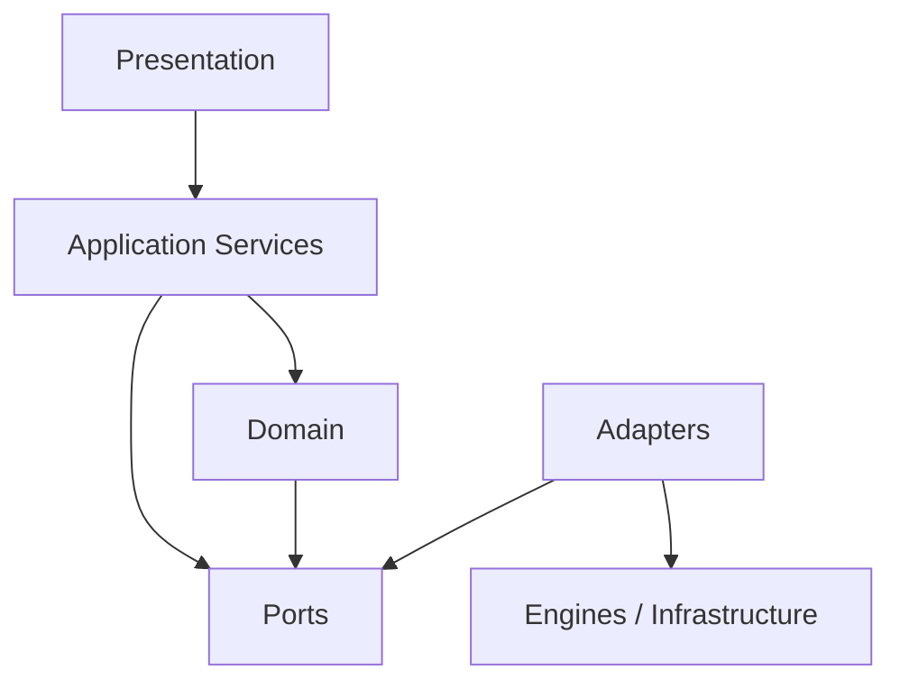

# APZQEP Engineering Handbook

| Field          | Value                                                         |
| -------------- | ------------------------------------------------------------- |
| Document       | APZQEP-ENGINEERING-HANDBOOK                                   |
| Programme      | APZQEP-ENG-001                                                |
| Classification | Product Engineering Manual                                    |
| Status         | **COMPLETE**                                                  |
| Authority      | Implementation guidance (not constitutional law)              |
| Audience       | Engineers · Leads · Architects · Product Owners · AI agents   |
| Horizon        | Written to remain usable for years; principles over snapshots |

---

## Document control

### Purpose

This Handbook explains **how** engineering is performed for APZQEP and, by inheritance, how durable product engineering should be performed across the APZHUB portfolio.

APZQEP is the **reference implementation** of this guidance. The principles herein are intentionally product-portable: other APZHUB products should be able to adopt this Handbook without rewriting methodology for each programme.

### What this Handbook is

- The definitive engineering reference for day-to-day product engineering practice
- A translation of constitutional principles into responsibilities, workflows, and rationale
- A single inheritance point so future slices do not redefine methodology

### What this Handbook is not

- Not the Engineering Constitution (principles only — see [APZQEP-ENGINEERING-CONSTITUTION.md](./APZQEP-ENGINEERING-CONSTITUTION.md))
- Not a coding standard (see [APZQEP-ENGINEERING-STANDARDS.md](./APZQEP-ENGINEERING-STANDARDS.md) when COMPLETE)
- Not a slice instruction template (see [APZQEP-SLICE-TEMPLATE.md](./APZQEP-SLICE-TEMPLATE.md) when COMPLETE)
- Not a substitute for APZHUB Foundation documents 000–029, APZHUB-ENG-001, or ADR-0092
- Not a rewrite of certified slices, roadmaps, or solution architecture

### Inheritance hierarchy (Product Board)

```text
APZHUB Engineering Standard
        │
        ▼
APZQEP Engineering Constitution
        │
        ▼
APZQEP Engineering Framework v1.0    ← named product (core document set)
        │
        ├── Engineering Handbook     ← this document (how)
        ├── Engineering Standards
        └── Specification Template
                │
                ▼
        Engineering Specifications
```

Cite: [APZQEP-ENGINEERING-FRAMEWORK.md](./APZQEP-ENGINEERING-FRAMEWORK.md).

### Authority order

On conflict, apply this order:

1. APZHUB Engineering Constitution (Document 000)
2. ADR-0092 / APZHUB-ENG-001 Engineering Slice Standard
3. [APZQEP Engineering Constitution](./APZQEP-ENGINEERING-CONSTITUTION.md)
4. Engineering Framework v1.0 core — **This Handbook** (guidance)
5. [Engineering Standards](./APZQEP-ENGINEERING-STANDARDS.md) and specialised Standards (Testing, Certification, API, Events, Database, Documentation)
6. Individual slice specifications

Slice specifications SHALL cite the Framework and reference this Handbook and the Engineering Standards. They SHALL NOT restate methodology or naming conventions.

### Durability rule

Prefer **stable principles and responsibilities** over transient technology choices.

When a technology, package name, or current adapter must be mentioned for clarity, treat it as an example of the current reference implementation—not as the definition of the architecture.

### Related specialised standards

| Topic                          | Authoritative document (when COMPLETE)                                 |
| ------------------------------ | ---------------------------------------------------------------------- |
| Coding conventions             | [APZQEP-ENGINEERING-STANDARDS.md](./APZQEP-ENGINEERING-STANDARDS.md)   |
| Domain events (detail)         | [APZQEP-DOMAIN-EVENT-STANDARD.md](./APZQEP-DOMAIN-EVENT-STANDARD.md)   |
| APIs (detail)                  | [APZQEP-API-STANDARD.md](./APZQEP-API-STANDARD.md)                     |
| Database / migrations (detail) | [APZQEP-DATABASE-STANDARD.md](./APZQEP-DATABASE-STANDARD.md)           |
| Testing (detail)               | [APZQEP-TESTING-STANDARD.md](./APZQEP-TESTING-STANDARD.md)             |
| Documentation craft            | [APZQEP-DOCUMENTATION-STANDARD.md](./APZQEP-DOCUMENTATION-STANDARD.md) |
| Certification gates            | [APZQEP-CERTIFICATION-STANDARD.md](./APZQEP-CERTIFICATION-STANDARD.md) |
| Review checklists              | [APZQEP-CHECKLISTS.md](./APZQEP-CHECKLISTS.md)                         |

This Handbook summarises intent and responsibility. Specialised standards own normative detail.

---

# Part I — Engineering Philosophy

## 1. Engineering vision

APZHUB product engineering exists to deliver **enterprise-grade capabilities** that remain understandable, secure, and replaceable over long product lifetimes.

Engineering excellence is measured by:

- correctness under real security and tenancy constraints;
- clarity of boundaries and ownership;
- independent certifiability of change;
- evidence that stands up to audit years later;
- the ability of a new engineer or AI agent to extend the system without rediscovering tribal rules.

Short-term velocity that destroys these properties is not excellence.

## 2. Product philosophy

APZQEP is a native APZHUB product: it consumes platform capabilities (identity, permissions, shell, search, notifications, observability, events, configuration) and contributes product domains through Platform Services, modules, and adapters—never by bypassing those layers.

Product-facing names describe user capability. Backend engines and vendors remain masked behind adapters and platform services.

**Why this matters:** products outlive vendor choices. Coupling user language or application logic to a temporary engine creates irreversible debt.

## 3. Long-term maintainability

Maintainability is designed, not hoped for.

| Practice                         | Rationale                                             |
| -------------------------------- | ----------------------------------------------------- |
| Manifest before code             | Discovery and contracts precede implementation        |
| Interface-first services         | Replaceable adapters without rewriting business rules |
| Additive schema evolution        | History and identifiers remain trustworthy            |
| Independently certifiable slices | Change stays reviewable and releasable                |
| Inheritance over duplication     | Methodology stays consistent across years of slices   |

If a design can only be understood by the people who wrote it last week, it is incomplete.

## 4. Enterprise engineering

Enterprise engineering assumes:

- multiple tenants and projects;
- regulated evidence and audit trails;
- least-privilege operators and dedicated worker identities;
- zero trust on every request path;
- explicit release and deployment authority separate from engineering completion.

Convenience shortcuts that skip authz, validation, audit, or evidence are architectural defects—not pragmatism.

## 5. AI-assisted engineering

AI agents are first-class contributors to drafting, implementing, testing, and documenting slices. They are not an authority.

Humans (Owner / Product Board / designated reviewers) retain approval for architecture conflict, scope change, release, deployment, and constitutional amendment.

AI work must remain:

- scoped to an authorised slice;
- traceable to evidence and commits;
- stoppable when reality conflicts with instruction;
- free of silent authority expansion (no package promotion, release, or deploy without programme authority).

See Part XIII.

## 6. Definition of engineering excellence

Excellence means a change that is:

1. **Architecturally honest** — respects layer and ownership boundaries
2. **Secure by default** — default deny; server authoritative
3. **Tenant-safe** — isolation enforced in durable paths
4. **Tested at the right levels** — unit, integration, security, migration, regression as applicable
5. **Documented** — no undocumented security-, persistence-, or user-visible behaviour
6. **Evidenced** — timestamped proof of what was done
7. **Certified** — PASS under governing certification rules
8. **Stopped cleanly** when it cannot meet the above within scope

---

# Part II — Architecture

## 7. Architecture principles

Architecture precedes engineering. An authorised slice confirms its architectural basis before implementation. Where repository reality conflicts with that basis in a way that cannot be resolved in scope, work **stops**.

Core principles (see Constitution for immutable statements):

- business logic in application services;
- ports and adapters only;
- no layer bypass;
- provider independence for replaceable infrastructure;
- distinct authorities for distinct concerns (for evidence platforms: catalogue, storage, integrity, permission, query, lifecycle, events—where architecture so defines them).

## 8. Layered architecture

```text
Presentation (modules / UI / thin handlers)
        ↓
Application (services, commands, queries, orchestration)
        ↓
Domain (models, invariants, domain services, domain events)
        ↓
Ports (repository, storage, integrity, external capability contracts)
        ↓
Adapters (persistence, providers, engine clients)
        ↓
Infrastructure / Backend engines
```

Dependencies point **inward** toward domain and application contracts. Adapters depend on ports; domain does not depend on adapters.



**Why:** layer bypass creates twin implementations of rules—one in the UI or handler, one in the database—and neither remains authoritative.

## 9. Domain-driven design

Use DDD as a structuring discipline, not a ceremony tax.

- Model language matches the product domain (verification, evidence, lifecycle), not vendor jargon.
- Bounded contexts protect coherence; do not force a single model across unrelated domains.
- Shared kernel types are careful and minimal; prefer explicit translation at boundaries.

## 10. Application services

Application services own:

- use-case orchestration;
- validation before side effects;
- authorisation checks in concert with platform permission services;
- transaction boundaries for the use case;
- publication of domain/integration events after successful state change;
- audit and search/notify _triggers_ via platform mechanisms—not ad-hoc module subsystems.

Application services do **not** own:

- SQL dialects or storage-provider APIs;
- UI layout;
- raw engine error surfaces;
- cross-module coupling for convenience.

## 11. Repository pattern

Repositories abstract persistence of aggregates or durable records behind ports.

- Application code depends on repository interfaces.
- Persistence technology (currently PostgreSQL in the reference implementation) stays behind adapters.
- Queries that are reporting/search shaped may use dedicated read models or query ports—still without leaking vendor details into application contracts.

## 12. Ports and adapters

| Concern               | Port responsibility                 | Adapter responsibility             |
| --------------------- | ----------------------------------- | ---------------------------------- |
| Persistence           | Load/save domain-relevant state     | Map to tables/drivers              |
| Blob / object storage | Store/retrieve bytes by logical key | Talk to a provider                 |
| Integrity             | Digest / verify content hashes      | Crypto/library specifics           |
| External engines      | Capability contracts                | Engine clients + error translation |

Never combine “module UI”, “platform service policy”, and “connector client” into one type.

## 13. Dependency inversion

High-level policy defines interfaces. Low-level details implement them.

New infrastructure is added by **new adapters**, not by rewriting services to call vendor SDKs.

## 14. Provider independence

Content and infrastructure providers are replaceable. Catalogue and lifecycle policy must not encode a single provider’s physical deletion, path layout, or proprietary API semantics as business truth.

**Why:** evidence and quality platforms outlive storage vendors. Logical state belongs to product services; bytes belong to storage adapters.

## 15. Bounded contexts

Protect boundaries between contexts (for example: catalogue vs storage vs lifecycle governance vs discovery). Crossing a boundary requires an explicit contract—service call, port, or event—not a shared table “for convenience.”

## 16. Modular engineering

- Modules present capability; they do not own business rules that belong in services.
- Services are the unit of business logic.
- Integrations/connectors translate; they do not invent product policy.
- Packages and manifests make modules/services discoverable—hardcoding registries in the shell is prohibited by platform standards.

---

# Part III — Domain Engineering

## 17. Domain models

The domain model expresses business meaning: identities, states, relationships, and rules that would remain true if the UI and database were replaced tomorrow.

Keep the model free of transport DTOs, framework base classes, and provider SDKs.

## 18. Aggregate roots

Where aggregates are used, the aggregate root is the consistency boundary for invariants that must hold together.

External references prefer root identifiers. Cross-aggregate consistency uses application orchestration and eventual consistency via events where immediate consistency is not required.

## 19. Entities

Entities have identity that persists across attribute changes. Identity is platform-meaningful (global IDs where the platform so requires). Backend engine identifiers remain adapter-internal unless architecture explicitly promotes them.

## 20. Value objects

Use value objects for concepts defined by attributes (digests, status codes that are closed sets, scoped keys) when equality is structural. Prefer validation at construction so invalid values never enter the model.

## 21. Domain services

Domain services hold operations that do not naturally belong to a single entity but are still pure domain policy (for example, evaluating whether a transition is allowed given two states and a policy matrix).

If an operation needs transactions, permissions, or multi-port orchestration, it belongs in an **application** service that may call a domain service for the pure rule.

## 22. Domain events

Domain events record **facts that already happened** in past-tense language. They are not commands.

Event philosophy and envelope rules are specialised in the Domain Event Standard; platform Event SDK remains authoritative for bus mechanics. See Part VIII for Handbook-level guidance.

## 23. Invariants

Invariants are conditions that must always hold for a consistent model (tenant scope present, digest immutable after seal, forbidden transitions rejected).

Enforce invariants as close to the domain as practical; never rely solely on the UI.

## 24. Business rules

| Rule location | Appropriate for                                            |
| ------------- | ---------------------------------------------------------- |
| Domain        | Pure policy, state machines, invariant checks              |
| Application   | Orchestration, authz, transactions, multi-port workflows   |
| Adapter       | Translation, retries against infrastructure, error mapping |
| Presentation  | Display and interaction only                               |

Duplicating a business rule in two layers is a defect waiting for drift.

---

# Part IV — Application Layer

## 25. Commands

Commands express intent to change state. They are validated, authorised, executed once (or made idempotent), and either succeed with a defined result or fail with a typed error category.

Commands do not return large read models as a side habit; prefer explicit query paths for reads.

## 26. Queries

Queries read state without changing authoritative business data. They still require authentication, authorisation, and tenant scoping.

Search and discovery go through platform search mechanisms where the product registers providers—modules do not invent standalone search subsystems.

## 27. Validation

Validate early:

1. structural / schema validation of input;
2. authorisation;
3. domain invariants and business rules;
4. then persistence or provider calls.

Never “write first, validate later” for durable authoritative state.

## 28. Transactions

A use case defines its transactional boundary. Prefer one clear unit of work per command success path. Side effects that cannot share the transaction (external storage, notifications) must be designed for consistency (outbox/events, compensating actions, or explicit lifecycle states)—not left implicit.

## 29. Error handling

- Translate infrastructure errors at adapters.
- Surface typed platform error categories to clients.
- Never leak engine internals, stack traces, or secret material to users.
- Security-relevant failures remain auditable without becoming information oracles.

## 30. Orchestration

Orchestration coordinates ports and domain rules. It belongs in application services—not in controllers, not in repositories, not in UI components.

Long-running work is asynchronous (jobs/events). Request handlers stay responsive.

## 31. Service responsibilities (summary)

```text
Authorise → Validate → Apply domain rules → Persist via ports →
Publish events / enqueue jobs → Return envelope
```

Audit, notification, and search indexing are triggered through platform-owned paths after the business fact is established—not reimplemented per module.

---

# Part V — Persistence

## 32. Repository responsibilities

Repositories:

- translate between domain-relevant persistence models and storage;
- enforce tenant predicates on load/save paths that they own;
- participate in unit-of-work / transaction scopes defined by the application;
- do not contain product workflow policy.

Detailed naming, indexing, and migration rules belong in the Database Standard.

## 33. PostgreSQL guidance (reference implementation)

The current APZHUB platform metadata and many product durable stores use PostgreSQL. Treat this as the **reference** relational store, not as permission to embed vendor-only features into domain contracts.

Portable practices:

- explicit constraints for integrity the domain relies on;
- additive migrations;
- optimistic concurrency where concurrent writers exist;
- indexes justified by query paths;
- no business data duplication across systems of record without an explicit cache/search rationale.

## 34. Entity mapping

Mapping keeps domain models free of row shapes. Persistence models may exist in adapters. Avoid leaking column names into API contracts.

## 35. Migration strategy

- Additive by default (Constitution).
- Tested in CI for apply path.
- Destructive change requires explicit Owner authority.
- Migrations are part of the slice’s certifiable deliverables when schema changes.

## 36. Optimistic concurrency

Where concurrent updates are possible, use version tokens or equivalent checks so lost updates fail safely and can be retried with full re-validation.

## 37. Transactions (persistence view)

Keep transactions short. Do not hold transactions open across slow external provider calls. Coordinate logical state (catalogue/lifecycle) with byte storage using explicit application patterns, not accidental multi-resource transactions.

## 38. Indexing and performance

Indexes follow observed or designed query paths. Premature indexing of every column is noise; missing indexes on tenant + lookup keys are defects.

Performance work measures before and after; it does not guess in production without evidence.

---

# Part VI — Security

## 39. Authentication

Authentication establishes identity via the platform auth layer. Products do not invent parallel login systems for normal users. Session handoff remains platform-owned.

## 40. Authorisation

Authorisation is **server-side and authoritative**. UI hiding is a usability feature, not a control.

Default deny: missing allow ⇒ deny.

## 41. Permission model

Permissions are platform concepts. Product modules declare required permissions; PermissionService (or successor platform authority) evaluates them.

Backend engine role names never appear in user-facing UI. Role translation stays in platform/service/adapter layers.

Superadmin is a special audited tier—not a silent bypass of design.

## 42. Tenant isolation

Every durable read and write is tenant-scoped. Cross-tenant access requires an explicit, authorised break-glass pattern if ever allowed; ordinary features never “filter in the UI only.”

## 43. Project isolation

Where projects (or equivalent scopes) partition data, isolation rules are enforced with the same seriousness as tenant isolation—on the server, in queries and commands.

## 44. Secret handling

Secrets never appear in source control, logs, client bundles, or error messages. Configuration stores references and encrypted material per platform practice—not plaintext in manifests.

## 45. Security by default

New endpoints and commands ship private, authenticated, authorised, validated, rate-limited, correlated, and auditable. Public exposure is an explicit design decision with threat consideration—not a default.

---

# Part VII — Storage

## 46. Storage abstraction

Logical content operations go through storage ports. Application services reason about **logical objects** and lifecycle states, not bucket APIs.

## 47. Storage providers

Providers are adapters. Adding a provider must not require rewriting catalogue or lifecycle policy.

## 48. Evidence storage (reference domain)

In the APZQEP evidence reference architecture, responsibilities remain separated:

```text
Catalogue owns logical records
Storage owns bytes
Integrity owns digests
Permission owns visibility
Query owns discovery
Lifecycle service owns transition policy
```

Blurring these authorities recreates the defects certified slices closed. Future products with analogous concerns should preserve the same separation of duties even if domain names differ.

## 49. Metadata

Metadata that is authoritative for the product belongs in the product’s system of record (catalogue/platform DB as architecture dictates). Provider-native metadata is not the product SoR unless explicitly designated.

## 50. Integrity

Integrity verification (digests, seal rules) is a distinct concern. Storage adapters may compute or transport bytes; integrity policy remains a first-class service responsibility where architecture so defines it.

## 51. Provider independence (storage)

Physical delete semantics, eventual consistency of object stores, and provider quotas must not silently redefine product lifecycle states. Logical deletion and disposal eligibility are product decisions.

---

# Part VIII — Domain Events

## 52. Event philosophy

Respond fast; process asynchronously where work is not required for the immediate consistent answer. Events record facts for notify, audit, search, activity, and downstream workflows.

Platform Services publish; modules do not operate private notification or search buses.

## 53. Event ownership

The service that owns the state transition owns the event publication. Downstream subscribers are idempotent and must tolerate at-least-once delivery.

## 54. Event contracts

Events have schemas (manifest-first per platform Event SDK). Consumers depend on contracts, not on producer internals.

Normative naming, envelope, and evolution rules: Domain Event Standard + platform Event SDK (029).

## 55. Correlation and causation

- **Correlation ID** ties a user/API journey across services.
- **Causation ID** ties an event to the message or command that caused it.

Both are mandatory for operability and audit reconstruction.

## 56. Idempotency

Subscribers treat duplicates as safe. Producers make publication patterns idempotent where retries occur.

## 57. Replay

Replay is a supported operational concept for recovery and re-projection—not an excuse for non-idempotent handlers. Ordering guarantees, if any, are explicit per stream; do not assume global order.

## 58. Versioning

Evolve events compatibly. Breaking changes require new versions and controlled migration of consumers. Deprecation is explicit and time-bounded in documentation.

---

# Part IX — Testing

## 59. Testing philosophy

Tests protect architecture and security properties—not only happy paths.

The test pyramid remains mandatory. Detail and coverage expectations live in the Testing Standard and Foundation 015.

## 60. Unit testing

Unit tests cover domain rules, transition matrices, pure validators, and application logic with ports faked/mocked at boundaries.

## 61. Integration testing

Integration tests exercise adapters against real or testcontainer infrastructure where needed (database, storage fakes), proving tenant isolation and migration apply paths.

## 62. Migration testing

Schema migrations are tested for apply success and for compatibility with existing identifiers and authoritative content.

## 63. Security testing

Security tests prove default deny, tenant/project isolation, and permission boundaries—especially for list/search/query paths that historically leak.

## 64. Regression testing

Certified behaviour stays green. Intentional behaviour changes are documented in the slice and evidenced; silent regressions are certification failures.

## 65. Evidence generation

Automated and manual evidence (logs of test runs, security results, migration proofs) are filed under the programme evidence conventions with timestamps.

## 66. Certification testing

Certification is not “tests exist.” It is a structured PASS/FAIL/STOP against the Certification Standard, with required evidence attached.

---

# Part X — Documentation

## 67. Documentation philosophy

If behaviour is user-visible, security-relevant, or persistence-relevant, it is documented in the artefacts that govern the slice.

Documentation is part of Definition of Done—not a cleanup phase after merge pressure.

## 68. Markdown conventions

Follow the Documentation Standard (when COMPLETE) for structure, headings, terminology, and tables. Prefer durable links to framework docs over pasting methodology into every slice note.

## 69. ADR usage

Architecture Decision Records capture **decisions and rationale** that should outlive a slice. Slice notes capture what that slice did. Do not hide portfolio-level decisions only in chat transcripts.

## 70. Architecture diagrams

Use diagrams to show ownership and request paths. Prefer stable responsibility diagrams over screenshots of today’s folder tree.

## 71. Repository structure

Respect monorepo layout and SDK placement rules from Foundation 004 and platform SDKs. Product docs live under `docs/products/{product}/`. Engineering methodology for APZQEP lives in this folder.

## 72. Cross references

Reference; do not fork. When a specialised standard exists, link it. When APZHUB-ENG-001 owns process, link it.

---

# Part XI — Certification

## 73. Definition of Done (engineering slice)

A slice is done when, within its authorised scope:

- architecture confirmation recorded;
- implementation complete without boundary violations;
- required tests pass;
- security validation passes;
- documentation updated;
- evidence filed;
- certification outcome is **PASS**;
- repository left in a releasable state;
- no silent release/deploy performed unless separately authorised.

Normative gate language: Certification Standard + APZHUB-ENG-001.

## 74. Engineering certification

Engineering certification attests technical completeness and standards compliance. It does not by itself authorise production promotion.

## 75. Product Board review

Product-significant programmes and release gates require Product Board authority per APZQEP / APZHUB governance. Engineering PASS ≠ Board acceptance ≠ Release.

## 76. Release readiness

Release readiness is a separate gate: freeze, notes, promotion rules, and operational checks. An engineering slice must not smuggle release authority.

## 77. Engineering evidence

Evidence answers: what changed, why, how it was tested, how security was validated, what was certified, and what remains out of scope. Timestamped artefacts under operations evidence paths are mandatory.

---

# Part XII — Release

## 78. Release governance

Release is governed by lifecycle and portfolio standards—not by informal tag creation after a slice.

## 79. Freeze

Freeze locks scope and, when declared, blocks non-remediation change. Slices authorised during freeze follow freeze rules.

## 80. Promotion

Package or environment promotion requires explicit programme authority. LIMITED_AVAILABILITY and similar postures are intentional product states—not accidents.

## 81. Release candidates

Candidates are built from known commits with evidence. They are tested as candidates; they are not “main but hopeful.”

## 82. Production release

Production release requires the full acceptance chain defined by governance. Engineering completion of a slice is necessary but not sufficient.

## 83. Remediation

Remediation slices are still slices: scoped, evidenced, certified. Hotfixes do not waive tenant isolation, authz, or additive-migration principles unless Owner explicitly authorises a constitutional exception path.

---

# Part XIII — AI Engineering

## 84. Cursor and other agents

AI coding agents may implement authorised slices end-to-end within documentation and code scopes granted by the Owner instruction. They must read Foundation, Constitution, this Handbook, and the slice instruction before expanding scope.

## 85. Conversational AI

Chat tools may assist design and review. Their outputs are not authoritative until captured in repository documents or ADRs.

## 86. AI responsibilities

AI agents SHALL:

- stay inside authorised scope;
- preserve architectural boundaries;
- produce tests and evidence;
- stop with a structured STOP when blocked;
- avoid rewriting frozen authoritative artefacts;
- avoid release/deploy/package promotion without authority.

## 87. Human approval

Humans approve: architecture exceptions, scope changes, constitutional amendments, Product Board gates, release, and deployment.

## 88. Engineering workflow (AI-shaped)

```text
Owner authorises slice
  → Agent inspects baseline
  → Confirms architecture
  → Designs within boundaries
  → Implements
  → Tests
  → Documents
  → Evidences
  → Certifies
  → Stops (no next slice without new authority)
```

## 89. Traceability

Prompts, commits, evidence files, and certification records form the audit trail. Prefer repository artefacts over ephemeral chat as the system of record for decisions.

## 90. AI limitations

AI must not be used to:

- invent parallel architecture;
- weaken security for demo speed;
- redefine methodology inside a slice prompt when this Handbook already governs it;
- claim certification without required evidence.

---

# Part XIV — Operational Engineering

## 91. Logging

Structured logs with correlation IDs. No secrets. Security and persistence-relevant actions are reconstructable.

## 92. Metrics

Services and connectors expose metrics that support SLO thinking: latency, errors, saturation, queue depth where jobs exist.

## 93. Observability

Metrics, logs, traces, and health correlate via correlation IDs (Foundation 014). Silent components are defects.

## 94. Health

Health is hierarchical: platform → workspace → module → service → connector → engine → infrastructure. Product services self-report honestly (including “business functionality false” when stubs).

## 95. Diagnostics

Diagnostic paths are permission-gated. Backend admin UIs are not the default operator experience for standard users.

## 96. Performance

Performance is evidenced. Optimisations that break isolation or layering are rejected.

## 97. Scalability

Design for horizontal scale at the edges that need it (stateless services, async jobs). Do not prematurely distribute a modular monolith without architectural authority.

---

# Part XV — Engineering Workflow

## 98. Product Board

Product Board sets product direction, accepts significant programmes, and gates release-class decisions. Engineering executes authorised slices within that frame.

## 99. Engineering slices

Per APZHUB-ENG-001 / ADR-0092:

- smallest coherent authorised unit;
- independently testable and certifiable;
- leaves repository releasable;
- short Owner prompt; methodology inherited—not restated.

APZQEP product slices additionally inherit this Handbook and the APZQEP Engineering Constitution.

## 100. Review

Use Architecture, Engineering, Security, Migration, Testing, Documentation, Certification, and Release checklists (see Checklists document when COMPLETE). Reviews verify boundaries and evidence—not only style.

## 101. Certification

PASS / FAIL / STOP per Certification Standard. STOP is a valid professional outcome.

## 102. Release

Separate authority. See Part XII.

## 103. Continuous improvement

Improve standards through explicit amendments and ADRs—not through quiet drift in a single slice. When a slice reveals a missing durable rule, update the framework documents in a documentation programme; do not leave the rule only in that slice’s notes.

---

# Appendices

## Appendix A — Glossary

| Term                     | Meaning                                                       |
| ------------------------ | ------------------------------------------------------------- |
| Slice                    | Owner-authorised, independently certifiable engineering unit  |
| Port                     | Application/domain-facing interface to an external capability |
| Adapter                  | Infrastructure implementation of a port                       |
| SoR                      | System of Record — authoritative store for a datum            |
| Constitution             | Immutable principles document                                 |
| Handbook                 | This document — how engineering is performed                  |
| Certification            | Structured PASS/FAIL/STOP against required evidence           |
| Default deny             | Missing allow decision equals deny                            |
| Provider independence    | Business policy not bound to one vendor’s mechanics           |
| Reference implementation | APZQEP’s current concrete expression of these principles      |

## Appendix B — Terminology discipline

| Prefer                                                                         | Avoid in product/UI language                 |
| ------------------------------------------------------------------------------ | -------------------------------------------- |
| Platform service names (`ProjectService`, evidence catalogue service concepts) | Vendor service names as user terms           |
| Past-tense event names                                                         | Command-like event names                     |
| Tenant / project scope                                                         | “Global access” without design               |
| Logical lifecycle states                                                       | Equating lifecycle with provider delete APIs |

## Appendix C — Reference documents

| Document                                                                   | Role                                |
| -------------------------------------------------------------------------- | ----------------------------------- |
| APZHUB Document 000                                                        | Supreme engineering constitution    |
| Foundation 001–029                                                         | Architecture and SDKs               |
| APZHUB-ENG-001 / ADR-0092                                                  | Slice process freeze                |
| APZHUB Lifecycle / Engineering / AI Operational Framework                  | Governance                          |
| APZQEP roadmap, solution architecture, execution plan                      | Product authority                   |
| APZQEP-120-S01…S06                                                         | Certified reference slices (closed) |
| [APZQEP-ENGINEERING-CONSTITUTION.md](./APZQEP-ENGINEERING-CONSTITUTION.md) | Product engineering principles      |
| Specialised APZQEP-ENG-001 standards                                       | Normative detail by topic           |

## Appendix D — Repository conventions (durable)

- Product documentation: `docs/products/{product}/`
- This framework: `docs/products/apzqep/engineering/`
- ADRs: `docs/adr/`
- Operations evidence: `docs/operations/evidence/{product}/`
- Manifest-first registries for modules, services, events, integrations per platform SDKs

Exact package layouts follow Foundation 004 and SDK documents; this Handbook does not freeze folder trivia that tooling may evolve.

## Appendix E — Engineering principles summary

1. Architecture before engineering
2. Business logic in application services
3. Ports and adapters only
4. Tenant and project isolation; default deny
5. Repository abstraction; provider independence
6. Additive migrations
7. Evidence mandatory; certification mandatory
8. Independently certifiable slices
9. No undocumented behaviour; no hidden APIs
10. No silent package, release, or deployment authority
11. Inheritance over duplication
12. Stop on unresolvable conflict

These are stated normatively in the Constitution; this Handbook explains how to live them.

## Appendix F — How future slices should cite this Handbook

Minimum citation pattern for a future slice instruction:

```text
Engineering methodology:
  APZHUB-ENG-001 / ADR-0092
  APZQEP Engineering Constitution
  APZQEP Engineering Handbook
  (applicable specialised Standards)

This slice defines only:
  objective, scope, acceptance criteria, dependencies, exclusions, special constraints
```

Do not paste Parts I–XV into the slice.

---

## Document history

| Version | Programme phase        | Status   | Notes                                                                                            |
| ------- | ---------------------- | -------- | ------------------------------------------------------------------------------------------------ |
| 1.0     | APZQEP-ENG-001 Phase 2 | COMPLETE | First complete Handbook; durable portfolio-oriented guidance; APZQEP as reference implementation |

---

_End of APZQEP Engineering Handbook_
