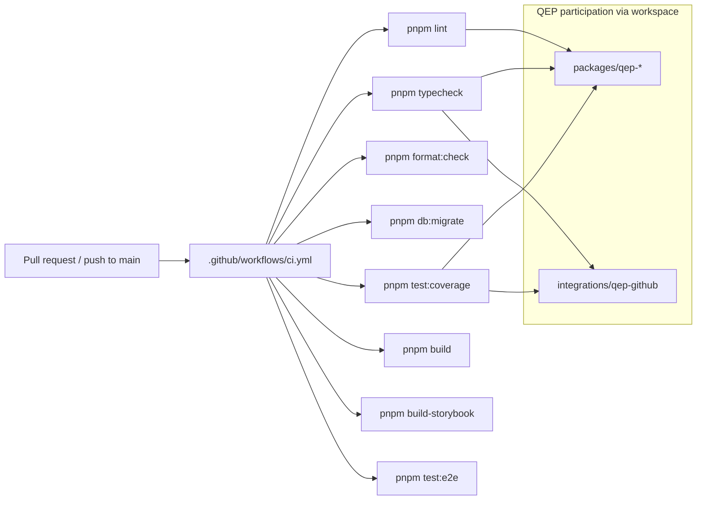

# APZQEP-ENG-010 — CI/CD

> **Programme:** APZQEP-ENG-010  
> **Status:** IMPLEMENTED / AWAITING OWNER ACCEPTANCE  
> **Deploy:** **None** — foundation milestone only

## Purpose

Document how APZ QEP foundation artefacts participate in the existing APZHUB continuous integration pipeline. ENG-010 did **not** create a separate QEP pipeline or deployment target.

## Pipeline overview



## Root CI workflow

**File:** `.github/workflows/ci.yml`

**Triggers:** Push to `main`/`master`; all pull requests.

**Services:** PostgreSQL 16 (port `54334`), Redis 7 (port `6380`).

| Step      | Command                          | QEP impact                                      |
| --------- | -------------------------------- | ----------------------------------------------- |
| Install   | `pnpm install --frozen-lockfile` | Installs `@apzhub/qep-*` workspace packages     |
| Lint      | `pnpm lint`                      | ESLint scans QEP paths                          |
| Typecheck | `pnpm typecheck`                 | Runs package `typecheck` scripts including QEP  |
| Format    | `pnpm format:check`              | Prettier validates QEP sources                  |
| Migrate   | `pnpm db:migrate`                | Platform DB only — no QEP migrations            |
| Test      | `pnpm test:coverage`             | Vitest includes QEP unit tests                  |
| Build     | `pnpm build`                     | Platform web build — no QEP routes yet          |
| Storybook | `pnpm build-storybook`           | Platform UI Storybook — QEP components deferred |
| E2E       | `pnpm test:e2e`                  | Platform E2E — no QEP scenarios                 |

QEP packages participate **automatically** through pnpm workspace membership — no CI file changes were required at ENG-010 beyond existing monorepo coverage.

## QEP-specific scripts (local / programme closeout)

These scripts are **not** currently invoked in `.github/workflows/ci.yml`. Run them locally and in programme evidence capture:

| Script                      | Purpose                                  |
| --------------------------- | ---------------------------------------- |
| `pnpm test:qep`             | Focused Vitest run on QEP packages only  |
| `pnpm typecheck:qep`        | Focused TypeScript check on QEP packages |
| `pnpm audit:qep-foundation` | Structural foundation audit              |

**Recommendation for ENG-010 Acceptance:** Add `pnpm audit:qep-foundation` to CI in a follow-up PR after Owner Acceptance, or include in programme closeout manual gate until CI extension is approved.

## Workspace discovery

```yaml
# pnpm-workspace.yaml
packages:
  - "apps/*"
  - "packages/*" # includes packages/qep-*
  - "services/*" # includes services/qep/
  - "integrations/*" # includes integrations/qep-github
  - "events/*" # includes events/qep/
```

Module and event manifests are not npm packages; they are validated by the audit script, not by CI build steps.

## What CI does not do at ENG-010

| Excluded                   | Reason                                    |
| -------------------------- | ----------------------------------------- |
| QEP deployment             | No releasable QEP artefact                |
| Docker image for QEP       | QEP is not a separate service             |
| QEP database migrations    | No QEP schema                             |
| QEP E2E job                | No business scenarios                     |
| Separate QEP workflow file | Unnecessary — workspace covers foundation |
| Production smoke for QEP   | Deferred to MVP programmes                |

## Deploy posture

| Environment          | ENG-010 action                                 |
| -------------------- | ---------------------------------------------- |
| Local dev            | Existing `pnpm docker:up` + `pnpm dev`         |
| CI                   | Quality gates only                             |
| Staging / production | **No deploy** — foundation code is inert stubs |

Release 0.1 (engineering foundation) does not produce a customer-facing deployment. First deployable QEP increment is scheduled in PLAN-001 release 0.2+ after domain programmes.

## Secrets and CI

CI uses ephemeral test secrets (see workflow `env` block). No QEP connector secrets are required at foundation level. Per Document 013:

- Never commit secrets to the repository
- Connector configuration references only in future integration programmes

## Branch protection alignment

Per [branch-protection.md](../../../developer/branch-protection.md) and [BRANCHING-AND-VERSIONING.md](../../../operations/BRANCHING-AND-VERSIONING.md):

- PR required to `main`
- CI quality job must pass
- Branch up to date before merge

QEP changes follow the same protection as platform changes.

## Future CI extensions (domain programmes)

When authorised programmes deliver domain code:

| Extension                            | Programme trigger         |
| ------------------------------------ | ------------------------- |
| `pnpm audit:qep-foundation` in CI    | Post ENG-010 Acceptance   |
| QEP Playwright project               | ENG-040+ / MVP path       |
| QEP-specific coverage thresholds     | Domain programme closeout |
| OpenAPI validation for QEP APIs      | API programme             |
| Deploy to staging with feature flags | Release 0.2+              |

## Related documents

- [QUALITY-GATES.md](./QUALITY-GATES.md) — gate definitions
- [TESTING-GUIDE.md](./TESTING-GUIDE.md) — test scope
- [DEVELOPMENT-GUIDE.md](./DEVELOPMENT-GUIDE.md) — local commands
