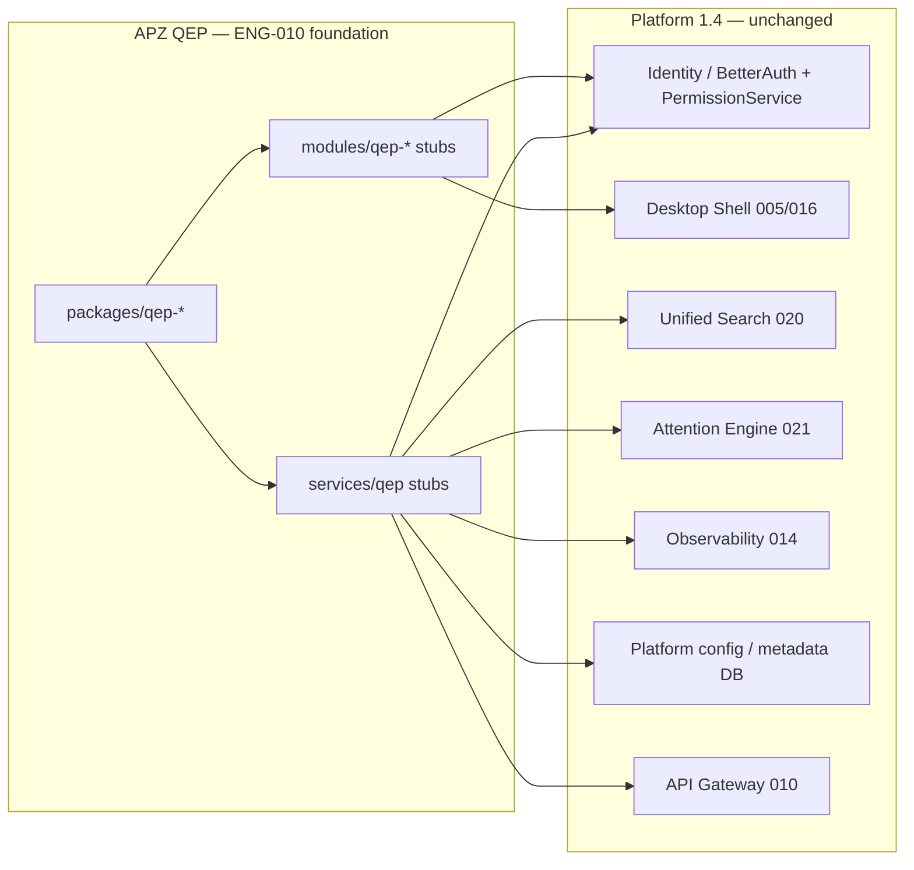

# APZQEP-ENG-010 — Engineering Foundation

> **Programme:** APZQEP-ENG-010  
> **Classification:** ENGINEERING FOUNDATION  
> **Status:** IMPLEMENTED / AWAITING OWNER ACCEPTANCE  
> **Baseline:** APZQEP-PLAN-001 ACCEPTED · APZQEP-ARCH-001 · APZQEP-DEF-002 · Platform 1.4 **CERTIFIED**

## Purpose

Define the engineering principles, platform consumption model, and scope boundaries for the QEP foundation delivered in APZQEP-ENG-010. This document is the authoritative reference for what was implemented and what remains deferred.

## Engineering principles

| Principle                           | Decision                                                                                         |
| ----------------------------------- | ------------------------------------------------------------------------------------------------ |
| **Single monorepo**                 | QEP extends `/home/ubuntu/apz-portal` — no second repository                                     |
| **Manifest first**                  | `module.yaml`, `service.yaml`, `event.yaml`, `integration.yaml` before domain code (SDK 024–029) |
| **Modular monolith**                | One deployable APZHUB application; QEP bounded contexts as packages and manifests                |
| **Platform consumption**            | Identity, shell, search, notify, observe, config — platform-owned, QEP consumes                  |
| **Layering (003)**                  | Module → Platform Service → Connector → Engine — no bypass                                       |
| **Strict TypeScript**               | QEP packages inherit root `tsconfig`; `strict` enforced                                          |
| **Quality pyramid (015)**           | Lint, typecheck, unit tests, CI gates on every change                                            |
| **Self-hosted OSS first**           | Community Edition APIs; no mandatory commercial dependencies                                     |
| **No business logic in foundation** | Stubs, types, contracts, health markers only                                                     |

## Platform reuse

QEP is a **native APZHUB product**. The foundation assumes and preserves consumption of these platform capabilities:

| Capability             | Platform owner                          | QEP ENG-010 action                                            |
| ---------------------- | --------------------------------------- | ------------------------------------------------------------- |
| **Identity / auth**    | BetterAuth + PermissionService (007)    | None — consume on domain programmes                           |
| **Authorisation**      | PermissionService; server authoritative | Permission keys declared in manifests only                    |
| **Shell / navigation** | Desktop Framework (005/016/017)         | Nav metadata in `module.yaml`; no routes implemented          |
| **Search**             | Platform Search Service (020)           | No module search UIs; provider registration deferred          |
| **Notifications**      | Attention Engine (021)                  | Event manifests stubbed; no publishers                        |
| **Observability**      | Metrics, logs, traces, health (014)     | `getQepFoundationHealth()` marker in `@apzhub/qep-foundation` |
| **Configuration**      | Platform PostgreSQL metadata (011)      | No QEP schemas or migrations                                  |
| **Events**             | Event Bus (012/029)                     | Eight `event.yaml` stubs; no bus wiring                       |
| **Audit**              | Central audit service                   | Subscribers referenced in event manifests only                |

## Modular monolith posture

Per APZQEP-ARCH-001, QEP ships as an additive product inside the APZHUB modular monolith:

- **Presentation:** 22 module stubs (`modules/qep-*`) — M01–M22 catalogue from DEF-002
- **Application:** Platform service shell + 16 domain service stubs under `services/qep/services/`
- **Shared kernel:** `@apzhub/qep-types`, `@apzhub/qep-contracts`, `@apzhub/qep-foundation`, `@apzhub/qep-ui`
- **Integration:** `@apzhub/integration-qep-github` stub
- **Events:** Eight lifecycle event manifests under `events/qep/`

No separate QEP deployment unit exists at ENG-010. Release 0.1 is an engineering foundation milestone, not a product release.

## What was implemented

| Area                  | Implementation                                                                                               |
| --------------------- | ------------------------------------------------------------------------------------------------------------ |
| **Package stubs**     | Four QEP packages + GitHub integration package with `package.json`, `tsconfig`, `src/index.ts`, Vitest tests |
| **Module registry**   | 22 `module.yaml` files with catalogue IDs M01–M22, nav metadata, stub status                                 |
| **Service registry**  | Root `services/qep/service.yaml` + 16 domain `service.yaml` stubs                                            |
| **Event registry**    | 8 `event.yaml` stubs for core lifecycle transitions                                                          |
| **Type catalogue**    | `QEP_MODULES`, `QEP_MODULE_IDS`, product constants in `@apzhub/qep-types`                                    |
| **Contract markers**  | `createContractStub()` — `implemented: false` in `@apzhub/qep-contracts`                                     |
| **Foundation health** | `getQepFoundationHealth()` — `businessFunctionality: false`                                                  |
| **UI placeholder**    | `getQepProductLabel()` in `@apzhub/qep-ui`                                                                   |
| **Testing scaffold**  | Vitest tests per package; `testing/qep/fixtures/foundation.json`                                             |
| **Audit gate**        | `scripts/apzqep-eng-010-foundation-audit.mjs`                                                                |
| **Root scripts**      | `test:qep`, `typecheck:qep`, `audit:qep-foundation`                                                          |
| **Documentation**     | This engineering pack under `docs/products/apzqep/engineering/`                                              |

## What was not implemented

| Excluded area                                  | Rationale / deferred to                        |
| ---------------------------------------------- | ---------------------------------------------- |
| Requirements domain (CRUD, approval workflows) | **APZQEP-ENG-020**                             |
| Verification library / design                  | ENG-030+ programmes                            |
| Execution sessions                             | ENG-040+ programmes                            |
| Evidence capture / traceability matrices       | Later domain programmes                        |
| Defects, risk, certification business rules    | Later domain programmes                        |
| Database schemas / migrations                  | Domain programmes per ARCH-001                 |
| REST/OpenAPI endpoints                         | Domain programmes                              |
| Module UI routes in `apps/web`                 | Domain programmes                              |
| Playwright business E2E (`@mvp-cert`)          | Post-foundation testing programmes             |
| Storybook QEP components                       | UI Component SDK work with domain UI           |
| Event publishers / subscribers (runtime)       | Platform Event Bus wiring in domain programmes |
| GitHub connector implementation                | Integration programme                          |
| AI workspace (M17) / MCP (M18)                 | Post-1.0 per PLAN-001                          |
| Platform redesign                              | Out of scope — Platform 1.4 unchanged          |

## Architecture guardrails

The foundation audit script enforces that QEP packages must not export forbidden domain operations:

- `createRequirement`
- `approveVerification`
- `executeSession`
- `certifyRelease`

Violations fail `pnpm audit:qep-foundation`.

## Alignment

| Source                      | Alignment                                                    |
| --------------------------- | ------------------------------------------------------------ |
| APZHUB Foundation 000–029   | Layering, IAM, gateway, manifests, quality pyramid           |
| APZQEP-CONSTITUTION-001     | SoR, certification guardrails preserved                      |
| APZQEP-DEF-002              | 22 modules, MVP manual-first scope                           |
| APZQEP-ARCH-001             | Bounded contexts, application services, platform consumption |
| APZQEP-PLAN-001 Sprint Zero | Deliverables 1–15 addressed at foundation level              |

## Version

| Artifact           | Version                                                       |
| ------------------ | ------------------------------------------------------------- |
| QEP packages       | `0.1.0`                                                       |
| Programme baseline | ENG-010 foundation                                            |
| Next programme     | APZQEP-ENG-020 Requirements Domain (blocked until Acceptance) |
