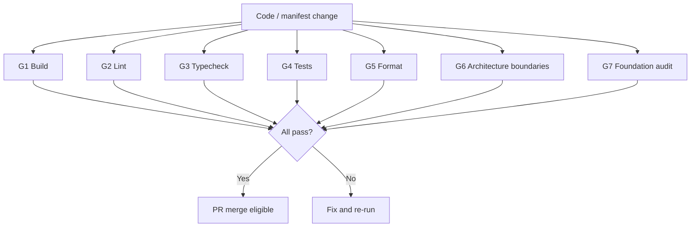

# APZQEP-ENG-010 — Quality Gates

> **Programme:** APZQEP-ENG-010  
> **Status:** IMPLEMENTED / AWAITING OWNER ACCEPTANCE  
> **Authority:** Document 015 · APZHUB Foundation 000–029

## Purpose

Define mandatory quality gates for QEP engineering foundation work. All gates must pass before Owner Acceptance and before any downstream domain programme merges.

## Gate summary

## Mandatory gates

### G1 — Build

| Item            | Detail                                                  |
| --------------- | ------------------------------------------------------- |
| **Command**     | `pnpm build`                                            |
| **Scope**       | Root monorepo build (`@apzhub/web`)                     |
| **Requirement** | Zero errors; QEP packages must not break platform build |
| **CI**          | Yes — `.github/workflows/ci.yml`                        |

QEP foundation packages are library stubs; they must compile cleanly as workspace dependencies.

### G2 — Lint

| Item            | Detail                                                                  |
| --------------- | ----------------------------------------------------------------------- |
| **Command**     | `pnpm lint`                                                             |
| **Scope**       | Entire repository including `packages/qep-*`, `integrations/qep-github` |
| **Requirement** | Zero new ESLint violations                                              |
| **CI**          | Yes                                                                     |

### G3 — Typecheck

| Item            | Detail                                                              |
| --------------- | ------------------------------------------------------------------- |
| **Command**     | `pnpm typecheck` (full) · `pnpm typecheck:qep` (focused)            |
| **Scope**       | All packages with `typecheck` script                                |
| **Requirement** | Strict TypeScript; no `any`; no suppressed errors without Owner ADR |
| **CI**          | Yes (full typecheck)                                                |

### G4 — Tests

| Item            | Detail                                                     |
| --------------- | ---------------------------------------------------------- |
| **Command**     | `pnpm test:coverage` (CI) · `pnpm test:qep` (focused)      |
| **Scope**       | Vitest unit tests for QEP packages                         |
| **Requirement** | All tests pass; no skipped tests without documented reason |
| **CI**          | Yes (via `test:coverage`)                                  |

Business E2E is **not** a gate at ENG-010.

### G5 — Format

| Item            | Detail                        |
| --------------- | ----------------------------- |
| **Command**     | `pnpm format:check`           |
| **Scope**       | Prettier on all tracked files |
| **Requirement** | No formatting drift           |
| **CI**          | Yes                           |

### G6 — Architecture boundaries

Manual and automated checks enforcing Document 003 layering and SDK rules:

| Rule                                     | Verification                                                                          |
| ---------------------------------------- | ------------------------------------------------------------------------------------- |
| Modules do not call connectors directly  | Code review; no connector imports in `modules/qep-*` (manifest-only at ENG-010)       |
| Business logic only in Platform Services | No domain logic in `@apzhub/qep-ui` or modules                                        |
| Manifest before implementation           | `*.yaml` exists before service/module code in domain programmes                       |
| No backend branding in UI                | Product naming per terminology rules                                                  |
| Events not direct notify                 | Event manifests declare subscribers; no direct notification calls                     |
| Platform unchanged                       | No modifications to core auth, shell, or gateway behaviour without separate programme |

| Item        | Detail                                                                |
| ----------- | --------------------------------------------------------------------- |
| **Command** | Code review + `pnpm audit:qep-foundation` (partial automation)        |
| **CI**      | Audit — **local/programme gate** (recommended for CI post-Acceptance) |

### G7 — Foundation audit

| Item            | Detail                                        |
| --------------- | --------------------------------------------- |
| **Command**     | `pnpm audit:qep-foundation`                   |
| **Script**      | `scripts/apzqep-eng-010-foundation-audit.mjs` |
| **Requirement** | Exit code 0                                   |

Audit validates:

| Check                | Expected                                                                                                 |
| -------------------- | -------------------------------------------------------------------------------------------------------- |
| QEP packages present | 4 packages + 1 integration with `package.json` + `src/index.ts`                                          |
| Module stubs         | 22 × `modules/qep-*/module.yaml`                                                                         |
| Service stubs        | ≥16 under `services/qep/services/`                                                                       |
| Event stubs          | ≥8 under `events/qep/`                                                                                   |
| Engineering docs     | `docs/products/apzqep/engineering/README.md`                                                             |
| No forbidden exports | No `createRequirement`, `approveVerification`, `executeSession`, `certifyRelease` in foundation packages |

## Gate matrix by change type

| Change type                 | G1  | G2  | G3  | G4  | G5  | G6  | G7  |
| --------------------------- | --- | --- | --- | --- | --- | --- | --- |
| QEP package source          | ✓   | ✓   | ✓   | ✓   | ✓   | ✓   | ✓   |
| Module manifest only        | —   | ✓   | —   | —   | ✓   | ✓   | ✓   |
| Service/event manifest only | —   | ✓   | —   | —   | ✓   | ✓   | ✓   |
| Engineering docs only       | —   | ✓   | —   | —   | ✓   | —   | ✓   |
| Platform package (non-QEP)  | ✓   | ✓   | ✓   | ✓   | ✓   | ✓   | —   |

## Definition of Done — ENG-010

Foundation work is **Done** when:

- [x] All four QEP packages and GitHub integration stub compile and test
- [x] 22 module manifests, 16 service manifests, 8 event manifests on disk
- [x] Root scripts `test:qep`, `typecheck:qep`, `audit:qep-foundation` available
- [x] `pnpm audit:qep-foundation` passes
- [x] Engineering documentation pack complete (this folder)
- [x] No business domain implementation
- [x] Platform 1.4 behaviour unchanged
- [ ] **Owner Acceptance recorded** — pending

## Excluded gates at ENG-010

| Gate                                     | Deferred to                  |
| ---------------------------------------- | ---------------------------- |
| Playwright `@mvp-cert` E2E               | Release 0.9 / MVP programmes |
| QEP API contract tests                   | Domain API programmes        |
| Storybook visual/a11y for QEP components | UI Component SDK work        |
| Security penetration test                | GA hardening (1.0)           |
| Performance benchmarks                   | Domain scale programmes      |
| Deploy / smoke test                      | First deployable release     |

## Failure response

| Gate failure  | Action                                                                   |
| ------------- | ------------------------------------------------------------------------ |
| Lint / format | Run `pnpm format`; fix ESLint violations                                 |
| Typecheck     | Fix types; do not use `@ts-ignore` without ADR                           |
| Tests         | Fix or add meaningful tests — no deletion to pass                        |
| Audit         | Restore missing manifests; remove forbidden domain exports               |
| Architecture  | Refactor to restore layer boundaries; escalate if platform change needed |

## Related documents

- [CI-CD.md](./CI-CD.md) — pipeline mapping
- [TESTING-GUIDE.md](./TESTING-GUIDE.md) — test scope
- Document 015 — APZHUB quality and release standard
- [../engineering-plan/IMPLEMENTATION-CHECKLIST.md](../engineering-plan/IMPLEMENTATION-CHECKLIST.md) — plan-level validation
