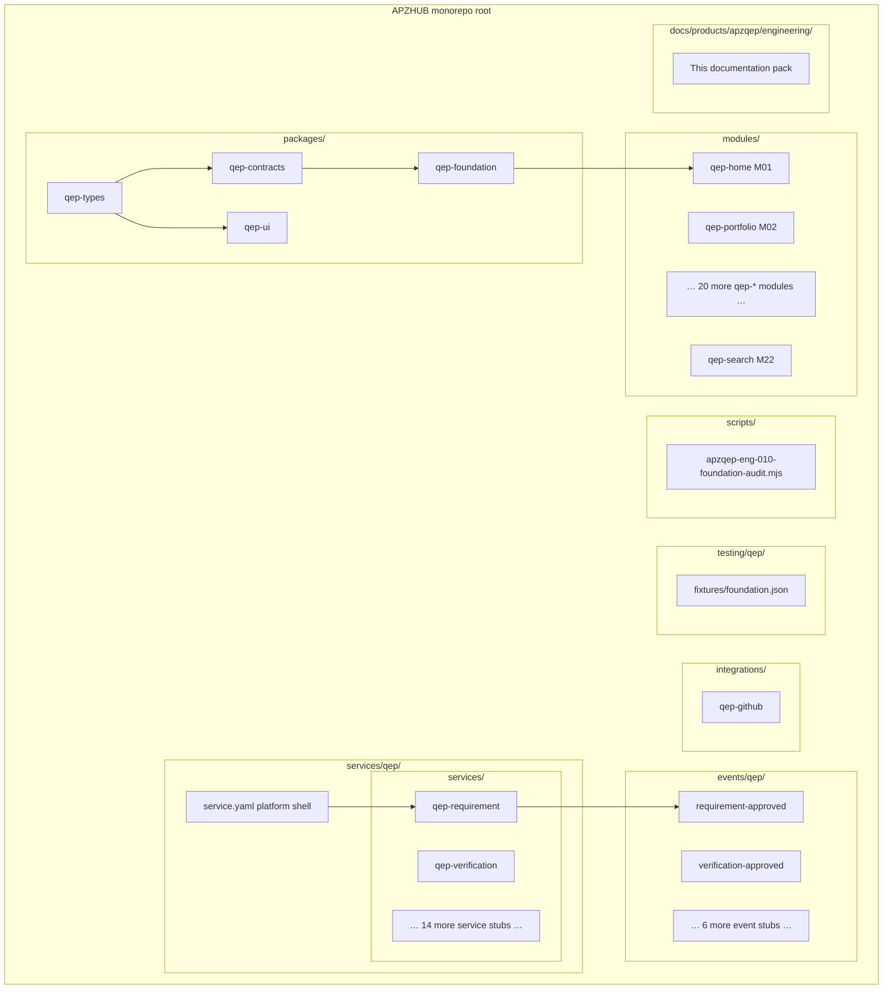

# APZQEP-ENG-010 — Repository Structure

> **Programme:** APZQEP-ENG-010  
> **Status:** IMPLEMENTED / AWAITING OWNER ACCEPTANCE  
> **Model:** Additive extension of APZHUB pnpm monorepo (Platform 1.4)

## Overview

APZQEP-ENG-010 created QEP artefacts under standard APZHUB roots defined in Document 004. No new top-level repository roots were introduced. All QEP packages register in the existing `pnpm-workspace.yaml` via glob patterns (`packages/*`, `services/*`, `integrations/*`, `events/*`).

## Structure diagram



## Package layout

### `packages/qep-types`

| Item             | Detail                                                                   |
| ---------------- | ------------------------------------------------------------------------ |
| **Package name** | `@apzhub/qep-types`                                                      |
| **Version**      | `0.1.0`                                                                  |
| **Purpose**      | Product constants, module catalogue IDs M01–M22, descriptor types        |
| **Key exports**  | `QEP_PRODUCT_ID`, `QEP_MODULES`, `QEP_MODULE_IDS`, `QepModuleDescriptor` |
| **Tests**        | `src/types.test.ts`                                                      |

### `packages/qep-contracts`

| Item             | Detail                                                           |
| ---------------- | ---------------------------------------------------------------- |
| **Package name** | `@apzhub/qep-contracts`                                          |
| **Version**      | `0.1.0`                                                          |
| **Purpose**      | Future service contract namespace markers (`implemented: false`) |
| **Key exports**  | `createContractStub()`, `QepContractNamespace`                   |
| **Depends on**   | `@apzhub/qep-types`                                              |
| **Tests**        | `src/contracts.test.ts`                                          |

### `packages/qep-foundation`

| Item             | Detail                                             |
| ---------------- | -------------------------------------------------- |
| **Package name** | `@apzhub/qep-foundation`                           |
| **Version**      | `0.1.0`                                            |
| **Purpose**      | Foundation registry and health reporting           |
| **Key exports**  | `getQepFoundationHealth()`, `listQepModuleStubs()` |
| **Depends on**   | `@apzhub/qep-types`                                |
| **Tests**        | `src/foundation.test.ts`                           |

### `packages/qep-ui`

| Item             | Detail                                                   |
| ---------------- | -------------------------------------------------------- |
| **Package name** | `@apzhub/qep-ui`                                         |
| **Version**      | `0.1.0`                                                  |
| **Purpose**      | Presentation placeholder; token-only components deferred |
| **Key exports**  | `getQepProductLabel()`, `QEP_UI_VERSION`                 |
| **Depends on**   | `@apzhub/qep-types`                                      |
| **Tests**        | `src/ui.test.ts`                                         |

## Module stubs (`modules/qep-*`)

Twenty-two module directories, each containing **only** `module.yaml` (no implementation code):

| ID  | Directory                          | Title                        |
| --- | ---------------------------------- | ---------------------------- |
| M01 | `modules/qep-home`                 | Home and Command Centre      |
| M02 | `modules/qep-portfolio`            | Portfolio and Projects       |
| M03 | `modules/qep-requirements`         | Requirements                 |
| M04 | `modules/qep-verification-library` | Verification Library         |
| M05 | `modules/qep-verification-design`  | Verification Design          |
| M06 | `modules/qep-execution`            | Execution and Sessions       |
| M07 | `modules/qep-automation`           | Automation Management        |
| M08 | `modules/qep-defects`              | Defects and Quality Issues   |
| M09 | `modules/qep-evidence`             | Evidence                     |
| M10 | `modules/qep-traceability`         | Traceability                 |
| M11 | `modules/qep-risk`                 | Risk Management              |
| M12 | `modules/qep-release-readiness`    | Release Readiness            |
| M13 | `modules/qep-certification`        | Certification                |
| M14 | `modules/qep-quality-intelligence` | Quality Intelligence         |
| M15 | `modules/qep-reporting`            | Reporting and Analytics      |
| M16 | `modules/qep-knowledge`            | Knowledge and Learning       |
| M17 | `modules/qep-ai-workspace`         | AI Quality Workspace         |
| M18 | `modules/qep-mcp`                  | MCP and Developer Experience |
| M19 | `modules/qep-integrations`         | Integration Centre           |
| M20 | `modules/qep-administration`       | Administration               |
| M21 | `modules/qep-audit`                | Audit and Compliance         |
| M22 | `modules/qep-search`               | Search and Navigation        |

Each manifest declares:

- `kind: module`, `status: stub`
- `moduleCatalogueId: Mxx`
- Workbench navigation metadata (route, permission key, icon)
- Dependency on `qep-platform-service`

## Service stubs (`services/qep/`)

### Platform shell

| File                        | Purpose                                              |
| --------------------------- | ---------------------------------------------------- |
| `services/qep/service.yaml` | `qep-platform-service` — orchestration service shell |

### Domain services (`services/qep/services/`)

Sixteen service manifest stubs:

| Service ID                 | Directory                                         | Domain                        |
| -------------------------- | ------------------------------------------------- | ----------------------------- |
| `qep-requirement`          | `services/qep/services/qep-requirement/`          | Requirements                  |
| `qep-verification`         | `services/qep/services/qep-verification/`         | Verification                  |
| `qep-execution`            | `services/qep/services/qep-execution/`            | Execution                     |
| `qep-evidence`             | `services/qep/services/qep-evidence/`             | Evidence                      |
| `qep-defect`               | `services/qep/services/qep-defect/`               | Defects                       |
| `qep-risk`                 | `services/qep/services/qep-risk/`                 | Risk                          |
| `qep-traceability`         | `services/qep/services/qep-traceability/`         | Traceability                  |
| `qep-release-readiness`    | `services/qep/services/qep-release-readiness/`    | Release readiness             |
| `qep-certification`        | `services/qep/services/qep-certification/`        | Certification                 |
| `qep-quality-intelligence` | `services/qep/services/qep-quality-intelligence/` | Quality intelligence          |
| `qep-knowledge`            | `services/qep/services/qep-knowledge/`            | Knowledge                     |
| `qep-automation`           | `services/qep/services/qep-automation/`           | Automation                    |
| `qep-integration`          | `services/qep/services/qep-integration/`          | Integrations                  |
| `qep-administration`       | `services/qep/services/qep-administration/`       | Administration                |
| `qep-ai`                   | `services/qep/services/qep-ai/`                   | AI (stub; default OFF)        |
| `qep-mcp`                  | `services/qep/services/qep-mcp/`                  | MCP (stub; deferred post-1.0) |

Each declares `kind: service`, `status: stub`, `contractPackage: "@apzhub/qep-contracts"`.

## Event stubs (`events/qep/`)

Eight event manifest directories:

| Event key                     | Directory                             | Publisher (declared) |
| ----------------------------- | ------------------------------------- | -------------------- |
| `qep.requirement.approved`    | `events/qep/requirement-approved/`    | `qep-requirement`    |
| `qep.verification.approved`   | `events/qep/verification-approved/`   | `qep-verification`   |
| `qep.execution.completed`     | `events/qep/execution-completed/`     | `qep-execution`      |
| `qep.evidence.captured`       | `events/qep/evidence-captured/`       | `qep-evidence`       |
| `qep.defect.created`          | `events/qep/defect-created/`          | `qep-defect`         |
| `qep.risk.accepted`           | `events/qep/risk-accepted/`           | `qep-risk`           |
| `qep.certification.requested` | `events/qep/certification-requested/` | `qep-certification`  |
| `qep.certification.decided`   | `events/qep/certification-decided/`   | `qep-certification`  |

Each declares `kind: event` with payload field placeholders; no runtime publishers.

## Integration stub

| Path                       | Package                          | Manifest                                                        |
| -------------------------- | -------------------------------- | --------------------------------------------------------------- |
| `integrations/qep-github/` | `@apzhub/integration-qep-github` | `integration.yaml` — GitHub Actions ingest stub, `status: stub` |

Contains `src/index.ts`, Vitest test, strict TypeScript config.

## Testing foundation

| Path                                   | Purpose                                                                    |
| -------------------------------------- | -------------------------------------------------------------------------- |
| `testing/qep/README.md`                | Testing foundation index                                                   |
| `testing/qep/fixtures/foundation.json` | Foundation fixture (`businessFunctionality: false`, `moduleStubCount: 22`) |

No QEP Playwright project or business E2E scenarios at ENG-010.

## Audit script

| Path                                          | Command                     |
| --------------------------------------------- | --------------------------- |
| `scripts/apzqep-eng-010-foundation-audit.mjs` | `pnpm audit:qep-foundation` |

Validates:

- Four QEP packages + GitHub integration have `package.json` and `src/index.ts`
- Exactly 22 `modules/qep-*/module.yaml` files
- ≥16 service stubs under `services/qep/services/`
- ≥8 events under `events/qep/`
- Engineering docs README exists
- No forbidden domain function exports in foundation packages

## Documentation

| Path                                | Purpose                                         |
| ----------------------------------- | ----------------------------------------------- |
| `docs/products/apzqep/engineering/` | This engineering pack (ENG-010 deliverable #15) |

## Workspace registration

QEP packages are discovered automatically:

```yaml
# pnpm-workspace.yaml (existing — no QEP-specific override)
packages:
  - "apps/*"
  - "packages/*"
  - "services/*"
  - "integrations/*"
  - "events/*"
```

## Intentionally unchanged paths

| Path                            | Reason                                         |
| ------------------------------- | ---------------------------------------------- |
| `apps/web`                      | No QEP routes or shell registration at ENG-010 |
| Platform `packages/*` (non-qep) | Platform 1.4 unchanged                         |
| `infrastructure/docker/`        | Existing dev compose; no QEP-specific services |
| Database migrations             | No QEP schemas                                 |

## Dependency direction

```text
@apzhub/qep-types
  → @apzhub/qep-contracts
  → @apzhub/qep-foundation
@apzhub/qep-types → @apzhub/qep-ui
@apzhub/integration-qep-github (standalone stub)

modules/qep-* (manifest only) → qep-platform-service (declared)
services/qep/services/* (manifest only) → @apzhub/qep-contracts (declared)
```

Modules and services do **not** import each other at ENG-010. Runtime wiring is deferred to domain programmes.
