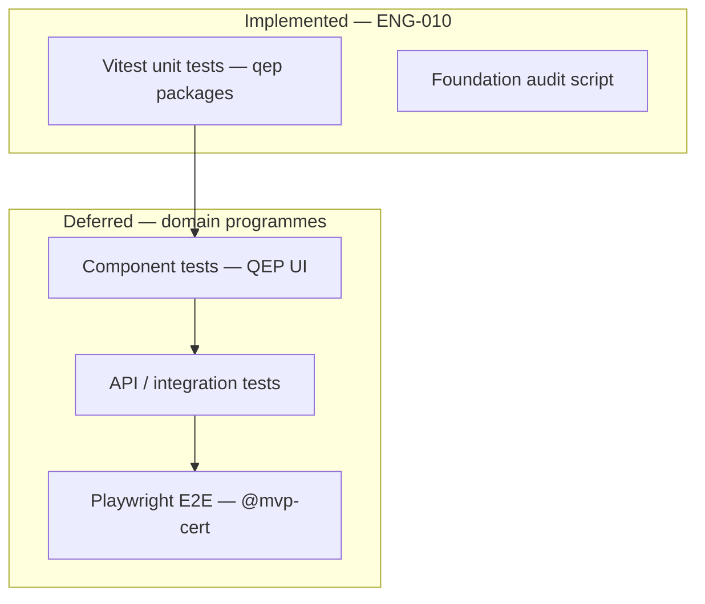

# APZQEP-ENG-010 — Testing Guide

> **Programme:** APZQEP-ENG-010  
> **Status:** IMPLEMENTED / AWAITING OWNER ACCEPTANCE  
> **Baseline:** Document 015 quality pyramid · APZQEP-PLAN-001 Testing Roadmap

## Purpose

Define the testing strategy for the QEP engineering foundation. ENG-010 delivers **unit test scaffold only** — no business scenario tests, no domain E2E, no certification path automation.

## Test pyramid at ENG-010



| Layer                  | ENG-010 status  | Tooling                                                     |
| ---------------------- | --------------- | ----------------------------------------------------------- |
| **Unit**               | **Implemented** | Vitest                                                      |
| **Component**          | Deferred        | Vitest + Testing Library (with `@apzhub/qep-ui` components) |
| **Integration / API**  | Deferred        | Vitest + test DB (domain programmes)                        |
| **E2E**                | Deferred        | Playwright (`@mvp-cert` per PLAN-001)                       |
| **Architecture audit** | **Implemented** | `pnpm audit:qep-foundation`                                 |

## Vitest scope

### Command

```bash
pnpm test:qep
```

Equivalent to:

```bash
vitest run packages/qep-types packages/qep-contracts packages/qep-foundation packages/qep-ui integrations/qep-github
```

### Package test files

| Package                          | Test file                                        | What is asserted                               |
| -------------------------------- | ------------------------------------------------ | ---------------------------------------------- |
| `@apzhub/qep-types`              | `packages/qep-types/src/types.test.ts`           | Module catalogue count (22), product constants |
| `@apzhub/qep-contracts`          | `packages/qep-contracts/src/contracts.test.ts`   | Contract stubs return `implemented: false`     |
| `@apzhub/qep-foundation`         | `packages/qep-foundation/src/foundation.test.ts` | Health reports `businessFunctionality: false`  |
| `@apzhub/qep-ui`                 | `packages/qep-ui/src/ui.test.ts`                 | Product label helper                           |
| `@apzhub/integration-qep-github` | `integrations/qep-github/src/stub.test.ts`       | Integration stub exports                       |

### Running individual packages

```bash
pnpm --filter @apzhub/qep-foundation test
vitest run packages/qep-types/src/types.test.ts
pnpm test:watch   # watch mode — full monorepo Vitest
```

QEP tests participate in root `pnpm test` and CI `pnpm test:coverage` via workspace discovery.

## Fixtures (`testing/qep/`)

| File                                   | Purpose                                    |
| -------------------------------------- | ------------------------------------------ |
| `testing/qep/README.md`                | Index for QEP test assets                  |
| `testing/qep/fixtures/foundation.json` | Baseline fixture for foundation assertions |

### `foundation.json` schema (informal)

```json
{
  "productId": "apzqep",
  "programme": "APZQEP-ENG-010",
  "businessFunctionality": false,
  "moduleStubCount": 22
}
```

Use this fixture in future tests to assert foundation invariants without duplicating magic numbers.

## Foundation audit as test gate

`pnpm audit:qep-foundation` is a **structural quality gate**, not a unit test runner. It complements Vitest by verifying:

- Required paths exist on disk
- Module/service/event counts meet ENG-010 baseline
- Engineering documentation README is present
- Foundation packages do not export forbidden domain operations

Run audit in CI locally before PR; integrate into programme closeout evidence.

## What is not tested at ENG-010

| Excluded                        | Reason                             |
| ------------------------------- | ---------------------------------- |
| Requirements CRUD               | No implementation                  |
| Verification approval workflows | No implementation                  |
| Execution sessions              | No implementation                  |
| Certification `@mvp-cert` E2E   | Deferred to release 0.9 programmes |
| Module shell routes             | No routes registered in `apps/web` |
| Service HTTP endpoints          | No API handlers                    |
| Event bus publish/subscribe     | Manifests only                     |
| GitHub connector calls          | Stub only                          |
| Database migrations             | No QEP schema                      |

## Mock strategy for later programmes

When domain programmes begin (starting **APZQEP-ENG-020**), adopt these patterns:

### Platform services

| Dependency          | Mock approach                                             |
| ------------------- | --------------------------------------------------------- |
| PermissionService   | Vitest mock returning fixture permission sets per persona |
| Platform Search     | Stub provider registration; assert query-time filtering   |
| Attention Engine    | Assert event publication; mock delivery                   |
| Audit service       | Capture audit entries in memory for assertions            |
| API Gateway context | Inject correlation ID, tenant, locale in test harness     |

### Connectors

| Pattern                  | Detail                                                                                |
| ------------------------ | ------------------------------------------------------------------------------------- |
| **Integration boundary** | Mock at Service Connector interface — never mock internal engine clients from modules |
| **Fixtures**             | Store normalised connector responses under `testing/qep/fixtures/connectors/`         |
| **Error translation**    | Test adapter error mapping separately from service orchestration                      |

### Data layer

| Pattern                | Detail                                                          |
| ---------------------- | --------------------------------------------------------------- |
| **Test database**      | Use `DATABASE_URL_TEST` (CI port `54334`) for integration tests |
| **Transactions**       | Roll back per test where possible                               |
| **No production data** | Synthetic tenants and projects only                             |

### E2E (future)

Per [TESTING-ROADMAP.md](../engineering-plan/TESTING-ROADMAP.md):

- Playwright project `qep` under `testing/playwright/` (to be created in domain programmes)
- Tag `@mvp-cert` for manual certification path
- Mock external engines (GitHub, ALM) at network boundary
- Use platform auth test helpers — no bypass of PermissionService

## CI participation

Root CI (`.github/workflows/ci.yml`) runs:

- `pnpm test:coverage` — includes QEP Vitest tests via workspace
- No separate QEP CI job at ENG-010

See [CI-CD.md](./CI-CD.md) for pipeline details.

## Quality expectations for new tests

When adding tests in authorised programmes:

1. **Meaningful behaviour** — assert business rules and invariants, not trivial exports.
2. **No snapshot churn** — prefer explicit assertions.
3. **Correlation IDs** — include in integration test contexts (010).
4. **Permission scenarios** — test allowed and denied paths.
5. **Idempotency** — event handlers and jobs must have idempotency tests (012).
6. **Update fixtures** — keep `testing/qep/fixtures/` authoritative for shared data.

## Related documents

- [DEVELOPMENT-GUIDE.md](./DEVELOPMENT-GUIDE.md) — local commands
- [QUALITY-GATES.md](./QUALITY-GATES.md) — mandatory gates
- [../engineering-plan/TESTING-ROADMAP.md](../engineering-plan/TESTING-ROADMAP.md) — release-aligned test plan
