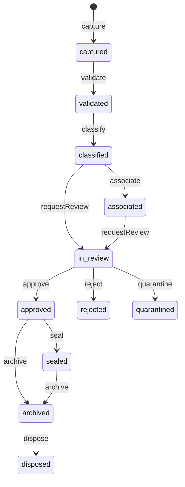

# APZQEP-OES-ENG-091A — APPENDIX B — Lifecycle Transition Matrix

## States

`captured` · `validated` · `classified` · `associated` · `in_review` · `approved` · `rejected` · `quarantined` · `sealed` · `retained` · `archived` · `disposed`

`legalHold` is orthogonal (boolean). When `true`, `disposeEvidence` is **prohibited**.

## Permitted transitions

| From                                                   | Command                               | To                                                                                                             |
| ------------------------------------------------------ | ------------------------------------- | -------------------------------------------------------------------------------------------------------------- |
| —                                                      | `captureEvidence`                     | `captured`                                                                                                     |
| `captured`                                             | `validateEvidence`                    | `validated`                                                                                                    |
| `validated`                                            | `classifyEvidence`                    | `classified`                                                                                                   |
| `classified`                                           | `associateEvidence`                   | `associated` (or remain classified if already associated elsewhere)                                            |
| `classified` / `associated`                            | `requestReview`                       | `in_review`                                                                                                    |
| `in_review`                                            | `approveEvidence`                     | `approved`                                                                                                     |
| `in_review`                                            | `rejectEvidence`                      | `rejected`                                                                                                     |
| `in_review` / others per policy                        | `quarantineEvidence`                  | `quarantined`                                                                                                  |
| `approved`                                             | `sealEvidence`                        | `sealed`                                                                                                       |
| `approved` / `sealed`                                  | (retention active)                    | `retained` (via archive policy or explicit retain marker — Eng wave may treat `approved`/`sealed` as retained) |
| `approved` / `sealed` / `retained`                     | `archiveEvidence`                     | `archived`                                                                                                     |
| `archived` / `retained` / `approved`/`sealed` eligible | `disposeEvidence`                     | `disposed`                                                                                                     |
| any non-disposed (policy)                              | `applyLegalHold` / `releaseLegalHold` | same status; flag toggles                                                                                      |
| non-sealed                                             | `replaceContent`                      | same status; version++                                                                                         |

## Prohibited (examples)

- Any content mutation when `sealed` or `disposed`
- `disposeEvidence` when `legalHold`
- Skipping validate/classify when policy requires (Application may auto-validate on capture if configured — Domain still records transitions)
- Reviving `disposed` to active content delivery

## Mermaid (summary)

