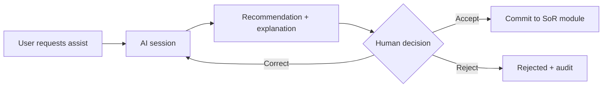
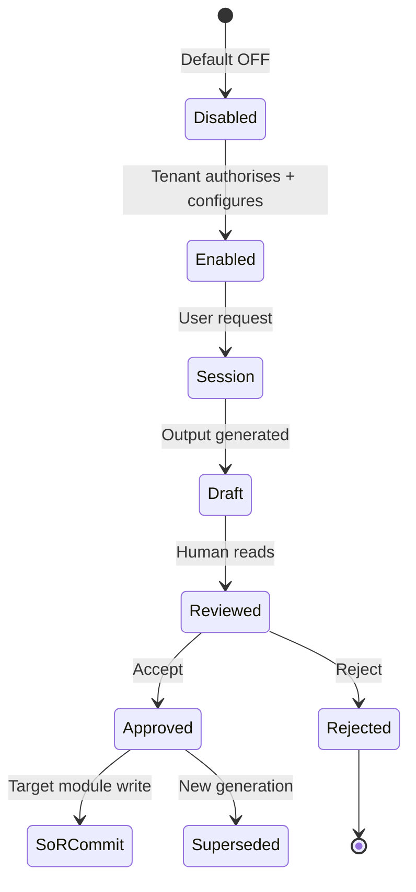
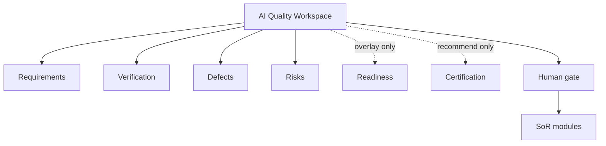

# APZ QEP — AI Workflows

> **Programme:** APZQEP-DEF-002  
> **Constitution:** AI never SoR · never certifies · default OFF · human accept

## Purpose

AI Workflows define how optional AI assistance participates in quality engineering activities inside APZ QEP — always as draft or advisory content until a human explicitly accepts, rejects, or corrects. AI accelerates analysis and authoring; it never replaces accountable decisions for certification, risk acceptance, or SoR authority.

## Business rationale

AI can reduce toil in requirement analysis, verification design, triage, and narrative explanation — but ungoverned AI in quality systems creates audit liability and false confidence. A uniform workflow (request → generate → explain → human gate → optional SoR commit) keeps AI subordinate to Constitution rules across all modules.

## Core concepts

| Concept                   | Product meaning                                     |
| ------------------------- | --------------------------------------------------- |
| AI session                | Bounded interaction producing recommendations       |
| AI content status         | Draft → Reviewed → Approved → Rejected → Superseded |
| Human gate                | Mandatory decision before SoR write                 |
| Non-authoritative overlay | Readiness/cert narratives that do not change status |
| Prompt governance         | Policy-controlled prompts and retention             |
| Provider adapter          | Replaceable AI backend via extensibility            |
| AI audit                  | Log of prompts, outputs, and decisions              |

## AI content statuses

Draft → Reviewed → Approved → Rejected → Superseded

| Status     | Meaning                                    |
| ---------- | ------------------------------------------ |
| Draft      | AI output; not relied upon                 |
| Reviewed   | Human saw content; no SoR commit yet       |
| Approved   | Human accepts for intended use / SoR write |
| Rejected   | Discarded with reason                      |
| Superseded | Newer AI or human version replaces         |

## Primary objects

| Object                 | Description                                     |
| ---------------------- | ----------------------------------------------- |
| AI assist request      | User-initiated scoped ask                       |
| AI recommendation      | Structured output with explanation              |
| AI content record      | Versioned artefact with status                  |
| Accept/reject decision | Human gate outcome                              |
| AI audit entry         | Correlation to session and actor                |
| Provider configuration | Tenant-scoped adapter settings — off by default |

## Canonical AI workflow

## Workflow catalogue (product)

| Workflow                     | Trigger           | Human gate                   | SoR write                  |
| ---------------------------- | ----------------- | ---------------------------- | -------------------------- |
| Requirement analysis         | BA requests       | Accept suggestions           | Only accepted edits        |
| Verification generation      | QA requests draft | Accept/edit before Library   | On accept                  |
| Coverage analysis            | Gap review        | Informational / accept tasks | Task creation optional     |
| Regression analysis          | Release prep      | Human selects suite          | On selection               |
| Risk analysis                | Risk review       | Human accepts residual risk  | On risk accept             |
| Defect clustering            | Triage            | Human merges/links           | On confirm                 |
| Readiness narrative          | RM requests       | Non-authoritative overlay    | No cert change             |
| Certification recommendation | Cert review       | **Human decides certify**    | Cert module only via human |
| NL query                     | User asks         | Answers cite SoR             | No silent write            |

## Lifecycle

## Ownership

| Role                     | Ownership                                      |
| ------------------------ | ---------------------------------------------- |
| Tenant Administrator     | Enables AI entitlements and providers          |
| Security Officer         | Approves AI enablement in enterprise/regulated |
| QA Manager               | Governs which workflows teams may use          |
| Human actor per workflow | Accept/reject decisions                        |

## Relationships

AI workflows touch Requirements, Verification, Defects, Risk, QI, Readiness (overlay only), Certification (recommendation only). Never bypass Evidence lock or Certification decision.

## States

AI subsystem: Disabled (default) → Enabled → Session active. Content statuses per table above. Certification and risk states **never** transition via AI alone.

## Business rules

| Rule  | Statement                                                            |
| ----- | -------------------------------------------------------------------- |
| AI-01 | Every capability disabled by default until authorised and configured |
| AI-02 | Prompt governance and AI audit mandatory when enabled                |
| AI-03 | Providers replaceable without changing workflow semantics            |
| AI-04 | AI Agent persona **cannot certify**                                  |
| AI-05 | AI never independent SoR — human accept for writes                   |
| AI-06 | Readiness and cert narratives labelled non-authoritative             |
| AI-07 | NL query cites sources; no silent write                              |
| AI-08 | Continuous signals and AI are distinct — neither auto-certifies      |

## Approval rules

Enable AI: Tenant Admin + Security Officer (regulated). Per-content Approved status requires human with module-appropriate permission. Risk accept and cert remain dedicated human workflows — AI outputs Draft only.

## Role responsibilities

| Persona          | Responsibility                                |
| ---------------- | --------------------------------------------- |
| Business Analyst | Accept/reject requirement analysis            |
| QA Engineer      | Accept verification drafts                    |
| QA Manager       | Policy for team AI usage                      |
| Release Manager  | Uses readiness narrative — owns cert decision |
| Security Officer | AI enablement approval                        |
| AI Agent         | Operates only within gated tools — no cert    |

## Reporting

AI usage report (admin): sessions, accept/reject rates, workflow breakdown, audit export. Quality reports exclude unapproved AI content from authoritative metrics.

## Search

Search AI content records by status, workflow, linked object. Approved AI summaries searchable; Draft hidden from standard reports per policy.

## Audit

Prompt metadata (policy-controlled), output hash, accept/reject actor, SoR commit correlation — mandatory when enabled. Rejected content retained per retention policy.

## AI considerations

This document **is** the AI consideration framework. Self-referential constraints: default OFF, never SoR without accept, never certifies, explainability on recommendations.

## MCP considerations

IDE agents using MCP are not exempt from AI workflows — MCP-proposed drafts enter same approval queues. MCP + AI combined calls doubly audited. See [MCP-WORKFLOWS.md](./MCP-WORKFLOWS.md).

## Future evolution

Fine-tuned domain models (customer-hosted), evaluation benchmarks for suggestion quality, organisation prompt libraries. Human gate invariant.

## Boundary conditions

| In boundary               | Out of boundary                |
| ------------------------- | ------------------------------ |
| Governed assist workflows | General-purpose chatbot        |
| Draft → accept → SoR      | Autonomous agent closure       |
| Cert **recommendation**   | Cert **decision**              |
| NL query over SoR         | Internet browsing as authority |

## Example scenarios

**Scenario 1 — Verification draft:** QA requests procedure draft; edits two steps; Approved → Library. Rejected steps never in SoR.

**Scenario 2 — Cert review:** AI lists pack gaps; Release Manager Rejects cert based on human judgment — AI marked Reviewed not Approved for cert use.

**Scenario 3 — Risk:** AI suggests acceptance wording; human rejects; treats risk via mitigation instead — Risk Model human accept only.

**Scenario 4 — Disabled tenant:** AI workflows unavailable; full manual lifecycle unaffected.

**Scenario 5 — NL query:** Developer asks coverage question; answer cites requirement IDs; no records created.

## Rules (summary)

- Every capability disabled by default until authorised and configured
- Prompt governance and AI audit mandatory when enabled
- Providers replaceable
- AI Agent persona cannot certify
