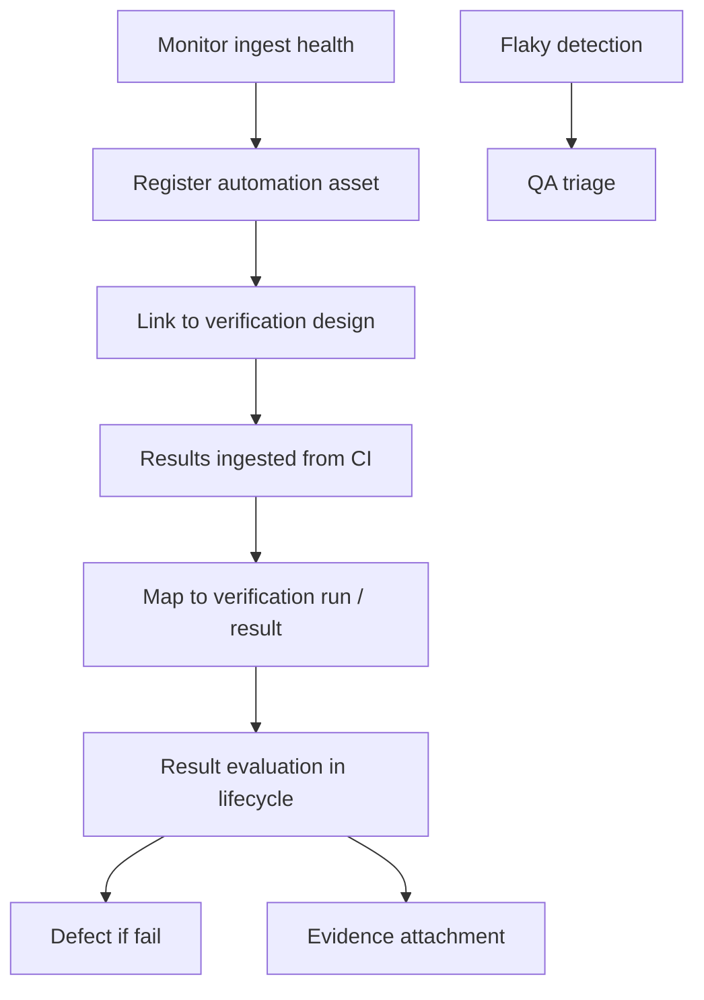
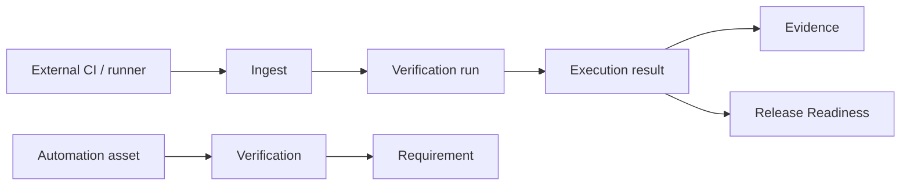

# APZ QEP — Automation Management (Product View)

> **Programme:** APZQEP-DEF-002  
> **Boundary:** QEP consumes and governs automation results — **does not become a runner**

## Purpose

Automation Management provides the product view of automated verification assets and ingested results — linking frameworks, repositories, pipelines, and runners **by reference** to the same SoR lifecycle as manual verification. It answers *what automation exists, is it healthy, and does it support release confidence?*

## Business rationale

Most enterprises already invest in CI and test runners. Duplicating runner identity in QEP would violate product boundaries and fragment ownership. Conversely, ignoring automation leaves gaps in traceability, readiness, and certification. Automation Management bridges external execution with governed quality records — ingest, health, flakiness, coverage — without becoming CI/CD.

## Core concepts

| Concept | Product meaning |
| ------- | ---------------- |
| Automation asset | Registered reference to tests, suites, or jobs |
| Framework identity | Declared technology (e.g. Playwright, JUnit) — descriptive |
| Ingest | Import of run results into QEP SoR |
| Flakiness | Repeated non-deterministic failure pattern |
| Automation coverage | Requirements linked to executed automation |
| Ingest health | Freshness and error state of integration |
| Manual-to-automation candidate | Promotion suggestion from manual procedures |

## Primary objects

| Object | Description |
| ------ | ----------- |
| Automation asset | Named register entry with ownership |
| Repository reference | Link to source repo — not code hosting |
| Pipeline / runner reference | Link to CI job or runner — not pipeline authoring |
| Ingest configuration | Connector policy — product intent |
| Execution ingest record | Imported run mapped to verification |
| Flaky marker | Asset/run pattern flag |
| Health indicator | Last success, lag, failure reason class |
| Coverage link | Requirement ↔ automation execution |

## Lifecycle

Assets: Draft → Active → Degraded (ingest issues) → Retired. Ingested runs follow Execution result states.

## Ownership

| Role | Ownership |
| ---- | --------- |
| Automation Engineer | Asset registration, ingest health, flaky remediation |
| QA Manager | Coverage priorities; candidate promotion approval |
| QA Engineer | Verification linkage integrity |
| Operations Engineer | Disable broken integrations |
| Developer | Fix failing tests — not QEP runner ops |

## Relationships

Automation Management connects to Verification Library/Design, Execution, Evidence, Traceability, Defects, Release Readiness, QI, and Integration Centre. Parallel to [MANUAL-VERIFICATION.md](./MANUAL-VERIFICATION.md).

## States

| State | Applies to | Meaning |
| ----- | ---------- | ------- |
| Draft | Asset | Registered; not yet Active |
| Active | Asset | In use; ingest expected |
| Degraded | Asset | Ingest failing or stale |
| Retired | Asset | No longer in scope |
| Ingested | Run | Result in SoR |
| Failed ingest | Ingest | Error — not counted for coverage |

## Explicit non-capabilities

| Not in product | Why |
| -------------- | --- |
| Authoring Playwright/Cypress/JUnit runners as QEP identity | Runner ecosystems remain external |
| CI pipeline authoring UI | Not a CI/CD platform |
| Device farm control | Not a device cloud |
| Executing tests as QEP | Not a runner |

## Business rules

| Rule | Statement |
| ---- | --------- |
| AM-01 | QEP ingests results; never executes as product identity |
| AM-02 | Automation coverage requires requirement linkage per Traceability Model |
| AM-03 | Stale ingest downgrades QI/readiness confidence |
| AM-04 | Flaky results may be quarantined per policy — human disposition |
| AM-05 | Certification never auto-issued from green automation alone |
| AM-06 | Backend runner brands not shown to standard users |

## Approval rules

Automation asset Active promotion: Automation Engineer + QA Manager typical. Manual-to-automation candidate promotion requires verification design approval. Ingest connector enablement: Tenant Administrator.

## Role responsibilities

| Persona | Responsibility |
| ------- | ---------------- |
| Automation Engineer | Maintains assets and ingest |
| QA Manager | Coverage and flaky prioritisation |
| QA Engineer | Links automation to requirements |
| Developer | Fixes test code externally |
| Release Manager | Interprets automation gates at readiness |
| Manual Tester | Uses hybrid sessions referencing automation results |

## Reporting

Automation coverage report, ingest health dashboard, flaky asset register, last-run matrix by release, manual-to-automation candidate list. QI consumes for defect/recurrence intelligence.

## Search

Search assets by name, framework, repo, owner, health state, linked requirement, flaky flag.

## Audit

Asset register changes, ingest events, mapping changes, flaky quarantine decisions audited. Correlation to external run IDs retained.

## AI considerations

AI default **OFF**. May suggest automation candidates from manual procedures or summarise failure clusters — human promotes. AI does not trigger ingest or cert.

## MCP considerations

MCP read: execution results, missing coverage. MCP may attach evidence references from IDE test runs — gated. No MCP pipeline control.

## Future evolution

Richer flake analytics, contract tests on ingest schema, marketplace connectors. Runner remains external.

## Boundary conditions

| In boundary | Out of boundary |
| ----------- | --------------- |
| Asset register + ingest | Run tests |
| Flakiness tracking | Fix test code in QEP |
| Coverage linkage | Git hosting |
| Health of integration | Jenkins replacement |

## Example scenarios

**Scenario 1 — Nightly ingest:** CI publishes results; QEP maps to verification runs; readiness gate uses last 7-day pass rate; stale ingest warns Partial confidence.

**Scenario 2 — Flaky quarantine:** Asset marked flaky; QA Manager quarantines from gate until fixed externally; human documents risk if waived.

**Scenario 3 — Candidate promotion:** Manual procedure executed 10 times; QI suggests automation candidate; QA approves verification design update; asset registered.

**Scenario 4 — Hybrid session:** Manual Tester runs exploratory session while referencing failed automation run in same requirement scope — evidence links both.

## Relationship to Execution

Ingested automation results appear as runs/results alongside manual sessions, linkable to requirements, evidence, defects, readiness, and certification — single Execution SoR, dual methods.
