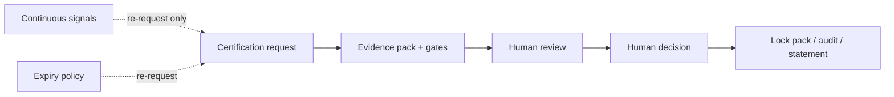
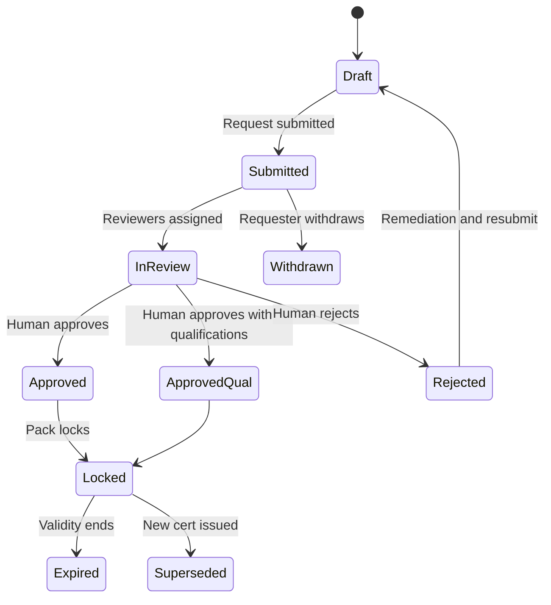
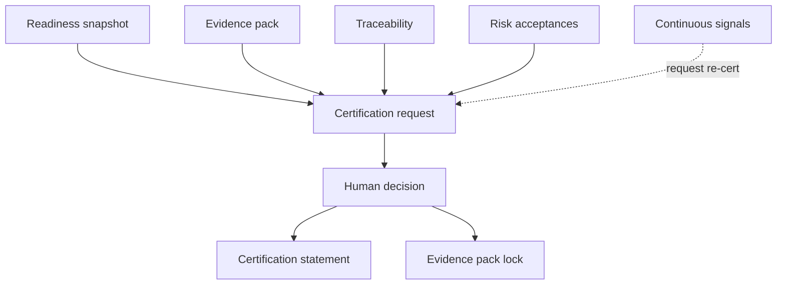

# APZ QEP — Certification Model

> **Programme:** APZQEP-DEF-002  
> **Constitution:** Human accountability · immutable approved evidence · history never deleted · reproducible · traceable · signals never auto-flip status

## Purpose

The Certification Model governs how organisations formally attest that a defined release scope meets quality policy — through human review of evidence packs, gate results, risks, and traceability. Certification is the accountable decision point in the QEP lifecycle; it is never issued by automation, AI, or continuous signals alone.

## Business rationale

Informal “sign-offs” in email or chat fail audit and create liability ambiguity. Regulated and enterprise customers require named approvers, immutable evidence at decision time, and clear outcomes (including qualifications and rejections). Certification separates _we are ready to ask_ (readiness) from _we attest_ (human decision).

## Core concepts

| Concept                 | Product meaning                                    |
| ----------------------- | -------------------------------------------------- |
| Certification request   | Formal ask to certify a scope                      |
| Evidence pack           | Curated proof bundle — locks on approval           |
| Certification decision  | Human outcome with rationale                       |
| Qualification           | Approved with documented operational constraints   |
| Certification statement | Published attestation record                       |
| Validity period         | Optional policy-bound cert lifetime                |
| Continuous signal       | Drift indicator — may request re-cert only         |
| Supersession            | Later cert replaces earlier for same scope lineage |

## Decision outcomes

| Outcome                          | Meaning                                            |
| -------------------------------- | -------------------------------------------------- |
| **Approved**                     | Certified for scope                                |
| **Approved with qualifications** | Certified with recorded operational qualifications |
| **Rejected**                     | Not certified; reason required                     |
| **Withdrawn**                    | Request withdrawn before decision                  |
| **Expired**                      | Validity ended per policy                          |
| **Superseded**                   | Replaced by later certification                    |

## Primary objects

| Object                   | Description                                           |
| ------------------------ | ----------------------------------------------------- |
| Certification request    | Scope, snapshot refs, approver routing                |
| Review task              | Assigned human reviewer checklist                     |
| Evidence pack            | Linked pack — locks on positive decision              |
| Decision record          | Outcome, approvers, timestamp, rationale              |
| Qualification record     | Constraints bundled with Approved with qualifications |
| Certification statement  | Customer/audit-facing attestation                     |
| Re-certification request | Triggered by drift, expiry, or scope change           |
| Cert history             | Immutable chain per release/product line              |

## Lifecycle

Detailed state flow:

## Ownership

| Role               | Ownership                                       |
| ------------------ | ----------------------------------------------- |
| Release Manager    | Initiates request; primary certifier typical    |
| QA Manager         | Co-reviewer; verification/evidence attestation  |
| Compliance Officer | Regulated co-approver when policy requires      |
| Auditor            | Observes; independent read — no cert by default |
| Product Owner      | Qualification acceptance for scope trade-offs   |

## Relationships

Certification consumes Release Readiness snapshots, Evidence packs, Risk acceptances, Traceability completeness, and Defect disposition. Certification history feeds QI and Reporting. Evidence pack **locks** on Approved / Approved with qualifications per Evidence Model.

## States

| State                                   | Meaning                           |
| --------------------------------------- | --------------------------------- |
| Draft                                   | Request preparing                 |
| Submitted                               | Awaiting reviewer assignment      |
| In review                               | Active human review               |
| Approved / Approved with qualifications | Positive decision — pack locks    |
| Rejected                                | Negative decision — pack editable |
| Withdrawn                               | Cancelled before decision         |
| Expired                                 | Past validity                     |
| Superseded                              | Replaced by newer cert            |

Formal certification status changes **only** via human decision states above — not via continuous signals or QI scores.

## Business rules

| Rule    | Statement                                                                   |
| ------- | --------------------------------------------------------------------------- |
| CERT-01 | Certification shall always be a human decision                              |
| CERT-02 | Evidence packs lock on Approved or Approved with qualifications             |
| CERT-03 | History never deleted; supersession retains chain                           |
| CERT-04 | Continuous signals may **request** re-certification; never auto-flip status |
| CERT-05 | AI may recommend; never certifies                                           |
| CERT-06 | Rejected decisions require documented rationale                             |
| CERT-07 | Qualifications must be explicit and visible on statement                    |
| CERT-08 | Readiness Ready alone is insufficient — cert decision separate              |

## Approval rules

| Policy tier    | Approvers                                                        |
| -------------- | ---------------------------------------------------------------- |
| Team           | Release Manager (default)                                        |
| Enterprise     | Release Manager + QA Manager optional co-sign                    |
| Regulated      | Multi-approver: Release Manager + Compliance/Security per policy |
| Qualifications | Same as base tier + Product Owner acknowledgment typical         |

AI Agent, MCP, integrators, and QI **cannot** approve. Delegation per RBAC only.

## Role responsibilities

| Persona            | Responsibility                                |
| ------------------ | --------------------------------------------- |
| Release Manager    | Submit request; certify or reject             |
| QA Manager         | Review evidence and verification completeness |
| Compliance Officer | Co-approve in regulated tenants               |
| Auditor            | Verify locked pack matches statement          |
| Executive          | Views status — not default certifier          |
| AI Agent           | **Cannot certify**                            |

## Reporting

Certification register, pending reviews, qualification summary, expiry forecast, rejection analysis, and audit pack export. Executive portfolio cert status view.

## Search

Search by cert ID, release, outcome, approver, date, qualification keyword, and linked requirement. Locked pack contents searchable read-only.

## Audit

Submit, review, decision, lock, withdraw, expire, supersede — all immutable audit. Approver identity, MFA policy compliance (product intent), and pack hash metadata at lock. Post-decision tamper attempts blocked and logged.

## AI considerations

AI default **OFF**. Certification recommendation workflow produces non-authoritative overlay; **Human decides certify**. AI narratives in review pack labelled Draft until reviewed. No SoR cert state from AI.

## MCP considerations

MCP may read certification readiness and status. MCP **forbidden** from autonomous certification. No MCP tool submits Approved outcome.

## Future evolution

Continuous certification **signals** (entitlement add-on later) enrich drift detection — always re-request human decision. Industry statement templates via extensibility. Lock semantics unchanged.

## Boundary conditions

| In boundary                  | Out of boundary                 |
| ---------------------------- | ------------------------------- |
| Human cert decision SoR      | CI green = deployed             |
| Lock evidence on approval    | Digital signature hardware spec |
| Re-cert request from signals | Auto-revoke cert on signal      |
| Certification statement      | Legal contract issuance         |

## Example scenarios

**Scenario 1 — Full approval:** Readiness snapshot Ready; certifiers review pack; Approved; pack locks; statement published for release.

**Scenario 2 — Qualifications:** Known monitoring gap documented; Approved with qualifications; qualification visible to ops; pack locks including qualification record.

**Scenario 3 — Rejection:** Missing evidence for security requirement; Rejected with rationale; pack remains editable; remediation and new request.

**Scenario 4 — Continuous drift:** Post-approval deploy signal detects config drift; system opens re-certification request; formal status remains Approved until humans decide; signals did not auto-expire cert.

**Scenario 5 — AI assist (enabled):** AI summarises pack gaps for reviewer; Release Manager rejects cert based on human judgment; AI summary not cited as authority.
