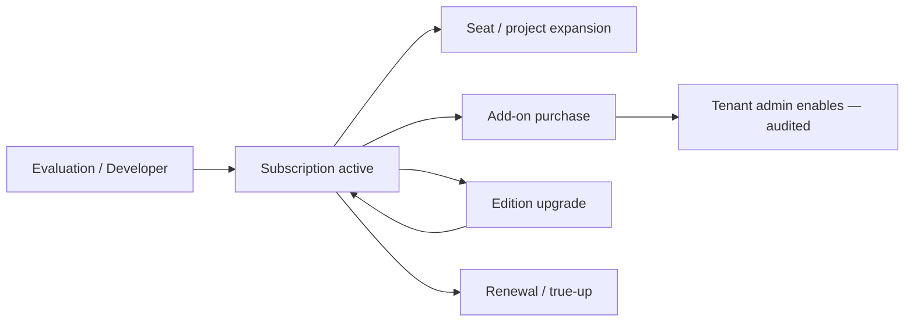
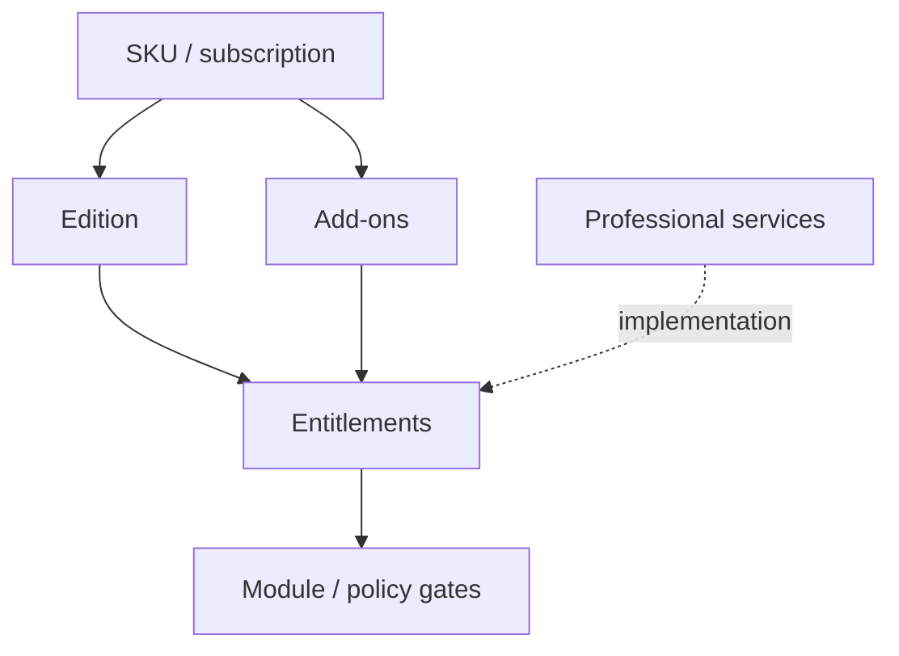

# APZ QEP — Commercial Packaging

> **Programme:** APZQEP-DEF-002  
> **Reconciles:** REQ CR-* · Discovery commercial strategy  
> **Rule:** No final prices unless already authorised

## Purpose

Commercial Packaging defines how APZ QEP is sold, licensed, and entitled as a product — mapping editions, add-ons, services, and partner motions to customer value without specifying infrastructure or implementation code.

## Business rationale

Clear packaging accelerates sales cycles, prevents bespoke one-off feature deals that break supportability, and aligns revenue with consumption (seats, projects, automation volume). Separating base editions from add-ons (AI, MCP, advanced certification) protects Constitution defaults while enabling premium monetisation.

## Core concepts

| Concept               | Product meaning                                      |
| --------------------- | ---------------------------------------------------- |
| SKU                   | Sellable unit mapping to entitlements                |
| Base subscription     | Edition-level recurring license                      |
| Add-on                | Optional capability layer                            |
| Consumption meter     | Usage-based dimension (automation ingest, AI tokens) |
| Professional services | Implementation, migration, training                  |
| Partner motion        | SI and reseller implementation packages              |
| Marketplace (later)   | Third-party extensions — P3 intent                   |

## Package elements

| Package element         | Intent                                                 |
| ----------------------- | ------------------------------------------------------ |
| Free / developer access | Evaluation; Developer edition                          |
| Team subscription       | Team edition capabilities                              |
| Enterprise subscription | Enterprise edition                                     |
| Regulated enterprise    | Compliance-oriented SKU atop Enterprise                |
| AI capabilities         | Entitled add-on; Constitution-bound; **default OFF**   |
| MCP capabilities        | Entitled with enterprise controls                      |
| Advanced certification  | Multi-approver; continuous signals (later entitlement) |
| Advanced analytics / QI | Premium / enterprise analytics depth                   |
| Marketplace             | Later P3 — partner extensions                          |
| Premium integrations    | Tier-gated connectors                                  |
| Professional services   | Implementation, migration, training                    |
| Partner implementation  | SI partners deliver governed rollout                   |

## Primary objects

| Object                     | Description                               |
| -------------------------- | ----------------------------------------- |
| Commercial offer           | Sales-facing bundle description           |
| Entitlement contract       | Customer rights record                    |
| Usage meter                | Automation volume, AI usage when entitled |
| Add-on activation          | AI, MCP, advanced cert flags              |
| Services statement of work | PS engagement — outside product SoR       |

## Lifecycle

## Ownership

| Role                 | Ownership                          |
| -------------------- | ---------------------------------- |
| Owner / Commercial   | Pricing authority — not in DEF-002 |
| Tenant Administrator | Applies entitlements to tenant     |
| Partner              | Delivers implementation SOW        |
| Compliance Officer   | Validates regulated SKU fit        |

## Relationships

Commercial packaging maps to [PRODUCT-EDITIONS.md](./PRODUCT-EDITIONS.md) and [DEPLOYMENT-MODEL.md](./DEPLOYMENT-MODEL.md). Feature gates enforced in product behaviour — not honour-system documentation.

## States

| State          | Meaning                                       |
| -------------- | --------------------------------------------- |
| Evaluation     | Time or feature limited                       |
| Active         | Paid or entitled in contract                  |
| Over capacity  | Usage exceeds meter — policy warning or block |
| Lapsed         | Subscription ended; grace read-only           |
| Add-on pending | Purchased but not tenant-enabled              |
| Add-on active  | Enabled and audited                           |

## Business rules

| Rule  | Statement                                                                                       |
| ----- | ----------------------------------------------------------------------------------------------- |
| CP-01 | No final prices in product definition unless Owner authorised                                   |
| CP-02 | AI add-on does not bypass default OFF at tenant config                                          |
| CP-03 | MCP add-on requires enterprise-grade authz audit                                                |
| CP-04 | Advanced certification never implies autonomous cert                                            |
| CP-05 | Education SKU enforces non-production terms                                                     |
| CP-06 | Marketplace P3 — extensions cannot own SoR domains                                              |
| CP-07 | Licensing philosophy: seats / projects / automation volume / AI usage — Owner decides weighting |

## Approval rules

Add-on activation (especially AI) requires Tenant Administrator + optional Security Officer approval per tenant policy. Regulated SKU requires Compliance acknowledgment.

Commercial discounting and custom SKUs — Owner approval outside product definition.

## Role responsibilities

| Persona                | Responsibility                        |
| ---------------------- | ------------------------------------- |
| Tenant Administrator   | Enables purchased entitlements        |
| Platform Administrator | Provisions tenant from contract       |
| Security Officer       | Approves AI/MCP enablement            |
| Partner integrator     | Delivers within entitled scope        |
| Release Manager        | Consumes features present in contract |

## Reporting

Commercial operations reports: entitlement inventory, usage vs contract, add-on adoption, over-capacity events. Customer-facing usage dashboard optional for Enterprise — admin scope.

## Search

Administration search for SKU and entitlement metadata. Not end-user feature.

## Audit

Entitlement grants, add-on enable/disable, over-capacity blocks, and AI/MCP activation audited with authoriser identity.

## AI considerations

AI sold as add-on; still never SoR, never certifies, default OFF until configured. Usage metering may apply when Owner defines commercial model.

## MCP considerations

MCP sold as add-on with enterprise controls. Packaging does not grant forbidden MCP behaviours (autonomous cert, unrestricted DB).

## Future evolution

Marketplace revenue share, consumption-only tiers for automation-heavy customers, and industry compliance packs as SKUs. Pricing tables remain Owner-controlled documents.

## Boundary conditions

| In boundary                        | Out of boundary               |
| ---------------------------------- | ----------------------------- |
| SKU intent and entitlement mapping | Invoice systems               |
| Add-on product meaning             | Payment gateway integration   |
| Licensing dimensions               | Tax and legal contract text   |
| Partner package definition         | Partner portal implementation |

## Example scenarios

**Scenario 1 — Team growth:** Customer on Team subscription adds 10 seats and second project within entitlements. No SKU change.

**Scenario 2 — AI add-on:** Enterprise customer purchases AI add-on. Security Officer approves enablement; AI remains off for certification module narratives until QA policy enables per workflow.

**Scenario 3 — Automation true-up:** Customer exceeds automation ingest volume meter; commercial true-up triggered — product warns before hard block per contract.

**Scenario 4 — Regulated bundle:** Bank purchases Regulated enterprise + advanced certification add-on. Multi-approver cert and legal hold entitlements activate; professional services SOW covers validation protocol migration.
