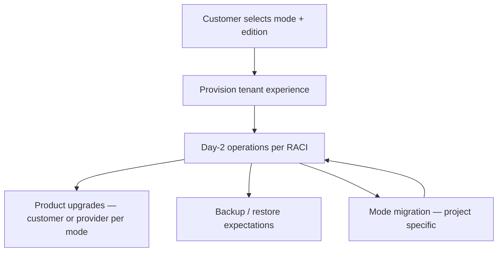
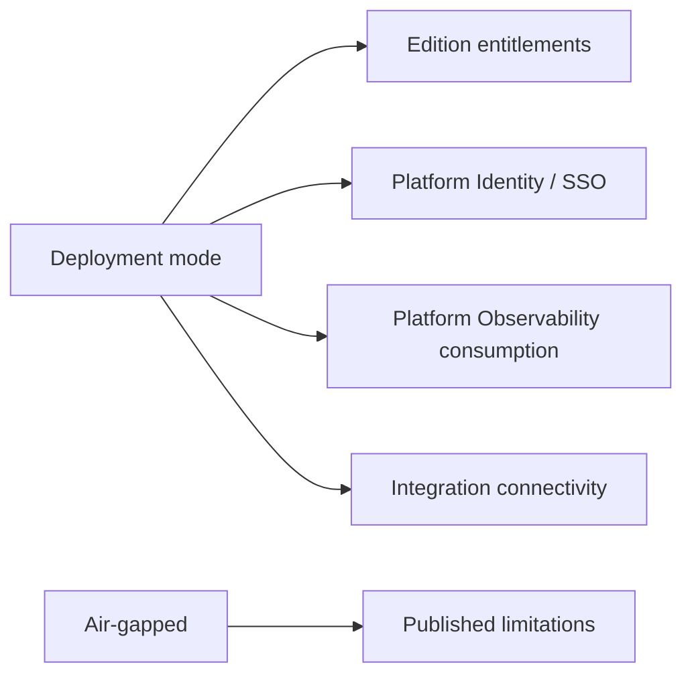

# APZ QEP — Deployment Model (Product Experience)

> **Programme:** APZQEP-DEF-002  
> **Rule:** Deployment experiences — not infra design

## Purpose

The Deployment Model describes how customers **experience** operating APZ QEP across hosting choices — what control they retain over data, what operational responsibilities they accept, and what product behaviours differ by mode. It does not specify servers, networks, or cloud architecture.

## Business rationale

Enterprise buyers require predictable data ownership and operational boundaries. Regulated customers need air-gapped or restricted options. SaaS-oriented teams want managed convenience. A clear deployment experience model aligns sales, support, and customer expectations without conflating deployment with edition packaging.

## Core concepts

| Concept | Product meaning |
| ------- | ---------------- |
| Deployment mode | Customer-facing hosting experience category |
| Data ownership | Who holds authoritative QEP SoR under contract |
| Operational responsibility split | Customer vs provider duties |
| Identity integration | SSO and platform identity expectations |
| Backup expectation | QEP SoR included in customer backup scope |
| Published limitations | Known mode-specific product constraints per release |

## Deployment modes

| Mode | Experience intent | Data ownership expectation |
| ---- | ----------------- | -------------------------- |
| **Self-hosted** | First-class enterprise control; customer operates stack | Customer-controlled |
| **Private cloud** | Customer VPC-style control; dedicated tenant isolation | Customer-controlled |
| **Managed cloud** | Provider-operated; optional later Owner-gated | Contractual — customer data rights per agreement |
| **Hybrid** | Split workloads; optional later | Split per contract (e.g. SoR self-hosted, ingest edge managed) |
| **Air-gapped / restricted** | Regulated enterprise path; no mandatory external dependencies | Fully local |

## Primary objects

| Object | Description |
| ------ | ----------- |
| Deployment profile | Tenant binding to mode and region policy |
| Data residency declaration | Customer-facing statement of storage jurisdiction intent |
| Operational responsibility matrix | RACI-style product document per mode |
| Limitation notice | Release notes for mode-specific constraints |
| Connectivity class | Online / restricted / air-gapped product behaviour |

## Lifecycle

Mode migration (e.g. self-hosted to private cloud) is a professional services or customer project — product preserves SoR export/import intent without defining technical migration APIs here.

## Ownership

| Role | Ownership |
| ---- | --------- |
| Customer IT / Platform Admin | Self-hosted and private cloud operations |
| Provider ops (managed) | Managed cloud uptime per SLA — commercial |
| Tenant Administrator | Tenant config regardless of mode |
| Compliance Officer | Data residency and air-gap attestation |

## Relationships

Deployment mode intersects Edition entitlements and Commercial packaging. Extensibility connectors may have mode-specific availability (e.g. external AI provider blocked in air-gap unless local model entitled).

## States

| State | Meaning |
| ----- | ------- |
| Planned | Mode announced; not generally available (Managed/Hybrid later) |
| Available | Customer may select per commercial rules |
| Restricted | Invite-only or regulated qualification required |
| Deprecated mode variant | Legacy path; migration guidance published |

## Business rules

| Rule | Statement |
| ---- | --------- |
| DP-01 | QEP SoR backup scope must be documented per mode — customer responsibility in self-hosted |
| DP-02 | Platform Identity / SSO integration expected where online |
| DP-03 | Observability via Platform — not duplicate QEP-only APM as product |
| DP-04 | Air-gapped mode shall not imply WebSockets or email as SoR unlock |
| DP-05 | Known limitations published per release for each available mode |
| DP-06 | Data ownership statements shall not contradict edition upgrade path |
| DP-07 | Managed cloud availability is Owner-gated when introduced |

## Approval rules

Selecting air-gapped or regulated deployment profile may require Compliance Officer sign-off on customer onboarding. Managed cloud tenant provisioning requires commercial contract activation.

## Role responsibilities

| Persona | Responsibility |
| ------- | ---------------- |
| Tenant Administrator | Configures tenant within deployment constraints |
| Platform Administrator | Self-hosted install and upgrade coordination |
| Operations Engineer | Monitors health; disables broken integrations |
| Compliance Officer | Validates residency and air-gap attestation |
| Release Manager | Unaware of infra — experiences consistent product |

## Reporting

Deployment mode appears in administration reports only: tenant inventory, limitation compliance, backup attestation checklist status. Standard quality reports unchanged by mode.

## Search

Administration search for deployment profile metadata. End-user search behaviour identical across modes where connectivity allows.

## Audit

Deployment profile changes, air-gap attestation updates, and cross-border data policy changes audited. Managed cloud provider access (if any) logged per contract — product intent only.

## AI considerations

Air-gapped deployments may restrict external AI providers; local or no AI default. AI default OFF all modes. Managed cloud AI add-on still requires tenant authorisation.

## MCP considerations

MCP requires connectivity from IDE to APZHUB Gateway — blocked or limited in strict air-gap unless internal gateway provided. MCP rules unchanged: authenticated, authorised, audited.

## Future evolution

Managed cloud and Hybrid modes marked optional later in APZQEP-DEF-002. Product experience principles stable: customer control narrative for self-hosted/private; contractual clarity for managed.

## Boundary conditions

| In boundary | Out of boundary |
| ----------- | --------------- |
| Customer-facing deployment experience | Kubernetes manifests |
| Data ownership expectations | Network diagrams |
| Operational RACI | CPU sizing tables |
| Published mode limitations | ADRs |

QEP deployment doc is product packaging — refer to infrastructure programme for build design.

## Example scenarios

**Scenario 1 — Self-hosted enterprise:** Bank runs QEP on-premises. Customer IT owns backup including PostgreSQL SoR. SSO via corporate IdP. All product modules available per Enterprise edition.

**Scenario 2 — Air-gapped regulated:** Defence contractor uses air-gapped profile. External AI and SaaS connectors disabled by limitation notice. Manual verification and certification fully supported; automation ingest via approved internal runners only.

**Scenario 3 — Private cloud:** SaaS vendor hosts dedicated VPC for customer. Data ownership customer-controlled per contract; provider handles patching — experience documented in RACI.

**Scenario 4 — Evaluation online:** Developer edition on vendor-managed trial (future managed cloud). Customer understands contractual data terms differ from self-hosted.
