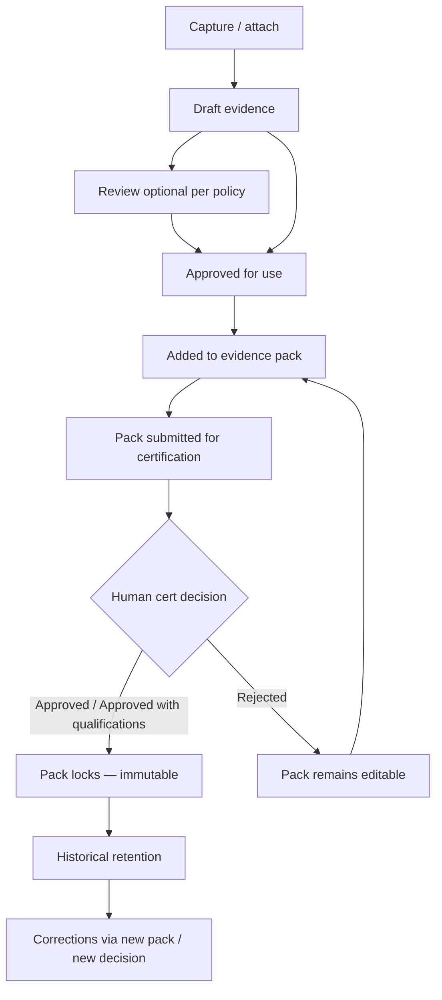
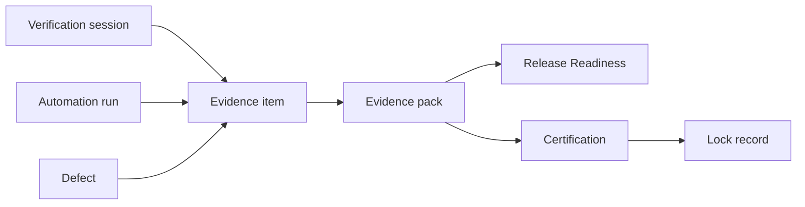

# APZ QEP — Evidence Model

> **Programme:** APZQEP-DEF-002  
> **Philosophy:** Evidence before Opinion

## Purpose

The Evidence Model defines how proof of verification, compliance, and accountable decisions is captured, organised, reviewed, packed, locked, and retained in APZ QEP. Evidence transforms execution results and human observations into durable, auditable artefacts that support release readiness and certification.

## Business rationale

Opinion and status fields alone fail regulated and enterprise audit. Certification requires demonstrable proof: what was tested, what was observed, who approved it, and that the record has not been tampered with after decision. Scattered attachments in chat, email, or ungoverned drives create chain-of-custody gaps.

QEP centralises evidence as first-class SoR objects linked to verification, defects, risks, and releases — enabling _Evidence before Opinion_ in every readiness and certification conversation.

## Core concepts

| Concept                     | Product meaning                                                                   |
| --------------------------- | --------------------------------------------------------------------------------- |
| Evidence item               | A single artefact or reference with metadata and custody                          |
| Evidence attachment         | Link from evidence to execution step, session, or record                          |
| Evidence pack               | Curated collection for readiness or certification scope                           |
| Pack lock                   | Immutability of pack contents upon certification approval                         |
| Chain of custody            | Who captured, reviewed, exported; audit trail                                     |
| Evidence completeness       | Policy measure of required evidence for scope                                     |
| Supporting vs authoritative | Human decisions and sign-offs authoritative; AI reports supporting until accepted |

## Primary objects

| Object                 | Description                                                             |
| ---------------------- | ----------------------------------------------------------------------- |
| Evidence item          | File, reference, log extract, or structured observation                 |
| Evidence metadata      | Capture time, capturer, source, classification, retention class         |
| Evidence review record | Peer or approver review of evidence suitability                         |
| Evidence pack          | Named bundle for release or certification request                       |
| Pack membership        | Ordered list of items with rationale for inclusion                      |
| Lock record            | Timestamp, cert decision, and approver binding pack immutability        |
| Export record          | Audited export for external auditors or customers                       |
| Correction path        | New decision or supplemental pack — never silent edit of locked content |

## Evidence types

| Type                  | Typical use                             |
| --------------------- | --------------------------------------- |
| Screenshots           | UI state proof                          |
| Videos                | Session replay or exploratory capture   |
| Documents             | Test plans, protocols, signed protocols |
| Logs                  | Application or test logs                |
| API outputs           | Response captures                       |
| Automation results    | Ingested runner output references       |
| Performance outputs   | Load/latency reports                    |
| Security outputs      | Scan or pen-test excerpts               |
| Accessibility outputs | a11y check results                      |
| AI reports            | Non-authoritative until human accepted  |
| Human observations    | Qualitative notes from sessions         |
| Approval records      | Embedded decision artefacts             |
| Digital sign-offs     | Formal sign-off metadata                |

## Lifecycle

## Ownership

| Role                        | Ownership                                              |
| --------------------------- | ------------------------------------------------------ |
| Manual Tester / QA Engineer | Captures session evidence; ensures completeness        |
| Automation Engineer         | Ensures ingested automation artefacts link correctly   |
| QA Manager                  | Reviews pack completeness before certification request |
| Release Manager             | Owns certification pack submission                     |
| Compliance Officer          | Retention class, legal hold, export policy             |
| Auditor                     | Read-only access to locked packs and export audit      |

## Relationships

Evidence links to verification sessions, runs, steps, defects, risks, readiness snapshots, and certification requests. Traceability views surface _unsupported certification claims_ when cert scope lacks linked evidence.

## States

| State        | Applies to    | Meaning                                 |
| ------------ | ------------- | --------------------------------------- |
| Draft        | Evidence item | Captured; not yet approved for pack use |
| Under review | Evidence item | Peer review in progress                 |
| Approved     | Evidence item | Suitable for packs per policy           |
| Rejected     | Evidence item | Not suitable; reason recorded           |
| Assembled    | Pack          | Items collected; editable               |
| Submitted    | Pack          | Linked to certification request         |
| Locked       | Pack          | Certification approved; immutable       |
| Superseded   | Pack          | Replaced by later certification pack    |

## Business rules

| Rule  | Statement                                                                                    |
| ----- | -------------------------------------------------------------------------------------------- |
| EV-01 | Evidence packs **lock** on certification approval (Approved or Approved with qualifications) |
| EV-02 | Locked pack content shall not be edited; corrections use new decisions and packs             |
| EV-03 | History is never deleted; retention and legal hold apply                                     |
| EV-04 | AI-generated reports remain non-authoritative until human accepted                           |
| EV-05 | Exports are audited with exporter identity and scope                                         |
| EV-06 | Evidence completeness gates may block readiness — configurable by edition/policy             |
| EV-07 | Classification and retention class mandatory where regulated policy enabled                  |

## Approval rules

| Action                                 | Approver                                                   |
| -------------------------------------- | ---------------------------------------------------------- |
| Evidence item approval (when required) | QA peer or QA Manager per policy                           |
| Pack completeness sign-off             | QA Manager or Release Manager per policy                   |
| Certification pack acceptance          | Human certification decision — separate from item approval |
| Export for external audit              | Compliance Officer or delegated role                       |
| Legal hold placement                   | Compliance Officer / Tenant Admin                          |

Pack lock is automatic upon certification approval — not a separate human toggle.

## Role responsibilities

| Persona                 | Responsibility                                         |
| ----------------------- | ------------------------------------------------------ |
| Manual Tester           | Capture accurate session evidence                      |
| QA Engineer             | Attach evidence to procedures and retests              |
| Automation Engineer     | Validate ingested artefact integrity                   |
| QA Manager              | Review completeness; reject unsuitable items           |
| Release Manager         | Curates certification pack membership                  |
| Compliance Officer      | Govern retention and export                            |
| Auditor                 | Verify lock integrity and custody chain                |
| Customer Representative | May receive customer-facing export packs when entitled |

## Reporting

Reports include evidence completeness by release, missing evidence gaps, pack assembly status, export history, and locked pack inventory. Executive views show completeness trends. Certification statements reference locked pack identifiers.

## Search

Evidence searchable by title, type, linked requirement, session, defect, pack, capturer, and date range. Full-text where policy allows. Locked packs searchable but items not editable. Unified search permission-filtered.

## Audit

Capture, review, approve, reject, pack add/remove (pre-lock), submit, lock, export, and legal hold events are immutable audit entries. Chain-of-custody metadata captures who captured, reviewed, and exported. Post-lock access is read-only except audited export.

## AI considerations

AI default **OFF**. AI may suggest evidence labels, summarise log excerpts, or draft review comments — never auto-approve evidence. Accepted AI summaries become evidence items with clear provenance. AI cannot lock packs or certify.

## MCP considerations

MCP may submit evidence **references** (gated write) when developer attaches proof from IDE workflows. References enter Draft until human approval. MCP cannot lock packs or modify locked content. All submissions audited with tool correlation ID.

## Future evolution

Future product intent: richer media handling via platform storage, customer evidence portals (read-only), templated pack layouts by industry, and watermarking on export. Lock semantics remain: approval triggers immutability.

## Boundary conditions

| In boundary                        | Out of boundary                                    |
| ---------------------------------- | -------------------------------------------------- |
| Govern evidence metadata and packs | Replace enterprise document management             |
| Reference external storage         | Store unlimited binary SoR outside platform policy |
| Lock on certification approval     | Lock on continuous signal alone                    |
| Chain of custody audit             | Email as system of record                          |

QEP is not a generic DMS; it governs quality evidence in the certification chain.

## Example scenarios

**Scenario 1 — Manual session:** A Manual Tester completes exploratory session, attaches screenshots and notes. Evidence items Approved by QA Engineer, included in release pack. Certification Approved locks pack; later typo corrected via supplemental addendum pack and new qualification — original lock unchanged.

**Scenario 2 — Automation ingest:** Nightly run produces junit and screenshots ingested as evidence references. Automation Engineer confirms linkage to verification run. Pack completeness gate passes for automated scope.

**Scenario 3 — Regulated export:** Compliance Officer exports locked pack for external auditor. Export record captures officer identity, timestamp, and hash intent. Legal hold prevents retention expiry deletion.

**Scenario 4 — Unsupported claim:** Traceability view flags certification scope missing evidence for two requirements. Release Manager adds items before re-submitting certification request — prior rejected cert pack remained editable.
