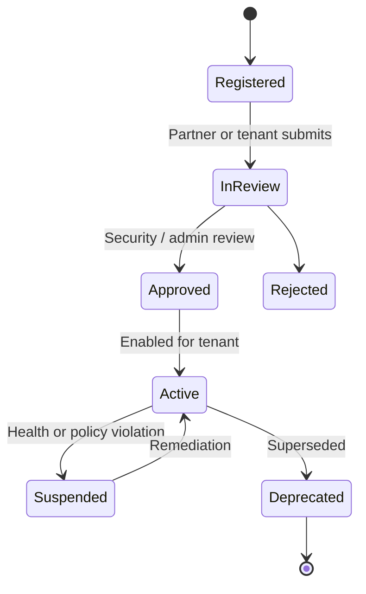
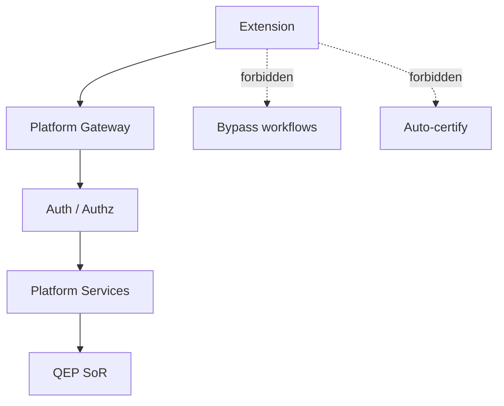

# APZ QEP — Extensibility

> **Programme:** APZQEP-DEF-002  
> **Rule:** Product extension model — not technical API specifications

## Purpose

Extensibility defines how customers and partners extend APZ QEP with integrations, custom policies, templates, reports, and tooling — while preserving SoR boundaries, human certification, auditability, and permission-driven access. Extensions **consume** QEP; they do not replace core quality domains.

## Business rationale

Every enterprise has unique tools, policies, and reporting needs. A monolithic product without extension surfaces forces shadow IT and unsafe workarounds. Governed extensibility keeps quality data authoritative in QEP while allowing IDE workflows, webhooks, custom fields, and marketplace packages (future) to meet local requirements.

## Core concepts

| Concept | Product meaning |
| ------- | ---------------- |
| Extension surface | Approved interaction point (API, webhook, MCP, template, policy) |
| Extension package | Registered bundle with manifest and review status |
| Custom policy | Tenant-defined certification, risk, or gate rule within platform limits |
| Connector | Integration adapter ingesting or linking external systems |
| Partner extension | SI or ISV-delivered package via partner programme |
| Marketplace package | Later P3 distributable extension |

## Extension surfaces

Product APIs · Webhooks · MCP tools · Integration connectors · AI-provider adapters · IDE clients · Verification templates · Custom fields · Custom workflows · Custom policies · Certification policies · Risk policies · Report extensions · Marketplace packages · Partner extensions

## Primary objects

| Object | Description |
| ------ | ----------- |
| Extension registration | Manifest metadata, version, owner, health |
| Custom field definition | Additional metadata on governed objects |
| Custom workflow hook | Trigger points in lifecycle stages |
| Policy extension | Certification, risk, readiness rule templates |
| Report extension | Additional report layouts and data slices |
| Connector registration | Integration capability declaration |
| Template package | Verification or evidence templates |

## Lifecycle

## Ownership

| Role | Ownership |
| ---- | --------- |
| Tenant Administrator | Enables approved extensions for tenant |
| Platform Administrator | Reviews partner registrations globally |
| Partner / Integrator | Builds and maintains extension packages |
| QA Manager | Owns custom verification templates |
| Compliance Officer | Approves policy extensions in regulated tenants |

## Relationships

Extensions attach to modules across Verification, Evidence, Certification, Risk, Reporting, and MCP. They read/write through Platform Services — never direct backend engine branding to users.

## States

| State | Meaning |
| ----- | ------- |
| Registered | Metadata recorded; not enabled |
| In review | Awaiting security/compliance review |
| Approved | May be enabled per tenant |
| Active | Enabled and monitored |
| Suspended | Disabled for violation or health failure |
| Rejected | Not permitted |
| Deprecated | Supported until end date |

## Governance expectations

| Rule | Statement |
| ---- | --------- |
| SoR | Extensions consume QEP; do not own SoR domains |
| Authz | Every extension call authorised |
| Audit | Mutating extensions audited |
| Certify | No extension may auto-certify |
| Manifest | Connectors/providers registered and reviewable |
| Brand | No engine brand leakage to standard users |
| Risk | No extension may auto-accept risk |
| Evidence | No extension may unlock locked packs |

## Business rules

| Rule | Statement |
| ---- | --------- |
| EXT-01 | Extensions cannot become authoritative for certification decisions |
| EXT-02 | Custom policies cannot disable human certification requirement |
| EXT-03 | MCP and API writes use draft/gated paths where SoR impact |
| EXT-04 | Marketplace packages (P3) follow same governance as tenant extensions |
| EXT-05 | AI provider adapters replaceable; AI default OFF |
| EXT-06 | Health reporting mandatory for active connector extensions |

## Approval rules

| Extension type | Approver |
| -------------- | -------- |
| Tenant custom field | Tenant Administrator |
| Custom cert/risk policy | Compliance Officer in Regulated; QA Manager + Admin otherwise |
| Partner connector | Platform Administrator + security review |
| MCP tool package | Security Officer + Tenant Administrator |
| Report extension | Tenant Administrator |

## Role responsibilities

| Persona | Responsibility |
| ------- | ---------------- |
| Third-party Integrator | Build within manifest contract |
| Developer | Uses IDE/MCP extensions within scope |
| Tenant Administrator | Enable/disable extensions |
| Security Officer | Review mutating extensions |
| QA Manager | Curate verification templates |
| AI Agent | Uses MCP tools only — cannot register extensions |

## Reporting

Extension health dashboard (admin): active registrations, failed webhooks, connector latency class, policy extension audit. Standard quality reports unaffected unless report extension explicitly registered.

## Search

Registered extensions searchable in Integration Centre / Administration. Custom fields searchable when indexed and permitted.

## Audit

Extension enable/disable, mutating API calls, webhook deliveries, MCP tool invocations, and policy extension changes audited with correlation IDs.

## AI considerations

AI-provider adapters are extension surface. Adapters do not grant AI certification rights. Prompt governance extension hooks optional for Enterprise.

## MCP considerations

MCP tools are first-class extension surface documented in [MCP-WORKFLOWS.md](./MCP-WORKFLOWS.md). MCP packages require manifest registration and respect scoped authz.

## Future evolution

Marketplace P3, verified partner badge programme, low-code policy editor for gates (human cert unchanged), and industry template packs. Extension manifest schema evolves via SDK programme — not in DEF-002.

## Boundary conditions

| In boundary | Out of boundary |
| ----------- | --------------- |
| Extension registration model | OpenAPI specifications |
| Policy extension intent | Rule engine implementation |
| Partner programme rules | Revenue share systems |
| Template distribution | npm package structure |

## Example scenarios

**Scenario 1 — Custom field:** Enterprise adds “Business unit” custom field on requirements. Tenant Admin approves; field appears in search and reports.

**Scenario 2 — Webhook:** CI system webhook ingests run metadata. Connector registered Active; failures Suspended until fixed. QEP still does not run tests.

**Scenario 3 — Cert policy extension:** Regulated tenant adds mandatory Security Officer co-approval on cert requests via policy extension. Human cert still required — extension adds approver only.

**Scenario 4 — Rejected extension:** Partner submits extension claiming auto-certify on green gates. Platform Administrator Rejects — violates EXT-01.
