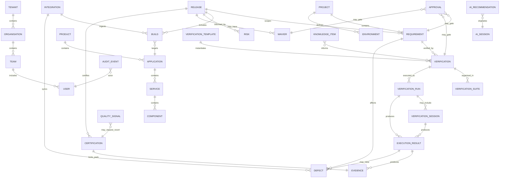

# APZ QEP — Information Architecture

> **Programme:** APZQEP-DEF-002  
> **Rule:** Product objects and relationships — not tables, types, or storage  
> **Preserved from DEF-001:** Principal object set, core relationship diagram, ownership/lifecycle principles

## Architecture overview

APZ QEP’s information architecture defines **what exists in the product**, **what it means to users**, and **how objects relate** — independent of database schema or API design. The platform is System of Record for listed quality domains; external ALM, CI, and defect tools remain authoritative for their own domains and integrate via the Integration Centre.

Objects share common product semantics: **owner**, **lifecycle status**, **audit history**, **permission-scoped visibility**, and **search/navigation registration**. Certification decisions and privileged approvals are **immutable** once recorded. AI artefacts are **non-authoritative** until a human accepts them into SoR.

## Principal product objects

The following sections expand each principal object beyond the DEF-001 index. Field definitions are consistent across objects.

---

### Tenant

| Dimension                  | Definition                                                                                                                |
| -------------------------- | ------------------------------------------------------------------------------------------------------------------------- |
| **Business meaning**       | Top-level isolation boundary for a customer deployment; all quality data belongs to exactly one tenant.                   |
| **Purpose**                | Enforce data separation, entitlements, retention, and policy scope for enterprise and multi-customer hosting.             |
| **Owner**                  | Platform Administrator (hosting); Tenant Administrator (tenant policies).                                                 |
| **Lifecycle**              | Provisioned → Active → Suspended → Decommissioned (archival/export per policy).                                           |
| **Relationships**          | Contains organisations, users, projects, integrations, and all quality objects; parent to entitlements and AI/MCP policy. |
| **Visibility**             | Users see only their tenant; cross-tenant discovery is forbidden.                                                         |
| **Security**               | Strongest boundary; tenant context on every request; superadmin access audited.                                           |
| **Audit**                  | Provisioning, suspension, policy changes, export/decommission events.                                                     |
| **Search behaviour**       | Not a user search target; implicit filter on all queries.                                                                 |
| **Navigation behaviour**   | Rarely shown in breadcrumbs; Administration entry for tenant admins.                                                      |
| **AI interaction**         | Tenant-level AI enable/disable; model and data-boundary policy.                                                           |
| **MCP interaction**        | Tenant-level MCP enable/disable; tool allowlists.                                                                         |
| **Reporting implications** | Tenant is report scope root; executive roll-ups never cross tenants.                                                      |

---

### Organisation

| Dimension                  | Definition                                                                                                           |
| -------------------------- | -------------------------------------------------------------------------------------------------------------------- |
| **Business meaning**       | Structural grouping within a tenant — business unit, division, or department — for governance and reporting roll-up. |
| **Purpose**                | Mirror enterprise structure without becoming an HR system; scope permissions, portfolios, and reports.               |
| **Owner**                  | Tenant Administrator; business unit lead as steward.                                                                 |
| **Lifecycle**              | Draft → Active → Archived (projects may reassign before archive).                                                    |
| **Relationships**          | Parent to teams and projects; linked to retention and policy templates.                                              |
| **Visibility**             | Users see organisations they belong to or that contain accessible projects.                                          |
| **Security**               | Org-scoped roles may limit project and report visibility.                                                            |
| **Audit**                  | Create, rename, archive, policy attachment.                                                                          |
| **Search behaviour**       | Searchable by name/code for admins and portfolio navigation.                                                         |
| **Navigation behaviour**   | Portfolio filters; Administration tree; optional breadcrumb segment.                                                 |
| **AI interaction**         | May inherit org-level AI policy overrides where entitled.                                                            |
| **MCP interaction**        | Org-scoped tool policies when tenant configures hierarchy.                                                           |
| **Reporting implications** | Portfolio and executive reports group by organisation.                                                               |

---

### Team

| Dimension                  | Definition                                                                                            |
| -------------------------- | ----------------------------------------------------------------------------------------------------- |
| **Business meaning**       | A working group assigned to quality work within projects — QA squad, release train, automation guild. |
| **Purpose**                | Assign ownership, route work queues, and filter Home/dashboard views.                                 |
| **Owner**                  | Team lead; Project Manager as co-steward.                                                             |
| **Lifecycle**              | Active → Archived; membership changes versioned in audit.                                             |
| **Relationships**          | Linked to projects; members are users; may own verifications, sessions, defects.                      |
| **Visibility**             | Team membership visible to project participants; hidden from unrelated projects.                      |
| **Security**               | Team-based assignment does not grant extra permissions beyond roles.                                  |
| **Audit**                  | Membership changes, team-project links.                                                               |
| **Search behaviour**       | Searchable by name; appears as facet on work items.                                                   |
| **Navigation behaviour**   | Project settings; filter on Execution and Defects queues.                                             |
| **AI interaction**         | None direct; may tag AI session context to team scope.                                                |
| **MCP interaction**        | None direct.                                                                                          |
| **Reporting implications** | Workload and throughput reports by team.                                                              |

---

### User

| Dimension                  | Definition                                                                                 |
| -------------------------- | ------------------------------------------------------------------------------------------ |
| **Business meaning**       | A human actor authenticated via platform identity with QEP permissions.                    |
| **Purpose**                | Attribute actions, approvals, certifications, and audit events to accountable individuals. |
| **Owner**                  | Tenant Administrator (account); user (preferences).                                        |
| **Lifecycle**              | Invited → Active → Suspended → Removed (historical attribution preserved).                 |
| **Relationships**          | Member of teams; holder of roles; assignee/approver on quality objects.                    |
| **Visibility**             | Profile visible per policy; email/display name on owned work.                              |
| **Security**               | Authentication via Better Auth; authorisation via QEP permission model.                    |
| **Audit**                  | Login context on sensitive actions; role changes fully audited.                            |
| **Search behaviour**       | Search assignees, approvers, certifiers by name.                                           |
| **Navigation behaviour**   | User picker in assignments; Administration user detail.                                    |
| **AI interaction**         | User-level AI opt-in where tenant allows.                                                  |
| **MCP interaction**        | Developer/integrator users may hold MCP client credentials per policy.                     |
| **Reporting implications** | Productivity and approval latency by user (permission-gated).                              |

---

### Role

| Dimension                  | Definition                                                                                         |
| -------------------------- | -------------------------------------------------------------------------------------------------- |
| **Business meaning**       | Named permission bundle mapping platform capabilities to job functions — not backend engine roles. |
| **Purpose**                | Drive permission-filtered UI, approval authority, and separation of duties.                        |
| **Owner**                  | Tenant Administrator; Security Officer for sensitive roles.                                        |
| **Lifecycle**              | Defined → Active → Deprecated (users migrated before removal).                                     |
| **Relationships**          | Assigned to users; maps to approval types and workspace defaults.                                  |
| **Visibility**             | Role names visible to admins; effective permissions visible to self where policy allows.           |
| **Security**               | Least privilege; certifier and admin roles explicitly tiered.                                      |
| **Audit**                  | Role definition changes and assignments.                                                           |
| **Search behaviour**       | Admin search only.                                                                                 |
| **Navigation behaviour**   | Administration → Roles; explains blocked actions elsewhere.                                        |
| **AI interaction**         | Roles may exclude AI write or MCP tool classes.                                                    |
| **MCP interaction**        | Integrator/developer role gates MCP access.                                                        |
| **Reporting implications** | SoD reports map roles to approval patterns.                                                        |

---

### Project

| Dimension                  | Definition                                                                                                                               |
| -------------------------- | ---------------------------------------------------------------------------------------------------------------------------------------- |
| **Business meaning**       | Primary **quality context** — the governed unit for requirements, verification, execution, and release confidence for a delivery effort. |
| **Purpose**                | Stable scope for traceability and readiness without replacing ALM project management.                                                    |
| **Owner**                  | Product Owner / QA Manager (shared stewardship); Project Manager for delivery tracking.                                                  |
| **Lifecycle**              | Draft → Active → Archived (read-only history retained).                                                                                  |
| **Relationships**          | Contains requirements, verifications, environments, releases; links to products/applications; external ALM reference optional.           |
| **Visibility**             | Project membership and role permissions.                                                                                                 |
| **Security**               | Project boundary for most quality objects; cross-project links explicit and audited.                                                     |
| **Audit**                  | Create, archive, owner change, external link changes.                                                                                    |
| **Search behaviour**       | High-priority search target; facet for all scoped objects.                                                                               |
| **Navigation behaviour**   | Central hub: project sidebar switches module context; breadcrumbs anchor here.                                                           |
| **AI interaction**         | AI context scoped to project when assisting design or analysis.                                                                          |
| **MCP interaction**        | MCP tools default to project scope parameters.                                                                                           |
| **Reporting implications** | Primary roll-up unit for quality metrics and readiness.                                                                                  |

---

### Product

| Dimension                  | Definition                                                                                    |
| -------------------------- | --------------------------------------------------------------------------------------------- |
| **Business meaning**       | A logical product line or offering under quality governance — may span multiple applications. |
| **Purpose**                | Executive and portfolio reporting; group applications/services for quality posture.           |
| **Owner**                  | Product Owner.                                                                                |
| **Lifecycle**              | Active → Deprecated → Retired.                                                                |
| **Relationships**          | Parent to applications; linked to projects and portfolio views.                               |
| **Visibility**             | Portfolio and project participants; executive read aggregates.                                |
| **Security**               | Inherited via project/portfolio permissions.                                                  |
| **Audit**                  | Definition and hierarchy changes.                                                             |
| **Search behaviour**       | Searchable name; portfolio filter facet.                                                      |
| **Navigation behaviour**   | Portfolio module; drill to contained applications.                                            |
| **AI interaction**         | Context for portfolio-level intelligence when enabled.                                        |
| **MCP interaction**        | Read scope for product metadata tools.                                                        |
| **Reporting implications** | Portfolio quality dashboards by product.                                                      |

---

### Application

| Dimension                  | Definition                                                                           |
| -------------------------- | ------------------------------------------------------------------------------------ |
| **Business meaning**       | A deployable application or system under test — user-facing or internal.             |
| **Purpose**                | Scope environments, builds, and verification to a concrete system.                   |
| **Owner**                  | Product Owner / technical lead.                                                      |
| **Lifecycle**              | In development → Active → Deprecated.                                                |
| **Relationships**          | Belongs to product; contains services/components; linked to environments and builds. |
| **Visibility**             | Project and portfolio scopes.                                                        |
| **Security**               | Same as parent project.                                                              |
| **Audit**                  | Structure and owner changes.                                                         |
| **Search behaviour**       | Searchable; links from defects and execution context.                                |
| **Navigation behaviour**   | Portfolio → Application detail; context on execution and defects.                    |
| **AI interaction**         | Scope for impact analysis suggestions.                                               |
| **MCP interaction**        | Reference in MCP read tools for developers.                                          |
| **Reporting implications** | Defect and coverage roll-ups by application.                                         |

---

### Service

| Dimension                  | Definition                                                                           |
| -------------------------- | ------------------------------------------------------------------------------------ |
| **Business meaning**       | A bounded capability or microservice within an application architecture.             |
| **Purpose**                | Finer-grained quality scope for microservice estates and service-level verification. |
| **Owner**                  | Service owner / tech lead.                                                           |
| **Lifecycle**              | Active → Deprecated.                                                                 |
| **Relationships**          | Child of application; may link to components and environments.                       |
| **Visibility**             | Project scope.                                                                       |
| **Security**               | Project permissions.                                                                 |
| **Audit**                  | Definition changes.                                                                  |
| **Search behaviour**       | Facet on defects, verifications, execution.                                          |
| **Navigation behaviour**   | Portfolio hierarchy; filters in Traceability and Defects.                            |
| **AI interaction**         | Optional scope for service-level recommendations.                                    |
| **MCP interaction**        | Metadata in developer tools.                                                         |
| **Reporting implications** | Service-level defect density and verification coverage.                              |

---

### Component

| Dimension                  | Definition                                                                    |
| -------------------------- | ----------------------------------------------------------------------------- |
| **Business meaning**       | A modular part of an application or service — UI module, library, API module. |
| **Purpose**                | Target granular verification and defect attribution.                          |
| **Owner**                  | Component owner / developer lead.                                             |
| **Lifecycle**              | Active → Removed.                                                             |
| **Relationships**          | Child of application or service; linked in traceability graph.                |
| **Visibility**             | Project scope.                                                                |
| **Security**               | Project permissions.                                                          |
| **Audit**                  | Structural changes.                                                           |
| **Search behaviour**       | Facet and keyword on linked work items.                                       |
| **Navigation behaviour**   | Portfolio detail; traceability node.                                          |
| **AI interaction**         | Context for change-impact hints.                                              |
| **MCP interaction**        | Read in MCP metadata tools.                                                   |
| **Reporting implications** | Component hotspot reports.                                                    |

---

### Environment

| Dimension                  | Definition                                                                           |
| -------------------------- | ------------------------------------------------------------------------------------ |
| **Business meaning**       | A named target where verification runs — SIT, UAT, staging, production-like.         |
| **Purpose**                | Bind sessions and automated runs to execution context; explain result applicability. |
| **Owner**                  | Operations Engineer / QA Manager.                                                    |
| **Lifecycle**              | Defined → Active → Decommissioned.                                                   |
| **Relationships**          | Linked to project, application, integrations; referenced by runs and sessions.       |
| **Visibility**             | Project team; restricted envs may be role-limited.                                   |
| **Security**               | Production-like environments may have stricter execute permissions.                  |
| **Audit**                  | Definition, credential reference changes (not secret values).                        |
| **Search behaviour**       | Search by name/code; filter on execution lists.                                      |
| **Navigation behaviour**   | Project settings; session setup; execution filters.                                  |
| **AI interaction**         | None authoritative.                                                                  |
| **MCP interaction**        | Read environment list for test tool context.                                         |
| **Reporting implications** | Results and defects by environment.                                                  |

---

### Build

| Dimension                  | Definition                                                                             |
| -------------------------- | -------------------------------------------------------------------------------------- |
| **Business meaning**       | A specific build or version candidate of software under test — often ingested from CI. |
| **Purpose**                | Anchor execution results and defects to the artefact that was verified.                |
| **Owner**                  | Release Manager / Automation Engineer (ingestion).                                     |
| **Lifecycle**              | Detected → Active candidate → Superseded → Archived.                                   |
| **Relationships**          | Linked to application, release, runs; external CI reference.                           |
| **Visibility**             | Project/release scope.                                                                 |
| **Security**               | Read for most; promote/link actions permission-gated.                                  |
| **Audit**                  | Link/unlink to release; ingestion events.                                              |
| **Search behaviour**       | Search by version/build id; recent builds on release hub.                              |
| **Navigation behaviour**   | Release hub; execution result detail; defect context.                                  |
| **AI interaction**         | None authoritative.                                                                    |
| **MCP interaction**        | CI ingestion via integration; MCP read of build metadata.                              |
| **Reporting implications** | Pass/fail trends per build; release comparison.                                        |

---

### Release

| Dimension                  | Definition                                                                                                    |
| -------------------------- | ------------------------------------------------------------------------------------------------------------- |
| **Business meaning**       | A scoped **delivery candidate** — version, sprint release, or patch — subject to readiness and certification. |
| **Purpose**                | Aggregate scope, gates, evidence, and human certification decision for go/no-go.                              |
| **Owner**                  | Release Manager.                                                                                              |
| **Lifecycle**              | Planning → In verification → Readiness review → Certification pending → Released / Not released → Closed.     |
| **Relationships**          | Scopes requirements, builds, defects, waivers, risks; parent to readiness snapshots and certification.        |
| **Visibility**             | Release participants; executive aggregates.                                                                   |
| **Security**               | Certification actions restricted to certifier roles; read wider for stakeholders.                             |
| **Audit**                  | Scope changes, readiness evaluations, cert handoff.                                                           |
| **Search behaviour**       | High-priority; search by name/version/milestone.                                                              |
| **Navigation behaviour**   | **Release hub** — first-class navigation context parallel to project.                                         |
| **AI interaction**         | Readiness explanation assists when AI enabled — not cert decision.                                            |
| **MCP interaction**        | Read release scope tools; no certify tools (DEF-D-006).                                                       |
| **Reporting implications** | Release readiness reports; certification history; executive release view.                                     |

---

### Requirement

| Dimension                  | Definition                                                                            |
| -------------------------- | ------------------------------------------------------------------------------------- |
| **Business meaning**       | An approved need, constraint, or acceptance criterion that quality work must prove.   |
| **Purpose**                | Anchor traceability from business intent through verification to evidence.            |
| **Owner**                  | Business Analyst / Product Owner (author); PO approves.                               |
| **Lifecycle**              | Draft → In review → Approved → Changed → Deprecated (re-approval on material change). |
| **Relationships**          | Verified by verifications; affected by defects; scoped to releases; traced in graph.  |
| **Visibility**             | Project scope; customer-shared views where entitled.                                  |
| **Security**               | Edit vs approve separated; approved baseline locked per policy.                       |
| **Audit**                  | Full version history; approval records.                                               |
| **Search behaviour**       | Primary search object; rich facets (status, priority, release).                       |
| **Navigation behaviour**   | Requirements module; hub in traceability; links to verifications.                     |
| **AI interaction**         | Draft requirements and acceptance criteria — human approval required.                 |
| **MCP interaction**        | Read/write draft via governed tools — not bypass approval.                            |
| **Reporting implications** | Coverage %, approval cycle time, open change rate.                                    |

---

### Verification

| Dimension                  | Definition                                                                                                                  |
| -------------------------- | --------------------------------------------------------------------------------------------------------------------------- |
| **Business meaning**       | The **primary work unit** proving requirements — manual procedure, automated check, hybrid, or continuous form (DEF-D-001). |
| **Purpose**                | Executable specification of how confidence is established.                                                                  |
| **Owner**                  | QA Engineer / QA Manager.                                                                                                   |
| **Lifecycle**              | Draft → In review → Approved → Active → Deprecated (suites may reference retired).                                          |
| **Relationships**          | Proves requirements; organised in suites/templates; executed as runs/sessions; produces results and evidence.               |
| **Visibility**             | Project scope; library may share across projects per policy.                                                                |
| **Security**               | Approve vs execute permissions differ; promote from automation gated.                                                       |
| **Audit**                  | Versioning; approval; promotion from automation.                                                                            |
| **Search behaviour**       | Primary search; link from requirements and defects.                                                                         |
| **Navigation behaviour**   | Verification Library and Design; links to Execution planning.                                                               |
| **AI interaction**         | Draft procedures and gap suggestions — peer review required.                                                                |
| **MCP interaction**        | Read approved verifications; draft create via MCP when policy allows.                                                       |
| **Reporting implications** | Coverage, reuse, execution pass rates.                                                                                      |

---

### Verification Suite

| Dimension                  | Definition                                                                       |
| -------------------------- | -------------------------------------------------------------------------------- |
| **Business meaning**       | A curated organisation of verifications for a plan, regression, or release gate. |
| **Purpose**                | Batch planning, progress tracking, and readiness evaluation.                     |
| **Owner**                  | QA Manager.                                                                      |
| **Lifecycle**              | Draft → Active → Frozen (for release baseline) → Archived.                       |
| **Relationships**          | Contains verifications; linked to release readiness and execution plans.         |
| **Visibility**             | Project/release scope.                                                           |
| **Security**               | Freeze for baseline may require approval.                                        |
| **Audit**                  | Membership changes; freeze events.                                               |
| **Search behaviour**       | Search by name/release tag.                                                      |
| **Navigation behaviour**   | Verification module; release hub section.                                        |
| **AI interaction**         | Suggest suite composition — human confirms.                                      |
| **MCP interaction**        | Read suite membership.                                                           |
| **Reporting implications** | Suite completion % for readiness gates.                                          |

---

### Verification Template

| Dimension                  | Definition                                                                                     |
| -------------------------- | ---------------------------------------------------------------------------------------------- |
| **Business meaning**       | Reusable pattern for creating verifications — standard steps, data, and evidence expectations. |
| **Purpose**                | Accelerate consistent design across projects; encode organisational standards.                 |
| **Owner**                  | QA Manager / centre of excellence.                                                             |
| **Lifecycle**              | Draft → Published → Deprecated.                                                                |
| **Relationships**          | Instantiates verifications; may link to knowledge items.                                       |
| **Visibility**             | Tenant or org library per policy.                                                              |
| **Security**               | Publish action restricted; templates may be read-only for engineers.                           |
| **Audit**                  | Publish and breaking changes.                                                                  |
| **Search behaviour**       | Library search; “create from template” picker.                                                 |
| **Navigation behaviour**   | Verification Library / Design.                                                                 |
| **AI interaction**         | Generate template drafts from knowledge — publish gated.                                       |
| **MCP interaction**        | Read templates.                                                                                |
| **Reporting implications** | Template adoption rate.                                                                        |

---

### Verification Run

| Dimension                  | Definition                                                                                                   |
| -------------------------- | ------------------------------------------------------------------------------------------------------------ |
| **Business meaning**       | A planned or batch **execution instance** — automated run, scheduled regression, or grouped manual campaign. |
| **Purpose**                | Track execution progress and aggregate results for a defined set of verifications.                           |
| **Owner**                  | QA Engineer / Automation Engineer / assigned lead.                                                           |
| **Lifecycle**              | Planned → In progress → Completed → Cancelled → Archived.                                                    |
| **Relationships**          | Contains sessions or automated executions; produces execution results and evidence; may raise defects.       |
| **Visibility**             | Project/release; assignees see queues.                                                                       |
| **Security**               | Execute vs view; cancel may be manager-only.                                                                 |
| **Audit**                  | Start, complete, cancel, re-run.                                                                             |
| **Search behaviour**       | Search by id, name, release, build.                                                                          |
| **Navigation behaviour**   | Execution module; release hub progress.                                                                      |
| **AI interaction**         | Summarise run outcomes — not alter results.                                                                  |
| **MCP interaction**        | Trigger/read run status via integration tools — not bypass evidence.                                         |
| **Reporting implications** | Run pass/fail, duration, automation vs manual mix.                                                           |

---

### Verification Session

| Dimension                  | Definition                                                                                |
| -------------------------- | ----------------------------------------------------------------------------------------- |
| **Business meaning**       | A **human-centred execution context** for manual or exploratory verification (DEF-D-002). |
| **Purpose**                | Step-by-step execution with evidence, comments, and defect raise — first-class MVP path.  |
| **Owner**                  | Assigned tester; QA Manager oversees.                                                     |
| **Lifecycle**              | Assigned → In progress → Paused → Completed → Signed off (optional policy) → Archived.    |
| **Relationships**          | Instance of verification(s); produces step-level results and evidence; links to defects.  |
| **Visibility**             | Assignee and project team; managers see queues.                                           |
| **Security**               | Execute assigned; sign-off may require lead role.                                         |
| **Audit**                  | Step outcomes, evidence attach, pause/resume, completion.                                 |
| **Search behaviour**       | “My sessions”; search by verification, release, assignee.                                 |
| **Navigation behaviour**   | Execution module primary surface; Home assigned work.                                     |
| **AI interaction**         | Optional step hints — never auto-mark pass/fail.                                          |
| **MCP interaction**        | Limited read session status for developers.                                               |
| **Reporting implications** | Session throughput, blocked rate, evidence completeness.                                  |

---

### Execution Result

| Dimension                  | Definition                                                                                                 |
| -------------------------- | ---------------------------------------------------------------------------------------------------------- |
| **Business meaning**       | The recorded **outcome** of executing a verification step or automated check.                              |
| **Purpose**                | Factual input to traceability, readiness, and defect triage — pass, fail, blocked, NA, skipped per policy. |
| **Owner**                  | Executor (tester/automation identity); system for ingested automation.                                     |
| **Lifecycle**              | Recorded → Amended (policy-limited, audited) → Superseded by retest → Locked (post-cert).                  |
| **Relationships**          | Child of run/session; links to evidence; may spawn defects; rolls up to readiness.                         |
| **Visibility**             | Project/release scope.                                                                                     |
| **Security**               | Amend may be restricted after baseline freeze.                                                             |
| **Audit**                  | Immutable after lock; amendments retain prior value.                                                       |
| **Search behaviour**       | Filter fail/blocked; link from defects and traceability.                                                   |
| **Navigation behaviour**   | Execution detail; defect pre-fill source.                                                                  |
| **AI interaction**         | Explain failure patterns — not change result.                                                              |
| **MCP interaction**        | Ingest via automation integration; read via MCP.                                                           |
| **Reporting implications** | Pass rates, flaky detection input, trend charts.                                                           |

---

### Evidence

| Dimension                  | Definition                                                                               |
| -------------------------- | ---------------------------------------------------------------------------------------- |
| **Business meaning**       | A proof artefact — screenshot, log extract, report, file, or linked external record.     |
| **Purpose**                | Support claims in results, readiness, and certification; “evidence before opinion.”      |
| **Owner**                  | Capturing user or ingestion process; steward for pack curation.                          |
| **Lifecycle**              | Draft → Attached → In pack → Locked (with certification) → Retained/archived per policy. |
| **Relationships**          | Linked to results, sessions, defects; aggregated into evidence packs.                    |
| **Visibility**             | Project/release; sensitive evidence may be role-restricted.                              |
| **Security**               | Tamper-evident integrity; no edit after lock.                                            |
| **Audit**                  | Upload, link, lock, export access.                                                       |
| **Search behaviour**       | Search metadata and linked objects; not necessarily full-text file in MVP.               |
| **Navigation behaviour**   | Evidence module; inline in session and cert pack review.                                 |
| **AI interaction**         | Describe/summarise evidence — not replace artefact.                                      |
| **MCP interaction**        | Attach via governed upload tools.                                                        |
| **Reporting implications** | Completeness metrics for readiness gates.                                                |

---

### Defect

| Dimension                  | Definition                                                                                           |
| -------------------------- | ---------------------------------------------------------------------------------------------------- |
| **Business meaning**       | A recorded quality problem threatening confidence — bug, failure, or significant deviation.          |
| **Purpose**                | Track remediation, severity, and release impact with traceability to requirements.                   |
| **Owner**                  | QA / reporter; Developer as fix owner when assigned.                                                 |
| **Lifecycle**              | New → Triaged → In progress → Fixed → Retest → Closed / Deferred / Won't fix (policy).               |
| **Relationships**          | Affects requirements; linked to results/sessions; scoped to release; may integrate external tracker. |
| **Visibility**             | Project team; customer view optional.                                                                |
| **Security**               | Create broad; close may need QA; severity change audited.                                            |
| **Audit**                  | Status, severity, assignment, external sync.                                                         |
| **Search behaviour**       | Primary search; facets severity, status, release.                                                    |
| **Navigation behaviour**   | Defects module; raise from session; developer Home queue.                                            |
| **AI interaction**         | Suggest duplicate detection — human confirms.                                                        |
| **MCP interaction**        | Create/link via integration tools.                                                                   |
| **Reporting implications** | Open critical count for gates; aging; escape rate.                                                   |

---

### Quality Issue

| Dimension                  | Definition                                                                                                              |
| -------------------------- | ----------------------------------------------------------------------------------------------------------------------- |
| **Business meaning**       | A broader quality concern not always a software defect — process gap, ambiguous requirement, environmental instability. |
| **Purpose**                | Capture systemic issues affecting confidence without forcing defect taxonomy.                                           |
| **Owner**                  | QA Manager / process owner.                                                                                             |
| **Lifecycle**              | Open → Investigating → Resolved → Closed.                                                                               |
| **Relationships**          | May link requirements, risks, knowledge items; optional defect conversion.                                              |
| **Visibility**             | Project scope.                                                                                                          |
| **Security**               | Create/edit per QA roles.                                                                                               |
| **Audit**                  | Resolution and conversion events.                                                                                       |
| **Search behaviour**       | Searchable distinct from defects.                                                                                       |
| **Navigation behaviour**   | Defects module (shared area) or dedicated filter.                                                                       |
| **AI interaction**         | Categorisation suggestions.                                                                                             |
| **MCP interaction**        | Read/create per policy.                                                                                                 |
| **Reporting implications** | Quality issue trend alongside defect metrics.                                                                           |

---

### Risk

| Dimension                  | Definition                                                                                             |
| -------------------------- | ------------------------------------------------------------------------------------------------------ |
| **Business meaning**       | Identified uncertainty affecting release confidence — technical, schedule, compliance, or operational. |
| **Purpose**                | Inform readiness and certification with explicit assessment and mitigation.                            |
| **Owner**                  | QA Manager / Release Manager.                                                                          |
| **Lifecycle**              | Identified → Assessed → Mitigating → Accepted / Closed.                                                |
| **Relationships**          | Informs releases; may link waivers; related to defects and requirements.                               |
| **Visibility**             | Project/release; executive summary roll-up.                                                            |
| **Security**               | Accept risk may require elevated approval.                                                             |
| **Audit**                  | Assessment changes, acceptance decisions.                                                              |
| **Search behaviour**       | Facet on release hub; search by rating.                                                                |
| **Navigation behaviour**   | Risk module; release readiness panel.                                                                  |
| **AI interaction**         | Suggest related risks from history — not auto-accept.                                                  |
| **MCP interaction**        | Read risk register.                                                                                    |
| **Reporting implications** | Top risks on executive dashboards; gate inputs.                                                        |

---

### Waiver

| Dimension                  | Definition                                                                                        |
| -------------------------- | ------------------------------------------------------------------------------------------------- |
| **Business meaning**       | An **approved exception** to a gate or requirement — documented acceptance of reduced confidence. |
| **Purpose**                | Formalise “release with known gap” with accountability.                                           |
| **Owner**                  | Requestor; approver per policy (often PO or QA Manager).                                          |
| **Lifecycle**              | Requested → In review → Approved → Active → Expired / Revoked.                                    |
| **Relationships**          | Linked to release, requirement, defect, or gate; appears in readiness explanation.                |
| **Visibility**             | Stakeholders on release; auditors full history.                                                   |
| **Security**               | Approve separated from request; SoD enforced.                                                     |
| **Audit**                  | Immutable approval record.                                                                        |
| **Search behaviour**       | Search on release; waiver facet in readiness.                                                     |
| **Navigation behaviour**   | Release hub; Risk module cross-link.                                                              |
| **AI interaction**         | None for approval.                                                                                |
| **MCP interaction**        | Read only.                                                                                        |
| **Reporting implications** | Waiver exposure reports; gate “ready with waivers” state.                                         |

---

### Approval

| Dimension                  | Definition                                                                                             |
| -------------------------- | ------------------------------------------------------------------------------------------------------ |
| **Business meaning**       | A **human decision record** on a gated transition — requirement, verification, waiver, promotion, etc. |
| **Purpose**                | Prove intentional human authorisation for audit and readiness.                                         |
| **Owner**                  | Named approver role holder.                                                                            |
| **Lifecycle**              | Pending → Approved / Rejected / Withdrawn → Record retained permanently.                               |
| **Relationships**          | Attached to target object; may chain multi-step approvals.                                             |
| **Visibility**             | Participants and auditors.                                                                             |
| **Security**               | SoD; cannot approve own submission where forbidden.                                                    |
| **Audit**                  | Decision, reason, timestamp — immutable.                                                               |
| **Search behaviour**       | “Pending my approval”; search by object.                                                               |
| **Navigation behaviour**   | Home queue; object detail banner.                                                                      |
| **AI interaction**         | AI may draft; human must submit approval.                                                              |
| **MCP interaction**        | No approval via MCP without explicit human confirmation path.                                          |
| **Reporting implications** | Approval latency; bottleneck analysis.                                                                 |

---

### Certification

| Dimension                  | Definition                                                                                                           |
| -------------------------- | -------------------------------------------------------------------------------------------------------------------- |
| **Business meaning**       | Formal **human quality decision** for a release scope — approve, approve with qualifications, or reject (DEF-D-007). |
| **Purpose**                | Answer “can we release?” with immutable accountability and locked evidence pack.                                     |
| **Owner**                  | Release Manager primary certifier; co-approvers per policy (DEF-D-010).                                              |
| **Lifecycle**              | Requested → In review → Decided → Locked → Expired / Superseded.                                                     |
| **Relationships**          | One release scope; locks evidence pack; continuous signals may **request** re-cert only.                             |
| **Visibility**             | Stakeholders read; certifiers act; executives view status.                                                           |
| **Security**               | Strict certifier roles; AI Agent cannot certify (DEF-D-005).                                                         |
| **Audit**                  | Full decision trail; pack lock events.                                                                               |
| **Search behaviour**       | Search certifications by release, outcome, date.                                                                     |
| **Navigation behaviour**   | Certification module; release hub culmination.                                                                       |
| **AI interaction**         | Explain pack gaps — never decide.                                                                                    |
| **MCP interaction**        | **No autonomous certify tools** (DEF-D-006).                                                                         |
| **Reporting implications** | Certification history; qualifications register; audit packs.                                                         |

---

### Quality Metric

| Dimension                  | Definition                                                                          |
| -------------------------- | ----------------------------------------------------------------------------------- |
| **Business meaning**       | A defined measurable indicator — coverage %, pass rate, defect density, gate score. |
| **Purpose**                | Objective inputs to readiness gates and analytics.                                  |
| **Owner**                  | QA Manager / metric steward; system calculates.                                     |
| **Lifecycle**              | Defined → Active → Deprecated (historical values retained).                         |
| **Relationships**          | Feeds readiness gates and reports; derived from execution/defect data.              |
| **Visibility**             | Per project/release permissions.                                                    |
| **Security**               | Definition change restricted; calculated values read broadly.                       |
| **Audit**                  | Threshold and formula changes.                                                      |
| **Search behaviour**       | Admin/reporting discovery.                                                          |
| **Navigation behaviour**   | Analytics; release readiness score breakdown.                                       |
| **AI interaction**         | Explain metric movement — not redefine formula silently.                            |
| **MCP interaction**        | Read metric values.                                                                 |
| **Reporting implications** | Core analytics and executive KPIs.                                                  |

---

### Quality Signal

| Dimension                  | Definition                                                                                                                    |
| -------------------------- | ----------------------------------------------------------------------------------------------------------------------------- |
| **Business meaning**       | Continuous or event-driven indicator of drift — post-cert monitoring, flaky automation, production anomaly cue (L7 maturity). |
| **Purpose**                | **Request** re-certification review; never auto-flip certification status.                                                    |
| **Owner**                  | System-generated; steward acknowledges.                                                                                       |
| **Lifecycle**              | Active → Acknowledged → Resolved / Escalated to cert request.                                                                 |
| **Relationships**          | References certification, release, verification, or integration source.                                                       |
| **Visibility**             | Operations, release, QA leadership.                                                                                           |
| **Security**               | Acknowledge vs escalate permissions.                                                                                          |
| **Audit**                  | Signal detection and human response.                                                                                          |
| **Search behaviour**       | Filter on release/certification context.                                                                                      |
| **Navigation behaviour**   | Home alert; Certification “signals” panel; Intelligence module.                                                               |
| **AI interaction**         | Correlate signals — human escalates.                                                                                          |
| **MCP interaction**        | Ingest via integrations.                                                                                                      |
| **Reporting implications** | Signal volume; time-to-re-cert request.                                                                                       |

---

### Knowledge Item

| Dimension                  | Definition                                                                                   |
| -------------------------- | -------------------------------------------------------------------------------------------- |
| **Business meaning**       | Reusable learning — workaround, test data note, root-cause summary, charter pattern.         |
| **Purpose**                | Institutional memory feeding design and onboarding; complements formal verification library. |
| **Owner**                  | Author; QA Manager curates publish.                                                          |
| **Lifecycle**              | Draft → Published → Review due → Archived.                                                   |
| **Relationships**          | Links to requirements, verifications, defects, templates.                                    |
| **Visibility**             | Tenant/org/project per policy.                                                               |
| **Security**               | Publish gated; sensitive items restricted.                                                   |
| **Audit**                  | Publish, deprecate, access to restricted items.                                              |
| **Search behaviour**       | Primary Knowledge module search; surfaced in contextual hints.                               |
| **Navigation behaviour**   | Knowledge module; links from Design and Defects.                                             |
| **AI interaction**         | Retrieval augment for AI assists when enabled.                                               |
| **MCP interaction**        | Read published items.                                                                        |
| **Reporting implications** | Usage and freshness of knowledge base.                                                       |

---

### AI Session

| Dimension                  | Definition                                                                     |
| -------------------------- | ------------------------------------------------------------------------------ |
| **Business meaning**       | A bounded assistive interaction — chat or task session with AI in QEP context. |
| **Purpose**                | Record what was asked, what context was used, and what was accepted into SoR.  |
| **Owner**                  | User; AI policy owner governs retention.                                       |
| **Lifecycle**              | Active → Closed → Retained/archived per AI policy.                             |
| **Relationships**          | References project objects; may produce recommendations.                       |
| **Visibility**             | User’s sessions; admin audit views.                                            |
| **Security**               | AI OFF = no sessions; data boundary per tenant policy.                         |
| **Audit**                  | Prompts, accepts/rejects of suggestions.                                       |
| **Search behaviour**       | User’s recent AI sessions when entitled.                                       |
| **Navigation behaviour**   | AI Quality Workspace.                                                          |
| **AI interaction**         | Native object.                                                                 |
| **MCP interaction**        | Distinct from MCP client sessions but may share policy.                        |
| **Reporting implications** | AI usage and acceptance rates (admin).                                         |

---

### AI Recommendation

| Dimension                  | Definition                                                                              |
| -------------------------- | --------------------------------------------------------------------------------------- |
| **Business meaning**       | A non-authoritative suggestion — draft verification, gap list, summary, categorisation. |
| **Purpose**                | Accelerate work pending explicit human accept/reject.                                   |
| **Owner**                  | Target object owner upon acceptance.                                                    |
| **Lifecycle**              | Proposed → Accepted / Rejected / Expired.                                               |
| **Relationships**          | Links to source session and target object type.                                         |
| **Visibility**             | Requesting user and reviewers on accept path.                                           |
| **Security**               | Accept applies permissions of user, not AI.                                             |
| **Audit**                  | Proposal and disposition.                                                               |
| **Search behaviour**       | Not primary; visible in session history.                                                |
| **Navigation behaviour**   | Inline review panels; AI Workspace.                                                     |
| **AI interaction**         | Native object.                                                                          |
| **MCP interaction**        | May arrive via MCP agent as draft recommendation.                                       |
| **Reporting implications** | Acceptance rate; quality of assists.                                                    |

---

### Prompt

| Dimension                  | Definition                                                                                      |
| -------------------------- | ----------------------------------------------------------------------------------------------- |
| **Business meaning**       | A stored or templated instruction for AI assists — org-standard prompts for consistent outputs. |
| **Purpose**                | Govern AI behaviour and reuse safe patterns.                                                    |
| **Owner**                  | AI policy owner / QA Manager.                                                                   |
| **Lifecycle**              | Draft → Published → Deprecated.                                                                 |
| **Relationships**          | Used by AI Session; may link to knowledge.                                                      |
| **Visibility**             | Entitled users see published prompts.                                                           |
| **Security**               | Publish restricted; no secrets in prompt text.                                                  |
| **Audit**                  | Publish and version changes.                                                                    |
| **Search behaviour**       | Prompt library picker in AI Workspace.                                                          |
| **Navigation behaviour**   | AI Workspace; Administration AI policy.                                                         |
| **AI interaction**         | Native object.                                                                                  |
| **MCP interaction**        | MCP agents may reference allowed prompt ids.                                                    |
| **Reporting implications** | Prompt usage analytics.                                                                         |

---

### Integration

| Dimension                  | Definition                                                                                         |
| -------------------------- | -------------------------------------------------------------------------------------------------- |
| **Business meaning**       | A configured connection to an external system — ALM, CI, defect tracker, storage, identity helper. |
| **Purpose**                | Ingest and link external artefacts without QEP becoming those systems (DEF-D-008).                 |
| **Owner**                  | Integrator / Operations Engineer / Tenant Admin.                                                   |
| **Lifecycle**              | Configured → Healthy → Degraded → Disabled.                                                        |
| **Relationships**          | Feeds builds, defects, requirements references, automation results.                                |
| **Visibility**             | Integrators and ops; status visible on Home when degraded.                                         |
| **Security**               | Credentials via platform secret refs; least privilege connectors.                                  |
| **Audit**                  | Config changes, disable events, sync failures.                                                     |
| **Search behaviour**       | Admin search by name/type.                                                                         |
| **Navigation behaviour**   | Integration Centre.                                                                                |
| **AI interaction**         | None direct.                                                                                       |
| **MCP interaction**        | MCP server is product capability — distinct from per-integration connectors.                       |
| **Reporting implications** | Sync health dashboards; ingestion volume.                                                          |

---

### Audit Event

| Dimension                  | Definition                                                                             |
| -------------------------- | -------------------------------------------------------------------------------------- |
| **Business meaning**       | An **immutable record** of who did what, when, on which object — platform audit trail. |
| **Purpose**                | Compliance, investigation, and certification defensibility.                            |
| **Owner**                  | System; Compliance Officer stewards retention policy.                                  |
| **Lifecycle**              | Recorded → Retained → Exported (never deleted per cert constitution).                  |
| **Relationships**          | References any object type; correlates via correlation id.                             |
| **Visibility**             | Auditors, compliance, security; limited self-history where policy allows.              |
| **Security**               | Append-only; tamper detection.                                                         |
| **Audit**                  | Meta-audit on export and admin access to audit.                                        |
| **Search behaviour**       | Primary Audit module search with rich filters.                                         |
| **Navigation behaviour**   | Audit module; object “History” tab.                                                    |
| **AI interaction**         | Summarise investigation for auditor — not alter log.                                   |
| **MCP interaction**        | Read-only audit query tools for integrators when entitled.                             |
| **Reporting implications** | Compliance reports; SoD evidence.                                                      |

---

## Core relationships

## Ownership and lifecycle (product)

Every principal object has a **named owner** (role or individual) responsible for stewardship — not necessarily the last editor. Lifecycle states drive which actions appear in UI; archived objects remain searchable for audit and certification history but block new linkage where policy requires.

**Immutability rules (preserved from DEF-001):**

- Certification decisions and locked evidence packs cannot be edited — only superseded by a new certification cycle.
- Privileged approvals retain reject/approve reasons permanently.
- AI recommendations never become authoritative until human accept writes the target object.
- Continuous quality signals **request** re-certification; they never silently change certification outcome.

## Navigation meaning

Users navigate **Tenant → Portfolio/Project → object graph**, with **Release** and **Certification** as parallel first-class hubs for confidence decisions. Object detail pages expose consistent related panels (traceability, evidence, history) regardless of entry module.

Search and favourites shortcut the hierarchy for known work. Administration and Audit sit outside daily project navigation but remain globally reachable for entitled roles.

See [NAVIGATION-MAP.md](./NAVIGATION-MAP.md) for module-level navigation behaviour.

## Related documents

| Document                                                             | Relationship              |
| -------------------------------------------------------------------- | ------------------------- |
| [PRODUCT-GLOSSARY.md](./PRODUCT-GLOSSARY.md)                         | Terminology alignment     |
| [TRACEABILITY-MODEL.md](./TRACEABILITY-MODEL.md)                     | Graph semantics           |
| [EVIDENCE-MODEL.md](./EVIDENCE-MODEL.md)                             | Evidence and packs        |
| [CERTIFICATION-MODEL.md](./CERTIFICATION-MODEL.md)                   | Certification outcomes    |
| [PRODUCT-DEFINITION-DECISIONS.md](./PRODUCT-DEFINITION-DECISIONS.md) | DEF-001 decision register |
