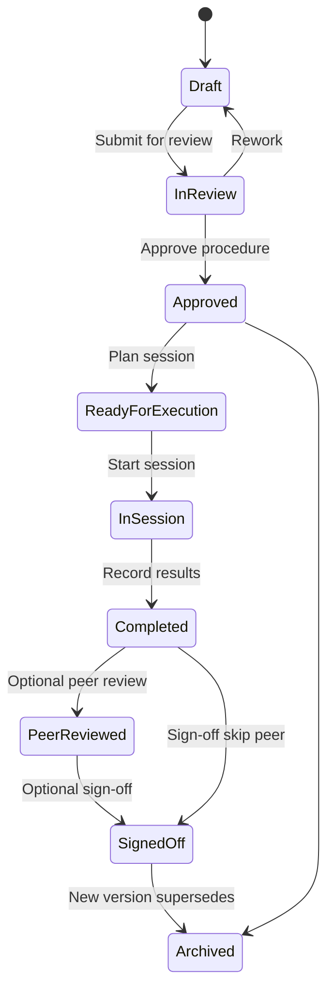
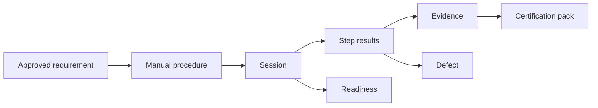

# APZ QEP — Manual Verification (First-Class)

> **Programme:** APZQEP-DEF-002  
> **Constitution:** Manual verification remains fully supported · MVP first-class

## Purpose

Manual Verification enables humans to design, plan, execute, evidence, review, and sign off verification work without depending on automation, CI, or AI. It is a **first-class** product path — not a legacy mode — delivering full lifecycle value from library through certification.

## Business rationale

Many regulated workflows, exploratory domains, and early lifecycle teams rely on human observation. Products that treat manual testing as inferior drive shadow processes and audit gaps. APZ QEP mandates manual parity: same traceability, evidence, readiness, and certification chain as automation.

MVP **must** deliver complete manual verification value without AI or automation prerequisites.

## Core concepts

| Concept              | Product meaning                                |
| -------------------- | ---------------------------------------------- |
| Structured procedure | Steps, expected outcomes, preconditions        |
| Exploratory session  | Charter-driven time-boxed investigation        |
| Checklist            | Lightweight confirmation list                  |
| Human observation    | Qualitative finding as evidence                |
| Verification session | Human-centred execution container              |
| Peer review          | Independent review of session/procedure        |
| Sign-off             | Optional formal session completion attestation |

## Supported manual forms

| Form                       | Description                               |
| -------------------------- | ----------------------------------------- |
| Structured test procedures | Steps, expected outcomes, preconditions   |
| Exploratory sessions       | Charters, time-boxed observation, notes   |
| Checklists                 | Lightweight confirmation lists            |
| Human observations         | Qualitative findings attached as evidence |

## Primary objects

| Object                 | Description                          |
| ---------------------- | ------------------------------------ |
| Verification procedure | Reusable manual specification        |
| Session plan           | Scheduled execution intent           |
| Verification session   | Active or completed human execution  |
| Step result            | Pass / Fail / Blocked / N/A per step |
| Session evidence       | Attachments and observations         |
| Review record          | Peer review outcome                  |
| Sign-off record        | Optional formal closure              |
| Archived version       | Superseded procedure retained        |

## Lifecycle

Product path: Draft → In review → Approved → Ready for execution → In session → Completed → (optional) Peer reviewed / Signed off → Archived version retained.

## Ownership

| Role               | Ownership                              |
| ------------------ | -------------------------------------- |
| QA Engineer        | Procedure design and approval support  |
| Manual Tester      | Session execution and evidence capture |
| Exploratory Tester | Charter sessions                       |
| QA Manager         | Approval and sign-off policy           |
| Peer reviewer      | Independent review when required       |

## Relationships

Manual verification links to Requirements, Evidence, Defects, Traceability, Release Readiness, and Certification — identical chain to automation.

## States

| State               | Meaning                  |
| ------------------- | ------------------------ |
| Draft               | Procedure editing        |
| In review           | Awaiting approval        |
| Approved            | Executable specification |
| Ready for execution | Planned                  |
| In session          | Active execution         |
| Completed           | Results recorded         |
| Peer reviewed       | Independent review done  |
| Signed off          | Formal closure optional  |
| Archived            | Historical version       |

## Manual capabilities (normative)

Structured procedures · Exploratory sessions · Checklists · Human observations · Expected outcomes · Actual outcomes · Pass / Fail / Blocked / Not applicable · Evidence attachment · Comments · Defect creation · Retesting · Peer review · Approval · Sign-off

## Operating modes

| Mode                 | Meaning                                                         |
| -------------------- | --------------------------------------------------------------- |
| Standalone           | Organisation operates entirely on manual verification           |
| Alongside automation | Same requirements verified manually and via ingested automation |
| Hybrid session       | Human executes while referencing automation results             |

## Business rules

| Rule  | Statement                                                               |
| ----- | ----------------------------------------------------------------------- |
| MV-01 | Manual verification is never temporary or inferior in product semantics |
| MV-02 | Automation not required to certify                                      |
| MV-03 | AI observation replacement requires human accept path — AI default OFF  |
| MV-04 | Blocked and N/A dispositions require rationale when policy enabled      |
| MV-05 | Retest links to original session and defect                             |
| MV-06 | Archived procedures retain execution history                            |

## Approval rules

Procedure approval: QA Manager or peer per policy. Session sign-off: Manual Tester + optional QA Manager. Peer review mandatory for regulated tenants on critical procedures optional elsewhere.

## Role responsibilities

| Persona            | Responsibility                           |
| ------------------ | ---------------------------------------- |
| Manual Tester      | Execute sessions; capture evidence       |
| Exploratory Tester | Charter-based sessions                   |
| QA Engineer        | Design procedures; support retest        |
| QA Manager         | Approve procedures; audit quality        |
| Release Manager    | Consumes manual results in readiness     |
| Product Owner      | Prioritises manual coverage for features |

## Reporting

Manual execution progress, session pass rates, exploratory findings summary, peer review backlog, manual coverage by requirement, retest cycle time.

## Search

Search procedures, sessions, charters, step outcomes, testers, and linked requirements. Unified search includes manual and automation with method filter.

## Audit

Session start/stop, result changes (with reason), evidence attach, review, sign-off — immutable audit. Session tamper after sign-off blocked per policy.

## AI considerations

AI default **OFF**. May draft procedure steps or summarise session notes — Draft until QA accepts. AI shall not auto-complete sessions or sign off. Human observation remains authoritative.

## MCP considerations

MCP may propose verification drafts from IDE — enters manual design approval queue. MCP does not execute sessions or sign off on behalf of testers.

## Future evolution

Mobile session capture, richer media evidence, voice notes with transcription (human approved). Manual-first principle unchanged.

## Boundary conditions

| In boundary          | Out of boundary                     |
| -------------------- | ----------------------------------- |
| Session SoR          | Screen recorder product replacement |
| Exploratory charters | Test management ALM                 |
| Manual cert chain    | Device farm execution               |

## Explicit exclusions

- Treating manual as “legacy to remove”
- Requiring automation to certify
- Replacing human observation with AI without accept path

## MVP obligation

MVP **must** deliver: library, design, session execution, evidence, defects, traceability into readiness/certification — **without AI**. Manual path demonstrates full product value on day one.

## Example scenarios

**Scenario 1 — Standalone org:** Entire release verified via structured procedures and checklists; readiness and human cert without any automation ingest.

**Scenario 2 — Exploratory:** Charter session finds usability defect; observation evidence attached; defect linked to requirement; retest session after fix.

**Scenario 3 — Hybrid:** Manual Tester references failed nightly automation in session notes; manual confirmation evidence added for readiness gate.

**Scenario 4 — Regulated peer review:** Critical payment procedure requires peer review before sign-off; audit pack includes reviewer identity.
