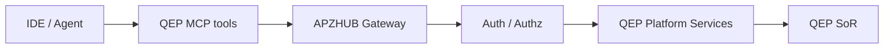
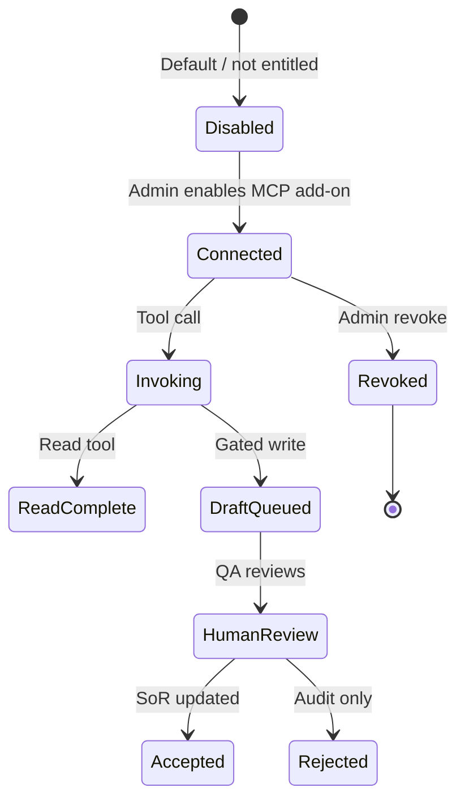

# APZ QEP — MCP Workflows

> **Programme:** APZQEP-DEF-002  
> **IDEs:** Cursor · VS Code · Windsurf · Replit · Kilo · future  
> **Rules:** Authenticated · Authorised · Scoped · Audited · Traceable · Revocable · Human approval where required

## Purpose

MCP Workflows define how developer tools and agents interact with APZ QEP through governed MCP tools — retrieving quality context at the point of work and submitting drafts or evidence references without bypassing product workflows, permissions, or human accountability.

## Business rationale

Developers need requirements, standards, defects, and coverage context inside the IDE. Copy-paste from wikis breaks traceability. Ungoverned agent write access would violate certification and evidence rules. MCP provides a controlled bridge: read widely, write through gates, never auto-certify.

## Core concepts

| Concept        | Product meaning                                   |
| -------------- | ------------------------------------------------- |
| MCP tool       | Named capability exposed via MCP protocol         |
| Scoped session | Auth token bound to tenant, project, role         |
| Read tool      | SoR read without approval                         |
| Gated write    | Draft queue requiring human approval              |
| Tool audit     | Log of invocation, args class, outcome            |
| Revocation     | Admin disables tool or token instantly            |
| IDE agent      | Non-human actor — same rules as AI Agent for cert |

## Interaction model



## Primary objects

| Object            | Description                         |
| ----------------- | ----------------------------------- |
| MCP connection    | Tenant-scoped authenticated binding |
| Tool manifest     | Registered capability metadata      |
| Invocation record | Audit log entry                     |
| Draft submission  | Gated write pending human review    |
| Scope policy      | Project/release/read/write limits   |
| Revocation event  | Admin forced disconnect             |

## Governed capabilities (product)

| Capability                        | Type        | Human approval |
| --------------------------------- | ----------- | -------------- |
| Retrieve approved requirements    | Read        | No             |
| Retrieve verification context     | Read        | No             |
| Retrieve coding/quality standards | Read        | No             |
| Retrieve known defects            | Read        | No             |
| Retrieve release scope            | Read        | No             |
| Retrieve missing coverage         | Read        | No             |
| Retrieve execution results        | Read        | No             |
| Retrieve certification readiness  | Read        | No             |
| Request quality explanations      | Read        | No             |
| Propose verification              | Draft       | Yes before SoR |
| Submit verification drafts        | Gated write | Yes            |
| Submit evidence references        | Gated write | Yes            |

## Lifecycle



## Ownership

| Role                   | Ownership                           |
| ---------------------- | ----------------------------------- |
| Tenant Administrator   | Enable MCP; assign scopes           |
| Security Officer       | Approve MCP in enterprise/regulated |
| QA Engineer            | Review draft submissions from MCP   |
| Developer              | Invokes tools within granted scope  |
| Platform Administrator | Global tool manifest governance     |

## Relationships

MCP reads/writes traverse Verification, Requirements, Evidence (references), Traceability, Readiness (read), Certification (read status only). Aligns with [AI-WORKFLOWS.md](./AI-WORKFLOWS.md) when agent uses both.

```mermaid
flowchart TB
  MCP[MCP tools] --> Req[Requirements read]
  MCP --> Ver[Verification read / draft write]
  MCP --> Ev[Evidence reference write]
  MCP --> QI[Quality explanations read]
  MCP -.x Cert[Certify — forbidden]
  MCP -.x Risk[Risk accept — forbidden]
```

## States

Connection: Disabled → Connected → Revoked. Draft submission: Queued → In review → Accepted / Rejected.

## Forbidden MCP behaviours

Unrestricted database access · Bypass product workflows · Autonomous certification · Privilege escalation · Cross-tenant access · Auto risk acceptance · Modify locked evidence packs · Silent SoR mutation

## Business rules

| Rule   | Statement                                                              |
| ------ | ---------------------------------------------------------------------- |
| MCP-01 | All calls authenticated and authorised                                 |
| MCP-02 | Mutations use draft/gated paths except audited admin APIs (not MCP)    |
| MCP-03 | Every invocation audited with correlation ID                           |
| MCP-04 | Cross-tenant access forbidden                                          |
| MCP-05 | Certification and risk acceptance require human in product UI/workflow |
| MCP-06 | MCP entitlement typically Enterprise add-on                            |
| MCP-07 | Read tools still permission-filtered                                   |

## Approval rules

Draft verification and evidence references: QA Engineer or QA Manager accept per Verification/Evidence models. MCP cannot approve on behalf of named human. Security Officer approves MCP enablement for regulated tenants.

## Role responsibilities

| Persona              | Responsibility                                |
| -------------------- | --------------------------------------------- |
| Developer            | Uses read tools; submits drafts appropriately |
| QA Engineer          | Reviews MCP-originated drafts                 |
| Tenant Administrator | Scope and revoke connections                  |
| Security Officer     | MCP risk assessment                           |
| AI Agent             | Same prohibitions — no cert                   |
| Release Manager      | Not primary MCP actor; cert stays in product  |

## Reporting

MCP usage dashboard (admin): invocations by tool, draft accept rate, rejected drafts, revoked tokens, anomalous volume alerts.

## Search

Admin search invocation audit by user, tool, project, date. Developers search SoR via MCP read tools — not separate index.

## Audit

Full tool audit trail: actor, tool, scope, outcome, draft ID linkage, IP/device class (product intent). Revocation events immediate effect logged.

## AI considerations

IDE agents combining MCP + AI still subject to AI-WORKFLOWS human gates for SoR. AI narrative from MCP read tools is informational. Default AI OFF at tenant; MCP may work without AI.

## MCP considerations

Self-referential: this document defines MCP product behaviour. Manifest registration via Extensibility; air-gapped deployments may limit connectivity per Deployment Model.

## Future evolution

Additional read tools (knowledge base), batch draft import with mandatory review queue, org-specific tool allowlists. Forbidden behaviours list may expand; cert invariant permanent.

## Boundary conditions

| In boundary           | Out of boundary                         |
| --------------------- | --------------------------------------- |
| Governed MCP tools    | Raw SQL MCP                             |
| Draft write queue     | Direct cert API                         |
| IDE context retrieval | IDE plugin marketplace (implementation) |

## Workflow: MCP-originated verification proposal

| Step | Actor                                          | Outcome                                 |
| ---- | ---------------------------------------------- | --------------------------------------- |
| 1    | Developer/Agent retrieves requirements via MCP | Context loaded                          |
| 2    | Agent proposes verification draft              | Draft in approval queue                 |
| 3    | QA Engineer reviews in QEP                     | Accept/edit/reject                      |
| 4    | On accept                                      | Verification enters Library/Design path |
| 5    | Audit                                          | Tool calls + decision recorded          |

## Example scenarios

**Scenario 1 — Context pull:** Developer retrieves approved requirements and open defects before coding; no writes; audit logs read volume only.

**Scenario 2 — Draft proposal:** Agent submits verification draft via MCP; QA edits step 3; Accept → Library; rejections audited.

**Scenario 3 — Evidence reference:** Developer attaches test log reference from IDE; Evidence Draft until QA approves for pack use.

**Scenario 4 — Revocation:** Security revokes compromised token; in-flight drafts remain Queued; no new invocations.

**Scenario 5 — Regulated:** MCP enabled read-only; gated writes disabled by policy — drafts must enter via QEP UI only.

**Scenario 6 — Forbidden path blocked:** Agent attempts cert approve via tool — rejected; audit flags violation attempt.
