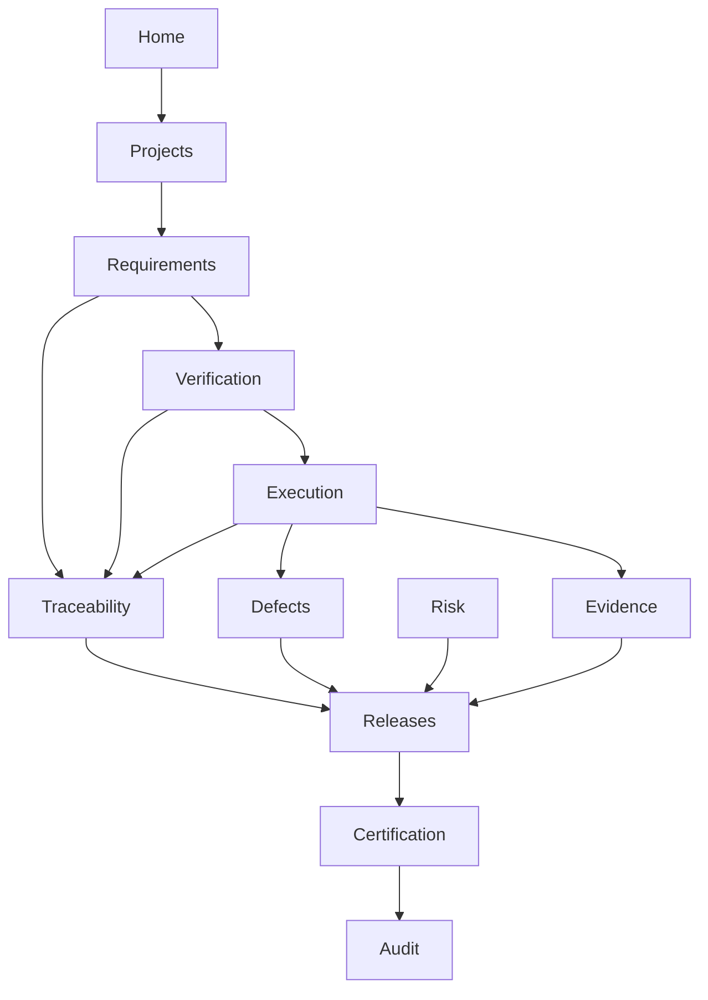

# APZ QEP — Navigation Map

> **Programme:** APZQEP-DEF-002  
> **Rule:** Product navigation hierarchy — no visual mock-ups  
> **Preserved from DEF-001:** Global nav item set, navigation types, core flow diagram

## Navigation model overview

QEP navigation registers into the APZHUB shell: **Activity Bar → Sidebar → Workspace → Context panel**. All navigation is **permission-filtered** at render time — hidden items are omitted, not disabled teases. The product provides **global module access**, **project/release scoping**, **object-level detail**, and **cross-links** that preserve context.

Central outcome navigation path: **Home → Project → Requirements → Verification → Execution → Evidence/Defects → Traceability → Release → Certification**.

---

## Global navigation areas

Each area below maps to one or more modules in [PRODUCT-MODULES.md](./PRODUCT-MODULES.md) and [MODULE-CATALOGUE.md](./MODULE-CATALOGUE.md).

---

### Home

| Attribute               | Definition                                                                                          |
| ----------------------- | --------------------------------------------------------------------------------------------------- |
| **Purpose**             | Role-aware command centre — situational awareness, assigned work, approvals, alerts, quick actions. |
| **Visible roles**       | All authenticated users (widget set varies by workspace).                                           |
| **Entry points**        | Default landing; Activity Bar “Home”; post-login redirect; notification deep links to work items.   |
| **Primary tasks**       | Open assigned sessions; process approval queue; review readiness/cert alerts; acknowledge risks.    |
| **Secondary tasks**     | Pin saved views; customise widget layout; jump to recent project/release.                           |
| **Related modules**     | M01 Home; M22 Search; all modules via widgets and deep links.                                       |
| **Breadcrumbs**         | Home (root).                                                                                        |
| **Cross-navigation**    | One-click to Execution, Certification queue, Defects, Release hub from widgets.                     |
| **Search integration**  | Prominent global search entry; search results open in target module with context.                   |
| **Favourite support**   | Pin saved views and favourite projects/releases on Home.                                            |
| **Recent item support** | Recent projects, releases, sessions, and approvals panel.                                           |

---

### Portfolio

| Attribute               | Definition                                                                               |
| ----------------------- | ---------------------------------------------------------------------------------------- |
| **Purpose**             | Executive and multi-project view of quality posture across products and organisations.   |
| **Visible roles**       | Executive, Product Owner, QA Manager, Project Manager, Tenant Admin (read scope varies). |
| **Entry points**        | Activity Bar “Portfolio”; Home portfolio widget drill-down.                              |
| **Primary tasks**       | Compare project quality status; identify at-risk releases; open project context.         |
| **Secondary tasks**     | Filter by organisation/product; export portfolio summary reports.                        |
| **Related modules**     | M02 Portfolio and Projects; M15 Reporting; M14 Quality Intelligence (when entitled).     |
| **Breadcrumbs**         | Home → Portfolio.                                                                        |
| **Cross-navigation**    | Drill to Projects, Releases, Certification status, Analytics.                            |
| **Search integration**  | Search projects/products within portfolio scope.                                         |
| **Favourite support**   | Favourite portfolio filters and saved portfolio views.                                   |
| **Recent item support** | Recently viewed projects in portfolio context.                                           |

---

### Projects

| Attribute               | Definition                                                                                                     |
| ----------------------- | -------------------------------------------------------------------------------------------------------------- |
| **Purpose**             | Governed **quality context** — project setup, applications, environments, teams, quality profile.              |
| **Visible roles**       | PO, PM, QA Manager, QA Engineer, Developer (read), Admin.                                                      |
| **Entry points**        | Activity Bar “Projects”; Portfolio drill-down; project switcher in shell.                                      |
| **Primary tasks**       | Create/open project; assign owners; link external ALM reference; view quality profile.                         |
| **Secondary tasks**     | Manage environments/teams; archive project; configure project-level integrations display.                      |
| **Related modules**     | M02 Portfolio and Projects; entry to all project-scoped modules.                                               |
| **Breadcrumbs**         | Home → Portfolio (optional) → Projects → {Project name}.                                                       |
| **Cross-navigation**    | Project sidebar unlocks Requirements, Verification, Execution, etc.; switch project preserves module if valid. |
| **Search integration**  | Project-scoped search default when inside project.                                                             |
| **Favourite support**   | Favourite projects appear in switcher and Home.                                                                |
| **Recent item support** | Recent projects in switcher; last project restored on return.                                                  |

---

### Requirements

| Attribute               | Definition                                                                            |
| ----------------------- | ------------------------------------------------------------------------------------- |
| **Purpose**             | Author, review, approve, and maintain requirements and acceptance criteria.           |
| **Visible roles**       | BA, PO, QA (read/design link), PM (read), Customer (shared read if entitled).         |
| **Entry points**        | Activity Bar “Requirements”; project sidebar; traceability links; search.             |
| **Primary tasks**       | Create/edit requirements; submit for approval; approve/reject; link to verifications. |
| **Secondary tasks**     | Hierarchy browse; change impact view; import/reference external reqs.                 |
| **Related modules**     | M03 Requirements; M10 Traceability; M12 Release Readiness (scope).                    |
| **Breadcrumbs**         | Home → Projects → {Project} → Requirements → {Requirement}.                           |
| **Cross-navigation**    | Open linked verifications, defects, traceability graph, release scope.                |
| **Search integration**  | Full-text and facet search; high-priority global object type.                         |
| **Favourite support**   | Favourite requirements and saved filters.                                             |
| **Recent item support** | Recently edited/viewed requirements.                                                  |

---

### Verification

| Attribute               | Definition                                                                                       |
| ----------------------- | ------------------------------------------------------------------------------------------------ |
| **Purpose**             | **Library + Design** — reusable procedures, templates, suites, and design workflow.              |
| **Visible roles**       | QA Manager, QA Engineer, Automation Engineer (promotion read), BA (read).                        |
| **Entry points**        | Activity Bar “Verification”; project sidebar; requirement “verified by” links.                   |
| **Primary tasks**       | Author/review verifications; manage templates/suites; approve designs; plan coverage.            |
| **Secondary tasks**     | Reuse from library; peer review queue; link automation candidates.                               |
| **Related modules**     | M04 Verification Library; M05 Verification Design; M07 Automation (promotion); M10 Traceability. |
| **Breadcrumbs**         | Home → Projects → {Project} → Verification → [Library \| Design \| Suites] → {Object}.           |
| **Cross-navigation**    | To Execution planning, Traceability, Knowledge, Automation promotion.                            |
| **Search integration**  | Search verifications, templates, suites globally and in-project.                                 |
| **Favourite support**   | Favourite suites and frequently used templates.                                                  |
| **Recent item support** | Recent designs and library items.                                                                |

---

### Execution

| Attribute               | Definition                                                                              |
| ----------------------- | --------------------------------------------------------------------------------------- |
| **Purpose**             | Plan and **run** verification — manual sessions, runs, results, assign work.            |
| **Visible roles**       | Manual Tester, QA Engineer, Automation Engineer, QA Manager, Developer (read assigned). |
| **Entry points**        | Activity Bar “Execution”; Home assigned sessions; run links from Release hub.           |
| **Primary tasks**       | Execute manual sessions; monitor runs; record results; assign/reassign work.            |
| **Secondary tasks**     | Pause/resume sessions; batch run planning; retest triggers.                             |
| **Related modules**     | M06 Execution and Sessions; M07 Automation; M09 Evidence; M08 Defects.                  |
| **Breadcrumbs**         | Home → Projects → {Project} → Execution → [Runs \| Sessions] → {Object}.                |
| **Cross-navigation**    | Raise defect; attach evidence; open verification design; link to release progress.      |
| **Search integration**  | Search runs/sessions by id, assignee, release, status.                                  |
| **Favourite support**   | Pin “My sessions” and team run views.                                                   |
| **Recent item support** | Recent sessions and runs; resume in-progress session.                                   |

---

### Defects

| Attribute               | Definition                                                                       |
| ----------------------- | -------------------------------------------------------------------------------- |
| **Purpose**             | Track defects and quality issues — triage, assign, retest, release impact.       |
| **Visible roles**       | QA, Developer, PM (read), Support (read), PO (read).                             |
| **Entry points**        | Activity Bar “Defects”; session fail path; Home defect widget; integration sync. |
| **Primary tasks**       | Create/triage defects; assign developers; track retest; close with evidence.     |
| **Secondary tasks**     | Convert quality issue; link external tracker; severity/ release impact.          |
| **Related modules**     | M08 Defects; M06 Execution; M10 Traceability; M12 Release Readiness.             |
| **Breadcrumbs**         | Home → Projects → {Project} → Defects → {Defect}.                                |
| **Cross-navigation**    | To requirement, verification, session result, evidence, release gate impact.     |
| **Search integration**  | Primary search type; facets severity, status, assignee, release.                 |
| **Favourite support**   | Saved filters (e.g. “My assigned”, “Critical open”).                             |
| **Recent item support** | Recently viewed/edited defects.                                                  |

---

### Evidence

| Attribute               | Definition                                                                   |
| ----------------------- | ---------------------------------------------------------------------------- |
| **Purpose**             | Browse, organise, and validate **evidence artefacts** and packs.             |
| **Visible roles**       | QA, Release Manager, Auditor, Certifier (read); Tester (attach via session). |
| **Entry points**        | Activity Bar “Evidence”; session attach; certification pack; audit drill.    |
| **Primary tasks**       | View/link evidence; curate packs; validate completeness for release.         |
| **Secondary tasks**     | Export pack views; review locked cert evidence (read-only).                  |
| **Related modules**     | M09 Evidence; M06 Execution; M13 Certification; M21 Audit.                   |
| **Breadcrumbs**         | Home → Projects → {Project} → Evidence → [Items \| Packs] → {Object}.        |
| **Cross-navigation**    | To source session/result, certification, readiness gap list.                 |
| **Search integration**  | Search by metadata, linked object, pack membership.                          |
| **Favourite support**   | Favourite packs for release managers.                                        |
| **Recent item support** | Recently attached/viewed evidence.                                           |

---

### Traceability

| Attribute               | Definition                                                                         |
| ----------------------- | ---------------------------------------------------------------------------------- |
| **Purpose**             | Visual and tabular **req → verify → run → result → defect** confidence graph.      |
| **Visible roles**       | BA, QA, PO, PM, Release Manager, Auditor (read).                                   |
| **Entry points**        | Activity Bar “Traceability”; requirement/verification related panels; Release hub. |
| **Primary tasks**       | Analyse coverage gaps; navigate dependency chain; export trace views.              |
| **Secondary tasks**     | Filter by release; impact analysis for requirement changes.                        |
| **Related modules**     | M10 Traceability; M03, M04, M05, M06, M08.                                         |
| **Breadcrumbs**         | Home → Projects → {Project} → Traceability → [Graph \| Matrix] → {Focus object}.   |
| **Cross-navigation**    | Any graph node opens native object detail in owning module.                        |
| **Search integration**  | Focus object via search lands in graph context when supported.                     |
| **Favourite support**   | Saved trace views and release-scoped matrices.                                     |
| **Recent item support** | Recent trace focus objects.                                                        |

---

### Risk

| Attribute               | Definition                                                                     |
| ----------------------- | ------------------------------------------------------------------------------ |
| **Purpose**             | Identify, assess, mitigate, and accept **risks** affecting release confidence. |
| **Visible roles**       | QA Manager, Release Manager, Security Officer, Executive (summary read).       |
| **Entry points**        | Activity Bar “Risk”; Release hub panel; Home risk highlights.                  |
| **Primary tasks**       | Register/assess risks; link mitigations; accept/escalate; feed readiness.      |
| **Secondary tasks**     | Link waivers; historical risk review; executive roll-up.                       |
| **Related modules**     | M11 Risk Management; M12 Release Readiness; M13 Certification.                 |
| **Breadcrumbs**         | Home → Projects → {Project} → Risk → {Risk}.                                   |
| **Cross-navigation**    | To release readiness, waivers, defects, certification review.                  |
| **Search integration**  | Search risks by rating, release, owner.                                        |
| **Favourite support**   | Saved risk register views.                                                     |
| **Recent item support** | Recently updated risks.                                                        |

---

### Releases

| Attribute               | Definition                                                                          |
| ----------------------- | ----------------------------------------------------------------------------------- |
| **Purpose**             | **Release hub** — scope, build inclusion, readiness, gates, waivers, cert handoff.  |
| **Visible roles**       | Release Manager, PO, QA Manager, PM, Executive (read), Developer (read scope).      |
| **Entry points**        | Activity Bar “Releases”; Home readiness widget; project release list.               |
| **Primary tasks**       | Define release scope; evaluate readiness; resolve gate gaps; request certification. |
| **Secondary tasks**     | Compare releases; manage waivers; track build inclusion.                            |
| **Related modules**     | M12 Release Readiness; M13 Certification; M09 Evidence; M08 Defects; M11 Risk.      |
| **Breadcrumbs**         | Home → Projects → {Project} → Releases → {Release} → [Scope \| Readiness \| Gates]. |
| **Cross-navigation**    | To Certification, Evidence packs, Traceability matrix, Execution progress.          |
| **Search integration**  | Search releases by name, version, status.                                           |
| **Favourite support**   | Favourite active releases; pin release hub for Release workspace.                   |
| **Recent item support** | Recent releases; restore last release context in Release workspace.                 |

---

### Certification

| Attribute               | Definition                                                                                       |
| ----------------------- | ------------------------------------------------------------------------------------------------ |
| **Purpose**             | Human **certification decision** — pack review, approve/reject/qualifications, immutable record. |
| **Visible roles**       | Release Manager (certifier), co-approvers, Auditor/Executive (read), QA (supporting read).       |
| **Entry points**        | Activity Bar “Certification”; Release hub “Request cert”; Home cert queue.                       |
| **Primary tasks**       | Review evidence pack; record certification decision; view locked history.                        |
| **Secondary tasks**     | Respond to continuous signals (re-request); export cert statement.                               |
| **Related modules**     | M13 Certification; M12 Release Readiness; M09 Evidence; M21 Audit.                               |
| **Breadcrumbs**         | Home → Projects → {Project} → Releases → {Release} → Certification → {Cert record}.              |
| **Cross-navigation**    | To evidence pack, readiness explanation, audit history, related approvals.                       |
| **Search integration**  | Search certifications by outcome, date, release.                                                 |
| **Favourite support**   | Certifier queue saved as favourite view.                                                         |
| **Recent item support** | Recent certification reviews for certifier role.                                                 |

---

### Intelligence

| Attribute               | Definition                                                                                               |
| ----------------------- | -------------------------------------------------------------------------------------------------------- |
| **Purpose**             | **Quality Intelligence** — explainable signals, drift, patterns (Phase 2+ when entitled; AI may be OFF). |
| **Visible roles**       | QA Manager, Release Manager, Executive, QA Engineer (read).                                              |
| **Entry points**        | Activity Bar “Intelligence”; Home insight widgets when entitled.                                         |
| **Primary tasks**       | Review quality signals; explore trends; drill to root objects.                                           |
| **Secondary tasks**     | Acknowledge signals; escalate to cert re-request.                                                        |
| **Related modules**     | M14 Quality Intelligence; M12, M13; M07 Automation (flaky).                                              |
| **Breadcrumbs**         | Home → Intelligence → [Dashboard \| Signals] → {Detail}.                                                 |
| **Cross-navigation**    | To Certification signals, Automation health, Analytics reports.                                          |
| **Search integration**  | Search signals and insight topics (metadata).                                                            |
| **Favourite support**   | Saved intelligence dashboards.                                                                           |
| **Recent item support** | Recent signal investigations.                                                                            |

---

### Analytics

| Attribute               | Definition                                                                      |
| ----------------------- | ------------------------------------------------------------------------------- |
| **Purpose**             | **Reporting and Analytics** — KPIs, trends, compliance and executive reports.   |
| **Visible roles**       | Executive, QA Manager, Release Manager, Compliance, PO (scoped reports).        |
| **Entry points**        | Activity Bar “Analytics”; Portfolio/Release drill-down; scheduled report links. |
| **Primary tasks**       | Run standard reports; build filtered views; export/share per policy.            |
| **Secondary tasks**     | Schedule digests; compare periods; drill to source objects.                     |
| **Related modules**     | M15 Reporting and Analytics; all data-producing modules.                        |
| **Breadcrumbs**         | Home → Analytics → {Report category} → {Report/view}.                           |
| **Cross-navigation**    | Drill-through to Projects, Releases, Defects, Certification history.            |
| **Search integration**  | Search report catalogue and saved reports.                                      |
| **Favourite support**   | Favourite reports and dashboards.                                               |
| **Recent item support** | Recently run reports.                                                           |

---

### Knowledge

| Attribute               | Definition                                                                           |
| ----------------------- | ------------------------------------------------------------------------------------ |
| **Purpose**             | **Knowledge and Learning** — reusable patterns, workarounds, learning from releases. |
| **Visible roles**       | QA Manager, QA Engineer, Manual/Exploratory Tester, Support, BA.                     |
| **Entry points**        | Activity Bar “Knowledge”; contextual links from Design/Defects/Execution.            |
| **Primary tasks**       | Publish/search knowledge items; link to verifications and defects.                   |
| **Secondary tasks**     | Review stale knowledge; charter templates for exploratory work.                      |
| **Related modules**     | M16 Knowledge and Learning; M05 Design; M08 Defects.                                 |
| **Breadcrumbs**         | Home → Knowledge → {Category} → {Item}.                                              |
| **Cross-navigation**    | To linked verifications, requirements, templates.                                    |
| **Search integration**  | Primary Knowledge search; contextual suggestions in Design.                          |
| **Favourite support**   | Favourite articles and team boards.                                                  |
| **Recent item support** | Recently viewed knowledge items.                                                     |

---

### AI Workspace

| Attribute               | Definition                                                                                                |
| ----------------------- | --------------------------------------------------------------------------------------------------------- |
| **Purpose**             | **AI Quality Workspace** — governed assistive sessions, prompts, recommendations (Phase 2+; default OFF). |
| **Visible roles**       | Entitled QA, BA, Developer (policy-scoped); not available when AI OFF.                                    |
| **Entry points**        | Activity Bar “AI Workspace” (hidden when disabled); inline AI entry points in Design/Requirements.        |
| **Primary tasks**       | Run AI sessions; accept/reject recommendations; use published prompts.                                    |
| **Secondary tasks**     | Review AI session history; provide feedback on suggestions.                                               |
| **Related modules**     | M17 AI Quality Workspace; M18 MCP; M05, M03.                                                              |
| **Breadcrumbs**         | Home → AI Workspace → {Session}.                                                                          |
| **Cross-navigation**    | Accepted suggestions open target object in native module.                                                 |
| **Search integration**  | Search prompts and session titles (user scope).                                                           |
| **Favourite support**   | Favourite prompts.                                                                                        |
| **Recent item support** | Recent AI sessions.                                                                                       |

---

### Integrations

| Attribute               | Definition                                                                                     |
| ----------------------- | ---------------------------------------------------------------------------------------------- |
| **Purpose**             | **Integration Centre** — connector health, configuration, sync status (not pipeline CI admin). |
| **Visible roles**       | Integrator, Operations Engineer, Tenant Admin, Automation Engineer.                            |
| **Entry points**        | Activity Bar “Integrations”; Home degradation alert; Administration cross-link.                |
| **Primary tasks**       | Configure connectors; monitor health; troubleshoot sync failures.                              |
| **Secondary tasks**     | Map external projects; review ingestion logs; disable broken integration.                      |
| **Related modules**     | M19 Integration Centre; M07 Automation; M18 MCP.                                               |
| **Breadcrumbs**         | Home → Integrations → {Connector} → {Detail}.                                                  |
| **Cross-navigation**    | To affected builds, defects, automation ingest views.                                          |
| **Search integration**  | Search connectors by name/type.                                                                |
| **Favourite support**   | Pin critical connector dashboards for ops.                                                     |
| **Recent item support** | Recently viewed connector incidents.                                                           |

---

### Administration

| Attribute               | Definition                                                                                  |
| ----------------------- | ------------------------------------------------------------------------------------------- |
| **Purpose**             | Tenant/platform **policy and identity** — users, roles, entitlements, retention, AI policy. |
| **Visible roles**       | Tenant Admin, Platform Admin, Security Officer (subset), Compliance (policy read).          |
| **Entry points**        | Activity Bar “Administration”; blocked-action “contact admin” links.                        |
| **Primary tasks**       | Manage users/roles; configure policies; entitlements; org structure.                        |
| **Secondary tasks**     | AI/MCP enablement; retention; integration credentials refs.                                 |
| **Related modules**     | M20 Administration; M19; M21 (policy overlap).                                              |
| **Breadcrumbs**         | Home → Administration → {Area} → {Object}.                                                  |
| **Cross-navigation**    | To Audit for verification of changes; Integrations for connector ownership.                 |
| **Search integration**  | Admin search for users, roles, policies.                                                    |
| **Favourite support**   | Admin saved tasks (e.g. pending user reviews).                                              |
| **Recent item support** | Recent admin changes (admin-only).                                                          |

---

### Audit

| Attribute               | Definition                                                                          |
| ----------------------- | ----------------------------------------------------------------------------------- |
| **Purpose**             | **Audit and Compliance** — investigate immutable activity; export compliance packs. |
| **Visible roles**       | Auditor, Compliance Officer, Security Officer, Tenant Admin (scoped).               |
| **Entry points**        | Activity Bar “Audit”; object History tab; Certification/Audit cross-links.          |
| **Primary tasks**       | Search/filter audit events; investigate certification chain; export.                |
| **Secondary tasks**     | SoD reports; retention verification; correlate by user/object/time.                 |
| **Related modules**     | M21 Audit and Compliance; M13 Certification; M20 Administration.                    |
| **Breadcrumbs**         | Home → Audit → [Search \| Export] → {Event detail}.                                 |
| **Cross-navigation**    | To source objects, evidence locks, certification records.                           |
| **Search integration**  | Primary audit search — rich filters, not generic global search only.                |
| **Favourite support**   | Saved investigation queries.                                                        |
| **Recent item support** | Recent investigations (auditor session).                                            |

---

## Navigation types

### Global

Product-wide module access via Activity Bar. Items omitted when user lacks permission or module not entitled (AI, Intelligence). Order stable across workspaces.

### Role-aware

Primary workspace reorders sidebar emphasis and Home widgets — e.g. Release workspace pins Releases and Certification near top; Manual Testing pins Execution. Does not grant permissions.

### Project

Entering a project scopes sidebar modules and search defaults to `{Project}`. Project switcher always visible in quality modules. Breadcrumbs include project name.

### Release

Active release context adds **Release hub** sub-nav: Scope, Readiness, Gates, Waivers, Certification handoff. May overlay project sidebar when release spans single project or multi-project per policy.

### Contextual

In-context links — requirement → verifications → runs — preserve focus object in context panel and breadcrumbs. Traceability graph is the canonical contextual navigator.

### Object-level

Detail pages for requirements, verifications, sessions, defects, etc. share pattern: header (status, owner, actions), tabs (detail, related, history), context panel (traceability, evidence).

### Admin

Separate subtree under Administration — visually distinct from quality execution to prevent mistaken policy edits during testing.

### Search

Global search (M22) reachable from shell; contextual search in module lists. Landing from search opens object detail with full breadcrumb trail computed from object graph.

### Saved workspace

Users save filtered views, dashboard layouts, and pinned objects as **saved workspaces** components — personal, not shared unless policy adds team views later.

### Mobile principles

Mobile channel is **read-mostly**: Home status, approval/cert decision (where policy allows), defect/session summary, audit read. Full manual session execution remains desktop-first; tablet acceptable for review/approve per [USER-EXPERIENCE.md](./USER-EXPERIENCE.md).

---

## Global navigation index

| Nav item       | Destination module area                    |
| -------------- | ------------------------------------------ |
| Home           | Home and Command Centre                    |
| Portfolio      | Portfolio and Projects                     |
| Projects       | Project contexts                           |
| Requirements   | Requirements                               |
| Verification   | Library + Design                           |
| Execution      | Execution and Sessions                     |
| Defects        | Defects                                    |
| Evidence       | Evidence                                   |
| Traceability   | Traceability                               |
| Risk           | Risk Management                            |
| Releases       | Release Readiness                          |
| Certification  | Certification                              |
| Intelligence   | Quality Intelligence                       |
| Analytics      | Reporting and Analytics                    |
| Knowledge      | Knowledge and Learning                     |
| AI Workspace   | AI Quality Workspace (if entitled/enabled) |
| Integrations   | Integration Centre                         |
| Administration | Administration                             |
| Audit          | Audit and Compliance                       |

---

## Primary quality flow

## Cross-cutting navigation services

| Service                     | Role in navigation                            |
| --------------------------- | --------------------------------------------- |
| Search and Navigation (M22) | Global entry, recents, favourites registry    |
| Notifications (Platform)    | Deep links into area-specific action surfaces |
| Permission Service          | Filters all nav items and search results      |
| Home (M01)                  | Aggregates entry points to all areas          |

## Related documents

| Document                                                     | Relationship                                       |
| ------------------------------------------------------------ | -------------------------------------------------- |
| [USER-EXPERIENCE.md](./USER-EXPERIENCE.md)                   | Navigation consistency and search-first philosophy |
| [ROLE-WORKSPACES.md](./ROLE-WORKSPACES.md)                   | Role-aware emphasis                                |
| [PRODUCT-MODULES.md](./PRODUCT-MODULES.md)                   | Module to area mapping                             |
| [INFORMATION-ARCHITECTURE.md](./INFORMATION-ARCHITECTURE.md) | Object-level navigation meaning                    |
