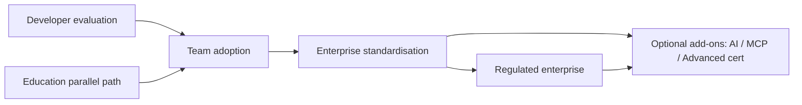
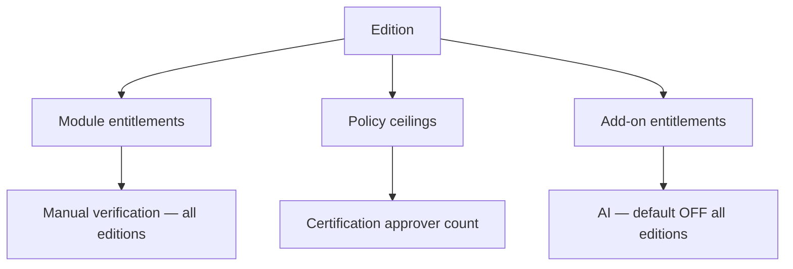

# APZ QEP — Product Editions

> **Programme:** APZQEP-DEF-002  
> **Rule:** Product packaging — not infrastructure architecture

## Purpose

Product Editions define how APZ QEP capabilities are packaged for different customer segments — from individual developers evaluating the platform to regulated enterprises requiring strict retention, multi-approver certification, and compliance-oriented workflows. Editions express **what the product offers**, not how infrastructure is deployed.

## Business rationale

A single undifferentiated SKU either overwhelms small teams or under-serves enterprises. Edition packaging aligns capability depth with buyer expectations, sales motion, and operational responsibility while preserving a consistent product identity and upgrade path. Clear edition boundaries reduce shelfware and prevent unsupported feature combinations in contracts.

Editions also enforce Constitution-aligned defaults: AI off until entitled, human certification, manual verification first-class at every tier.

## Core concepts

| Concept         | Product meaning                                        |
| --------------- | ------------------------------------------------------ |
| Edition         | Named capability bundle and policy ceiling             |
| Entitlement     | Licensed right to use edition features                 |
| Upgrade path    | Supported migration between editions                   |
| Limitation      | Explicit excluded or capped capability                 |
| Add-on          | Capability outside base edition (e.g. AI, advanced QI) |
| Education terms | Non-production restrictions for academic use           |

## Primary objects

| Object             | Description                                     |
| ------------------ | ----------------------------------------------- |
| Edition definition | Marketing and product contract for a SKU family |
| Entitlement record | Tenant binding to edition and add-ons           |
| Feature matrix     | Edition × capability mapping                    |
| Limitation policy  | Scale, approver count, retention defaults       |
| Upgrade request    | Commercial/operational path to higher edition   |

## Edition catalogue

| Edition                  | Target customer                    | Included (intent)                                                                               | Limitations (intent)                                                       |
| ------------------------ | ---------------------------------- | ----------------------------------------------------------------------------------------------- | -------------------------------------------------------------------------- |
| **Developer**            | Individual / dev teams evaluating  | Core manual lifecycle subset; single project emphasis; basic traceability; basic readiness view | Limited scale; single approver patterns; AI OFF; no advanced cert policies |
| **Team**                 | Small / mid teams                  | Multi-project; manual + automation ingest foundation; dashboards; team RBAC                     | Advanced cert multi-approver limited; regulated retention packs reduced    |
| **Enterprise**           | Large organisations                | Full RBAC; retention; cert multi-approver; integrations breadth; advanced QI                    | AI still OFF until entitled + authorised                                   |
| **Regulated enterprise** | Audit-heavy / regulated industries | Enterprise + stronger retention, legal hold, compliance packs, export controls                  | Higher operational expectations on customer                                |
| **Education**            | Training / academic institutions   | Team-like capabilities with education licensing terms                                           | Non-production entitlements; support tier limited                          |

## Lifecycle

Customer data ownership remains with customer/tenant under self-hosted and contracted cloud terms across all editions. Edition change does not erase audit history.

## Ownership

| Role                 | Ownership                                             |
| -------------------- | ----------------------------------------------------- |
| Product Owner (APZ)  | Edition definition and matrix                         |
| Tenant Administrator | Assigns users to edition entitlements within contract |
| Commercial / Owner   | Pricing and SKU authorisation — outside this document |
| Compliance Officer   | Validates Regulated edition policy fit                |

## Relationships

Editions gate modules and policies documented across Verification, Certification, Evidence, QI, AI, MCP, and Extensibility. Deployment model (Self-hosted, Private cloud, etc.) is orthogonal — any edition may be offered in permitted deployment modes per commercial packaging.

## States

| State                | Meaning                                                |
| -------------------- | ------------------------------------------------------ |
| Active entitlement   | Tenant within contract using edition                   |
| Trial / evaluation   | Developer or time-boxed Team trial                     |
| Grace                | Contract lapsed; read-only policy per commercial rules |
| Suspended            | Admin or compliance suspension                         |
| Upgraded             | Higher edition replaces prior entitlement              |
| Education restricted | Non-production enforcement                             |

## Business rules

| Rule  | Statement                                                                          |
| ----- | ---------------------------------------------------------------------------------- |
| ED-01 | Manual verification is first-class in every edition including Developer            |
| ED-02 | AI default OFF in all editions until add-on + tenant authorisation                 |
| ED-03 | No edition permits autonomous certification                                        |
| ED-04 | Upgrade preserves SoR history and audit immutability                               |
| ED-05 | Education edition shall not be used for production certification per terms         |
| ED-06 | Regulated enterprise requires compliance pack entitlements for legal hold features |
| ED-07 | Developer edition limits do not imply manual verification is deprecated            |

## Approval rules

Edition changes are commercial/tenant-admin operations — not end-user workflow approvals. Internal feature flags for beta capabilities require Owner authorisation outside standard edition matrix.

Regulated edition activation may require Compliance Officer acknowledgment on tenant onboarding checklist.

## Role responsibilities

| Persona                | Responsibility                                    |
| ---------------------- | ------------------------------------------------- |
| Tenant Administrator   | Maps users and projects to edition limits         |
| Platform Administrator | Provisions entitlement records                    |
| Compliance Officer     | Confirms Regulated edition policies enabled       |
| Release Manager        | Uses cert features available in edition           |
| Integrator             | Builds to lowest edition APIs when targeting Team |

## Reporting

Edition usage reports (admin): active users, project count vs limit, automation ingest volume, AI usage if entitled. Not exposed to standard testers. Supports commercial true-up and compliance attestation.

## Search

Edition metadata visible in Administration workspace only. Standard users do not search edition SKUs in daily workflows.

## Audit

Entitlement changes, edition upgrades, add-on activations, and education restriction violations are audited. AI add-on enablement requires explicit audit entry with authoriser.

## AI considerations

All editions: AI **default OFF**. Enterprise and Regulated may purchase AI add-on; enablement still requires tenant configuration and governance policies. Developer and Education: AI typically unavailable or strictly capped per commercial decision.

## MCP considerations

MCP availability gated by edition and add-on (Enterprise+ typical). Developer edition may offer read-only MCP for evaluation. No edition grants MCP bypass of certification or risk acceptance.

## Future evolution

Potential future editions or add-ons: industry packs (medical device, automotive), partner white-label SKUs, and consumption-based automation tiers. Core five editions remain the baseline naming through APZQEP-DEF-002.

## Boundary conditions

| In boundary                    | Out of boundary                     |
| ------------------------------ | ----------------------------------- |
| Capability packaging           | Infrastructure sizing guides        |
| Entitlement limits             | Cloud region architecture           |
| Upgrade path definition        | Migration runbooks (implementation) |
| Education non-production terms | Academic pricing tables             |

This document does not specify prices — Owner commercial decision.

## Example scenarios

**Scenario 1 — Startup:** Team of eight on **Team** edition runs manual-first verification with CI ingest. Multi-approver cert limited to two approvers — sufficient for their policy.

**Scenario 2 — Enterprise rollout:** Global bank on **Enterprise** with AI add-off (disabled pending security review). Enables MCP for IDE integration after security sign-off. **Regulated** features deferred until compliance pack purchased.

**Scenario 3 — Classroom:** University uses **Education** edition for training labs. Production release certification blocked by entitlement; students experience full manual lifecycle.

**Scenario 4 — Solo developer:** **Developer** edition evaluates QEP on single project; upgrades to Team when second product line added — history migrates without traceability loss.
