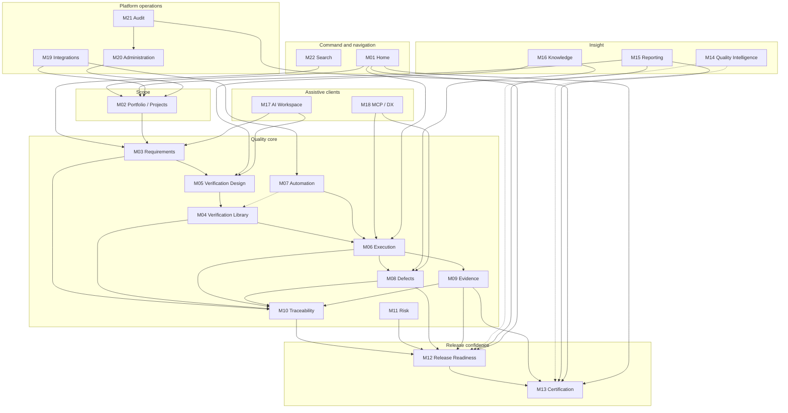

# APZ QEP — Product Modules (Structure)

> **Programme:** APZQEP-DEF-002  
> **Detail:** [MODULE-CATALOGUE.md](./MODULE-CATALOGUE.md) — authoritative per-module field definitions  
> **Preserved from DEF-001:** 22 modules (DEF-D-004), product areas, core relationship diagram, boundary reference

## Central outcome

Every module exists to support answering:

**Can this software be released with sufficient confidence?**

Modules do not compete as standalone tools — they form a **closed loop** from approved requirements through verification and execution to evidence, defects, risk, readiness, and human certification. Modules outside the quality loop (Administration, Integrations, Audit) **enable and govern** the loop without replacing it.

---

## Product areas

QEP organises 22 modules into eight product areas. Area boundaries are navigational and ownership groupings — not separate products or deployable units.

| Area                     | Modules                                                                                                                                                                           | Contribution to confidence                                |
| ------------------------ | --------------------------------------------------------------------------------------------------------------------------------------------------------------------------------- | --------------------------------------------------------- |
| **Command & navigation** | M01 Home; M22 Search and Navigation                                                                                                                                               | Surfaces assigned work, gates, alerts; fast object access |
| **Scope**                | M02 Portfolio and Projects                                                                                                                                                        | Stable quality context for all downstream objects         |
| **Quality core**         | M03 Requirements; M04 Verification Library; M05 Verification Design; M06 Execution and Sessions; M07 Automation Management; M08 Defects; M09 Evidence; M10 Traceability; M11 Risk | Defines, executes, proves, and exposes gaps in quality    |
| **Release confidence**   | M12 Release Readiness; M13 Certification                                                                                                                                          | Aggregates posture; human certification decision          |
| **Insight**              | M14 Quality Intelligence; M15 Reporting and Analytics; M16 Knowledge and Learning                                                                                                 | Explains patterns; reports; reuses learning               |
| **Assistive clients**    | M17 AI Quality Workspace; M18 MCP and Developer Experience                                                                                                                        | Governed assist — never autonomous certify                |
| **Platform operations**  | M19 Integration Centre; M20 Administration; M21 Audit and Compliance                                                                                                              | Connectors, policy, immutable investigation               |

---

## Module catalogue pointer

Full per-module definitions — purpose, users, capabilities, objects, MVP scope, exclusions — live in **[MODULE-CATALOGUE.md](./MODULE-CATALOGUE.md)**. This document describes **how modules relate** and **shared behaviour**; the catalogue is the field-level authority for each module id M01–M22.

Do not duplicate catalogue tables here. When module behaviour conflicts, catalogue + [PRODUCT-DEFINITION-DECISIONS.md](./PRODUCT-DEFINITION-DECISIONS.md) prevail.

---

## Shared cross-module capabilities

These capabilities span modules via platform services — modules consume them, they do not reimplement:

| Capability                     | Module consumption pattern                                                   |
| ------------------------------ | ---------------------------------------------------------------------------- |
| **Permission-filtered access** | Every module registers actions/objects; UI hides unauthorized surfaces       |
| **Audit**                      | Mutations emit audit events; M21 aggregates investigation                    |
| **Search**                     | M22 indexes SoR objects from all modules; permission filter at query         |
| **Notifications**              | Modules publish events; Home and queues deep-link — no module SMTP/WebSocket |
| **Entitlements**               | Edition gates M14–M18; honest empty states when not entitled                 |
| **Retention policies**         | Administration defines; Audit/Evidence/Certification consume                 |
| **Brand masking**              | No backend engine names in standard module UX                                |
| **Traceability**               | M10 federates links from M03–M09; objects carry cross-links in all modules   |

---

## Detailed module relationship narrative

### Scope anchors the graph

**M02 Portfolio and Projects** establishes projects, products, applications, services, components, environments, and teams. Every quality object hangs under a project (or portfolio roll-up). QEP is not an ALM (DEF-D-008) — M02 links outward to external project tools rather than replacing them.

### Requirements start the proof chain

**M03 Requirements** captures approved needs. Without approved requirements, verification lacks authority. Requirements feed **M05 Verification Design** and appear in **M10 Traceability** and **M12 Release Readiness** scope.

### Verification library and design

**M04 Verification Library** holds approved, reusable procedures. **M05 Verification Design** is the authoring and peer-review workflow. Together they implement DEF-D-001: _Verification_ is the product noun; classical test cases are a form. **M07 Automation Management** feeds promotion candidates into M04/M05 — automation does not bypass human approval for library entry.

### Execution proves requirements

**M06 Execution and Sessions** is where confidence is **earned** — manual sessions first-class (DEF-D-002), runs for batch/automation, hybrid flows supported. Results flow to **M09 Evidence** and may raise **M08 Defects**. **M07** monitors ingest health but does not replace M06 as the execution SoR.

### Defects, evidence, and traceability

**M08 Defects** captures threats to confidence. **M09 Evidence** captures proof. **M10 Traceability** binds req ↔ verify ↔ run ↔ result ↔ defect so readiness is explainable, not a black-box score. No module skips M10 for gate-critical claims.

### Risk and release readiness

**M11 Risk Management** records uncertainties and accepted mitigations. **M12 Release Readiness** aggregates scope, execution status, evidence completeness, open defects, risks, and waivers into gate evaluation. Readiness **never replaces** certification — it prepares **M13 Certification**.

### Certification closes the loop

**M13 Certification** records human decisions (including _Approved with qualifications_, DEF-D-007). Release Manager primary certifier with co-approvers (DEF-D-010). Locked evidence packs and immutable history. **M14 Quality Intelligence** continuous signals may request re-cert — never auto-flip status.

### Insight and learning

**M15 Reporting and Analytics** serves executives and compliance with KPIs and drill-through. **M16 Knowledge and Learning** captures reuse — feeding M05/M04 without duplicating verification SoR. **M14** adds explainable intelligence when entitled; AI default OFF (DEF-D-005).

### Assistive clients — governed, not authoritative

**M17 AI Quality Workspace** and **M18 MCP and Developer Experience** accelerate drafting, lookup, and IDE workflows. MCP preferred (DEF-D-006); no autonomous certify tools. AI Agent persona cannot certify. Accepted AI output lands in owning modules via explicit user action.

### Platform operations

**M19 Integration Centre** connects ALM, CI, defect trackers, storage — optional, not mandatory for MVP manual path. **M20 Administration** holds users, roles, policies, entitlements. **M21 Audit and Compliance** investigates all modules’ audit streams.

### Command layer

**M01 Home** composes widgets from across modules for role workspaces. **M22 Search and Navigation** is the universal index and favourites/recents registry — entry to any module’s objects.

---

## Module relationship diagram

Solid arrows: primary data/work flow. Dotted: optional/Phase 2+ or supporting influence.

---

## Cross-cutting concerns

| Concern                     | How modules cooperate                                                                                     |
| --------------------------- | --------------------------------------------------------------------------------------------------------- |
| **Approvals**               | M03, M05, M11, M08 (transitions), M07 (promotion) emit approval objects; M01 surfaces queues; M21 records |
| **Evidence before opinion** | M06/M09 produce; M12/M13 consume; M15 reports; no module claims readiness without M09 linkage             |
| **Manual-first MVP**        | M06 polished without M07/M17; M07/M17 show honest disabled states                                         |
| **Release hub**             | M12 orchestrates view; M08, M09, M10, M11, M06 feed; M13 receives handoff                                 |
| **Immutability**            | M13 locks packs; M21 reads all modules; M20 cannot delete cert history                                    |
| **External systems**        | M19 syncs into M02, M06, M08 — never makes QEP a CI server or ALM                                         |
| **Workspace composition**   | M01 + M22 + role workspace pin primary modules per [ROLE-WORKSPACES.md](./ROLE-WORKSPACES.md)             |

---

## Submodule notes (within catalogue modules)

Some Activity Bar destinations combine catalogue modules at UX level:

| Navigation area | Catalogue modules  | Note                                                                 |
| --------------- | ------------------ | -------------------------------------------------------------------- |
| Verification    | M04 + M05          | Library vs Design tabs; shared object model                          |
| Releases        | M12                | Release hub may show M06/M08/M09/M11 panels without owning their SoR |
| Defects         | M08                | Quality Issues share module area with distinct object type           |
| Intelligence    | M14                | Distinct from M15 operational reporting                              |
| AI Workspace    | M17 (+ M18 policy) | Hidden when AI OFF                                                   |

Splitting M04/M05 or merging Home into shell-only would be an ARCH change — product behaviour must remain (DEF-D-004).

---

## How modules support the central question

| Stage        | Question facet             | Primary modules |
| ------------ | -------------------------- | --------------- |
| Intent       | Do we know what to prove?  | M03, M02        |
| Design       | How will we prove it?      | M04, M05, M16   |
| Execute      | Did we run proof?          | M06, M07        |
| Record       | Is proof captured?         | M09, M08        |
| Understand   | Are gaps visible?          | M10, M11        |
| Decide scope | What is in this release?   | M12, M02        |
| Govern       | Human accountable release? | M13, M21        |
| Learn        | Do we improve?             | M16, M14, M15   |

---

## Boundaries

Modules implement **Enterprise Quality Engineering only** — not ALM, CI orchestration, device farms, or autonomous release bots ([PRODUCT-BOUNDARIES.md](./PRODUCT-BOUNDARIES.md), DEF-D-008).

| In scope                                    | Out of scope                                              |
| ------------------------------------------- | --------------------------------------------------------- |
| Verification SoR, execution, evidence, cert | Sprint planning, code repo, build pipelines as primary UX |
| Readiness aggregation and human cert        | Autonomous deploy/certify                                 |
| Integration ingestion and links             | Replacing Jira/GitLab/Jenkins UI                          |
| AI/MCP assist when enabled                  | AI-required MVP; silent SoR writes                        |

Module splits or merges in architecture phases must **preserve behaviours** documented in MODULE-CATALOGUE and decision register.

---

## Role-specific experiences

Module emphasis by persona is defined in [ROLE-WORKSPACES.md](./ROLE-WORKSPACES.md) and [PERSONAS.md](./PERSONAS.md). Modules do not define permissions — roles do — but each module declares primary/secondary personas in the catalogue.

---

## MVP vs later-phase modules

| MVP core                                | Foundation / Phase 2 depth | Phase 2+ (AI/MCP OFF until authorised) |
| --------------------------------------- | -------------------------- | -------------------------------------- |
| M01–M06, M08–M10, M12–M13, M15, M20–M22 | M07, M11, M19              | M14, M16, M17, M18                     |

MVP must feel complete for manual verification and certification without M14–M18.

---

## Related documents

| Document                                                             | Relationship                         |
| -------------------------------------------------------------------- | ------------------------------------ |
| [MODULE-CATALOGUE.md](./MODULE-CATALOGUE.md)                         | Per-module authoritative definitions |
| [NAVIGATION-MAP.md](./NAVIGATION-MAP.md)                             | Activity Bar to module mapping       |
| [INFORMATION-ARCHITECTURE.md](./INFORMATION-ARCHITECTURE.md)         | Objects modules share                |
| [PRODUCT-OVERVIEW.md](./PRODUCT-OVERVIEW.md)                         | Product-level flow diagrams          |
| [PRODUCT-DEFINITION-DECISIONS.md](./PRODUCT-DEFINITION-DECISIONS.md) | DEF-001 preserved decisions          |
