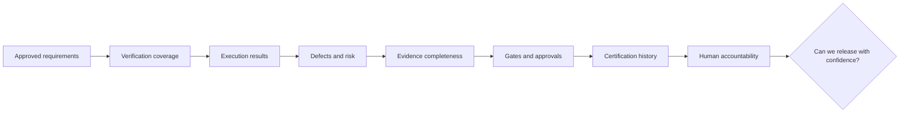
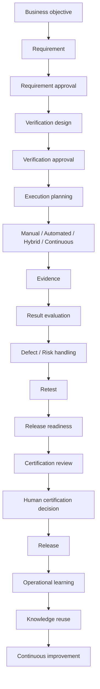
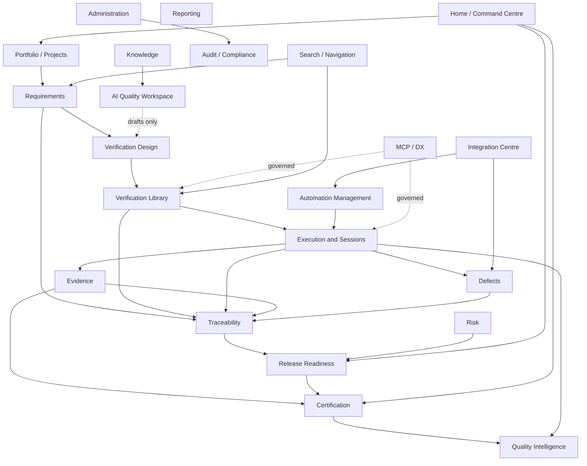

# APZ QEP — Product Overview

> **Programme:** APZQEP-DEF-002 (expansion of APZQEP-DEF-001)  
> **Baseline version:** 1.0.0-def (expanded)

## Identity and positioning

APZ QEP (APZ Quality Engineering Platform) is an **Enterprise Quality Engineering Platform** — not a test-case manager, not an ALM tool, and not an automation runner. It is the System of Record for quality-relevant requirements, verification, evidence, certification, quality metrics and intelligence, audit, and traceability. Testing is one capability within a broader quality governance mission.

Former name **APZ TCMS** is preserved as historical reference only. The product operates as a native APZHUB product following Module → Platform Service → Connector → Engine boundaries at the platform layer; this Definition describes product behaviour only.

## What the product contains

APZ QEP governs quality across the SDLC:

Requirements · Verification · Execution · Evidence · Defects · Risk · Traceability · Release readiness · Certification · Quality intelligence · Quality knowledge · AI-assisted quality engineering · Continuous improvement

The product comprises **22 modules** (product areas) including Home / Command Centre, Portfolio / Projects, Requirements, Verification Library, Verification Design, Execution and Sessions, Automation Management, Defects, Evidence, Traceability, Risk, Release Readiness, Certification, Quality Intelligence, Reporting, Knowledge, AI Quality Workspace, MCP / DX, Integration Centre, Administration, Audit / Compliance, and Search / Navigation.

## Who the product serves

**21 personas** across executive, product and delivery, QA (manual, exploratory, automation), development, release and operations, security, compliance, audit, customer, integrator, administrator, and (as a constrained actor) AI agent roles — each with structured definition tables in [PERSONAS.md](./PERSONAS.md) and role-aware workspaces in [ROLE-WORKSPACES.md](./ROLE-WORKSPACES.md).

## Central question

Every product area contributes to answering one question:

> **Can this software be released with sufficient confidence?**

## How quality information moves

**35 individual workflows** document how personas move through this lifecycle — see [USER-WORKFLOWS.md](./USER-WORKFLOWS.md), [AI-WORKFLOWS.md](./AI-WORKFLOWS.md), and [MCP-WORKFLOWS.md](./MCP-WORKFLOWS.md).

## Module relationship (product-level)

## Philosophy (preserved)

Quality before Testing · Verification before Execution · Evidence before Opinion · Certification before Release · Knowledge before Automation · Governance before Convenience · Security by Design · Platform-first · API-first · AI assists Humans · Humans remain Accountable · Everything Traceable / Auditable / Explainable / Measurable · Enterprise-first · Standards over Shortcuts.

## Coexistence of verification methods

| Method | Role | MVP |
| ------ | ---- | --- |
| Manual | First-class structured + exploratory | **Required** |
| Automated | Ingest/govern results; not a runner | Foundation ingest |
| AI-assisted | Draft/review under human gates | Default OFF |
| Continuous | Ongoing signals | Later phase |
| Hybrid | Combine methods against same requirement | Supported pattern |

## Product boundaries (summary)

Not an ALM, PM, SCM, CI/CD, runner, device cloud, generic DMS, observability suite, or general chatbot. Integrates with those systems. Detail: [PRODUCT-BOUNDARIES.md](./PRODUCT-BOUNDARIES.md).

## DEF-002 note

APZQEP-DEF-002 raised depth across personas, workflows, models, and UX/IA/navigation to enterprise clarity. Identity, positioning, central question, and philosophy are unchanged from DEF-001. See [PRODUCT-DEFINITION.md](./PRODUCT-DEFINITION.md) for control document summary.
