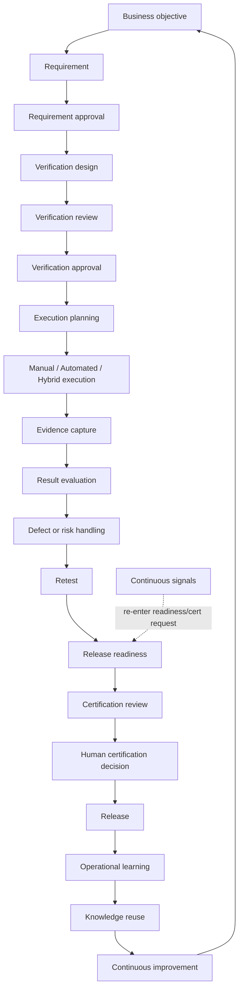
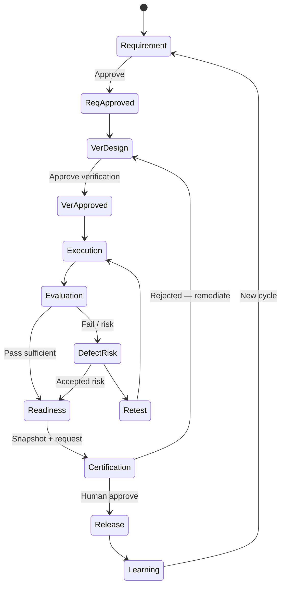

# APZ QEP — Quality Engineering Lifecycle

> **Programme:** APZQEP-DEF-002  
> **Note:** Programme reference QUALITY-LIFECYCLE.md maps to this document (`QUALITY-ENGINEERING-LIFECYCLE.md`).

## Purpose

The Quality Engineering Lifecycle defines the end-to-end product journey from business intent to release and continuous improvement — the backbone workflow APZ QEP governs. It connects all modules into a coherent, auditable path where human accountability, evidence, and traceability are preserved at every stage.

## Business rationale

Quality engineering fails when stages are implicit: requirements change without re-verification, evidence is collected after the fact, and release decisions lack a recorded chain. A explicit lifecycle aligns personas, approvals, and artefacts so organisations can answer the central question: _Can we release with confidence?_

The lifecycle supports manual-first adoption, automation ingest, AI assistance (optional), and regulated certification without requiring every maturity level upfront.

## Core concepts

| Concept          | Product meaning                                     |
| ---------------- | --------------------------------------------------- |
| Stage            | Named phase with entry/exit criteria                |
| Gate             | Approval or quality check between stages            |
| Feedback loop    | Operational learning feeding improvement            |
| Exception path   | Waiver or qualification — never silent              |
| Maturity overlay | L1–L7 verification maturity without skipping stages |
| Re-entry         | Return to earlier stage on change or drift          |

## Lifecycle overview

## Primary objects

| Object                         | Lifecycle role                         |
| ------------------------------ | -------------------------------------- |
| Business objective             | Origin of quality intent               |
| Requirement                    | Governed need — approved before design |
| Verification procedure         | Proof specification                    |
| Execution plan / session / run | Planned and actual verification        |
| Evidence item / pack           | Proof artefacts                        |
| Defect / risk                  | Failure or exposure handling           |
| Readiness snapshot             | Pre-cert aggregation                   |
| Certification decision         | Human attestation                      |
| Release record                 | Declared release event                 |
| Knowledge item                 | Reuse from learning                    |

## Stage table

| Stage                          | Entry criteria         | Exit criteria                          | Accountable                    | Supporting        | Evidence / approvals   |
| ------------------------------ | ---------------------- | -------------------------------------- | ------------------------------ | ----------------- | ---------------------- |
| Requirement                    | Objective identified   | Requirement drafted                    | BA / PO                        | QA                | Draft record           |
| Requirement approval           | Draft complete         | Approved                               | PO (typical)                   | BA, Compliance    | Approval record        |
| Verification design            | Approved requirement   | Design draft                           | QA Engineer                    | BA                | Design notes           |
| Verification review / approval | Draft ready            | Approved verification                  | QA Manager / peer              | QA Engineer       | Approval               |
| Execution planning             | Approved verification  | Planned run / session                  | QA Manager                     | Testers           | Plan                   |
| Execution                      | Plan ready             | Results recorded                       | Manual Tester / Automation     | QA                | Results + evidence     |
| Evaluation                     | Results exist          | Pass / fail disposition                | QA                             | Dev               | Comments               |
| Defect / risk                  | Failure / risk found   | Handled or accepted                    | QA / Dev / Risk approver       | RM                | Defect / risk records  |
| Retest                         | Fix / risk treatment   | Retest result                          | Tester                         | Dev               | Retest evidence        |
| Readiness                      | Scope frozen enough    | Ready / Not ready / Ready with waivers | Release Manager                | PO, QA            | Snapshot               |
| Certification                  | Readiness + packs      | Human decision                         | Release Manager + co-approvers | Auditor (observe) | Locked pack + decision |
| Release                        | Cert decision allows   | Released                               | Release Manager                | Ops               | Cert statement         |
| Learning                       | Release / ops feedback | Knowledge updated                      | QA Manager                     | All               | Knowledge item         |
| Continuous improvement         | Trends identified      | Objectives updated                     | QA Leadership                  | All               | Planning records       |

## Lifecycle

Stages proceed sequentially with parallel work allowed within governance (e.g. multiple verification designs). Change triggers re-entry: requirement change → re-design; scope change → re-readiness; drift signal → re-cert **request** only.

## Ownership

Accountable roles per stage table; Tenant Administrator owns lifecycle policy templates; Compliance Officer owns regulated stage mandatory approvals.

## Relationships

Lifecycle stitches modules: Requirements, Verification Library/Design, Execution, Automation Management, Defects, Evidence, Risk, Traceability, Release Readiness, Certification, QI, Knowledge, Reporting. No module bypasses human cert or evidence lock rules.

## States

Each primary object carries module-specific states (see Verification, Evidence, Certification models). Lifecycle **health** indicators: On track, Blocked (gate fail), Exception (waiver), Stale (verification vs requirement version).

## Business rules

| Rule   | Statement                                                                         |
| ------ | --------------------------------------------------------------------------------- |
| QEL-01 | Requirement approval precedes verification design counting toward coverage        |
| QEL-02 | Evidence before opinion — no cert without pack                                    |
| QEL-03 | Waivers and Approved with qualifications are explicit exception paths             |
| QEL-04 | Continuous signals re-enter at Readiness/Certification request — no auto-decision |
| QEL-05 | AI assists design/analysis only with human accept — default OFF                   |
| QEL-06 | Manual verification delivers full lifecycle value without automation              |
| QEL-07 | QEP is not ALM, CI, or runner — external tools referenced only                    |

## Approval rules

Stage gates in table; certification multi-approver per edition; risk acceptance human per Risk Model; verification peer review optional per policy.

## Role responsibilities

| Persona            | Primary stages                               |
| ------------------ | -------------------------------------------- |
| Product Owner      | Requirement approval; scope                  |
| QA Engineer        | Design, execution support                    |
| Manual Tester      | Execution, evidence                          |
| QA Manager         | Verification approval; defect/risk oversight |
| Release Manager    | Readiness, certification, release            |
| Developer          | Defect fix, retest support                   |
| Compliance Officer | Regulated gates                              |
| Auditor            | Observe cert; backward trace                 |
| AI Agent           | Draft assist only                            |

## Reporting

Lifecycle dashboards: stage throughput, blocked items, time-in-stage, exception rate, cert cycle time, learning closure rate. Portfolio view for executives.

## Search

Cross-stage search: “where is requirement X in lifecycle?” Unified search links objects by trace graph.

## Audit

Stage transitions with approver identity; cert lock; waiver links; AI assist accept events — full correlation ID chain per Constitution.

## AI considerations

AI may assist requirement analysis, verification generation, coverage analysis, risk/defect clustering, readiness narrative — all gated. AI never certifies; never writes SoR without accept. Default OFF.

## MCP considerations

MCP supports developer pull of requirements/standards and propose verification drafts — enters lifecycle at Design stage in approval queue. No MCP short-circuit to Certification.

## Future evolution

Richer stage SLAs, automated **task** creation from QI (not decisions), industry lifecycle templates. Core stage sequence stable.

## Boundary conditions

| In boundary                 | Out of boundary           |
| --------------------------- | ------------------------- |
| Product lifecycle stages    | Sprint planning in ALM    |
| Gate semantics              | Pipeline YAML             |
| Learning → improvement loop | HR performance management |

## Example scenarios

**Scenario 1 — Manual-first MVP:** Team runs full lifecycle through manual sessions only — requirement → session → evidence → readiness → human cert → release. No automation required.

**Scenario 2 — Hybrid:** Automated regression ingested at Execution; manual exploratory covers gaps; single readiness snapshot aggregates both.

**Scenario 3 — Exception:** Ready with waivers at Readiness; Approved with qualifications at Certification; ops monitors qualification in Learning stage.

**Scenario 4 — Drift re-entry:** Post-release continuous signal triggers re-cert request; lifecycle re-enters at Readiness/Certification; prior cert Superseded only after new human decision.

**Scenario 5 — Rejection loop:** Certification Rejected for trace gap; remediation through Verification design and new evidence; new request — history preserved.

## Exceptions and feedback

Waivers and “Approved with qualifications” are explicit exception paths — documented in Risk and Certification models. Operational learning feeds Knowledge module and QI trends. Continuous improvement updates objectives — restarting the outer loop without deleting history.
