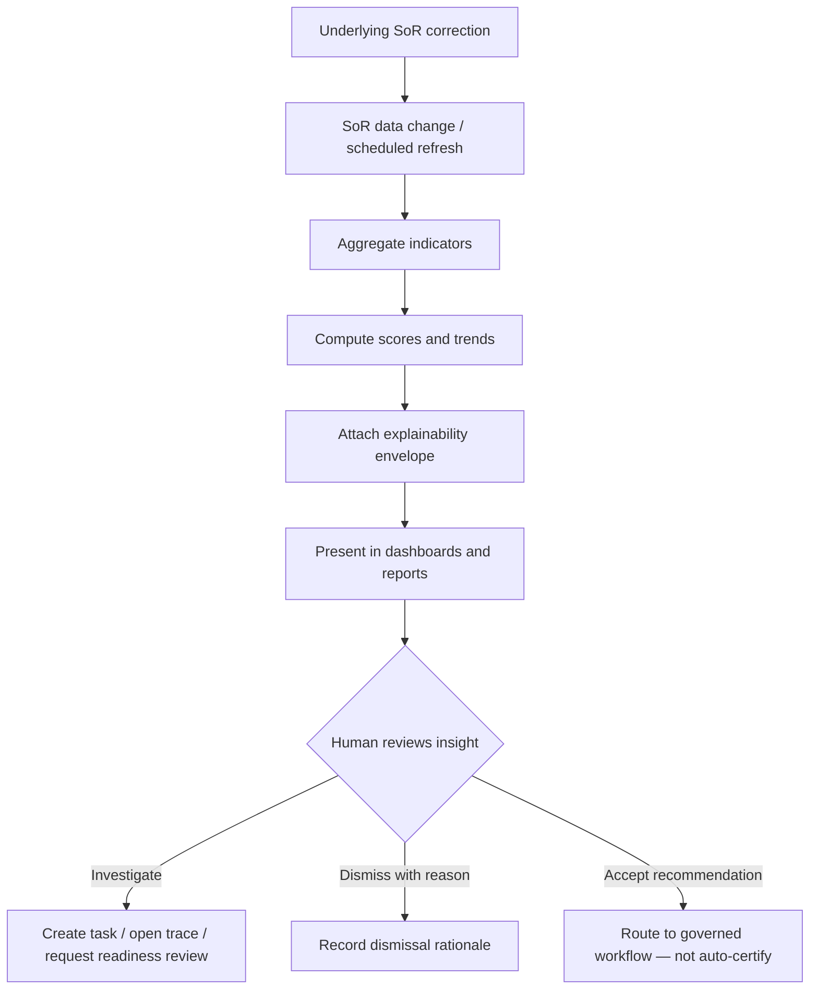
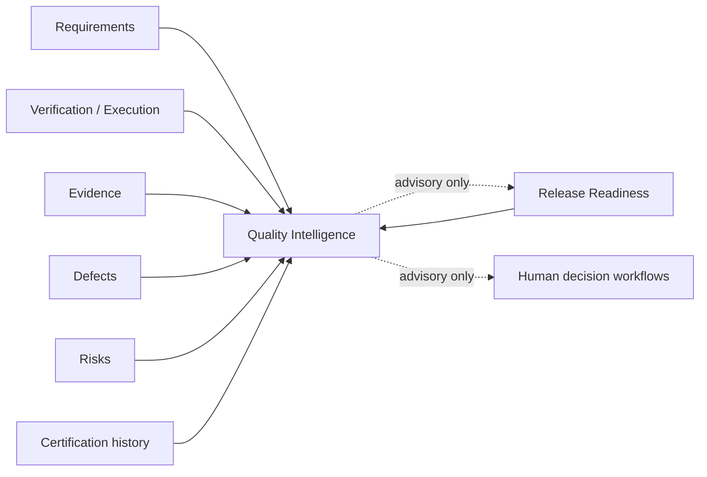

# APZ QEP — Quality Intelligence

> **Programme:** APZQEP-DEF-002  
> **Rule:** Supports decisions — never silently makes accountable human decisions

## Purpose

Quality Intelligence (QI) is the product’s analytical and interpretive layer. It aggregates quality-relevant signals from requirements, verification, execution, evidence, defects, risks, releases, and certification history to help humans answer: _What is our quality posture, where are the gaps, and what should we investigate next?_

QI explains; it does not decide. Every material score, trend, or recommendation is traceable to inputs and limitations.

## Business rationale

Organisations operating at enterprise scale cannot manually synthesise quality posture across projects, releases, and verification methods. Executives need confidence views without reading every session. QA leadership needs gap detection before readiness gates fail. Release managers need explainable readiness contributors, not opaque scores.

QI reduces time-to-insight while preserving human accountability for certification, risk acceptance, and waiver decisions. It also prevents “dashboard sprawl” by centralising quality analytics inside the QEP SoR rather than duplicating BI outside governed quality data.

## Core concepts

| Concept               | Product meaning                                                                                              |
| --------------------- | ------------------------------------------------------------------------------------------------------------ |
| Quality indicator     | A measured or derived signal about quality posture (e.g. open critical defects, verification coverage ratio) |
| Coverage intelligence | Analysis of requirement-to-verification linkage and execution completeness                                   |
| Risk intelligence     | Aggregation of open risks, treatments, and residual exposure by scope                                        |
| Defect intelligence   | Patterns in severity, recurrence, age, and component concentration                                           |
| Verification maturity | Organisational adoption level across manual, automated, and continuous methods                               |
| Release intelligence  | Readiness contributors, gate proximity, and comparative release posture                                      |
| Trend analysis        | Directional change over time with explicit data confidence                                                   |
| Predictive signal     | Forward-looking hint (e.g. likely gate failure) — advisory only                                              |
| Quality debt          | Accumulated gaps: missing verification, stale evidence, unresolved risks                                     |
| Quality confidence    | Composite interpretive score with explainability metadata                                                    |
| Data confidence       | Honest assessment of input completeness and freshness                                                        |

## Primary objects

| Object                  | Description                                                               |
| ----------------------- | ------------------------------------------------------------------------- |
| Quality dashboard       | Role-scoped view of indicators and trends                                 |
| Indicator definition    | Named metric with scope, formula intent, and data sources                 |
| Insight record          | Generated observation with inputs, confidence, and recommended actions    |
| Recommendation          | Suggested human action — never auto-executed for accountable decisions    |
| Executive quality view  | Portfolio-level aggregation for leadership personas                       |
| Coverage gap report     | Forward traceability view highlighting missing verification               |
| Trend snapshot          | Point-in-time historical comparison                                       |
| Explainability envelope | Metadata attached to every material score: inputs, limitations, freshness |

## Lifecycle

QI refreshes as underlying SoR records change. Insights do not mutate SoR; humans act through governed modules (defects, risks, verification design, readiness, certification requests).

## Ownership

| Role                   | Ownership                                                                                       |
| ---------------------- | ----------------------------------------------------------------------------------------------- |
| QA Manager             | Curates which indicators matter for a programme; validates interpretation for delivery          |
| Release Manager        | Uses release intelligence for readiness narrative; does not delegate certify authority to QI    |
| Executive              | Consumes portfolio views; may set organisational thresholds via policy (not via QI auto-action) |
| Tenant Administrator   | Configures entitlements, retention of analytics artefacts, and AI overlay enablement            |
| Platform Administrator | Ensures observability of QI refresh health; no business interpretation                          |

QI content is platform-derived, not user-owned like a requirement. Custom report extensions follow extensibility governance.

## Relationships

QI reads from — but never replaces — Requirements, Verification, Execution, Evidence, Defects, Risk, Traceability, Release Readiness, and Certification. Continuous certification signals may appear in QI as drift indicators; they **request** re-certification review and **never** flip formal certification status.

## States

| State      | Meaning                                                    |
| ---------- | ---------------------------------------------------------- |
| Current    | Insight reflects latest SoR data within freshness SLA      |
| Stale      | Source data older than policy threshold; UI warns          |
| Partial    | Missing inputs; confidence downgraded                      |
| Suppressed | Entitlement or permission hides detail                     |
| Dismissed  | Human acknowledged insight without action; reason recorded |

Scores and recommendations do not have “Approved” SoR status — they are interpretive overlays.

## Business rules

| Rule  | Statement                                                                                                 |
| ----- | --------------------------------------------------------------------------------------------------------- |
| QI-01 | QI shall not auto-certify, auto-waive, auto-close defects, or auto-accept risk                            |
| QI-02 | Every material score exposes inputs, confidence, and limitations                                          |
| QI-03 | Predictive signals are labelled advisory; never gate substitutes                                          |
| QI-04 | Continuous signals may surface in QI but never independently change certification                         |
| QI-05 | AI-generated narratives (when enabled) are overlays; human acceptance required before SoR write elsewhere |
| QI-06 | QI shall not expose backend engine branding or raw connector errors                                       |
| QI-07 | Historical QI snapshots for a locked certification pack are retained for audit comparison                 |

## Approval rules

QI itself requires no approval workflow. When a user accepts a QI recommendation that implies SoR change (e.g. “create verification for gap”), the target module’s approval rules apply. Dismissals of high-severity insights may require QA Manager acknowledgment per tenant policy.

Executive threshold changes (what appears on portfolio dashboards) are Tenant Administrator or Compliance Officer governed where regulated.

## Role responsibilities

| Persona             | Responsibility                                                                      |
| ------------------- | ----------------------------------------------------------------------------------- |
| Executive           | Consumes portfolio QI; escalates exceptions                                         |
| Product Owner       | Reviews coverage intelligence for priority requirements                             |
| QA Manager          | Validates gap reports; assigns remediation                                          |
| QA Engineer         | Investigates component-level defect intelligence                                    |
| Release Manager     | Uses readiness explanation; prepares certification narrative                        |
| Automation Engineer | Reviews flakiness and automation coverage intelligence                              |
| Compliance Officer  | Ensures QI retention and export meet policy                                         |
| Auditor             | Reads historical QI context alongside locked evidence packs                         |
| AI Agent            | May retrieve QI read-only when entitled; cannot act on recommendations autonomously |

## Reporting

QI feeds Reporting module with standard and extensible report types: executive quality summary, coverage gap analysis, defect concentration, risk heatmaps, verification maturity progression, release comparison, and quality debt register. Reports inherit explainability envelopes. Export to evidence packs is supported for certification support material — QI exports are **supporting**, not certifying.

| Report type               | Primary audience               |
| ------------------------- | ------------------------------ |
| Executive quality summary | Executive, Release Manager     |
| Coverage gap analysis     | QA Manager, Product Owner      |
| Defect concentration      | QA Engineer, Developer         |
| Release comparison        | Release Manager                |
| Quality debt register     | QA Manager, Compliance Officer |

## Search

QI insights and indicators are indexed for unified platform search when entitled. Search results respect permission filters at query time. Users may search by indicator name, affected requirement, release, project, or gap type. AI natural-language query (when enabled) cites SoR sources; it does not silently write records.

## Audit

QI refresh events, dismissed insights, accepted recommendations (with downstream workflow correlation), and exported analytics packs are audited. AI-generated narrative usage is logged when AI is enabled. Auditors can reconstruct what QI showed at the time of a certification decision via historical snapshots.

## AI considerations

AI default **OFF**. When entitled and authorised, AI may generate narrative summaries of QI views, suggest remediation wording, or assist natural-language exploration. AI outputs carry Draft → Reviewed → Approved → Rejected → Superseded lifecycle before any downstream use. AI never becomes SoR for indicators; computed indicators remain rule-based with explainability metadata. AI Agent persona cannot certify based on QI output.

## MCP considerations

MCP tools may retrieve quality explanations, missing coverage summaries, and readiness contributor narratives when authenticated and scoped. MCP read of QI is permitted; MCP write based on QI recommendations follows gated draft paths (e.g. propose verification). No MCP tool may auto-apply QI recommendations to certification or risk acceptance.

## Future evolution

Planned product evolution (not commitment): semantic search over quality knowledge, cross-portfolio benchmarking (anonymised), richer predictive models with explicit human-in-the-loop labelling, integration of continuous signals into maturity scoring, and marketplace report extensions. Continuous certification signals remain request-only for formal status changes.

## Boundary conditions

| In boundary                       | Out of boundary          |
| --------------------------------- | ------------------------ |
| Explain readiness contributors    | Replace release gates    |
| Highlight unsupported cert claims | Issue certification      |
| Recommend risk review             | Accept risk autonomously |
| Show automation flakiness trends  | Operate CI runners       |
| Portfolio quality posture         | ALM work-item management |

QI is not a generic observability platform; it consumes platform and ingested quality signals only.

## Example scenarios

**Scenario 1 — Pre-readiness review:** A Release Manager opens release intelligence before a readiness snapshot. QI shows three priority requirements with no executed verification in the last sprint, confidence Partial due to stale automation ingest. The manager creates verification tasks — not an auto waiver.

**Scenario 2 — Executive drill-down:** An Executive sees declining quality confidence for Programme B. Explainability shows rising open critical defects and expired evidence references. They request a certification status briefing from the Release Manager — QI did not change any certification record.

**Scenario 3 — Regulated audit:** An Auditor exports a historical QI snapshot attached to a locked evidence pack from six months ago, comparing it to the certification statement. Continuous signals that appeared post-certification are visible as drift indicators only; formal status remained Approved until human re-certification.

**Scenario 4 — AI-assisted narrative (enabled):** A QA Manager requests an AI summary of coverage gaps. The narrative is Draft until the manager reviews and marks Reviewed. It is attached to a readiness meeting pack as non-authoritative commentary.
