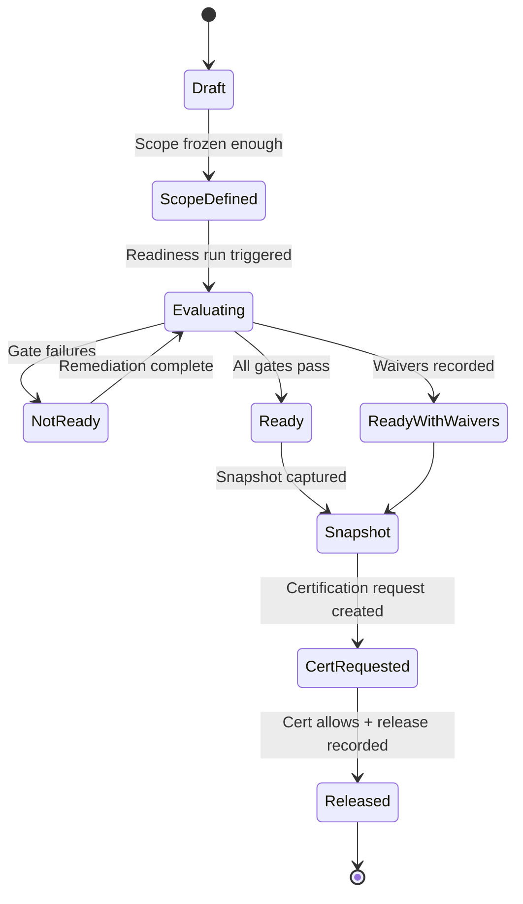
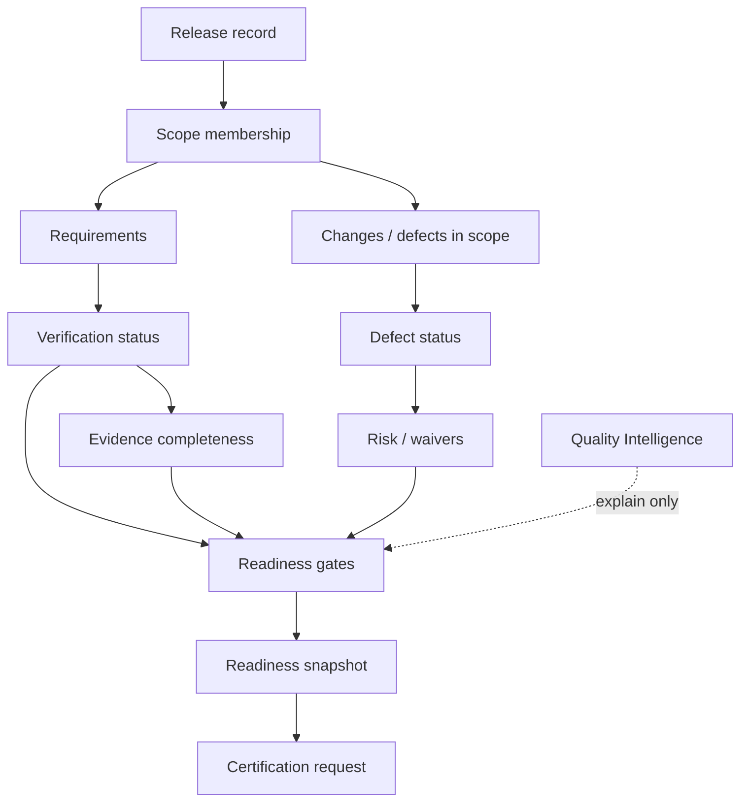

# APZ QEP — Release Readiness

> **Programme:** APZQEP-DEF-002  
> **Central question contributor:** Aggregates “confidence to certify/release”

## Purpose

Release Readiness is the product capability that evaluates whether a defined release scope has sufficient verification, evidence, defect resolution, risk disposition, and approval posture to proceed to certification and release. It aggregates governed inputs into an explainable readiness outcome — without replacing human certification.

## Business rationale

Release decisions fail when teams discover gaps too late: untested requirements, open critical defects, missing evidence, or unaccepted risks. Readiness provides a structured, repeatable gate before certification effort — saving audit cycles and preventing false confidence from green dashboards alone.

Readiness snapshots create a point-in-time record of what the organisation knew when it asked *are we ready to seek certification?* — essential for regulated enterprises and post-incident review.

## Core concepts

| Concept | Product meaning |
| ------- | ---------------- |
| Release record | Governed scope container for a release candidate |
| Readiness snapshot | Immutable point-in-time evaluation |
| Readiness gate | Policy threshold check (coverage, defects, evidence, approvals) |
| Readiness score | Composite indicator with explainability — advisory |
| Waiver / exception | Explicit recorded deviation linked to risk acceptance |
| Missing action | Human-actionable item blocking readiness |
| Handoff | Snapshot feeds certification request — not cert itself |

## Primary objects

| Object | Description |
| ------ | ----------- |
| Release record | Version, scope, included requirements/changes/defects |
| Scope membership | Requirements, change records, fix versions in scope |
| Readiness evaluation | Current or historical assessment run |
| Gate result | Per-gate pass/fail/waived outcome |
| Readiness explanation | Narrative and structured contributors |
| Waiver record | Linked risk acceptance or qualification |
| Comparison view | Diff between release candidates or snapshots |
| Executive release view | Portfolio-level readiness summary |

## Lifecycle

Continuous signals may trigger re-evaluation request; they do not auto-change readiness snapshot retroactively without human-triggered refresh.

## Ownership

| Role | Ownership |
| ---- | --------- |
| Release Manager | Owns release record and readiness outcome narrative |
| Product Owner | Scope membership and priority trade-offs |
| QA Manager | Verification and evidence gate interpretation |
| Developer | Defect resolution status in scope |
| Compliance Officer | Waiver policy and snapshot retention |

## Relationships

Readiness consumes Requirements, Verification execution status, Evidence completeness, Defects, Risks, and Traceability gaps. Outputs feed Certification requests and Reporting. QI provides advisory overlays on readiness contributors.

## States

| State | Meaning |
| ----- | ------- |
| Draft | Release record forming; scope not evaluable |
| Scope defined | Minimum scope stable for evaluation |
| Evaluating | Gate engine running |
| Not ready | One or more blocking gates failed |
| Ready | All required gates pass |
| Ready with waivers | Proceeding with recorded waivers/acceptances |
| Snapshot captured | Point-in-time frozen for cert handoff |
| Certification requested | Linked cert request in flight |
| Released | Release executed per policy |

## Business rules

| Rule | Statement |
| ---- | --------- |
| RR-01 | Readiness alone never replaces human certification |
| RR-02 | Gate outcomes: Ready / Not ready / Ready with waivers |
| RR-03 | Waivers must link to governed risk acceptance or qualification |
| RR-04 | Snapshots are retained; re-evaluation creates new snapshot lineage |
| RR-05 | Readiness score is explainable; not a substitute for gates |
| RR-06 | Continuous signals may request re-evaluation; never auto-certify |
| RR-07 | Unsupported traceability claims block Ready unless waived per policy |

## Approval rules

| Action | Approver |
| ------ | -------- |
| Scope freeze for evaluation | Release Manager + Product Owner (typical) |
| Waiver to achieve Ready with waivers | Per Risk Model acceptance authority |
| Snapshot certification handoff | Release Manager initiates; QA Manager co-sign optional |
| Override of blocking gate | Compliance Officer / policy-defined only — audited |

Readiness does not approve certification — only prepares certification request.

## Role responsibilities

| Persona | Responsibility |
| ------- | ---------------- |
| Release Manager | Runs evaluations; owns snapshot handoff |
| Product Owner | Confirms scope and accepts scope risks |
| QA Manager | Validates verification and evidence gates |
| QA Engineer | Resolves missing verification actions |
| Developer | Closes in-scope defects |
| Executive | Reviews executive release view |
| Auditor | Compares snapshot to eventual cert decision |
| AI Agent | May summarise readiness — no gate override |

## Reporting

Standard reports: readiness dashboard, gate failure detail, waiver summary, release comparison, missing actions list, snapshot history, and executive portfolio release view. Readiness explanation exportable to evidence pack as supporting material.

| Report | Audience |
| ------ | -------- |
| Gate failure detail | QA Manager, Release Manager |
| Waiver summary | Compliance Officer, Auditor |
| Release comparison | Release Manager, Product Owner |
| Snapshot history | Auditor |

## Search

Search releases by name, version, state, project, gate status, and linked certification. Missing actions searchable globally for assignees. Snapshots discoverable by date and cert linkage.

## Audit

Scope changes, evaluation runs, gate results, waiver links, snapshot creation, and cert handoff are audited. Diff between snapshots available for auditor review. AI-generated readiness narratives logged when AI enabled.

## AI considerations

AI default **OFF**. When enabled, AI may draft readiness narrative overlays summarising gate contributors — labelled non-authoritative. AI shall not mark Ready or submit certification. Human Release Manager owns outcome.

## MCP considerations

MCP may read release scope, gate status, and missing coverage for authorised projects. MCP may not waive gates or create snapshots. Proposed scope comments route as drafts if write enabled.

## Future evolution

Future intent: richer change-impact suggestions, continuous readiness drift alerts (request re-eval only), and benchmark comparisons across portfolios. Certification handoff semantics unchanged.

## Boundary conditions

| In boundary | Out of boundary |
| ----------- | --------------- |
| Aggregate quality gates for release | Deploy software to production |
| Snapshot for certification | Issue certification autonomously |
| Link CI ingest status | Operate pipelines |
| Executive release posture | ALM release calendar replacement |

QEP is not a CI/CD or deployment orchestrator.

## Example scenarios

**Scenario 1 — Clean path:** All priority requirements verified, evidence complete, no open critical defects. Gates pass Ready. Release Manager captures snapshot and opens certification request. Human certifies Approved; evidence pack locks separately in Certification module.

**Scenario 2 — Waiver path:** One medium defect deferred with Product Owner and Release Manager risk acceptance. Gates show Ready with waivers. Snapshot includes waiver IDs. Certifier approves with qualifications referencing waivers.

**Scenario 3 — Not ready:** Traceability shows three orphan requirements in scope. Readiness Not ready; missing actions assigned to QA Engineer. Continuous deploy signal does not change snapshot until human re-runs evaluation after fixes.

**Scenario 4 — Comparison:** Release Manager compares RC2 vs RC1 snapshots for gate regression before go/no-go meeting. QI overlay explains defect count trend — decision remains human.
