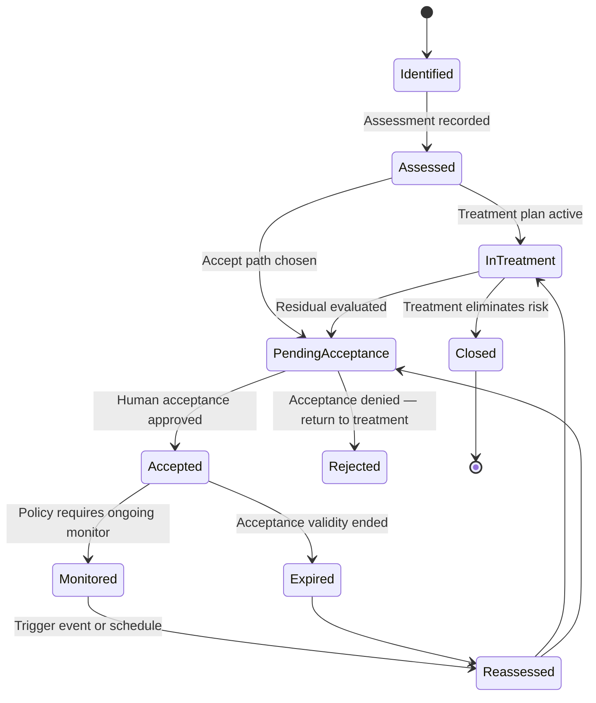
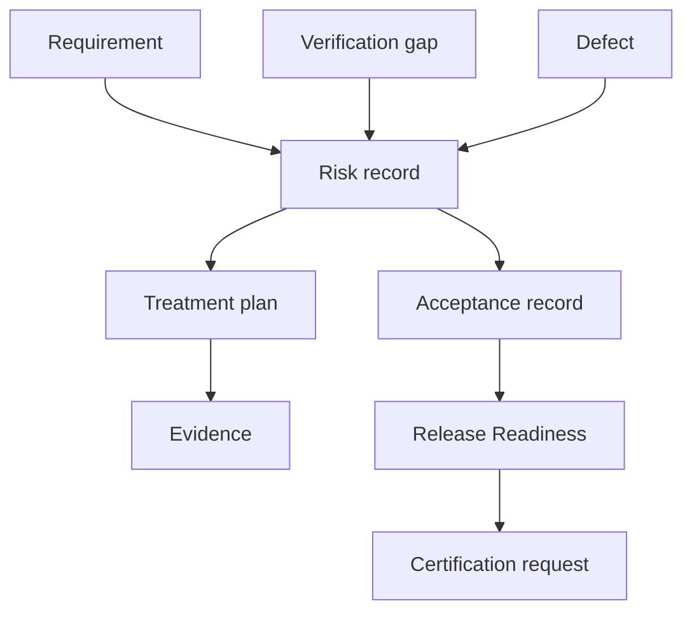

# APZ QEP — Risk Model

> **Programme:** APZQEP-DEF-002  
> **Rule:** Risk acceptance is a human decision. AI may recommend only.

## Purpose

The Risk Model governs how quality, product, release, and operational risks are recorded, assessed, treated, accepted, and evidenced within APZ QEP. It ensures that residual risk exposure is visible at readiness and certification time, and that every acceptance decision has an accountable human owner.

## Business rationale

Release confidence depends on known risk, not only on passed verification. Organisations in regulated and enterprise contexts must demonstrate that identified risks were evaluated, treated, or explicitly accepted with authority. Fragmented risk spreadsheets and informal waivers fail audit and recreate release surprises.

Centralising risk in the QEP SoR links risks to requirements, verification gaps, defects, evidence, and release scope — answering *what could go wrong, who accepted it, and on what evidence* without conflating risk with defect tracking or project management.

## Core concepts

| Concept | Product meaning |
| ------- | ---------------- |
| Risk | A potential adverse effect on quality, release, compliance, or operations |
| Risk class | Category grouping for policy, reporting, and ownership |
| Inherent risk | Exposure before controls or treatment |
| Residual risk | Exposure after treatment or compensating controls |
| Risk treatment | Planned action to reduce, avoid, transfer, or monitor risk |
| Risk acceptance | Explicit human decision to proceed despite residual exposure |
| Risk evidence | Records supporting assessment and acceptance |
| Risk owner | Accountable party for monitoring and escalation |

## Primary objects

| Object | Description |
| ------ | ----------- |
| Risk record | Governed SoR entity with class, description, scope, and links |
| Risk assessment | Scored evaluation with rationale and assessor |
| Treatment plan | Actions, owners, and target dates |
| Acceptance record | Human approval with authority level and expiry if policy requires |
| Risk register view | Filtered list by project, release, class, or owner |
| Residual risk snapshot | Point-in-time exposure for readiness/certification |
| Risk trend | Historical movement of open and accepted risks |

## Risk classes

| Class | Typical scope |
| ----- | ------------- |
| Quality | Verification gaps, quality debt, escaped defect patterns |
| Product | Feature scope uncertainty, requirement ambiguity |
| Release | Schedule, dependency, deployment readiness |
| Requirement | Unapproved or volatile requirements in release scope |
| Verification | Insufficient or stale verification for scope |
| Operational | Runbook, support, monitoring readiness |
| Security | Security findings not fully remediated |
| Compliance | Regulatory or contractual obligations |

## Lifecycle

## Ownership

| Role | Ownership |
| ---- | --------- |
| Risk owner (assigned) | Day-to-day monitoring, treatment progress, escalation |
| QA Manager | Quality and verification class risks; register hygiene |
| Release Manager | Release class risks; ensures acceptance visible at readiness |
| Product Owner | Product/requirement class risks; scope trade-offs |
| Security Officer | Security class risks; sensitive acceptance policy |
| Compliance Officer | Compliance class risks; retention and authority rules |

Unowned risks are flagged in QI and readiness views until assigned.

## Relationships

Risks link to requirements, verification records, defects, evidence, release records, readiness snapshots, and certification requests. A waiver at readiness is represented as a governed risk acceptance or qualification — not an informal comment.

## States

| State | Meaning |
| ----- | ------- |
| Identified | Logged; assessment not complete |
| Assessed | Scored and owned |
| In treatment | Active mitigation |
| Pending acceptance | Awaiting human acceptance decision |
| Accepted | Human accepted residual risk within authority |
| Monitored | Accepted risk under ongoing watch |
| Expired | Acceptance period ended; re-assessment required |
| Closed | Eliminated or no longer applicable |
| Rejected (acceptance) | Acceptance request denied |

## Business rules

| Rule | Statement |
| ---- | --------- |
| RSK-01 | Risk acceptance shall always be a human decision with recorded authority |
| RSK-02 | AI may recommend treatment or acceptance wording; never auto-accept |
| RSK-03 | Accepted risks must appear on readiness and certification context |
| RSK-04 | Critical-class risks may require multi-approver acceptance per policy |
| RSK-05 | Expired acceptance blocks “Ready” unless renewed or re-treated |
| RSK-06 | Risk records are never deleted; closure retains history |
| RSK-07 | Continuous signals may raise reassessment tasks; never auto-accept |

## Approval rules

| Decision | Typical approver | Notes |
| -------- | ---------------- | ----- |
| Standard acceptance | Risk owner + QA Manager | Team edition default |
| Release-blocking acceptance | Release Manager | Must align with readiness waiver policy |
| Security residual acceptance | Security Officer | May override lower authority |
| Compliance residual acceptance | Compliance Officer | Regulated enterprise path |
| Multi-approver acceptance | Policy-defined co-approvers | Enterprise / Regulated editions |

Delegation follows tenant RBAC; AI Agent and integrators cannot approve acceptance.

## Role responsibilities

| Persona | Responsibility |
| ------- | ---------------- |
| QA Manager | Maintains quality/verification risk register |
| QA Engineer | Raises risks from execution and gap analysis |
| Release Manager | Ensures release risks reflected in readiness |
| Product Owner | Accepts product/requirement trade-off risks within authority |
| Developer | Contributes technical treatment evidence |
| Security Officer | Governs security class acceptance |
| Compliance Officer | Validates acceptance authority and retention |
| Auditor | Reviews acceptance records against locked evidence packs |
| AI Agent | Draft recommendations only |

## Reporting

Standard reports: open risk register, accepted residual risk summary, risk trend by class, release risk heatmap, overdue treatments, and acceptance expiry forecast. Executive views aggregate by portfolio. Certification support packs include residual risk snapshot at decision time.

## Search

Risks are searchable by ID, title, class, owner, release, requirement link, and acceptance status. Unified search respects permission filters. Orphan risks (no scope link) appear in traceability gap views.

## Audit

Create, update, assess, treat, accept, reject, expire, and close events are immutable audit entries. Acceptance records capture approver identity, timestamp, rationale, and linked evidence. Exports of risk registers for legal hold follow Evidence Model chain-of-custody intent.

## AI considerations

AI default **OFF**. When enabled, AI may draft risk descriptions, suggest scores, or cluster related risks from defect text — all Draft until human review. AI shall not write Accepted state. Risk acceptance remains human-only per Constitution.

## MCP considerations

MCP may read open risks and acceptance status for scoped releases when authorised. MCP may propose draft risk records or treatment notes into approval queues. MCP cannot submit acceptance on behalf of a human. All MCP mutations audited.

## Future evolution

Product evolution may add risk appetite templates by industry, automated reassessment triggers from continuous signals (task-only), and partner risk policy packs via marketplace. Acceptance authority never becomes autonomous.

## Boundary conditions

| In boundary | Out of boundary |
| ----------- | --------------- |
| Quality/release risk register | Enterprise GRC platform replacement |
| Link risk to verification gaps | Execute mitigations in external tools |
| Acceptance for readiness waiver | Auto-waive gates |
| Residual risk in cert context | Independent certification by risk score |

QEP is not a full enterprise risk management suite; it owns quality-engineering-relevant risk in the release confidence chain.

## Example scenarios

**Scenario 1 — Verification gap:** A priority requirement lacks automated regression. QA Manager logs a Verification-class risk, scores residual as Medium, and starts treatment to add manual regression before release. Readiness shows In treatment — Not ready until accepted or closed.

**Scenario 2 — Release waiver:** A low-impact defect fix missed the cutoff. Product Owner and Release Manager jointly accept a Product-class residual risk with documented customer communication evidence. Readiness moves to Ready with waivers; certification reviewer sees the acceptance record in the pack.

**Scenario 3 — Expired acceptance:** A six-month acceptance for a known performance limitation expires. QI flags expiry; readiness blocks Ready until Security Officer renews acceptance or treatment completes. Continuous monitoring signal triggers reassessment task — certification status unchanged until human re-certification.

**Scenario 4 — AI draft (enabled):** AI proposes merging three similar defect-linked risks. QA Manager reviews, edits, and accepts merge. No acceptance of residual risk occurred via AI — only record consolidation.
