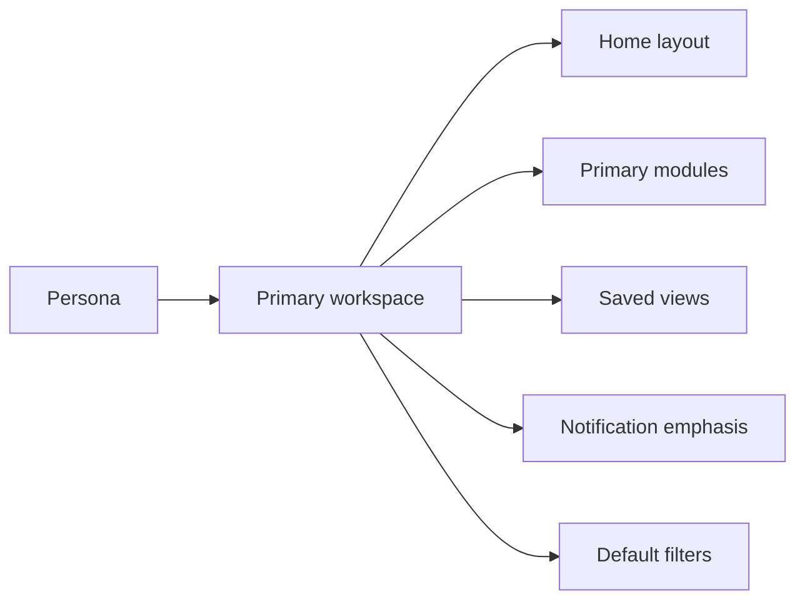
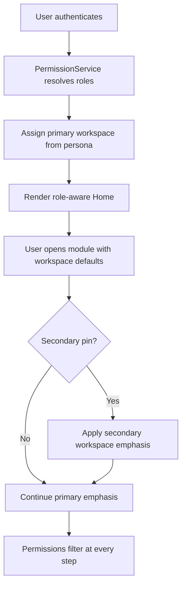

# APZ QEP — Role Workspaces

> **Programme:** APZQEP-DEF-002  
> **Note:** Substantive expansion of APZQEP-DEF-001 workspace catalogue. Product UX structure — not a technical deployment unit. Workspaces compose Home widgets, module emphasis, default filters, and saved views per persona.

## Workspace model

A **workspace** is a role-aware composition of Home widgets, primary modules, default filters, and saved views. Users land in a workspace matched to their primary persona; permissions remain authoritative — workspaces only affect emphasis and defaults.

### Cross-cutting workspace rules

| Rule | Definition |
| ---- | ---------- |
| Permission authority | Server-side permissions filter all modules, widgets, and actions — workspace never grants access |
| AI default | All workspaces assume **AI OFF** until Tenant Administrator authorises; AI widgets hidden when disabled |
| Manual first-class | Manual Testing and Exploratory workspaces require no automation or AI to be fully usable |
| Certification boundary | Only Release workspace (and configured co-approver views) expose certify actions; Auditor and AI Agent workspaces explicitly exclude them |
| Secondary pins | Users may pin secondary workspaces; pins are personal preferences, not permissions |
| Empty states | Every workspace empty state educates next action for that role — never a dead end |

---

## Workspace catalogue

| Workspace | Primary personas | Default Home emphasis | Primary modules |
| --------- | ---------------- | --------------------- | --------------- |
| Executive | Executive | Portfolio readiness; cert; top risks | Reporting; QI; Certification (view) |
| Product Owner | Product Owner | Coverage; defects; release scope | Requirements; Readiness; Defects |
| Analyst | Business Analyst | Requirement reviews | Requirements; Traceability; Knowledge |
| Delivery | Project Manager | Blockers; progress | Projects; Traceability; Defects; Home |
| QA Leadership | QA Manager | Suite progress; approvals | Library; Design; Execution; Risk |
| QA Engineering | QA Engineer | Design queue; gaps | Design; Library; Traceability |
| Manual Testing | Manual Tester | Assigned sessions | Execution; Evidence; Defects |
| Exploratory | Exploratory Tester | Charters | Execution; Evidence; Knowledge |
| Automation | Automation Engineer | Ingest health; flaky | Automation; Execution; Integrations |
| Developer | Developer | Assigned defects; failure evidence | Defects; MCP; Execution (read) |
| Release | Release Manager | Gates; cert queue | Readiness; Certification; Evidence |
| Operations | Operations Engineer | Integration health | Integrations; Admin (ops) |
| Support | Support Agent | Known limitations | Knowledge; Defects (read) |
| Security | Security Officer | Permission/policy changes | Admin; Audit; Risk |
| Compliance | Compliance Officer | Retention; compliance packs | Audit; Admin policies; Reporting |
| Auditor | Auditor | Investigation | Audit; Certification; Evidence |
| Customer | Customer Representative | Shared readiness | Reporting (shared) |
| Integrator | Third-party Integrator | Client health | Integrations; MCP |
| Platform Admin | Platform Administrator | Entitlements; identity | Administration; Integrations |
| Tenant Admin | Tenant Administrator | Policies; users; AI OFF | Administration; Audit |
| Agent | AI Agent | N/A (non-UI) | MCP tool context |

---

## Executive workspace

| Aspect | Definition |
| ------ | ---------- |
| **Purpose** | Portfolio-level situational awareness for quality investment and release risk without operational noise |
| **Visible roles** | Executive (primary); Compliance Officer and Customer Representative may receive read-only shared variants |
| **Default Home** | Portfolio readiness scorecard; certification status by product line; top five open risks; waiver exposure summary; recent certification decisions; escaped defect trend widget |
| **Primary modules** | Reporting and Analytics; Quality Intelligence (when entitled); Certification (view-only); Release Readiness (aggregated) |
| **Secondary modules** | Home; Portfolio and Projects (read); Risk (heatmap) |
| **Default filters** | Active portfolio projects; releases in next 90 days; certification status ≠ expired; risk rating ≥ high |
| **Saved views** | "Portfolio exceptions"; "Pending executive waivers"; "Certified last 30 days"; "Top risk products" |
| **Notifications emphasis** | Critical certification outcomes; rejected releases; high-severity post-cert defects; executive waiver chain |
| **Cross-navigation** | Drill from readiness widget → release detail → certification statement → evidence pack summary (read-only); risk widget → risk register → linked verifications |
| **Permission notes** | No mutate on verification, evidence, or certification; aggregated data only; sensitive project detail masked per policy |
| **Empty states intent** | When no active releases: guide to configure portfolio projects and readiness thresholds; link to Reporting module for historical packs |

---

## Product Owner workspace

| Aspect | Definition |
| ------ | ---------- |
| **Purpose** | Align product priorities with verification coverage, defect posture, and release scope decisions |
| **Visible roles** | Product Owner (primary); Business Analyst (secondary pin); Project Manager (read overlap on scope) |
| **Default Home** | Priority requirement coverage; open defects on current release scope; readiness gate status for owned products; waiver register; traceability gap count |
| **Primary modules** | Requirements; Release Readiness; Defects and Quality Issues |
| **Secondary modules** | Traceability; Home; Certification (view); Portfolio and Projects |
| **Default filters** | Owned projects; requirements status = approved or in review; defects severity ≥ major on release scope; gates status = open or failed |
| **Saved views** | "My release scope"; "Requirements awaiting my approval"; "Critical defects blocking readiness"; "Coverage gaps — priority requirements" |
| **Notifications emphasis** | Requirement review requests; readiness gate failures on owned scope; critical defects; waiver status updates |
| **Cross-navigation** | Requirement → linked verifications → execution status; defect → requirement trace; readiness gate → blocking evidence list |
| **Permission notes** | Approve requirements and initiate waivers per policy; cannot certify — Release workspace actions hidden |
| **Empty states intent** | No owned projects: prompt to request project ownership assignment; no requirements: link to Analyst workspace or import workflow |

---

## Analyst workspace

| Aspect | Definition |
| ------ | ---------- |
| **Purpose** | Author, refine, and baseline testable requirements with strong acceptance criteria and traceability foundations |
| **Visible roles** | Business Analyst (primary); Product Owner (approval overlap); Compliance Officer (regulatory requirement types) |
| **Default Home** | Requirements in review queue; missing acceptance criteria; dependency conflicts; baseline status; recent import/sync results |
| **Primary modules** | Requirements; Traceability; Knowledge and Learning |
| **Secondary modules** | Verification Design (read); Home; Portfolio and Projects |
| **Default filters** | Assigned author/reviewer; status = draft or in review; type filter per project profile; unlinked requirements |
| **Saved views** | "My drafts"; "Awaiting PO approval"; "Missing acceptance criteria"; "Regulatory requirements"; "Import conflicts" |
| **Notifications emphasis** | Review comments; approval outcomes; dependency changes; ALM sync conflicts when integration enabled |
| **Cross-navigation** | Requirement detail → acceptance criteria → traceability panel → linked verifications (read); requirement → risk linkage |
| **Permission notes** | Create/edit requirements; propose baselines; cannot approve unless policy allows self-approval |
| **Empty states intent** | No requirements in project: guided create or import path; empty traceability: prompt to link after approval |

---

## Delivery workspace

| Aspect | Definition |
| ------ | ---------- |
| **Purpose** | Track delivery progress and blockers across requirements, verification, defects, and release milestones |
| **Visible roles** | Project Manager (primary); Product Owner; QA Manager (read on programme status) |
| **Default Home** | Blocker board with aging; verification plan versus actual; defect burn-down on critical path; readiness timeline; team assignment summary |
| **Primary modules** | Portfolio and Projects; Traceability; Defects; Home |
| **Secondary modules** | Execution (summary); Release Readiness (schedule view) |
| **Default filters** | Assigned projects; blockers age > 3 days; milestones next 14 days; defects status = open on critical path |
| **Saved views** | "Critical blockers"; "This sprint verification progress"; "Release milestone tracker"; "Traceability completion %" |
| **Notifications emphasis** | Blocker escalations; overdue verification sessions; readiness schedule changes; critical defect assignments |
| **Cross-navigation** | Project dashboard → traceability matrix → session list → defect detail; milestone → readiness gates |
| **Permission notes** | Manage project metadata and milestones; read verification execution; no certification or library approval |
| **Empty states intent** | No assigned projects: request access from Tenant Admin; no blockers: show positive progress summary with next milestone dates |

---

## QA Leadership workspace

| Aspect | Definition |
| ------ | ---------- |
| **Purpose** | Govern verification programme standards, approvals, capacity, and risk across teams |
| **Visible roles** | QA Manager (primary); QA Engineer; Manual Tester leads (read on team queues) |
| **Default Home** | Suite and plan progress; approval queues (library and design); risk heatmap; team utilisation; coverage gap summary; automation linkage health (summary) |
| **Primary modules** | Verification Library; Verification Design; Execution and Sessions; Risk Management |
| **Secondary modules** | Release Readiness; Traceability; Home |
| **Default filters** | Programmes owned; approval status = pending; risk rating ≥ medium without treatment; sessions overdue |
| **Saved views** | "Pending my approval"; "High risk — no treatment"; "Team backlog"; "Manual vs automated mix"; "Library reuse candidates" |
| **Notifications emphasis** | Approval requests; high-risk escalations; critical session failures; readiness blockers from QA perspective |
| **Cross-navigation** | Approval queue → verification detail → traceability → risk link; execution summary → session evidence |
| **Permission notes** | Approve verification assets and risk treatments per policy; not default sole certifier unless also Release Manager |
| **Empty states intent** | Empty approval queue: show programme health metrics; no risks: prompt to import risk template or link requirements |

---

## QA Engineering workspace

| Aspect | Definition |
| ------ | ---------- |
| **Purpose** | Design reusable verifications, close coverage gaps, and maintain traceability quality |
| **Visible roles** | QA Engineer (primary); QA Manager (oversight); Automation Engineer (linkage collaboration) |
| **Default Home** | Design queue; coverage gaps on assigned scope; peer review inbox; reuse opportunities; automation identifier gaps |
| **Primary modules** | Verification Design; Verification Library; Traceability |
| **Secondary modules** | Execution (read); Risk; AI Quality Workspace (when AI authorised) |
| **Default filters** | Assigned designer; design status = draft or in review; gaps on priority requirements; peer review assigned to me |
| **Saved views** | "My design queue"; "Peer reviews waiting"; "Coverage gaps — release X"; "Ready for library promotion"; "Missing automation IDs" |
| **Notifications emphasis** | Peer review requests; requirement changes on linked verifications; coverage gap alerts |
| **Cross-navigation** | Design → requirement trace → library publish path; gap report → bulk link workflow |
| **Permission notes** | Create/edit designs; peer review; submit for QA Manager approval on shared templates |
| **Empty states intent** | No designs assigned: browse library for reuse or pull from approved requirements; AI workspace hidden until entitled |

---

## Manual Testing workspace

| Aspect | Definition |
| ------ | ---------- |
| **Purpose** | Execute structured manual verification with first-class session, evidence, and defect workflows — **MVP primary user** |
| **Visible roles** | Manual Tester (primary); QA Engineer (session review); QA Manager (team queue read) |
| **Default Home** | Assigned sessions today; overdue sessions; evidence completeness indicator; environment availability; quick-start last session |
| **Primary modules** | Execution and Sessions; Evidence; Defects and Quality Issues |
| **Secondary modules** | Home; Knowledge (known limitations); Verification Library (read procedures) |
| **Default filters** | Assignee = me; session status = assigned or in progress; due date ≤ 7 days; environment = current sprint target |
| **Saved views** | "Today's sessions"; "Blocked — environment"; "Incomplete evidence"; "My defects logged"; "Release X sessions" |
| **Notifications emphasis** | New assignments; environment issues; duplicate defect suggestions; session reassignment |
| **Cross-navigation** | Session → step execution → evidence attach → defect log; session → verification procedure read-only |
| **Permission notes** | Full manual execution without automation or AI; optional session sign-off per policy; no certification |
| **Empty states intent** | No assignments: show team queue if lead, otherwise link to Knowledge for self-training; celebrate completed sessions summary |

---

## Exploratory workspace

| Aspect | Definition |
| ------ | ---------- |
| **Purpose** | Charter-based discovery verification complementing scripted manual work |
| **Visible roles** | Exploratory Tester (primary); QA Manager (charter assignment); Manual Tester (secondary pin) |
| **Default Home** | Active charters; time-box progress; observations pending triage; recent findings with evidence; charter completion rate |
| **Primary modules** | Execution and Sessions (charter mode); Evidence; Knowledge and Learning |
| **Secondary modules** | Defects; Risk (observation promotion) |
| **Default filters** | Charter assignee = me; status = active; observations status = pending triage |
| **Saved views** | "Active charters"; "Findings to triage"; "This release charters"; "Promoted to knowledge" |
| **Notifications emphasis** | Charter assignments; triage outcomes; charter expiry reminders |
| **Cross-navigation** | Charter → session notes → evidence → defect proposal → knowledge article draft |
| **Permission notes** | Charter create/execute; propose defects; no certification |
| **Empty states intent** | No charters: prompt to request charter from QA Manager or select template charter from Knowledge |

---

## Automation workspace

| Aspect | Definition |
| ------ | ---------- |
| **Purpose** | Maintain automation linkage and ingest health — QEP does not execute runners internally |
| **Visible roles** | Automation Engineer (primary); Operations Engineer; QA Engineer (identifier collaboration) |
| **Default Home** | Ingest health dashboard; unlinked run count; flaky results leaderboard; integration status strip; mapping queue |
| **Primary modules** | Automation Management; Execution (run records); Integration Centre |
| **Secondary modules** | Traceability; Home |
| **Default filters** | Unlinked runs; flaky score above threshold; ingest errors last 24 hours; critical suite identifiers |
| **Saved views** | "Unlinked — critical suites"; "Flaky top 20"; "Ingest failures today"; "Pending mapping"; "Promotion candidates" |
| **Notifications emphasis** | Ingest failures; unlinked runs on release-critical suites; integration degradation |
| **Cross-navigation** | Unlinked run → map to verification → traceability confirm; integration error → ops escalation |
| **Permission notes** | Manage mappings and quarantine; cannot certify; MCP mutating mapping requires human approval when via agent |
| **Empty states intent** | No ingest data: guide to configure Integration Centre connector; all linked: show health score and flaky trend |

---

## Developer workspace

| Aspect | Definition |
| ------ | ---------- |
| **Purpose** | Resolve defects with full quality context and governed MCP access for IDE-integrated workflows |
| **Visible roles** | Developer (primary); QA Engineer (defect collaboration) |
| **Default Home** | Assigned defects by priority; failure evidence queue; re-verification status; MCP quick links (when entitled) |
| **Primary modules** | Defects and Quality Issues; MCP Developer Experience; Execution (read-only) |
| **Secondary modules** | Evidence; Traceability (read); Home |
| **Default filters** | Assignee = me; status = open or in progress; severity ≥ major; component = owned services |
| **Saved views** | "My critical defects"; "Awaiting re-verification"; "Failed automation on my components"; "Recently closed" |
| **Notifications emphasis** | New assignments; re-verification failures; mentions on defects |
| **Cross-navigation** | Defect → evidence → session/automation run → requirement trace → MCP context panel |
| **Permission notes** | Update assigned defects; MCP read default; mutating MCP tools require human approval; **cannot certify** |
| **Empty states intent** | No defects: show component quality summary and recent automation failures as proactive context |

---

## Release workspace

| Aspect | Definition |
| ------ | ---------- |
| **Purpose** | Assess readiness, assemble evidence, and execute **human certification** — Release Manager is **primary certifier** |
| **Visible roles** | Release Manager (primary); QA Manager; Product Owner; Compliance Officer (read); Executive (read briefing) |
| **Default Home** | Readiness gate board; certification queue; evidence pack completeness; open blockers; continuous certification signals (informational only); co-approver pending |
| **Primary modules** | Release Readiness; Certification; Evidence |
| **Secondary modules** | Traceability; Defects; Home; Reporting |
| **Default filters** | Releases status = candidate or in certification; gates failed or incomplete; packs completeness < 100%; signals unacknowledged |
| **Saved views** | "Certification queue"; "Failed gates"; "Packs ready for review"; "Approved with qualifications — active"; "Signals requesting re-cert" |
| **Notifications emphasis** | Gate failures; pack assembly complete; continuous signals; co-approver requests; approaching certification expiry |
| **Cross-navigation** | Release → gates → evidence gap list → pack builder → **certify / reject / qualifications** decision → locked pack |
| **Permission notes** | Full certification authority for Release Manager; signals **never** auto-flip certification status; AI narratives non-authoritative |
| **Empty states intent** | No releases in flight: show upcoming release calendar and last certification outcomes; guide to create release readiness record |

---

## Operations workspace

| Aspect | Definition |
| ------ | ---------- |
| **Purpose** | Monitor and restore operational health of integrations and quality data pipelines |
| **Visible roles** | Operations Engineer (primary); Automation Engineer; Platform Administrator (escalation) |
| **Default Home** | Integration health matrix; ingest error rate trend; environment readiness signals; open incidents; maintenance calendar |
| **Primary modules** | Integration Centre; Administration (operations subset) |
| **Secondary modules** | Automation Management; Home |
| **Default filters** | Integration status ≠ healthy; errors last 24 hours; environments degraded |
| **Saved views** | "Integration incidents"; "Degraded connectors"; "Scheduled maintenance"; "Release-blocking outages" |
| **Notifications emphasis** | Integration failures; SLA threshold breaches; maintenance windows; release-blocking alerts |
| **Cross-navigation** | Integration alert → connector detail → disable/enable action → Automation ingest impact view |
| **Permission notes** | Ops-level integration control; disable broken integrations with audit; no certification or tenant policy |
| **Empty states intent** | All healthy: show uptime SLA summary and last incident post-mortem link |

---

## Support workspace

| Aspect | Definition |
| ------ | ---------- |
| **Purpose** | Resolve user questions via knowledge-first guidance on APZ QEP workflows and known limitations |
| **Visible roles** | Support Agent (primary); Tenant Administrator (escalation) |
| **Default Home** | Known limitations spotlight; top support themes; recent knowledge updates; quick links to manual session and evidence guides |
| **Primary modules** | Knowledge and Learning; Defects (read-only for context) |
| **Secondary modules** | Home; Search |
| **Default filters** | Knowledge articles tagged support; defects product = QEP internal when configured |
| **Saved views** | "Known limitations"; "Manual verification FAQ"; "Certification policy FAQ"; "AI OFF guidance"; "Permission errors" |
| **Notifications emphasis** | Escalations from users; knowledge review requests; recurring theme thresholds |
| **Cross-navigation** | Knowledge article → related workflow doc → module deep link (read-only demo path) |
| **Permission notes** | Read-mostly; impersonation gated and audited; **cannot certify** or change AI policy |
| **Empty states intent** | Prompt to create FAQ from recurring ticket theme; link to Tenant Admin for access requests |

---

## Security workspace

| Aspect | Definition |
| ------ | ---------- |
| **Purpose** | Monitor permissions, privileged actions, and MCP/AI governance for security posture |
| **Visible roles** | Security Officer (primary); Tenant Administrator; Platform Administrator |
| **Default Home** | Permission anomaly feed; pending sensitive change approvals; MCP tool usage summary; AI enablement status (expect OFF default); privileged action timeline |
| **Primary modules** | Administration; Audit and Compliance; Risk Management (security items) |
| **Secondary modules** | Integration Centre (security review); Home |
| **Default filters** | Pending security approvals; audit events category = privileged; MCP mutating tool attempts; AI enablement requests |
| **Saved views** | "Pending my approval"; "Excessive privilege candidates"; "MCP policy violations"; "AI governance queue" |
| **Notifications emphasis** | Sensitive config changes; MCP mutating tool usage; AI enablement requests; security anomalies |
| **Cross-navigation** | Anomaly → user/role detail → audit trail → approval or remediation workflow |
| **Permission notes** | Approve sensitive changes; review MCP allowlists; cannot certify releases unless separate RM role |
| **Empty states intent** | No pending approvals: show last access review date and next scheduled review reminder |

---

## Compliance workspace

| Aspect | Definition |
| ------ | ---------- |
| **Purpose** | Manage retention, compliance packs, and regulatory alignment of certification evidence |
| **Visible roles** | Compliance Officer (primary); Auditor; Release Manager (pack coordination) |
| **Default Home** | Retention policy coverage; compliance pack generation status; certification expiry horizon; waiver compliance rate; export job queue |
| **Primary modules** | Audit and Compliance; Administration (policy trees); Reporting and Analytics |
| **Secondary modules** | Certification (view); Home |
| **Default filters** | Policies incomplete coverage; packs status = draft or failed; certifications expiring ≤ 30 days |
| **Saved views** | "Retention gaps"; "Packs in progress"; "Expiring certifications"; "Regulator export template X" |
| **Notifications emphasis** | Policy violations; export completion; certification expiry warnings |
| **Cross-navigation** | Policy → affected records → export wizard → manifest checksum → Auditor handoff |
| **Permission notes** | Manage compliance policies and exports; certification view read-only unless separate certifier role |
| **Empty states intent** | Guide to define retention classes and link to Certification view for sample pack structure |

---

## Auditor workspace

| Aspect | Definition |
| ------ | ---------- |
| **Purpose** | Independent investigation of certification integrity and privileged actions — **cannot certify** |
| **Visible roles** | Auditor (primary); Compliance Officer (export coordination) |
| **Default Home** | Investigation queue; certification sample plan; privileged action feed; export verification status; immutability attestation checklist |
| **Primary modules** | Audit and Compliance; Certification (read); Evidence (read) |
| **Secondary modules** | Administration (read); Home |
| **Default filters** | Sample period = current audit cycle; events category = certify or privileged; export status = pending verification |
| **Saved views** | "Certification sample — Q2"; "Privileged actions — admin"; "Export verification"; "Findings open" |
| **Notifications emphasis** | Export ready for verification; critical privileged actions; certification decisions in sample set |
| **Cross-navigation** | Audit event → certification decision → evidence pack manifest → session/run sample → finding record |
| **Permission notes** | Broad read; explicit deny on certify; independence from Release Manager role enforced |
| **Empty states intent** | Prompt to start audit cycle with sampling plan template; link to Compliance for export prerequisites |

---

## Customer workspace

| Aspect | Definition |
| ------ | ---------- |
| **Purpose** | Permission-filtered transparency for external stakeholders on readiness and certification |
| **Visible roles** | Customer Representative (primary); Executive shared invitees (read) |
| **Default Home** | Shared readiness summary; certification status for contracted scope; aggregated defect trend (no internal detail); published report list |
| **Primary modules** | Reporting and Analytics (shared catalog only) |
| **Secondary modules** | Home (limited widgets); Certification (shared view) |
| **Default filters** | Shared scope only; reports tagged customer-visible; certifications status = active or recent |
| **Saved views** | "My contracted releases"; "Latest shared packs"; "Certification history" |
| **Notifications emphasis** | Shared certification outcomes; new shared reports; scope change notices |
| **Cross-navigation** | Shared report → certification statement (redacted per policy) → download approved pack |
| **Permission notes** | Strictly read-only shared artefacts; no internal modules, admin, or certify |
| **Empty states intent** | Message that no shared content yet — contact account team; no internal data leakage in empty state |

---

## Integrator workspace

| Aspect | Definition |
| ------ | ---------- |
| **Purpose** | Develop, test, and maintain governed integrations and MCP tools — **cannot certify** |
| **Visible roles** | Third-party Integrator (primary); Platform Administrator (production promotion); Operations Engineer (health) |
| **Default Home** | Connector client health; sandbox test results; error taxonomy; credential expiry warnings; MCP tool registration status |
| **Primary modules** | Integration Centre; MCP Developer Experience |
| **Secondary modules** | Administration (limited); Automation (test ingest) |
| **Default filters** | Sandbox environment; failed tests last 7 days; connectors owned by integrator |
| **Saved views** | "Sandbox failures"; "Production promotion pending"; "MCP tools — draft"; "Error code reference" |
| **Notifications emphasis** | Connector failures; sandbox reset; credential expiry; promotion approval outcomes |
| **Cross-navigation** | Connector → sandbox test → error detail → manifest update → promotion request → Platform Admin queue |
| **Permission notes** | Sandbox write; production changes via Platform Admin approval; certify actions unavailable |
| **Empty states intent** | Guide to integration manifest and sandbox provisioning request |

---

## Platform Admin workspace

| Aspect | Definition |
| ------ | ---------- |
| **Purpose** | Platform-level entitlements, identity, and integration governance across tenants |
| **Visible roles** | Platform Administrator (primary); Tenant Administrator (downstream); Third-party Integrator (promotion requests) |
| **Default Home** | Entitlement matrix; tenant health summary; platform integration status; identity sync status; open provisioning jobs |
| **Primary modules** | Administration; Integration Centre |
| **Secondary modules** | Audit (platform scope); Home |
| **Default filters** | Tenants status = provisioning or degraded; pending entitlement requests; platform connectors unhealthy |
| **Saved views** | "Pending provisioning"; "Entitlement drift"; "Platform incidents"; "Integrator promotions" |
| **Notifications emphasis** | Platform incidents; entitlement requests; security escalations |
| **Cross-navigation** | Tenant → entitlements → module enablement → integrator promotion → audit confirm |
| **Permission notes** | Highest platform privileges; release certification requires separate Release Manager assignment |
| **Empty states intent** | On new platform: link to onboarding runbook; no tenants: guided first tenant provisioning |

---

## Tenant Admin workspace

| Aspect | Definition |
| ------ | ---------- |
| **Purpose** | Tenant policies, users, roles — **AI default OFF** until explicit authorisation with audit |
| **Visible roles** | Tenant Administrator (primary); Security Officer; Compliance Officer |
| **Default Home** | User and role matrix; pending access requests; **AI status OFF banner**; MCP policy summary; policy compliance indicators |
| **Primary modules** | Administration; Audit and Compliance |
| **Secondary modules** | Integration Centre (tenant scope); Home |
| **Default filters** | Access requests pending; roles with certifier flag; AI/MCP enablement requests open |
| **Saved views** | "Pending access"; "Certifier role holders"; "AI/MCP governance"; "Orphan assignments"; "Last access review" |
| **Notifications emphasis** | Access requests; AI enablement requests; MCP policy violations; permission review due |
| **Cross-navigation** | User → role assignment → permission preview → AI/MCP tab → audit trail |
| **Permission notes** | Tenant-wide admin; deliberate certifier role assignment; accidental AI enablement target = 0 |
| **Empty states intent** | First tenant setup wizard: identity source, default roles, confirm AI OFF, assign Release Manager certifiers |

---

## Agent workspace (non-UI)

| Aspect | Definition |
| ------ | ---------- |
| **Purpose** | Governed MCP and AI session context for PSN-DEF-21 AI Agent — not a standard shell workspace |
| **Visible roles** | AI Agent (actor); human supervisors via Audit and AI governance views |
| **Default Home** | N/A — no Home layout; activity surfaced in Audit and AI Quality Workspace session history |
| **Primary modules** | MCP Developer Experience (tool context); AI Quality Workspace (session host) |
| **Secondary modules** | Audit (agent action log) |
| **Default filters** | N/A — administrators filter agent audit by correlation ID, user session, tool name |
| **Saved views** | N/A for agent; admins use "Blocked mutating calls" and "Pending human approval" saved audit views |
| **Notifications emphasis** | Human approval requests for mutating MCP tools; policy violation blocks |
| **Cross-navigation** | Agent session → proposal → human approval queue in AI Workspace → SoR write on accept only |
| **Permission notes** | **Cannot certify**; mutating tools require human approval; AI never SoR without accept; tenant AI default OFF |
| **Empty states intent** | When AI disabled: agent context unavailable — Tenant Admin enablement path documented in Administration |

---

## Secondary workspaces

Personas may pin secondary workspaces to adapt emphasis without changing permissions. Common patterns:

| Primary persona | Typical secondary pins | Rationale |
| --------------- | ---------------------- | --------- |
| Executive | Delivery; Release (read) | Occasional drill-down on specific programme blockers |
| Product Owner | Analyst; Delivery | Requirement authoring overlap and milestone tracking |
| QA Manager | Release; Manual Testing | Readiness prep and team queue visibility |
| QA Engineer | Automation | Automation identifier collaboration |
| Manual Tester | Exploratory | Charter overlap for same individual |
| Release Manager | Executive; Compliance | Briefing prep and pack coordination |
| Developer | Automation (read) | Automation failure context |
| Security Officer | Tenant Admin (read) | Policy alignment reviews |
| Compliance Officer | Auditor | Export and sampling coordination |
| Auditor | Compliance | Shared export workflows |
| Operations Engineer | Automation | Ingest triage collaboration |

Pins persist per user session preferences and do not elevate privileges.

---

## Workspace selection flow

