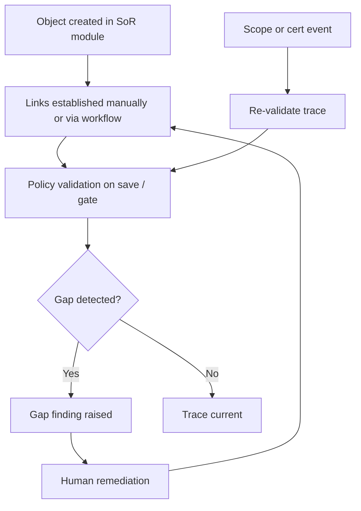
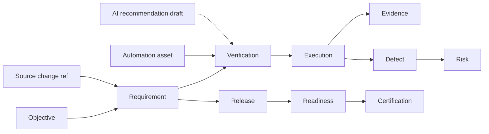

# APZ QEP — Traceability Model

> **Programme:** APZQEP-DEF-002

## Purpose

The Traceability Model defines how quality-relevant artefacts connect across the APZ QEP SoR — from business objectives through requirements, verification, execution, evidence, defects, risks, releases, approvals, and certification. It answers *can we prove what was required, what was verified, and what was certified?*

## Business rationale

Broken traceability is the leading cause of audit findings and release surprises. Spreadsheets and tool silos hide orphan requirements, unlinked automation, and certification claims without evidence. Central traceability in QEP supports coverage analysis, readiness gates, and auditor backward traversal without exposing ALM or CI internals as product identity.

## Core concepts

| Concept | Product meaning |
| ------- | ---------------- |
| Trace link | Governed relationship between two SoR objects |
| Forward trace | Requirement → verification → results → cert |
| Backward trace | Certification / defect → requirement origin |
| Coverage | Requirements with executed verification per policy |
| Gap | Missing or stale linkage |
| Orphan | Object without required parent/child link |
| Impact slice | Change-set affected requirements and verification |

## Linked domains

Business objectives · Requirements · Verification · Execution · Evidence · Defects · Risks · Releases · Approvals · Certification · Source changes · Automation assets · AI recommendations (draft until accepted)

## Primary objects

| Object | Description |
| ------ | ----------- |
| Trace link | Typed edge with creator and timestamp |
| Trace graph | Computed view for a scope |
| Coverage record | Requirement verification status aggregate |
| Gap finding | System-detected missing linkage |
| Orphan register | Items failing link policy |
| Impact report | Change-to-verification affect set |
| Unsupported claim | Cert scope lacking trace/evidence |

## Trace views

| View | Purpose |
| ---- | ------- |
| Forward | From requirement to verifications, results, certifications |
| Backward | From certification or defect back to requirements and objectives |
| Coverage gaps | Missing verification for in-scope requirements |
| Orphaned requirements | Requirements with no verification links |
| Unlinked verification | Verification not linked to requirements |
| Unverified changes | Changes in release scope without verification |
| Unsupported certification claims | Cert claims lacking evidence or trace |

## Lifecycle

Trace links persist through object versioning; historical links retained when requirements or verification versions supersede.

## Ownership

| Role | Ownership |
| ---- | --------- |
| Business Analyst / Product Owner | Objective and requirement linkage integrity |
| QA Engineer | Verification-to-requirement links |
| QA Manager | Coverage gap remediation prioritisation |
| Automation Engineer | Automation asset to verification links |
| Release Manager | Release scope trace completeness at readiness |

## Relationships

## States

| State | Applies to | Meaning |
| ----- | ---------- | ------- |
| Linked | Trace link | Valid relationship |
| Proposed | Trace link | Draft pending review |
| Broken | Gap finding | Policy violation detected |
| Waived | Gap finding | Accepted with risk/waiver |
| Stale | Coverage record | Verification outdated for requirement version |
| Complete | Coverage record | Policy satisfied |

## Business rules

| Rule | Statement |
| ---- | --------- |
| TR-01 | Certification scope must be backward-traceable to requirements unless waived |
| TR-02 | Orphan verification shall not count toward coverage without requirement link |
| TR-03 | AI-suggested links remain Proposed until human accept |
| TR-04 | Unsupported certification claims block Ready unless policy waiver |
| TR-05 | Trace history immutable — links superseded not deleted |
| TR-06 | Source change references link to requirements — not duplicate code SoR |
| TR-07 | Continuous signals may flag stale trace — never auto-certify |

## Approval rules

Proposed trace links from AI or bulk import require QA Engineer or QA Manager accept. Waiving trace gaps for readiness follows Risk Model acceptance. Requirement approval precedes verification link counting toward coverage.

## Role responsibilities

| Persona | Responsibility |
| ------- | ---------------- |
| Business Analyst | Maintains objective → requirement links |
| QA Engineer | Links verification design to requirements |
| Manual Tester | Confirms session execution links at completion |
| Automation Engineer | Maintains automation asset linkage |
| Release Manager | Reviews trace completeness at readiness |
| Auditor | Executes backward trace from cert |
| AI Agent | Proposes links — cannot finalize |

## Reporting

Coverage matrix, gap reports, orphan registers, impact analysis for change sets, certification trace pack, and trend of gap closure. Executive view: portfolio coverage percentage with confidence metadata.

## Search

Search by requirement ID, verification ID, release, gap type, orphan status, and cert ID. Unified search traverses links permission-filtered. “Show me everything for requirement X” is a primary navigation pattern.

## Audit

Link create, break, waive, and supersede events audited. Certification trace pack snapshot at lock includes link graph state. Bulk import trace operations logged with operator.

## AI considerations

AI default **OFF**. When enabled, AI may suggest missing links or gap explanations — Proposed until accepted. AI trace suggestions never satisfy gates alone.

## MCP considerations

MCP read: retrieve requirements, verification context, missing coverage for IDE scope. MCP write: propose verification drafts with proposed links — gated. No MCP bulk auto-link without human review queue.

## Future evolution

Semantic link suggestions, cross-project reuse graphs, and benchmark coverage metrics. Core forward/backward views remain stable.

## Boundary conditions

| In boundary | Out of boundary |
| ----------- | --------------- |
| Quality trace graph | Full ALM dependency management |
| Source change **references** | Git hosting |
| Automation asset references | Pipeline authoring |
| Gap detection for readiness | Auto-fix links without human |

## Example scenarios

**Scenario 1 — Forward audit prep:** QA Manager runs forward trace from release scope requirements. Two lack executed verification — gaps assigned before readiness.

**Scenario 2 — Backward from defect:** Production defect links backward to requirement and missed verification. Retest and trace update before re-certification request.

**Scenario 3 — Unsupported claim:** Certifier sees unsupported claim flag — cert scope includes requirement without evidence link. Release Manager adds evidence and links before approval.

**Scenario 4 — AI proposed link:** AI suggests linking automation asset to verification; QA Engineer accepts one, rejects two — audit shows decisions.
