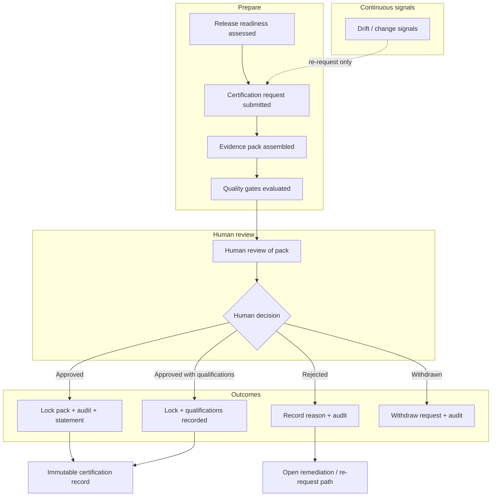

# APZ QEP — End-to-End User Workflows

> **Programme:** APZQEP-DEF-002 expansion  
> **Prior baseline:** APZQEP-DEF-001  
> **Cross-check:** Personas · Modules · Requirements · Constitution · Evidence · Human approval · Certification · Boundaries  
> **Terminology:** Prefer _verification_; classical test cases are a form of verification procedure.  
> **Governing posture:** AI features **OFF by default** · human certification **mandatory** · MCP **cannot autonomously certify**.

## Workflow index

| ID    | Workflow                                   | Primary persona                  |
| ----- | ------------------------------------------ | -------------------------------- |
| WF-01 | Create a project quality workspace         | PO / QA Manager                  |
| WF-02 | Import or create requirements              | BA                               |
| WF-03 | Review and approve requirements            | PO                               |
| WF-04 | Create manual verification                 | QA Engineer                      |
| WF-05 | Create verification from template          | QA Engineer                      |
| WF-06 | Generate AI-assisted verification          | QA Engineer                      |
| WF-07 | Review AI-generated verification           | QA Engineer                      |
| WF-08 | Approve verification                       | QA Manager                       |
| WF-09 | Plan a verification cycle                  | QA Manager                       |
| WF-10 | Execute a manual verification session      | Manual Tester                    |
| WF-11 | Ingest automated results                   | Automation Engineer              |
| WF-12 | Investigate a failure                      | QA / Developer                   |
| WF-13 | Create a defect                            | Manual Tester / QA               |
| WF-14 | Synchronise a defect externally            | Developer / Integrator           |
| WF-15 | Resolve and retest a defect                | Developer / Tester               |
| WF-16 | Capture evidence                           | Tester                           |
| WF-17 | Review evidence                            | QA / Release Manager             |
| WF-18 | Build traceability                         | BA / QA                          |
| WF-19 | Analyse coverage gaps                      | QA Engineer                      |
| WF-20 | Assess release risk                        | Release Manager                  |
| WF-21 | Prepare release readiness                  | Release Manager                  |
| WF-22 | Request certification                      | Release Manager                  |
| WF-23 | Review a certification pack                | Release Manager / Auditor        |
| WF-24 | Approve a certification                    | Release Manager (+ co-approvers) |
| WF-25 | Approve with operational qualifications    | Release Manager                  |
| WF-26 | Reject certification                       | Release Manager / co-approver    |
| WF-27 | Reproduce a prior certification            | Auditor                          |
| WF-28 | Investigate an audit event                 | Auditor                          |
| WF-29 | Query quality using natural language       | QA / Executive (AI on)           |
| WF-30 | Use QEP through Cursor or another IDE      | Developer                        |
| WF-31 | Submit verification proposal through MCP   | Developer / Agent                |
| WF-32 | Review and approve MCP-originated proposal | QA Engineer                      |
| WF-33 | Review executive quality status            | Executive                        |
| WF-34 | Review compliance evidence                 | Compliance / Auditor             |
| WF-35 | Create and approve a waiver                | Release Manager / PO             |

## Workflow definition pattern

Each workflow below defines end-to-end user behaviour at product level. Fields describe business intent only — no architecture, database, API, or implementation detail.

---

### WF-01 Create project quality workspace

| Field                    | Definition                                                                                                                                                                                                                                                                                                                                                                                                                                                                                                                                                                                                                                                                                                                                      |
| ------------------------ | ----------------------------------------------------------------------------------------------------------------------------------------------------------------------------------------------------------------------------------------------------------------------------------------------------------------------------------------------------------------------------------------------------------------------------------------------------------------------------------------------------------------------------------------------------------------------------------------------------------------------------------------------------------------------------------------------------------------------------------------------- |
| **Workflow identifier**  | WF-01                                                                                                                                                                                                                                                                                                                                                                                                                                                                                                                                                                                                                                                                                                                                           |
| **Business purpose**     | Establish a governed quality scope for a product, application, or customer context so all requirements, verifications, evidence, and certification artefacts have a single authoritative home within APZ QEP.                                                                                                                                                                                                                                                                                                                                                                                                                                                                                                                                   |
| **Trigger**              | A new product, release train, customer engagement, or internal APZHUB portfolio item requires quality governance.                                                                                                                                                                                                                                                                                                                                                                                                                                                                                                                                                                                                                               |
| **Primary persona**      | Product Owner (PSN-DEF-02) / QA Manager (PSN-DEF-05)                                                                                                                                                                                                                                                                                                                                                                                                                                                                                                                                                                                                                                                                                            |
| **Supporting personas**  | Tenant Administrator (PSN-DEF-20); Platform Administrator (PSN-DEF-19); Project Manager (PSN-DEF-04)                                                                                                                                                                                                                                                                                                                                                                                                                                                                                                                                                                                                                                            |
| **Entry criteria**       | User is authenticated; tenant is active; user holds project-creation permission for the target scope.                                                                                                                                                                                                                                                                                                                                                                                                                                                                                                                                                                                                                                           |
| **Preconditions**        | APZHUB workspace context exists or is creatable; quality product entitlement is enabled for the tenant; naming and ownership policies are defined.                                                                                                                                                                                                                                                                                                                                                                                                                                                                                                                                                                                              |
| **Inputs**               | Project name and description; owning organisation or portfolio; target environments (e.g. development, staging, production); optional external reference identifiers; optional template selection.                                                                                                                                                                                                                                                                                                                                                                                                                                                                                                                                              |
| **Main flow**            | 1. User opens Portfolio and Projects and initiates **Create quality workspace**. 2. User enters name, description, and scope boundaries. 3. User assigns primary owner (PO or QA Manager) and optional co-owners. 4. User configures environment labels relevant to verification and release. 5. User optionally links external portfolio or ALM references for traceability context. 6. User optionally applies an organisational project template (structure, default roles, baseline folders). 7. User reviews summary and confirms creation. 8. System activates the workspace and surfaces it in role-aware navigation. 9. User receives confirmation and is directed to next recommended actions (requirements or verification planning). |
| **Alternative flows**    | **A1 — From template:** User selects an approved organisational template; editable fields pre-populate; user adjusts owners and environments before activation. **A2 — Clone existing:** User duplicates structure from a prior project with copy/link policy for library items; user confirms what copies versus links. **A3 — Admin-assisted:** Tenant Admin creates shell; PO/QA Manager completes configuration later.                                                                                                                                                                                                                                                                                                                      |
| **Exception flows**      | **E1 — Duplicate name:** Creation blocked; user chooses rename or merge request per tenant policy. **E2 — Missing entitlement:** User informed product not enabled; directed to Tenant Admin. **E3 — Invalid owner:** Selected owner lacks required permission; user must pick an eligible owner. **E4 — Abandon draft:** Partial entry discarded; no workspace created; no audit of activation.                                                                                                                                                                                                                                                                                                                                                |
| **Decision points**      | Whether to use template vs blank; whether to clone vs create fresh; which environments to include; whether external references are mandatory per policy.                                                                                                                                                                                                                                                                                                                                                                                                                                                                                                                                                                                        |
| **Approval points**      | Owner assignment may require Tenant Admin confirmation when policy mandates segregated duties.                                                                                                                                                                                                                                                                                                                                                                                                                                                                                                                                                                                                                                                  |
| **Evidence generated**   | None at creation; workspace metadata becomes future anchor for all evidence.                                                                                                                                                                                                                                                                                                                                                                                                                                                                                                                                                                                                                                                                    |
| **Audit events**         | Project/workspace created; owner assigned; configuration updated; activation.                                                                                                                                                                                                                                                                                                                                                                                                                                                                                                                                                                                                                                                                   |
| **Notifications**        | Assigned owners notified of new workspace responsibility; optional PM notification if configured.                                                                                                                                                                                                                                                                                                                                                                                                                                                                                                                                                                                                                                               |
| **AI participation**     | None. AI features OFF by default; no AI involvement in project creation.                                                                                                                                                                                                                                                                                                                                                                                                                                                                                                                                                                                                                                                                        |
| **Human approvals**      | Implicit approval by authorised creator; explicit owner acceptance where policy requires.                                                                                                                                                                                                                                                                                                                                                                                                                                                                                                                                                                                                                                                       |
| **Exit criteria**        | Active quality workspace visible to permitted users; owners assigned; environments defined.                                                                                                                                                                                                                                                                                                                                                                                                                                                                                                                                                                                                                                                     |
| **Final state**          | **Active project quality workspace** ready for requirements and verification work.                                                                                                                                                                                                                                                                                                                                                                                                                                                                                                                                                                                                                                                              |
| **Related modules**      | Portfolio and Projects; Home and Command Centre; Administration                                                                                                                                                                                                                                                                                                                                                                                                                                                                                                                                                                                                                                                                                 |
| **Related requirements** | FR-001; FR-027; FR-028; FR-040; BR-011; BR-015; IR-009; IR-002                                                                                                                                                                                                                                                                                                                                                                                                                                                                                                                                                                                                                                                                                  |
| **Related personas**     | PSN-DEF-02; PSN-DEF-05; PSN-DEF-20; PSN-DEF-04                                                                                                                                                                                                                                                                                                                                                                                                                                                                                                                                                                                                                                                                                                  |
| **Business rules**       | One authoritative QEP scope per governed product context; no engine brands in user-facing labels; permissions server-authoritative; tenant isolation mandatory.                                                                                                                                                                                                                                                                                                                                                                                                                                                                                                                                                                                 |
| **Failure handling**     | Block creation on validation errors; preserve draft where supported; surface clear remediation message.                                                                                                                                                                                                                                                                                                                                                                                                                                                                                                                                                                                                                                         |
| **Recovery handling**    | User corrects inputs and retries; Admin resolves entitlement or permission gaps.                                                                                                                                                                                                                                                                                                                                                                                                                                                                                                                                                                                                                                                                |
| **Success measures**     | Time to first active workspace; % workspaces with assigned owner within SLA; zero cross-tenant leakage incidents.                                                                                                                                                                                                                                                                                                                                                                                                                                                                                                                                                                                                                               |
| **Future enhancements**  | Portfolio-level roll-up dashboards; automated provisioning from APZHUB product registry; industry overlay templates.                                                                                                                                                                                                                                                                                                                                                                                                                                                                                                                                                                                                                            |

### WF-02 Import or create requirements

| Field                    | Definition                                                                                                                                                                                                                                                                                                                                                                                                                                                                                                                                                                             |
| ------------------------ | -------------------------------------------------------------------------------------------------------------------------------------------------------------------------------------------------------------------------------------------------------------------------------------------------------------------------------------------------------------------------------------------------------------------------------------------------------------------------------------------------------------------------------------------------------------------------------------- |
| **Workflow identifier**  | WF-02                                                                                                                                                                                                                                                                                                                                                                                                                                                                                                                                                                                  |
| **Business purpose**     | Capture quality-relevant requirements as versioned, searchable entities that anchor verification design, traceability, and release readiness.                                                                                                                                                                                                                                                                                                                                                                                                                                          |
| **Trigger**              | New feature, regulation, customer contract, or quality objective needs documented requirements before verification can be planned.                                                                                                                                                                                                                                                                                                                                                                                                                                                     |
| **Primary persona**      | Business Analyst (PSN-DEF-03)                                                                                                                                                                                                                                                                                                                                                                                                                                                                                                                                                          |
| **Supporting personas**  | Product Owner (PSN-DEF-02); QA Engineer (PSN-DEF-06); Project Manager (PSN-DEF-04)                                                                                                                                                                                                                                                                                                                                                                                                                                                                                                     |
| **Entry criteria**       | Active quality workspace; user holds requirement author or import permission.                                                                                                                                                                                                                                                                                                                                                                                                                                                                                                          |
| **Preconditions**        | Requirement taxonomy (type, priority, tags) available; import source vetted if external; workspace not archived.                                                                                                                                                                                                                                                                                                                                                                                                                                                                       |
| **Inputs**               | Requirement title and description; acceptance criteria; priority; type; tags; parent/child hierarchy; optional import file or external reference; optional links to risks or releases.                                                                                                                                                                                                                                                                                                                                                                                                 |
| **Main flow**            | 1. User opens Requirements within the target workspace. 2. User chooses **Create** or **Import**. 3. For create: user enters structured fields and acceptance criteria. 4. For import: user selects supported format, maps fields, previews records. 5. User assigns initial status (typically Draft or Proposed). 6. User optionally links requirement to release, risk, or product area. 7. User saves; system assigns version and searchable metadata. 8. User notifies reviewers or adds to review queue per team practice. 9. Requirement awaits WF-03 review unless auto-routed. |
| **Alternative flows**    | **A1 — Bulk import:** BA imports spreadsheet or ALM export; resolves duplicates via merge or skip rules. **A2 — Derive from document:** BA links Platform Document reference as source artefact without duplicating document body in QEP. **A3 — Split requirement:** BA decomposes large requirement into child requirements with retained parent link.                                                                                                                                                                                                                               |
| **Exception flows**      | **E1 — Import validation failure:** Rows rejected with line-level errors; user fixes source and re-imports. **E2 — Duplicate detected:** User merges, supersedes, or marks as duplicate link. **E3 — Missing mandatory fields:** Save blocked until corrected. **E4 — Permission denied on target release link:** Link omitted or escalated to PO.                                                                                                                                                                                                                                     |
| **Decision points**      | Create vs import; decompose vs single requirement; which release or risk to associate; duplicate handling strategy.                                                                                                                                                                                                                                                                                                                                                                                                                                                                    |
| **Approval points**      | None at capture stage; approval occurs in WF-03.                                                                                                                                                                                                                                                                                                                                                                                                                                                                                                                                       |
| **Evidence generated**   | Requirement record and version history; import manifest when applicable.                                                                                                                                                                                                                                                                                                                                                                                                                                                                                                               |
| **Audit events**         | Requirement created; imported; updated; version incremented; linked to release/risk.                                                                                                                                                                                                                                                                                                                                                                                                                                                                                                   |
| **Notifications**        | Reviewers notified when requirement submitted for approval; PO notified of bulk imports if policy requires.                                                                                                                                                                                                                                                                                                                                                                                                                                                                            |
| **AI participation**     | Optional requirement analysis (AIR-002) when AI programme authorised — suggestions only; never auto-commits to SoR. Default: **OFF**.                                                                                                                                                                                                                                                                                                                                                                                                                                                  |
| **Human approvals**      | Not required at capture; human approval in WF-03.                                                                                                                                                                                                                                                                                                                                                                                                                                                                                                                                      |
| **Exit criteria**        | One or more requirements saved in Draft/Proposed state with complete mandatory metadata.                                                                                                                                                                                                                                                                                                                                                                                                                                                                                               |
| **Final state**          | **Captured requirement(s)** awaiting review or already linked into traceability graph.                                                                                                                                                                                                                                                                                                                                                                                                                                                                                                 |
| **Related modules**      | Requirements; Traceability; Search and Navigation; Knowledge and Learning                                                                                                                                                                                                                                                                                                                                                                                                                                                                                                              |
| **Related requirements** | FR-002; FR-003; FR-032; FR-026; BR-006; BR-016; AIR-002; IR-007; IR-012                                                                                                                                                                                                                                                                                                                                                                                                                                                                                                                |
| **Related personas**     | PSN-DEF-03; PSN-DEF-02; PSN-DEF-06                                                                                                                                                                                                                                                                                                                                                                                                                                                                                                                                                     |
| **Business rules**       | Requirements must be versioned; quality-relevant acceptance criteria encouraged; bidirectional traceability enabled once approved; no silent overwrite of approved baseline without new version.                                                                                                                                                                                                                                                                                                                                                                                       |
| **Failure handling**     | Partial import rollback per record where supported; preserve user draft on transient errors.                                                                                                                                                                                                                                                                                                                                                                                                                                                                                           |
| **Recovery handling**    | Re-import corrected rows; manual create for failed records; Admin resolves connector issues for ALM-sourced imports.                                                                                                                                                                                                                                                                                                                                                                                                                                                                   |
| **Success measures**     | Requirement capture cycle time; import error rate; % requirements with acceptance criteria populated.                                                                                                                                                                                                                                                                                                                                                                                                                                                                                  |
| **Future enhancements**  | ALM bidirectional sync; AI ambiguity hints when authorised; requirement quality scoring.                                                                                                                                                                                                                                                                                                                                                                                                                                                                                               |

### WF-03 Review and approve requirements

| Field                    | Definition                                                                                                                                                                                                                                                                                                                                                                                                                                                                                                                                                                                                                                                                                        |
| ------------------------ | ------------------------------------------------------------------------------------------------------------------------------------------------------------------------------------------------------------------------------------------------------------------------------------------------------------------------------------------------------------------------------------------------------------------------------------------------------------------------------------------------------------------------------------------------------------------------------------------------------------------------------------------------------------------------------------------------- |
| **Workflow identifier**  | WF-03                                                                                                                                                                                                                                                                                                                                                                                                                                                                                                                                                                                                                                                                                             |
| **Business purpose**     | Ensure requirements are testable, unambiguous, and formally approved before they drive verification design, coverage measurement, and release gates.                                                                                                                                                                                                                                                                                                                                                                                                                                                                                                                                              |
| **Trigger**              | One or more requirements reach Proposed or In Review and require a formal approve/reject decision before verification design proceeds.                                                                                                                                                                                                                                                                                                                                                                                                                                                                                                                                                            |
| **Primary persona**      | Product Owner (PSN-DEF-02)                                                                                                                                                                                                                                                                                                                                                                                                                                                                                                                                                                                                                                                                        |
| **Supporting personas**  | Business Analyst (PSN-DEF-03); QA Engineer (PSN-DEF-06); QA Manager (PSN-DEF-05)                                                                                                                                                                                                                                                                                                                                                                                                                                                                                                                                                                                                                  |
| **Entry criteria**       | Requirement exists in Proposed or In Review state; reviewer holds approve/reject permission.                                                                                                                                                                                                                                                                                                                                                                                                                                                                                                                                                                                                      |
| **Preconditions**        | Mandatory fields complete; linked context visible; no blocking policy violations (e.g. missing acceptance criteria when required).                                                                                                                                                                                                                                                                                                                                                                                                                                                                                                                                                                |
| **Inputs**               | Requirement version under review; reviewer comments; optional change requests; optional baseline membership request.                                                                                                                                                                                                                                                                                                                                                                                                                                                                                                                                                                              |
| **Main flow**            | 1. PO or delegate opens requirement review queue or notification link. 2. Reviewer reads description, acceptance criteria, and trace links. 3. Reviewer optionally requests BA clarification (returns to Draft/Proposed). 4. Reviewer evaluates testability and scope alignment. 5. Reviewer chooses **Approve**, **Reject**, or **Request changes**. 6. On approve: status becomes Approved; version locked for baseline eligibility. 7. On reject: reason recorded; BA notified. 8. On request changes: requirement returns to author with comments. 9. Optional: reviewer adds approved requirement to release baseline. 10. Traceability views update to show approved coverage expectations. |
| **Alternative flows**    | **A1 — Delegated review:** QA Manager performs technical review; PO performs final approval per policy. **A2 — Baseline batch:** PO approves set and baselines for a release milestone in one action. **A3 — Supersede:** Approved requirement replaced by new version; old version marked superseded with reason.                                                                                                                                                                                                                                                                                                                                                                                |
| **Exception flows**      | **E1 — Concurrent edit conflict:** Reviewer prompted to refresh or merge comments. **E2 — Approver unavailable:** Escalation to alternate approver per workflow policy. **E3 — Attempt to approve incomplete requirement:** Blocked by validation rule.                                                                                                                                                                                                                                                                                                                                                                                                                                           |
| **Decision points**      | Approve vs reject vs request changes; include in baseline or not; supersede vs amend.                                                                                                                                                                                                                                                                                                                                                                                                                                                                                                                                                                                                             |
| **Approval points**      | **Human requirement approval mandatory** — no automated approval path.                                                                                                                                                                                                                                                                                                                                                                                                                                                                                                                                                                                                                            |
| **Evidence generated**   | Approval record with actor, timestamp, and optional comment; baseline membership record when applied.                                                                                                                                                                                                                                                                                                                                                                                                                                                                                                                                                                                             |
| **Audit events**         | Requirement approved; rejected; change requested; baselined; superseded.                                                                                                                                                                                                                                                                                                                                                                                                                                                                                                                                                                                                                          |
| **Notifications**        | BA notified of decision; QA notified when approved requirements ready for verification design; PM notified of baseline changes if configured.                                                                                                                                                                                                                                                                                                                                                                                                                                                                                                                                                     |
| **AI participation**     | Optional testability analysis (AIR-002) visible to reviewer when AI authorised — informational only. Default: **OFF**.                                                                                                                                                                                                                                                                                                                                                                                                                                                                                                                                                                            |
| **Human approvals**      | PO (or configured approver role) must explicitly approve.                                                                                                                                                                                                                                                                                                                                                                                                                                                                                                                                                                                                                                         |
| **Exit criteria**        | Requirement reaches terminal review outcome: Approved, Rejected, or returned for rework.                                                                                                                                                                                                                                                                                                                                                                                                                                                                                                                                                                                                          |
| **Final state**          | **Approved requirement** (or documented rejection) eligible for traceability and verification linking.                                                                                                                                                                                                                                                                                                                                                                                                                                                                                                                                                                                            |
| **Related modules**      | Requirements; Traceability; Release Readiness                                                                                                                                                                                                                                                                                                                                                                                                                                                                                                                                                                                                                                                     |
| **Related requirements** | FR-002; FR-003; FR-032; FR-038; BR-016; BR-021; AIR-002; IR-010                                                                                                                                                                                                                                                                                                                                                                                                                                                                                                                                                                                                                                   |
| **Related personas**     | PSN-DEF-02; PSN-DEF-03; PSN-DEF-05; PSN-DEF-06                                                                                                                                                                                                                                                                                                                                                                                                                                                                                                                                                                                                                                                    |
| **Business rules**       | Only approved requirements count toward formal coverage gates; rejection requires reason; approval is audited and immutable in history.                                                                                                                                                                                                                                                                                                                                                                                                                                                                                                                                                           |
| **Failure handling**     | Block approval if gates not met; retain prior state on system error.                                                                                                                                                                                                                                                                                                                                                                                                                                                                                                                                                                                                                              |
| **Recovery handling**    | Re-review after author addresses changes; Admin restores reviewer assignment if misconfigured.                                                                                                                                                                                                                                                                                                                                                                                                                                                                                                                                                                                                    |
| **Success measures**     | Approval cycle time; rejection rate with documented reasons; % approved requirements with linked verifications within SLA.                                                                                                                                                                                                                                                                                                                                                                                                                                                                                                                                                                        |
| **Future enhancements**  | Multi-step approval chains via Platform Workflow when execute authorised; diff view between versions.                                                                                                                                                                                                                                                                                                                                                                                                                                                                                                                                                                                             |

### WF-04 Create manual verification

| Field                    | Definition                                                                                                                                                                                                                                                                                                                                                                                                                                                                                              |
| ------------------------ | ------------------------------------------------------------------------------------------------------------------------------------------------------------------------------------------------------------------------------------------------------------------------------------------------------------------------------------------------------------------------------------------------------------------------------------------------------------------------------------------------------- |
| **Workflow identifier**  | WF-04                                                                                                                                                                                                                                                                                                                                                                                                                                                                                                   |
| **Business purpose**     | Author structured manual verification procedures with steps, expected outcomes, and metadata so testers can execute consistently and results trace to requirements.                                                                                                                                                                                                                                                                                                                                     |
| **Trigger**              | Approved requirements need manual verification coverage; new feature or change requires bespoke procedure not satisfied by library reuse.                                                                                                                                                                                                                                                                                                                                                               |
| **Primary persona**      | QA Engineer (PSN-DEF-06)                                                                                                                                                                                                                                                                                                                                                                                                                                                                                |
| **Supporting personas**  | QA Manager (PSN-DEF-05); Manual Tester (PSN-DEF-07); Business Analyst (PSN-DEF-03)                                                                                                                                                                                                                                                                                                                                                                                                                      |
| **Entry criteria**       | Active workspace; user holds verification author permission; target requirements approved or explicitly marked in-progress per policy.                                                                                                                                                                                                                                                                                                                                                                  |
| **Preconditions**        | Verification design area accessible; naming and tagging standards defined; optional link targets exist.                                                                                                                                                                                                                                                                                                                                                                                                 |
| **Inputs**               | Procedure title; objective; preconditions; ordered steps; expected result per step; priority; tags; links to requirements, risks, or suites.                                                                                                                                                                                                                                                                                                                                                            |
| **Main flow**            | 1. QA Engineer opens Verification Design. 2. User initiates **Create manual verification**. 3. User enters objective, scope, and preconditions. 4. User adds steps with expected outcomes and optional data hints. 5. User links one or more approved requirements (traceability). 6. User assigns priority, tags, and ownership. 7. User saves as Draft. 8. User optionally submits for peer or manager review (WF-08 path). 9. Procedure remains Draft until approved for Library or cycle inclusion. |
| **Alternative flows**    | **A1 — Copy from Library:** User duplicates existing approved procedure and adapts for new context. **A2 — Session-derived:** After exploratory work, user formalises observed steps into new procedure (manual promotion). **A3 — Co-authoring:** Multiple QA Engineers edit draft with comment trail before submission.                                                                                                                                                                               |
| **Exception flows**      | **E1 — Link to unapproved requirement:** Warning or block per policy. **E2 — Empty steps:** Save blocked. **E3 — Duplicate procedure name:** User renames or links to existing instead.                                                                                                                                                                                                                                                                                                                 |
| **Decision points**      | New vs copy; granularity of steps; which requirements to link; submit now vs keep draft.                                                                                                                                                                                                                                                                                                                                                                                                                |
| **Approval points**      | Optional peer review before WF-08 formal approval.                                                                                                                                                                                                                                                                                                                                                                                                                                                      |
| **Evidence generated**   | Procedure draft and version history; design-time comments.                                                                                                                                                                                                                                                                                                                                                                                                                                              |
| **Audit events**         | Verification created; updated; linked; submitted for approval.                                                                                                                                                                                                                                                                                                                                                                                                                                          |
| **Notifications**        | QA Manager notified on submission for approval; linked requirement owners notified if configured.                                                                                                                                                                                                                                                                                                                                                                                                       |
| **AI participation**     | None in this workflow (see WF-06 for AI-assisted authoring). Default: **OFF**.                                                                                                                                                                                                                                                                                                                                                                                                                          |
| **Human approvals**      | Authoring does not require approval; Library entry requires WF-08.                                                                                                                                                                                                                                                                                                                                                                                                                                      |
| **Exit criteria**        | Manual verification procedure saved with at least one step and mandatory metadata.                                                                                                                                                                                                                                                                                                                                                                                                                      |
| **Final state**          | **Draft manual verification procedure** ready for review, approval, or cycle planning.                                                                                                                                                                                                                                                                                                                                                                                                                  |
| **Related modules**      | Verification Design; Verification Library; Traceability; Requirements                                                                                                                                                                                                                                                                                                                                                                                                                                   |
| **Related requirements** | FR-006; FR-010; FR-014; FR-032; BR-016; SR-006                                                                                                                                                                                                                                                                                                                                                                                                                                                          |
| **Related personas**     | PSN-DEF-06; PSN-DEF-05; PSN-DEF-07                                                                                                                                                                                                                                                                                                                                                                                                                                                                      |
| **Business rules**       | Verification terminology in UI; steps must have expected outcomes; trace links encouraged at authoring time; draft procedures cannot satisfy release gates until approved.                                                                                                                                                                                                                                                                                                                              |
| **Failure handling**     | Autosave draft where supported; block publish on validation failure.                                                                                                                                                                                                                                                                                                                                                                                                                                    |
| **Recovery handling**    | Restore from version history; re-link requirements after correction.                                                                                                                                                                                                                                                                                                                                                                                                                                    |
| **Success measures**     | Procedures authored per sprint; reuse rate from Library; % procedures with requirement links at creation.                                                                                                                                                                                                                                                                                                                                                                                               |
| **Future enhancements**  | Rich media step attachments; pairwise parameter hints; knowledge base snippets inline.                                                                                                                                                                                                                                                                                                                                                                                                                  |

### WF-05 Create verification from template

| Field                    | Definition                                                                                                                                                                                                                                                                                                                                                                                                                                                                                                                 |
| ------------------------ | -------------------------------------------------------------------------------------------------------------------------------------------------------------------------------------------------------------------------------------------------------------------------------------------------------------------------------------------------------------------------------------------------------------------------------------------------------------------------------------------------------------------------- |
| **Workflow identifier**  | WF-05                                                                                                                                                                                                                                                                                                                                                                                                                                                                                                                      |
| **Business purpose**     | Accelerate consistent verification authoring by applying organisational or industry templates while preserving human edit and approval control.                                                                                                                                                                                                                                                                                                                                                                            |
| **Trigger**              | Standard verification pattern exists as template; team wants faster, standardised procedure creation.                                                                                                                                                                                                                                                                                                                                                                                                                      |
| **Primary persona**      | QA Engineer (PSN-DEF-06)                                                                                                                                                                                                                                                                                                                                                                                                                                                                                                   |
| **Supporting personas**  | QA Manager (PSN-DEF-05); Tenant Administrator (PSN-DEF-20)                                                                                                                                                                                                                                                                                                                                                                                                                                                                 |
| **Entry criteria**       | Template catalogue available; user holds template apply and verification author permissions.                                                                                                                                                                                                                                                                                                                                                                                                                               |
| **Preconditions**        | Selected template is active and entitled for tenant; target workspace active.                                                                                                                                                                                                                                                                                                                                                                                                                                              |
| **Inputs**               | Template selection; parameter overrides (title, environment, requirement links); optional suite placement.                                                                                                                                                                                                                                                                                                                                                                                                                 |
| **Main flow**            | 1. QA Engineer opens Verification Design or Templates. 2. User browses or searches template catalogue. 3. User previews template structure and applicability notes. 4. User selects **Apply template**. 5. User provides instance-specific parameters and requirement links. 6. System generates **draft** procedure from template. 7. User edits steps, expected outcomes, and metadata as needed. 8. User saves draft and optionally submits for approval (WF-08). 9. Template application recorded for reuse analytics. |
| **Alternative flows**    | **A1 — Partial apply:** User applies only selected sections from template. **A2 — Template + Library merge:** User applies template then merges steps from Library item. **A3 — Save as new template:** QA Manager promotes edited draft to new template (governed separately).                                                                                                                                                                                                                                            |
| **Exception flows**      | **E1 — Template retired:** User directed to successor template or manual WF-04. **E2 — Entitlement missing:** Template not available on current edition; upgrade or Admin action required. **E3 — Parameter validation failure:** Apply blocked until required parameters supplied.                                                                                                                                                                                                                                        |
| **Decision points**      | Which template; full vs partial apply; edit depth before submission; promote to Library or not.                                                                                                                                                                                                                                                                                                                                                                                                                            |
| **Approval points**      | Same as WF-08 after template instantiation — template apply alone does not approve.                                                                                                                                                                                                                                                                                                                                                                                                                                        |
| **Evidence generated**   | Draft procedure; template application audit entry.                                                                                                                                                                                                                                                                                                                                                                                                                                                                         |
| **Audit events**         | Template applied; draft created; edited; submitted.                                                                                                                                                                                                                                                                                                                                                                                                                                                                        |
| **Notifications**        | QA Manager notified on submission; template owner notified of high reuse if configured.                                                                                                                                                                                                                                                                                                                                                                                                                                    |
| **AI participation**     | None. Default: **OFF**.                                                                                                                                                                                                                                                                                                                                                                                                                                                                                                    |
| **Human approvals**      | Human edit and WF-08 approval required before Library or gate eligibility.                                                                                                                                                                                                                                                                                                                                                                                                                                                 |
| **Exit criteria**        | Draft verification created from template with user-confirmed edits saved.                                                                                                                                                                                                                                                                                                                                                                                                                                                  |
| **Final state**          | **Draft verification (template-origin)** pending review and approval.                                                                                                                                                                                                                                                                                                                                                                                                                                                      |
| **Related modules**      | Verification Design; Verification Library; Knowledge and Learning                                                                                                                                                                                                                                                                                                                                                                                                                                                          |
| **Related requirements** | FR-011; FR-006; FR-010; FR-032; BR-008                                                                                                                                                                                                                                                                                                                                                                                                                                                                                     |
| **Related personas**     | PSN-DEF-06; PSN-DEF-05; PSN-DEF-20                                                                                                                                                                                                                                                                                                                                                                                                                                                                                         |
| **Business rules**       | Template apply always creates draft; templates versioned; retired templates not apply-able; no auto-approval on apply.                                                                                                                                                                                                                                                                                                                                                                                                     |
| **Failure handling**     | Roll back partial apply; retain no SoR entry if apply fails mid-flight.                                                                                                                                                                                                                                                                                                                                                                                                                                                    |
| **Recovery handling**    | Re-apply after parameter fix; manual WF-04 if template unavailable.                                                                                                                                                                                                                                                                                                                                                                                                                                                        |
| **Success measures**     | Time saved vs manual authoring; template reuse count; post-template edit rate.                                                                                                                                                                                                                                                                                                                                                                                                                                             |
| **Future enhancements**  | Marketplace templates (BR-008); industry regulatory packs; template diff on upgrade.                                                                                                                                                                                                                                                                                                                                                                                                                                       |

### WF-06 Generate AI-assisted verification

| Field                    | Definition                                                                                                                                                                                                                                                                                                                                                                                                                                                                   |
| ------------------------ | ---------------------------------------------------------------------------------------------------------------------------------------------------------------------------------------------------------------------------------------------------------------------------------------------------------------------------------------------------------------------------------------------------------------------------------------------------------------------------- |
| **Workflow identifier**  | WF-06                                                                                                                                                                                                                                                                                                                                                                                                                                                                        |
| **Business purpose**     | Optionally accelerate verification drafting from requirements or descriptions using AI assistance while keeping QEP as SoR and requiring human acceptance before any committed procedure.                                                                                                                                                                                                                                                                                    |
| **Trigger**              | QA Engineer needs draft verification quickly; AI Quality programme authorised and enabled for tenant (exception to default OFF).                                                                                                                                                                                                                                                                                                                                             |
| **Primary persona**      | QA Engineer (PSN-DEF-06)                                                                                                                                                                                                                                                                                                                                                                                                                                                     |
| **Supporting personas**  | QA Manager (PSN-DEF-05); Product Owner (PSN-DEF-02)                                                                                                                                                                                                                                                                                                                                                                                                                          |
| **Entry criteria**       | AI feature flag ON per Owner-authorised programme; user holds AI assist permission; source requirements or description available.                                                                                                                                                                                                                                                                                                                                            |
| **Preconditions**        | AI provider configured; prompt governance active; user session permission-filtered; no autonomous certify tools invoked.                                                                                                                                                                                                                                                                                                                                                     |
| **Inputs**               | Selected requirements or natural language description; optional context scope (release, risk area); optional template hints.                                                                                                                                                                                                                                                                                                                                                 |
| **Main flow**            | 1. QA Engineer explicitly opens **AI-assisted verification** (feature visible only when authorised). 2. User selects source requirements or enters description. 3. User confirms AI session start (clearly labelled as suggestion). 4. AI generates **draft** steps and expected outcomes with rationale references. 5. Draft stored in AI draft state — **not** Library or approved SoR. 6. User directed to WF-07 for review. 7. AI interaction metadata logged for audit. |
| **Alternative flows**    | **A1 — Regenerate:** User requests revised draft with refined prompt. **A2 — Partial accept:** User sends subset to WF-07 while discarding rest. **A3 — Combine with manual:** User merges AI draft into manual WF-04 procedure.                                                                                                                                                                                                                                             |
| **Exception flows**      | **E1 — AI disabled:** Feature unavailable; user directed to WF-04 or WF-05. **E2 — Provider unavailable:** Graceful failure; retry or manual path. **E3 — Policy block (sensitive data):** Generation refused with explanation. **E4 — Empty or low-quality output:** User rejects; no SoR write.                                                                                                                                                                            |
| **Decision points**      | Proceed with AI vs manual; regenerate vs accept for review; scope of source requirements.                                                                                                                                                                                                                                                                                                                                                                                    |
| **Approval points**      | None at generation — draft only.                                                                                                                                                                                                                                                                                                                                                                                                                                             |
| **Evidence generated**   | AI draft artefact; prompt/response metadata (AIR-016); explanation references.                                                                                                                                                                                                                                                                                                                                                                                               |
| **Audit events**         | AI session started; draft generated; regenerated; discarded.                                                                                                                                                                                                                                                                                                                                                                                                                 |
| **Notifications**        | Optional notify QA Manager when high-volume AI drafts queue for review.                                                                                                                                                                                                                                                                                                                                                                                                      |
| **AI participation**     | **Core workflow — assistant only.** Generates drafts; never writes approved verification; never certifies. Default product posture: **OFF**.                                                                                                                                                                                                                                                                                                                                 |
| **Human approvals**      | Mandatory human review (WF-07) and approval (WF-08) before SoR commit.                                                                                                                                                                                                                                                                                                                                                                                                       |
| **Exit criteria**        | AI draft available in review queue or explicitly discarded by user.                                                                                                                                                                                                                                                                                                                                                                                                          |
| **Final state**          | **AI-generated draft verification** awaiting human review — not approved, not in Library.                                                                                                                                                                                                                                                                                                                                                                                    |
| **Related modules**      | Verification Design; AI Quality Workspace; Verification Library                                                                                                                                                                                                                                                                                                                                                                                                              |
| **Related requirements** | FR-009; AIR-003; AIR-011; AIR-012; AIR-013; AIR-016; AIR-021; BR-003; SEC-007                                                                                                                                                                                                                                                                                                                                                                                                |
| **Related personas**     | PSN-DEF-06; PSN-DEF-05; PSN-DEF-21 (agent context — cannot certify)                                                                                                                                                                                                                                                                                                                                                                                                          |
| **Business rules**       | AI default OFF; drafts clearly labelled; human accept before SoR; AI never auto-approves; explainability available for material suggestions.                                                                                                                                                                                                                                                                                                                                 |
| **Failure handling**     | No partial SoR commit on AI failure; user always has manual fallback.                                                                                                                                                                                                                                                                                                                                                                                                        |
| **Recovery handling**    | Retry generation; switch provider if configured; revert to WF-04.                                                                                                                                                                                                                                                                                                                                                                                                            |
| **Success measures**     | Draft acceptance rate; time to approved procedure; zero auto-certify incidents; AI audit completeness.                                                                                                                                                                                                                                                                                                                                                                       |
| **Future enhancements**  | Multi-requirement batch drafts; self-hosted model preference (AIR-020); prompt A/B governance.                                                                                                                                                                                                                                                                                                                                                                               |

### WF-07 Review AI-generated verification

| Field                    | Definition                                                                                                                                                                                                                                                                                                                                                                                                                                                                                                                                                                          |
| ------------------------ | ----------------------------------------------------------------------------------------------------------------------------------------------------------------------------------------------------------------------------------------------------------------------------------------------------------------------------------------------------------------------------------------------------------------------------------------------------------------------------------------------------------------------------------------------------------------------------------- |
| **Workflow identifier**  | WF-07                                                                                                                                                                                                                                                                                                                                                                                                                                                                                                                                                                               |
| **Business purpose**     | Human quality gate on AI-drafted verifications — accept, edit, or reject before any procedure enters approved Library or execution cycles.                                                                                                                                                                                                                                                                                                                                                                                                                                          |
| **Trigger**              | WF-06 (or authorised AI path) produced a draft awaiting review.                                                                                                                                                                                                                                                                                                                                                                                                                                                                                                                     |
| **Primary persona**      | QA Engineer (PSN-DEF-06)                                                                                                                                                                                                                                                                                                                                                                                                                                                                                                                                                            |
| **Supporting personas**  | QA Manager (PSN-DEF-05)                                                                                                                                                                                                                                                                                                                                                                                                                                                                                                                                                             |
| **Entry criteria**       | AI draft exists in review queue; reviewer holds AI review accept/reject permission; AI programme authorised.                                                                                                                                                                                                                                                                                                                                                                                                                                                                        |
| **Preconditions**        | Source requirements visible alongside draft; AI rationale/explanation accessible (AIR-014).                                                                                                                                                                                                                                                                                                                                                                                                                                                                                         |
| **Inputs**               | AI draft procedure; reviewer edits; accept/reject decision; rejection reason.                                                                                                                                                                                                                                                                                                                                                                                                                                                                                                       |
| **Main flow**            | 1. Reviewer opens AI draft review queue. 2. Reviewer compares draft steps to linked requirements and acceptance criteria. 3. Reviewer reads AI rationale and source references. 4. Reviewer edits steps, expected outcomes, links, or metadata as needed. 5. Reviewer chooses **Accept for approval path**, **Return to draft**, or **Reject**. 6. On accept: procedure moves to standard Draft/Review state eligible for WF-08. 7. On reject: draft marked rejected; reason audited; no Library entry. 8. On return to draft: author may re-invoke WF-06 or edit manually (WF-04). |
| **Alternative flows**    | **A1 — Split draft:** Reviewer accepts part as new procedure and rejects remainder. **A2 — Escalate to QA Manager:** Complex draft escalated before accept. **A3 — Merge with existing:** Reviewer merges AI content into existing Library candidate.                                                                                                                                                                                                                                                                                                                               |
| **Exception flows**      | **E1 — Source requirement changed since generation:** Reviewer warned to regenerate or re-link. **E2 — Reviewer lacks approve permission:** Accept moves to WF-08 queue only, not auto-approved.                                                                                                                                                                                                                                                                                                                                                                                    |
| **Decision points**      | Accept vs reject vs edit heavily; sufficient traceability; escalate or not.                                                                                                                                                                                                                                                                                                                                                                                                                                                                                                         |
| **Approval points**      | Human accept of AI content required; WF-08 still required for Library approval.                                                                                                                                                                                                                                                                                                                                                                                                                                                                                                     |
| **Evidence generated**   | Review decision record; edited procedure version; rejection reason when applicable.                                                                                                                                                                                                                                                                                                                                                                                                                                                                                                 |
| **Audit events**         | AI draft reviewed; accepted; rejected; edited; escalated.                                                                                                                                                                                                                                                                                                                                                                                                                                                                                                                           |
| **Notifications**        | Original requester notified of outcome; QA Manager notified on rejection patterns if configured.                                                                                                                                                                                                                                                                                                                                                                                                                                                                                    |
| **AI participation**     | Input is AI-generated; reviewer human; no further AI action required.                                                                                                                                                                                                                                                                                                                                                                                                                                                                                                               |
| **Human approvals**      | **Mandatory human accept/reject** — AI paths never skip this step (AIR-013).                                                                                                                                                                                                                                                                                                                                                                                                                                                                                                        |
| **Exit criteria**        | Draft promoted to standard verification draft, rejected with reason, or returned for rework.                                                                                                                                                                                                                                                                                                                                                                                                                                                                                        |
| **Final state**          | **Human-reviewed verification draft** (accepted path) or **Rejected AI draft** (no SoR approval).                                                                                                                                                                                                                                                                                                                                                                                                                                                                                   |
| **Related modules**      | Verification Design; AI Quality Workspace; Verification Library                                                                                                                                                                                                                                                                                                                                                                                                                                                                                                                     |
| **Related requirements** | FR-009; AIR-003; AIR-013; AIR-014; AIR-016; UX-009; BR-025                                                                                                                                                                                                                                                                                                                                                                                                                                                                                                                          |
| **Related personas**     | PSN-DEF-06; PSN-DEF-05                                                                                                                                                                                                                                                                                                                                                                                                                                                                                                                                                              |
| **Business rules**       | No AI draft enters Library without human review; rejection requires reason; accepted edits versioned.                                                                                                                                                                                                                                                                                                                                                                                                                                                                               |
| **Failure handling**     | Preserve review in progress on transient errors; no silent accept.                                                                                                                                                                                                                                                                                                                                                                                                                                                                                                                  |
| **Recovery handling**    | Re-open rejected draft if policy allows; regenerate via WF-06.                                                                                                                                                                                                                                                                                                                                                                                                                                                                                                                      |
| **Success measures**     | AI draft reject rate; edit depth before accept; time review queue to WF-08.                                                                                                                                                                                                                                                                                                                                                                                                                                                                                                         |
| **Future enhancements**  | Side-by-side diff with requirements; reviewer rubric scoring; batch review.                                                                                                                                                                                                                                                                                                                                                                                                                                                                                                         |

### WF-08 Approve verification

| Field                    | Definition                                                                                                                                                                                                                                                                                                                                                                                                                                                                                                                                                                     |
| ------------------------ | ------------------------------------------------------------------------------------------------------------------------------------------------------------------------------------------------------------------------------------------------------------------------------------------------------------------------------------------------------------------------------------------------------------------------------------------------------------------------------------------------------------------------------------------------------------------------------ |
| **Workflow identifier**  | WF-08                                                                                                                                                                                                                                                                                                                                                                                                                                                                                                                                                                          |
| **Business purpose**     | Formal human approval of verification procedures so only governed, reviewed procedures enter the Verification Library and satisfy coverage and readiness gates.                                                                                                                                                                                                                                                                                                                                                                                                                |
| **Trigger**              | Draft manual, template-origin, or human-reviewed AI verification ready for Library inclusion or cycle binding.                                                                                                                                                                                                                                                                                                                                                                                                                                                                 |
| **Primary persona**      | QA Manager (PSN-DEF-05)                                                                                                                                                                                                                                                                                                                                                                                                                                                                                                                                                        |
| **Supporting personas**  | QA Engineer (PSN-DEF-06); Release Manager (PSN-DEF-11)                                                                                                                                                                                                                                                                                                                                                                                                                                                                                                                         |
| **Entry criteria**       | Procedure in Submitted or In Review state; approver holds verification approve permission; mandatory fields and links satisfied per policy.                                                                                                                                                                                                                                                                                                                                                                                                                                    |
| **Preconditions**        | Trace links validated where required; no blocking open comments from peer review.                                                                                                                                                                                                                                                                                                                                                                                                                                                                                              |
| **Inputs**               | Verification procedure version; approver comments; optional effective date or suite assignment.                                                                                                                                                                                                                                                                                                                                                                                                                                                                                |
| **Main flow**            | 1. QA Manager opens approval queue or notification. 2. Reviewer examines steps, expected outcomes, requirement links, and priority. 3. Reviewer verifies alignment with standards and risk posture. 4. Reviewer selects **Approve**, **Request changes**, or **Reject**. 5. On approve: status becomes Approved; procedure enters Verification Library per copy/link policy. 6. Approved version locked for execution reference; new edits create new version. 7. Traceability and coverage views update. 8. Optional: approver assigns to verification plan or suite (WF-09). |
| **Alternative flows**    | **A1 — Conditional approve:** Approve with documented conditions tracked as follow-up tasks. **A2 — Bulk approve:** Manager approves homogeneous batch with shared attestation. **A3 — Delegated approval:** Secondary approver per segregation policy.                                                                                                                                                                                                                                                                                                                        |
| **Exception flows**      | **E1 — Missing requirement link when mandatory:** Approval blocked. **E2 — Superseded version pending:** Approver must resolve version conflict. **E3 — Concurrent approval:** Second approver sees already-decided state.                                                                                                                                                                                                                                                                                                                                                     |
| **Decision points**      | Approve vs reject vs request changes; assign to plan now or later; bulk vs individual.                                                                                                                                                                                                                                                                                                                                                                                                                                                                                         |
| **Approval points**      | **Human approver mandatory** — no automated Library entry.                                                                                                                                                                                                                                                                                                                                                                                                                                                                                                                     |
| **Evidence generated**   | Approval attestation with actor, timestamp, version reference.                                                                                                                                                                                                                                                                                                                                                                                                                                                                                                                 |
| **Audit events**         | Verification approved; rejected; change requested; entered Library.                                                                                                                                                                                                                                                                                                                                                                                                                                                                                                            |
| **Notifications**        | Author and testers notified of approved procedures; Release Manager notified when release-critical verifications approved.                                                                                                                                                                                                                                                                                                                                                                                                                                                     |
| **AI participation**     | None at approval step. AI-origin procedures must complete WF-07 first. Default: **OFF**.                                                                                                                                                                                                                                                                                                                                                                                                                                                                                       |
| **Human approvals**      | QA Manager or configured approver role.                                                                                                                                                                                                                                                                                                                                                                                                                                                                                                                                        |
| **Exit criteria**        | Terminal approval outcome recorded; approved procedures Library-visible.                                                                                                                                                                                                                                                                                                                                                                                                                                                                                                       |
| **Final state**          | **Approved verification in Library** (or rejected/returned draft).                                                                                                                                                                                                                                                                                                                                                                                                                                                                                                             |
| **Related modules**      | Verification Library; Verification Design; Traceability; Release Readiness                                                                                                                                                                                                                                                                                                                                                                                                                                                                                                     |
| **Related requirements** | FR-006; FR-010; FR-014; FR-032; FR-037; BR-016; AIR-013                                                                                                                                                                                                                                                                                                                                                                                                                                                                                                                        |
| **Related personas**     | PSN-DEF-05; PSN-DEF-06; PSN-DEF-11                                                                                                                                                                                                                                                                                                                                                                                                                                                                                                                                             |
| **Business rules**       | Only approved verifications count toward formal coverage; version history immutable; rejection requires reason.                                                                                                                                                                                                                                                                                                                                                                                                                                                                |
| **Failure handling**     | No partial approval state; transactionally record decision.                                                                                                                                                                                                                                                                                                                                                                                                                                                                                                                    |
| **Recovery handling**    | Re-submit after changes; Admin fixes approver role assignment.                                                                                                                                                                                                                                                                                                                                                                                                                                                                                                                 |
| **Success measures**     | Approval cycle time; % approved with requirement links; Library reuse rate.                                                                                                                                                                                                                                                                                                                                                                                                                                                                                                    |
| **Future enhancements**  | Electronic sign-off enhancements (RR-009); approval chains via Platform Workflow.                                                                                                                                                                                                                                                                                                                                                                                                                                                                                              |

### WF-09 Plan a verification cycle

| Field                    | Definition                                                                                                                                                                                                                                                                                                                                                                                                                                                                                                                                                                                                   |
| ------------------------ | ------------------------------------------------------------------------------------------------------------------------------------------------------------------------------------------------------------------------------------------------------------------------------------------------------------------------------------------------------------------------------------------------------------------------------------------------------------------------------------------------------------------------------------------------------------------------------------------------------------ |
| **Workflow identifier**  | WF-09                                                                                                                                                                                                                                                                                                                                                                                                                                                                                                                                                                                                        |
| **Business purpose**     | Organise approved verifications into a time-bound cycle (plan, suite, schedule) aligned to release or sprint goals so execution and results roll up to readiness and certification.                                                                                                                                                                                                                                                                                                                                                                                                                          |
| **Trigger**              | Release milestone, sprint, regression need, or compliance window requires structured verification execution.                                                                                                                                                                                                                                                                                                                                                                                                                                                                                                 |
| **Primary persona**      | QA Manager (PSN-DEF-05)                                                                                                                                                                                                                                                                                                                                                                                                                                                                                                                                                                                      |
| **Supporting personas**  | QA Engineer (PSN-DEF-06); Project Manager (PSN-DEF-04); Automation Engineer (PSN-DEF-09)                                                                                                                                                                                                                                                                                                                                                                                                                                                                                                                     |
| **Entry criteria**       | Active workspace; approved verifications or Library items available; user holds plan create permission.                                                                                                                                                                                                                                                                                                                                                                                                                                                                                                      |
| **Preconditions**        | Target release or milestone defined where required; environments identified; ownership assignable.                                                                                                                                                                                                                                                                                                                                                                                                                                                                                                           |
| **Inputs**               | Plan name and objectives; scope (release, build, area); suite composition and ordering; schedule window; assigned manual testers and automation mappings; entry/exit criteria for the cycle.                                                                                                                                                                                                                                                                                                                                                                                                                 |
| **Main flow**            | 1. QA Manager opens Verification Planning. 2. User creates new plan with objectives and scope. 3. User builds suites from Library procedures (manual and automated-linked). 4. User orders suites and sets priorities. 5. User assigns owners and target dates. 6. User links plan to release and requirements for traceability. 7. User defines cycle entry criteria (e.g. build available, approvals complete). 8. User publishes plan — status becomes Active or Scheduled. 9. Execution queues populate for WF-10 and automation ingestion (WF-11). 10. Dashboards reflect planned vs executed progress. |
| **Alternative flows**    | **A1 — Regression plan:** User selects regression suite from prior failures (FR-035). **A2 — Risk-based subset:** User plans high-risk requirements first using risk views. **A3 — Continuous overlay:** Plan includes slots for ongoing automated signals (FR-042 intent).                                                                                                                                                                                                                                                                                                                                  |
| **Exception flows**      | **E1 — Unapproved procedure in suite:** Blocked or warning per policy. **E2 — Resource conflict:** Over-assigned testers flagged. **E3 — Empty plan:** Publish blocked.                                                                                                                                                                                                                                                                                                                                                                                                                                      |
| **Decision points**      | Full vs risk-based scope; manual vs automated balance; schedule compression; publish now vs draft.                                                                                                                                                                                                                                                                                                                                                                                                                                                                                                           |
| **Approval points**      | Optional PO sign-off on scope for major releases per policy.                                                                                                                                                                                                                                                                                                                                                                                                                                                                                                                                                 |
| **Evidence generated**   | Verification plan and suite records; publish snapshot.                                                                                                                                                                                                                                                                                                                                                                                                                                                                                                                                                       |
| **Audit events**         | Plan created; suites modified; published; reassigned; closed.                                                                                                                                                                                                                                                                                                                                                                                                                                                                                                                                                |
| **Notifications**        | Assigned testers and automation engineers notified; PM notified of plan publish.                                                                                                                                                                                                                                                                                                                                                                                                                                                                                                                             |
| **AI participation**     | Optional regression or coverage suggestions (AIR-004, AIR-005) when authorised — human selects suite contents. Default: **OFF**.                                                                                                                                                                                                                                                                                                                                                                                                                                                                             |
| **Human approvals**      | Plan publish by authorised QA Manager; optional PO scope approval.                                                                                                                                                                                                                                                                                                                                                                                                                                                                                                                                           |
| **Exit criteria**        | Active or scheduled verification plan with at least one suite and assigned scope.                                                                                                                                                                                                                                                                                                                                                                                                                                                                                                                            |
| **Final state**          | **Published verification cycle** ready for manual and automated execution.                                                                                                                                                                                                                                                                                                                                                                                                                                                                                                                                   |
| **Related modules**      | Verification Design; Verification Library; Execution and Sessions; Automation Management; Release Readiness                                                                                                                                                                                                                                                                                                                                                                                                                                                                                                  |
| **Related requirements** | FR-004; FR-005; FR-012; FR-035; FR-036; BR-016; AIR-005                                                                                                                                                                                                                                                                                                                                                                                                                                                                                                                                                      |
| **Related personas**     | PSN-DEF-05; PSN-DEF-06; PSN-DEF-09; PSN-DEF-04                                                                                                                                                                                                                                                                                                                                                                                                                                                                                                                                                               |
| **Business rules**       | Plans versioned; only approved procedures in formal gates; runners remain external for automation.                                                                                                                                                                                                                                                                                                                                                                                                                                                                                                           |
| **Failure handling**     | Draft plan preserved on publish failure; no partial active state.                                                                                                                                                                                                                                                                                                                                                                                                                                                                                                                                            |
| **Recovery handling**    | Amend plan before execution starts; supersede plan if scope changes mid-cycle per policy.                                                                                                                                                                                                                                                                                                                                                                                                                                                                                                                    |
| **Success measures**     | Plan completion rate; planned vs executed ratio; cycle time to readiness inputs.                                                                                                                                                                                                                                                                                                                                                                                                                                                                                                                             |
| **Future enhancements**  | AI-assisted suite optimisation when authorised; capacity forecasting.                                                                                                                                                                                                                                                                                                                                                                                                                                                                                                                                        |

### WF-10 Execute a manual verification session

| Field                    | Definition                                                                                                                                                                                                                                                                                                                                                                                                                                                                                                                                                                                                                                                                                                  |
| ------------------------ | ----------------------------------------------------------------------------------------------------------------------------------------------------------------------------------------------------------------------------------------------------------------------------------------------------------------------------------------------------------------------------------------------------------------------------------------------------------------------------------------------------------------------------------------------------------------------------------------------------------------------------------------------------------------------------------------------------------- |
| **Workflow identifier**  | WF-10                                                                                                                                                                                                                                                                                                                                                                                                                                                                                                                                                                                                                                                                                                       |
| **Business purpose**     | Record structured manual verification results with pass/fail/blocked/not-applicable outcomes, comments, evidence, and defect links so execution feeds traceability and release readiness.                                                                                                                                                                                                                                                                                                                                                                                                                                                                                                                   |
| **Trigger**              | Tester assigned to active verification cycle or ad hoc approved procedure; build or environment ready.                                                                                                                                                                                                                                                                                                                                                                                                                                                                                                                                                                                                      |
| **Primary persona**      | Manual Tester (PSN-DEF-07)                                                                                                                                                                                                                                                                                                                                                                                                                                                                                                                                                                                                                                                                                  |
| **Supporting personas**  | Exploratory Tester (PSN-DEF-08); QA Engineer (PSN-DEF-06)                                                                                                                                                                                                                                                                                                                                                                                                                                                                                                                                                                                                                                                   |
| **Entry criteria**       | Approved procedure assigned; user holds execute permission; session environment identified.                                                                                                                                                                                                                                                                                                                                                                                                                                                                                                                                                                                                                 |
| **Preconditions**        | Plan or ad hoc execution authorised; procedure version pinned; environment/build recorded per policy.                                                                                                                                                                                                                                                                                                                                                                                                                                                                                                                                                                                                       |
| **Inputs**               | Procedure steps; per-step or overall result; comments; time spent; environment/build identifiers; evidence attachments; defect references.                                                                                                                                                                                                                                                                                                                                                                                                                                                                                                                                                                  |
| **Main flow**            | 1. Tester opens assigned session from Execution workspace or notification. 2. Tester confirms environment, build, and procedure version. 3. Tester executes each step in order (or marks N/A with reason where allowed). 4. Tester records **Pass**, **Fail**, **Blocked**, or **N/A** per step or session rule. 5. Tester adds comments explaining failures or blocks. 6. Tester captures or links evidence (WF-16) for material steps. 7. Tester raises defect (WF-13) from failed steps when warranted. 8. Tester completes session — overall result computed per policy. 9. Results persist to SoR; traceability and readiness views update. 10. Optional: tester signs off session if policy requires. |
| **Alternative flows**    | **A1 — Ad hoc execution:** Tester runs Library procedure outside plan with recorded justification. **A2 — Paused session:** Tester saves in-progress session and resumes later. **A3 — Pair execution:** Second tester attests as witness per regulated policy.                                                                                                                                                                                                                                                                                                                                                                                                                                             |
| **Exception flows**      | **E1 — Environment unavailable:** Session marked Blocked with reason. **E2 — Wrong procedure version:** Tester prompted to use assigned version or escalate. **E3 — Lost connectivity:** Offline capture sync when restored if supported; otherwise manual recovery via Admin.                                                                                                                                                                                                                                                                                                                                                                                                                              |
| **Decision points**      | Fail vs blocked; raise defect now vs later; complete vs pause; N/A appropriateness.                                                                                                                                                                                                                                                                                                                                                                                                                                                                                                                                                                                                                         |
| **Approval points**      | Optional session sign-off by QA Engineer for regulated industries.                                                                                                                                                                                                                                                                                                                                                                                                                                                                                                                                                                                                                                          |
| **Evidence generated**   | Session result record; step-level outcomes; linked evidence artefacts; defect links.                                                                                                                                                                                                                                                                                                                                                                                                                                                                                                                                                                                                                        |
| **Audit events**         | Session started; step results recorded; completed; reopened; signed off.                                                                                                                                                                                                                                                                                                                                                                                                                                                                                                                                                                                                                                    |
| **Notifications**        | QA Manager notified on fail/blocked sessions; assignee notified on defect creation; Release Manager on critical-path failures if configured.                                                                                                                                                                                                                                                                                                                                                                                                                                                                                                                                                                |
| **AI participation**     | None during execution. Default: **OFF**.                                                                                                                                                                                                                                                                                                                                                                                                                                                                                                                                                                                                                                                                    |
| **Human approvals**      | Tester human execution mandatory; optional secondary sign-off.                                                                                                                                                                                                                                                                                                                                                                                                                                                                                                                                                                                                                                              |
| **Exit criteria**        | Session reached Completed, Abandoned (with reason), or Blocked terminal state.                                                                                                                                                                                                                                                                                                                                                                                                                                                                                                                                                                                                                              |
| **Final state**          | **Completed manual verification session** with persisted results in SoR.                                                                                                                                                                                                                                                                                                                                                                                                                                                                                                                                                                                                                                    |
| **Related modules**      | Execution and Sessions; Evidence; Defects; Traceability                                                                                                                                                                                                                                                                                                                                                                                                                                                                                                                                                                                                                                                     |
| **Related requirements** | FR-012; FR-013; FR-014; FR-015; FR-019; FR-022; SR-006; BR-016                                                                                                                                                                                                                                                                                                                                                                                                                                                                                                                                                                                                                                              |
| **Related personas**     | PSN-DEF-07; PSN-DEF-08; PSN-DEF-06                                                                                                                                                                                                                                                                                                                                                                                                                                                                                                                                                                                                                                                                          |
| **Business rules**       | Results immutable after lock period; blocked requires reason; defects link bidirectionally; evidence encouraged on fail.                                                                                                                                                                                                                                                                                                                                                                                                                                                                                                                                                                                    |
| **Failure handling**     | Preserve in-progress session data; prevent duplicate active session per policy.                                                                                                                                                                                                                                                                                                                                                                                                                                                                                                                                                                                                                             |
| **Recovery handling**    | Reopen within policy window with audit; Admin assists on sync conflicts.                                                                                                                                                                                                                                                                                                                                                                                                                                                                                                                                                                                                                                    |
| **Success measures**     | Sessions completed per day; % sessions with evidence on fail; defect link rate on fail.                                                                                                                                                                                                                                                                                                                                                                                                                                                                                                                                                                                                                     |
| **Future enhancements**  | Mobile-friendly capture; voice notes; guided execution modes.                                                                                                                                                                                                                                                                                                                                                                                                                                                                                                                                                                                                                                               |

### WF-11 Ingest automated results

| Field                    | Definition                                                                                                                                                                                                                                                                                                                                                                                                                                                                                                                                                                                       |
| ------------------------ | ------------------------------------------------------------------------------------------------------------------------------------------------------------------------------------------------------------------------------------------------------------------------------------------------------------------------------------------------------------------------------------------------------------------------------------------------------------------------------------------------------------------------------------------------------------------------------------------------ |
| **Workflow identifier**  | WF-11                                                                                                                                                                                                                                                                                                                                                                                                                                                                                                                                                                                            |
| **Business purpose**     | Record automated and continuous verification results in QEP SoR by linking external runner output to approved procedures and plans — without operating CI runners inside QEP.                                                                                                                                                                                                                                                                                                                                                                                                                    |
| **Trigger**              | External pipeline, test runner, or monitor completes; automation engineer or connector delivers results for mapping.                                                                                                                                                                                                                                                                                                                                                                                                                                                                             |
| **Primary persona**      | Automation Engineer (PSN-DEF-09)                                                                                                                                                                                                                                                                                                                                                                                                                                                                                                                                                                 |
| **Supporting personas**  | Developer (PSN-DEF-10); QA Engineer (PSN-DEF-06); Operations Engineer (PSN-DEF-12)                                                                                                                                                                                                                                                                                                                                                                                                                                                                                                               |
| **Entry criteria**       | Automation linkage configured; user or connector holds ingest permission; target procedure identifiers resolvable.                                                                                                                                                                                                                                                                                                                                                                                                                                                                               |
| **Preconditions**        | Approved verification has automation reference (FR-007); plan or continuous slot active if required; connector healthy.                                                                                                                                                                                                                                                                                                                                                                                                                                                                          |
| **Inputs**               | Runner identity; build/pipeline metadata; pass/fail/skip counts; timestamps; logs and artefact references; mapping keys to QEP procedures.                                                                                                                                                                                                                                                                                                                                                                                                                                                       |
| **Main flow**            | 1. External runner completes execution (outside QEP). 2. Results delivered via governed connector or manual upload per policy. 3. System matches results to automation identifiers and approved procedures. 4. Unmatched results flagged for engineer triage. 5. Matched results create automated execution instance (run) in SoR. 6. Results link to plan, release, and requirements via traceability rules. 7. Failures surface in investigation queue (WF-12). 8. Dashboards update pass rates and flaky signals. 9. Readiness and certification views consume aggregated automated outcomes. |
| **Alternative flows**    | **A1 — Manual upload:** Engineer uploads result bundle when connector temporarily unavailable. **A2 — Re-ingest correction:** Engineer supersedes erroneous ingest with audited correction. **A3 — Continuous signal:** Ongoing monitor results append as continuous run type (FR-042).                                                                                                                                                                                                                                                                                                          |
| **Exception flows**      | **E1 — Unmapped automation ID:** Results quarantined until mapped. **E2 — Connector auth failure:** Ingest rejected; Ops notified. **E3 — Duplicate ingest:** Idempotent handling or explicit supersede per policy.                                                                                                                                                                                                                                                                                                                                                                              |
| **Decision points**      | Map vs quarantine; associate with plan or ad hoc; supersede vs ignore duplicate.                                                                                                                                                                                                                                                                                                                                                                                                                                                                                                                 |
| **Approval points**      | Promotion of quarantined results may require QA review.                                                                                                                                                                                                                                                                                                                                                                                                                                                                                                                                          |
| **Evidence generated**   | Automated run record; log and artefact references; mapping audit.                                                                                                                                                                                                                                                                                                                                                                                                                                                                                                                                |
| **Audit events**         | Results ingested; mapped; quarantined; superseded; connector health events.                                                                                                                                                                                                                                                                                                                                                                                                                                                                                                                      |
| **Notifications**        | QA and dev notified on failed automated runs; Ops on connector failures.                                                                                                                                                                                                                                                                                                                                                                                                                                                                                                                         |
| **AI participation**     | Optional flaky clustering suggestions (AIR-007) when authorised — triage aid only. Default: **OFF**.                                                                                                                                                                                                                                                                                                                                                                                                                                                                                             |
| **Human approvals**      | Mapping corrections and quarantine release by Automation Engineer or QA.                                                                                                                                                                                                                                                                                                                                                                                                                                                                                                                         |
| **Exit criteria**        | Results ingested and mapped (or quarantined with owner) in SoR.                                                                                                                                                                                                                                                                                                                                                                                                                                                                                                                                  |
| **Final state**          | **Automated verification run recorded** and linked in traceability graph.                                                                                                                                                                                                                                                                                                                                                                                                                                                                                                                        |
| **Related modules**      | Automation Management; Execution and Sessions; Integrations; Traceability                                                                                                                                                                                                                                                                                                                                                                                                                                                                                                                        |
| **Related requirements** | FR-007; FR-008; FR-013; FR-039; FR-042; BR-023; IR-016; IR-017; SR-007                                                                                                                                                                                                                                                                                                                                                                                                                                                                                                                           |
| **Related personas**     | PSN-DEF-09; PSN-DEF-10; PSN-DEF-12                                                                                                                                                                                                                                                                                                                                                                                                                                                                                                                                                               |
| **Business rules**       | Runners external to QEP; no module-to-CI direct coupling; brand masking on connector surfaces; idempotent ingest preferred.                                                                                                                                                                                                                                                                                                                                                                                                                                                                      |
| **Failure handling**     | Quarantine unmatched; alert on connector errors; no silent drop of failures.                                                                                                                                                                                                                                                                                                                                                                                                                                                                                                                     |
| **Recovery handling**    | Remap identifiers; re-ingest; Ops restores connector; manual upload fallback.                                                                                                                                                                                                                                                                                                                                                                                                                                                                                                                    |
| **Success measures**     | % automated results linked to SoR; quarantine aging; mean time to map new automation IDs.                                                                                                                                                                                                                                                                                                                                                                                                                                                                                                        |
| **Future enhancements**  | Multi-CI normalisation; richer flaky analytics; continuous verification dashboards.                                                                                                                                                                                                                                                                                                                                                                                                                                                                                                              |

### WF-12 Investigate a failure

| Field                    | Definition                                                                                                                                                                                                                                                                                                                                                                                                                                                                                                                                                                                                                                                                                                                                         |
| ------------------------ | -------------------------------------------------------------------------------------------------------------------------------------------------------------------------------------------------------------------------------------------------------------------------------------------------------------------------------------------------------------------------------------------------------------------------------------------------------------------------------------------------------------------------------------------------------------------------------------------------------------------------------------------------------------------------------------------------------------------------------------------------- |
| **Workflow identifier**  | WF-12                                                                                                                                                                                                                                                                                                                                                                                                                                                                                                                                                                                                                                                                                                                                              |
| **Business purpose**     | Triage failed manual or automated verification outcomes to determine root cause, environment issue, defect candidacy, or flake — before release and certification decisions.                                                                                                                                                                                                                                                                                                                                                                                                                                                                                                                                                                       |
| **Trigger**              | Failed or blocked session (WF-10) or failed automated run (WF-11); or analyst selects failure from dashboard.                                                                                                                                                                                                                                                                                                                                                                                                                                                                                                                                                                                                                                      |
| **Primary persona**      | QA Engineer (PSN-DEF-06) / Developer (PSN-DEF-10)                                                                                                                                                                                                                                                                                                                                                                                                                                                                                                                                                                                                                                                                                                  |
| **Supporting personas**  | Manual Tester (PSN-DEF-07); Automation Engineer (PSN-DEF-09); QA Manager (PSN-DEF-05)                                                                                                                                                                                                                                                                                                                                                                                                                                                                                                                                                                                                                                                              |
| **Entry criteria**       | Failure record exists in SoR; user holds investigate permission.                                                                                                                                                                                                                                                                                                                                                                                                                                                                                                                                                                                                                                                                                   |
| **Preconditions**        | Session or run details, logs, and evidence accessible; environment/build context captured.                                                                                                                                                                                                                                                                                                                                                                                                                                                                                                                                                                                                                                                         |
| **Inputs**               | Failure record; logs and artefacts; reproduction notes; hypothesis; linked requirements and procedures.                                                                                                                                                                                                                                                                                                                                                                                                                                                                                                                                                                                                                                            |
| **Main flow**            | 1. Investigator opens failure from queue or notification. 2. Reviewer examines step results, logs, evidence, and environment context. 3. Reviewer attempts reproduction or requests tester/dev reproduction. 4. Reviewer classifies outcome: **Defect**, **Environment/infra**, **Test/procedure issue**, **Flake**, or **Expected failure**. 5. Reviewer documents findings and classification rationale. 6. If defect: initiate WF-13 with pre-populated context. 7. If procedure issue: route to verification update (WF-04/WF-08). 8. If flake: flag for automation triage and optional regression (WF-09). 9. Investigation status closed with auditable conclusion. 10. Readiness impact recalculated if classification changes gate inputs. |
| **Alternative flows**    | **A1 — Pair investigation:** Dev and QA joint session with shared notes. **A2 — Escalate to Release Manager:** Critical-path failure escalated before classification. **A3 — Waive investigation:** Documented accept-risk path toward WF-35 if policy allows.                                                                                                                                                                                                                                                                                                                                                                                                                                                                                     |
| **Exception flows**      | **E1 — Missing evidence:** Investigation blocked or marked inconclusive pending WF-16. **E2 — Cannot reproduce:** Classified inconclusive; may still open defect or monitoring task.                                                                                                                                                                                                                                                                                                                                                                                                                                                                                                                                                               |
| **Decision points**      | Defect vs environment vs procedure vs flake; escalate or not; open defect now vs monitor.                                                                                                                                                                                                                                                                                                                                                                                                                                                                                                                                                                                                                                                          |
| **Approval points**      | Accept-risk or waive may require PO/Release Manager per WF-35.                                                                                                                                                                                                                                                                                                                                                                                                                                                                                                                                                                                                                                                                                     |
| **Evidence generated**   | Investigation notes; classification; reproduction records; links to defects or procedure changes.                                                                                                                                                                                                                                                                                                                                                                                                                                                                                                                                                                                                                                                  |
| **Audit events**         | Investigation opened; classified; escalated; closed; linked defect created.                                                                                                                                                                                                                                                                                                                                                                                                                                                                                                                                                                                                                                                                        |
| **Notifications**        | Assignee and QA Manager notified on assignment; Release Manager on critical classifications.                                                                                                                                                                                                                                                                                                                                                                                                                                                                                                                                                                                                                                                       |
| **AI participation**     | Optional defect clustering (AIR-007) when authorised — suggestion only. Default: **OFF**.                                                                                                                                                                                                                                                                                                                                                                                                                                                                                                                                                                                                                                                          |
| **Human approvals**      | Classification and defect creation human-driven; no auto-defect from AI alone.                                                                                                                                                                                                                                                                                                                                                                                                                                                                                                                                                                                                                                                                     |
| **Exit criteria**        | Investigation closed with documented classification and follow-up actions created or explicitly none.                                                                                                                                                                                                                                                                                                                                                                                                                                                                                                                                                                                                                                              |
| **Final state**          | **Closed failure investigation** with routed outcomes (defect, procedure change, flake flag, or accepted risk).                                                                                                                                                                                                                                                                                                                                                                                                                                                                                                                                                                                                                                    |
| **Related modules**      | Execution and Sessions; Defects; Evidence; Automation Management; Risk                                                                                                                                                                                                                                                                                                                                                                                                                                                                                                                                                                                                                                                                             |
| **Related requirements** | FR-012; FR-015; FR-016; FR-034; AIR-007; SR-005; SR-006                                                                                                                                                                                                                                                                                                                                                                                                                                                                                                                                                                                                                                                                                            |
| **Related personas**     | PSN-DEF-06; PSN-DEF-10; PSN-DEF-07; PSN-DEF-09                                                                                                                                                                                                                                                                                                                                                                                                                                                                                                                                                                                                                                                                                                     |
| **Business rules**       | Failures must be dispositioned before release gate clearance where policy requires; classification audited; no silent ignore.                                                                                                                                                                                                                                                                                                                                                                                                                                                                                                                                                                                                                      |
| **Failure handling**     | Preserve partial investigation notes; allow reassignment on leave.                                                                                                                                                                                                                                                                                                                                                                                                                                                                                                                                                                                                                                                                                 |
| **Recovery handling**    | Reopen investigation if new evidence emerges; link supplemental runs.                                                                                                                                                                                                                                                                                                                                                                                                                                                                                                                                                                                                                                                                              |
| **Success measures**     | Mean time to classify; % failures with defect or documented non-defect outcome; escaped defect correlation.                                                                                                                                                                                                                                                                                                                                                                                                                                                                                                                                                                                                                                        |
| **Future enhancements**  | AI root-cause hints when authorised; integrated log viewer; similarity to prior failures.                                                                                                                                                                                                                                                                                                                                                                                                                                                                                                                                                                                                                                                          |

### WF-13 Create a defect

| Field                    | Definition                                                                                                                                                                                                                                                                                                                                                                                                                                                                                                                                                      |
| ------------------------ | --------------------------------------------------------------------------------------------------------------------------------------------------------------------------------------------------------------------------------------------------------------------------------------------------------------------------------------------------------------------------------------------------------------------------------------------------------------------------------------------------------------------------------------------------------------- |
| **Workflow identifier**  | WF-13                                                                                                                                                                                                                                                                                                                                                                                                                                                                                                                                                           |
| **Business purpose**     | Raise and track defects linked to verification sessions, requirements, and releases so remediation is traceable and readiness gates reflect open quality issues.                                                                                                                                                                                                                                                                                                                                                                                                |
| **Trigger**              | Failed verification step; investigation conclusion (WF-12); exploratory finding; customer-reported issue logged in QEP.                                                                                                                                                                                                                                                                                                                                                                                                                                         |
| **Primary persona**      | Manual Tester (PSN-DEF-07) / QA Engineer (PSN-DEF-06)                                                                                                                                                                                                                                                                                                                                                                                                                                                                                                           |
| **Supporting personas**  | Developer (PSN-DEF-10); Product Owner (PSN-DEF-02); Release Manager (PSN-DEF-11)                                                                                                                                                                                                                                                                                                                                                                                                                                                                                |
| **Entry criteria**       | User holds defect create permission; source session/run optional but linkable.                                                                                                                                                                                                                                                                                                                                                                                                                                                                                  |
| **Preconditions**        | Workspace active; severity/priority taxonomy available; assignee pool defined.                                                                                                                                                                                                                                                                                                                                                                                                                                                                                  |
| **Inputs**               | Title and description; severity and priority; steps to reproduce; environment/build; links to session, procedure, requirements; evidence attachments.                                                                                                                                                                                                                                                                                                                                                                                                           |
| **Main flow**            | 1. User initiates **Create defect** from session, run, or Defects module. 2. System pre-populates context from source failure where applicable. 3. User completes description, reproduction steps, and severity. 4. User links verification, requirements, and release. 5. User attaches or links evidence (WF-16). 6. User assigns developer or triage queue. 7. User saves — defect status Open or Triaged. 8. Traceability graph updates bidirectional links. 9. Readiness views reflect new open defect. 10. Optional: user triggers external sync (WF-14). |
| **Alternative flows**    | **A1 — Bulk from automation:** Multiple failures grouped into defects per triage rules. **A2 — Duplicate link:** User links to existing defect instead of creating new. **A3 — Exploratory charter finding:** Exploratory tester creates defect without formal procedure link.                                                                                                                                                                                                                                                                                  |
| **Exception flows**      | **E1 — Missing mandatory severity:** Save blocked. **E2 — Assignee lacks permission:** Assignment rejected; user picks valid assignee.                                                                                                                                                                                                                                                                                                                                                                                                                          |
| **Decision points**      | New vs duplicate; severity; assign now vs triage queue; sync externally now or later.                                                                                                                                                                                                                                                                                                                                                                                                                                                                           |
| **Approval points**      | None at creation; PO may approve priority changes per policy.                                                                                                                                                                                                                                                                                                                                                                                                                                                                                                   |
| **Evidence generated**   | Defect record; linked evidence; reproduction context snapshot.                                                                                                                                                                                                                                                                                                                                                                                                                                                                                                  |
| **Audit events**         | Defect created; updated; linked; assigned; priority changed.                                                                                                                                                                                                                                                                                                                                                                                                                                                                                                    |
| **Notifications**        | Assignee notified; QA Manager on critical severity; Release Manager on release-blocker defects.                                                                                                                                                                                                                                                                                                                                                                                                                                                                 |
| **AI participation**     | Optional clustering hints (AIR-007) when authorised — human confirms create/link. Default: **OFF**.                                                                                                                                                                                                                                                                                                                                                                                                                                                             |
| **Human approvals**      | Human creates defect; no autonomous defect creation by MCP without gated workflow (WF-31/32 scope is verification, not defects).                                                                                                                                                                                                                                                                                                                                                                                                                                |
| **Exit criteria**        | Defect persisted with mandatory fields and ownership or triage queue.                                                                                                                                                                                                                                                                                                                                                                                                                                                                                           |
| **Final state**          | **Open or triaged defect** linked in traceability graph.                                                                                                                                                                                                                                                                                                                                                                                                                                                                                                        |
| **Related modules**      | Defects; Execution and Sessions; Evidence; Traceability                                                                                                                                                                                                                                                                                                                                                                                                                                                                                                         |
| **Related requirements** | FR-015; FR-014; FR-019; FR-022; SR-005; SR-006                                                                                                                                                                                                                                                                                                                                                                                                                                                                                                                  |
| **Related personas**     | PSN-DEF-07; PSN-DEF-06; PSN-DEF-10; PSN-DEF-11                                                                                                                                                                                                                                                                                                                                                                                                                                                                                                                  |
| **Business rules**       | Bidirectional links to verifications and requirements; severity drives readiness signals; no engine brands in UI labels.                                                                                                                                                                                                                                                                                                                                                                                                                                        |
| **Failure handling**     | Preserve draft defect on error; prevent duplicate active defect IDs.                                                                                                                                                                                                                                                                                                                                                                                                                                                                                            |
| **Recovery handling**    | Merge duplicates; reassign; supplement evidence later.                                                                                                                                                                                                                                                                                                                                                                                                                                                                                                          |
| **Success measures**     | Time to assign; % defects with reproduction steps and evidence; open defect aging.                                                                                                                                                                                                                                                                                                                                                                                                                                                                              |
| **Future enhancements**  | ALM auto-sync on create; AI duplicate detection when authorised.                                                                                                                                                                                                                                                                                                                                                                                                                                                                                                |

### WF-14 Synchronise a defect externally

| Field                    | Definition                                                                                                                                                                                                                                                                                                                                                                                                                                                                                                     |
| ------------------------ | -------------------------------------------------------------------------------------------------------------------------------------------------------------------------------------------------------------------------------------------------------------------------------------------------------------------------------------------------------------------------------------------------------------------------------------------------------------------------------------------------------------- |
| **Workflow identifier**  | WF-14                                                                                                                                                                                                                                                                                                                                                                                                                                                                                                          |
| **Business purpose**     | Keep QEP as quality SoR while optionally reflecting defects in external ALM/work trackers via governed connectors — without exposing engine branding or bypassing QEP traceability.                                                                                                                                                                                                                                                                                                                            |
| **Trigger**              | Defect needs developer visibility in external tracker; bi-directional sync policy enabled; integrator batch sync scheduled.                                                                                                                                                                                                                                                                                                                                                                                    |
| **Primary persona**      | Developer (PSN-DEF-10) / Third-party Integrator (PSN-DEF-18)                                                                                                                                                                                                                                                                                                                                                                                                                                                   |
| **Supporting personas**  | QA Engineer (PSN-DEF-06); Operations Engineer (PSN-DEF-12)                                                                                                                                                                                                                                                                                                                                                                                                                                                     |
| **Entry criteria**       | Defect exists in QEP; connector configured and entitled; user holds sync permission.                                                                                                                                                                                                                                                                                                                                                                                                                           |
| **Preconditions**        | External project mapping defined; credentials via Platform patterns; brand masking active.                                                                                                                                                                                                                                                                                                                                                                                                                     |
| **Inputs**               | QEP defect record; sync direction policy; field mapping; external project/key; conflict resolution preference.                                                                                                                                                                                                                                                                                                                                                                                                 |
| **Main flow**            | 1. User selects defect and **Sync to external tracker** (or automatic outbound per policy). 2. System validates mapping and permissions. 3. Connector translates QEP defect to external work item format. 4. External item created or updated; external reference stored on QEP defect. 5. User sees masked success status in QEP (no raw engine UI embed). 6. Subsequent status changes may inbound sync per policy. 7. Traceability in QEP remains authoritative for quality links. 8. Sync outcome audited. |
| **Alternative flows**    | **A1 — Inbound only:** External item linked to existing QEP defect without outbound create. **A2 — Batch sync:** Integrator syncs queue of defects on schedule. **A3 — Manual link:** User associates external URL/reference without full connector.                                                                                                                                                                                                                                                           |
| **Exception flows**      | **E1 — Connector down:** Sync queued or failed with Ops alert. **E2 — Mapping conflict:** User resolves field mismatch manually. **E3 — Duplicate external item:** Link rather than create; audit merge.                                                                                                                                                                                                                                                                                                       |
| **Decision points**      | Create vs link; outbound vs inbound; retry vs manual intervention.                                                                                                                                                                                                                                                                                                                                                                                                                                             |
| **Approval points**      | Optional Admin approval for first-time project mapping.                                                                                                                                                                                                                                                                                                                                                                                                                                                        |
| **Evidence generated**   | External reference ID; sync manifest; last-sync snapshot metadata.                                                                                                                                                                                                                                                                                                                                                                                                                                             |
| **Audit events**         | Sync initiated; succeeded; failed; conflict resolved; link established.                                                                                                                                                                                                                                                                                                                                                                                                                                        |
| **Notifications**        | Developer notified on sync success/failure; Ops on connector errors.                                                                                                                                                                                                                                                                                                                                                                                                                                           |
| **AI participation**     | None. Default: **OFF**.                                                                                                                                                                                                                                                                                                                                                                                                                                                                                        |
| **Human approvals**      | Human initiates or approves mapping exceptions; no autonomous external write by AI Agent.                                                                                                                                                                                                                                                                                                                                                                                                                      |
| **Exit criteria**        | Defect linked to external item or sync failure documented with remediation path.                                                                                                                                                                                                                                                                                                                                                                                                                               |
| **Final state**          | **QEP defect with external sync reference** (or documented sync failure).                                                                                                                                                                                                                                                                                                                                                                                                                                      |
| **Related modules**      | Defects; Integration Centre                                                                                                                                                                                                                                                                                                                                                                                                                                                                                    |
| **Related requirements** | FR-015; FR-030; IR-012; IR-013; IR-014; IR-015; BR-005; SEC-004                                                                                                                                                                                                                                                                                                                                                                                                                                                |
| **Related personas**     | PSN-DEF-10; PSN-DEF-18; PSN-DEF-12                                                                                                                                                                                                                                                                                                                                                                                                                                                                             |
| **Business rules**       | QEP owns quality traceability; connectors only via Platform Services; brand masking mandatory; optional sync not mandatory for MVP all deployments.                                                                                                                                                                                                                                                                                                                                                            |
| **Failure handling**     | Retry with backoff; dead-letter queue for integrator; no data loss on QEP side.                                                                                                                                                                                                                                                                                                                                                                                                                                |
| **Recovery handling**    | Ops restores connector; user re-syncs; Admin fixes mapping.                                                                                                                                                                                                                                                                                                                                                                                                                                                    |
| **Success measures**     | Sync success rate; mean time to sync; drift detection between systems.                                                                                                                                                                                                                                                                                                                                                                                                                                         |
| **Future enhancements**  | Real-time webhooks; conflict merge UI; Plane/APZ Projects native path (IR-012).                                                                                                                                                                                                                                                                                                                                                                                                                                |

### WF-15 Resolve and retest a defect

| Field                    | Definition                                                                                                                                                                                                                                                                                                                                                                                                                                                                                                                                                                                                                              |
| ------------------------ | --------------------------------------------------------------------------------------------------------------------------------------------------------------------------------------------------------------------------------------------------------------------------------------------------------------------------------------------------------------------------------------------------------------------------------------------------------------------------------------------------------------------------------------------------------------------------------------------------------------------------------------- |
| **Workflow identifier**  | WF-15                                                                                                                                                                                                                                                                                                                                                                                                                                                                                                                                                                                                                                   |
| **Business purpose**     | Close the defect lifecycle through developer resolution, verification retest, and documented closure so readiness and certification reflect true fix validation.                                                                                                                                                                                                                                                                                                                                                                                                                                                                        |
| **Trigger**              | Defect assigned and fixed in development; ready for retest; or external tracker marks resolved inbound.                                                                                                                                                                                                                                                                                                                                                                                                                                                                                                                                 |
| **Primary persona**      | Developer (PSN-DEF-10) / Manual Tester (PSN-DEF-07)                                                                                                                                                                                                                                                                                                                                                                                                                                                                                                                                                                                     |
| **Supporting personas**  | QA Engineer (PSN-DEF-06); Automation Engineer (PSN-DEF-09)                                                                                                                                                                                                                                                                                                                                                                                                                                                                                                                                                                              |
| **Entry criteria**       | Defect in Open, In Progress, or Ready for Retest state; participants hold resolve/retest permissions.                                                                                                                                                                                                                                                                                                                                                                                                                                                                                                                                   |
| **Preconditions**        | Fix build or environment available; original verification procedures still valid or updated.                                                                                                                                                                                                                                                                                                                                                                                                                                                                                                                                            |
| **Inputs**               | Resolution notes; fix version/build; retest session results; optional automated re-run references; closure reason.                                                                                                                                                                                                                                                                                                                                                                                                                                                                                                                      |
| **Main flow**            | 1. Developer updates defect status to Resolved or Ready for Retest with notes and fix reference. 2. Optional inbound sync updates QEP from external tracker. 3. Tester receives retest assignment notification. 4. Tester executes linked verification procedure (WF-10) or targeted retest scope. 5. Tester records pass/fail with evidence on retest. 6. On pass: QA or tester moves defect to Closed Verified. 7. On fail: defect reopened with new failure context linked. 8. Traceability and readiness recalculate open defect counts. 9. Optional external sync publishes closed state. 10. Audit trail captures full lifecycle. |
| **Alternative flows**    | **A1 — Automated retest only:** Automation ingest (WF-11) satisfies retest; human confirms closure. **A2 — Won't fix:** PO approves won't-fix with documented reason and waiver path if needed. **A3 — Duplicate closure:** Close as duplicate of master defect with link.                                                                                                                                                                                                                                                                                                                                                              |
| **Exception flows**      | **E1 — Retest blocked by environment:** Defect remains Ready for Retest; blocked session recorded. **E2 — Procedure obsolete:** Retest uses updated approved procedure version.                                                                                                                                                                                                                                                                                                                                                                                                                                                         |
| **Decision points**      | Pass vs fail retest; close vs reopen; won't fix vs fix; automated vs manual retest sufficiency.                                                                                                                                                                                                                                                                                                                                                                                                                                                                                                                                         |
| **Approval points**      | Won't-fix or defer may require PO/Release Manager approval; waiver via WF-35 if gate impact.                                                                                                                                                                                                                                                                                                                                                                                                                                                                                                                                            |
| **Evidence generated**   | Retest session results; closure attestation; fix version references.                                                                                                                                                                                                                                                                                                                                                                                                                                                                                                                                                                    |
| **Audit events**         | Defect resolved; retest assigned; reopened; closed; won't-fix approved.                                                                                                                                                                                                                                                                                                                                                                                                                                                                                                                                                                 |
| **Notifications**        | Tester notified on ready for retest; QA Manager on reopen; Release Manager on release-blocker reopen.                                                                                                                                                                                                                                                                                                                                                                                                                                                                                                                                   |
| **AI participation**     | None. Default: **OFF**.                                                                                                                                                                                                                                                                                                                                                                                                                                                                                                                                                                                                                 |
| **Human approvals**      | Human retest and closure; no auto-close on automated pass alone where policy requires human confirmation.                                                                                                                                                                                                                                                                                                                                                                                                                                                                                                                               |
| **Exit criteria**        | Defect in Closed Verified, Closed Duplicate, Won't Fix, or Reopened state with documented rationale.                                                                                                                                                                                                                                                                                                                                                                                                                                                                                                                                    |
| **Final state**          | **Closed verified defect** (or explicitly reopened/won't fix) reflected in readiness.                                                                                                                                                                                                                                                                                                                                                                                                                                                                                                                                                   |
| **Related modules**      | Defects; Execution and Sessions; Automation Management; Release Readiness                                                                                                                                                                                                                                                                                                                                                                                                                                                                                                                                                               |
| **Related requirements** | FR-015; FR-012; FR-014; FR-017; FR-022; SR-005                                                                                                                                                                                                                                                                                                                                                                                                                                                                                                                                                                                          |
| **Related personas**     | PSN-DEF-10; PSN-DEF-07; PSN-DEF-06; PSN-DEF-09                                                                                                                                                                                                                                                                                                                                                                                                                                                                                                                                                                                          |
| **Business rules**       | Retest required before verified close where policy mandates; reopen preserves history; external sync must not bypass QEP closure audit.                                                                                                                                                                                                                                                                                                                                                                                                                                                                                                 |
| **Failure handling**     | Prevent close without retest when gate requires; preserve resolution notes on reopen.                                                                                                                                                                                                                                                                                                                                                                                                                                                                                                                                                   |
| **Recovery handling**    | Re-run retest on new build; split defect if partial fix.                                                                                                                                                                                                                                                                                                                                                                                                                                                                                                                                                                                |
| **Success measures**     | Defect cycle time; reopen rate; % closures with retest evidence.                                                                                                                                                                                                                                                                                                                                                                                                                                                                                                                                                                        |
| **Future enhancements**  | Suggested retest suite from failure scope; integrated fix verification from CI.                                                                                                                                                                                                                                                                                                                                                                                                                                                                                                                                                         |

### WF-16 Capture evidence

| Field                    | Definition                                                                                                                                                                                                                                                                                                                                                                                                                                                                                                                                   |
| ------------------------ | -------------------------------------------------------------------------------------------------------------------------------------------------------------------------------------------------------------------------------------------------------------------------------------------------------------------------------------------------------------------------------------------------------------------------------------------------------------------------------------------------------------------------------------------- |
| **Workflow identifier**  | WF-16                                                                                                                                                                                                                                                                                                                                                                                                                                                                                                                                        |
| **Business purpose**     | Attach durable evidence references (screenshots, logs, exports, documents) to verification sessions, defects, and certification-bound artefacts to support audit and human certification decisions.                                                                                                                                                                                                                                                                                                                                          |
| **Trigger**              | Material verification step executed; failure investigation; certification pack assembly; compliance request.                                                                                                                                                                                                                                                                                                                                                                                                                                 |
| **Primary persona**      | Manual Tester (PSN-DEF-07) / any execution participant                                                                                                                                                                                                                                                                                                                                                                                                                                                                                       |
| **Supporting personas**  | QA Engineer (PSN-DEF-06); Release Manager (PSN-DEF-11); Compliance Officer (PSN-DEF-15)                                                                                                                                                                                                                                                                                                                                                                                                                                                      |
| **Entry criteria**       | User holds evidence attach permission; parent entity (session, defect, cert request) exists or is being created.                                                                                                                                                                                                                                                                                                                                                                                                                             |
| **Preconditions**        | Storage and retention policy configured; file type and size limits defined; tenant entitlement active.                                                                                                                                                                                                                                                                                                                                                                                                                                       |
| **Inputs**               | Evidence files or Platform Document references; classification (screenshot, log, report, etc.); title and description; link targets; optional redaction notes.                                                                                                                                                                                                                                                                                                                                                                               |
| **Main flow**            | 1. User initiates capture from session step, defect, or evidence repository. 2. User uploads file or links existing Platform Document reference. 3. User classifies evidence type and adds description. 4. User associates evidence with session step, defect, requirement, or cert scope. 5. System stores metadata and secure storage reference in QEP SoR. 6. Evidence appears in traceability and pack assembly views. 7. Retention class applied per policy (RR-008). 8. User completes capture — evidence immutable after lock period. |
| **Alternative flows**    | **A1 — Bulk attach:** User attaches zip or log bundle with manifest. **A2 — Paste screenshot:** Quick capture from clipboard during session. **A3 — Reference-only:** Link external approved document without duplicating binary in QEP.                                                                                                                                                                                                                                                                                                     |
| **Exception flows**      | **E1 — File too large or disallowed type:** Upload rejected with guidance. **E2 — Storage unavailable:** Queue or fail with retry; session may complete with pending evidence flag. **E3 — PII detected per policy:** User warned to redact or block upload.                                                                                                                                                                                                                                                                                 |
| **Decision points**      | Upload vs link; classification; which entities to link; redact or abort.                                                                                                                                                                                                                                                                                                                                                                                                                                                                     |
| **Approval points**      | Sensitive evidence classification may require Security Officer review per policy.                                                                                                                                                                                                                                                                                                                                                                                                                                                            |
| **Evidence generated**   | Evidence metadata record; storage reference; linkage graph entries.                                                                                                                                                                                                                                                                                                                                                                                                                                                                          |
| **Audit events**         | Evidence captured; linked; classified; deleted only per retention exception policy.                                                                                                                                                                                                                                                                                                                                                                                                                                                          |
| **Notifications**        | Release Manager alerted when mandatory evidence missing for cert-bound sessions.                                                                                                                                                                                                                                                                                                                                                                                                                                                             |
| **AI participation**     | AI shall not silently alter evidence (AIR governing rules). No AI capture. Default: **OFF**.                                                                                                                                                                                                                                                                                                                                                                                                                                                 |
| **Human approvals**      | Human attaches evidence; MCP gated write for evidence references requires human approval (MCP workflows).                                                                                                                                                                                                                                                                                                                                                                                                                                    |
| **Exit criteria**        | Evidence metadata persisted and linked to at least one SoR entity.                                                                                                                                                                                                                                                                                                                                                                                                                                                                           |
| **Final state**          | **Captured evidence artefact** available for review (WF-17) and certification packs.                                                                                                                                                                                                                                                                                                                                                                                                                                                         |
| **Related modules**      | Evidence; Execution and Sessions; Defects; Certification                                                                                                                                                                                                                                                                                                                                                                                                                                                                                     |
| **Related requirements** | FR-019; FR-020; FR-014; RR-008; RR-007; IR-006; SEC-004                                                                                                                                                                                                                                                                                                                                                                                                                                                                                      |
| **Related personas**     | PSN-DEF-07; PSN-DEF-06; PSN-DEF-11; PSN-DEF-15                                                                                                                                                                                                                                                                                                                                                                                                                                                                                               |
| **Business rules**       | Evidence metadata in QEP SoR; binaries via Platform storage patterns; retention-aware; no silent AI modification.                                                                                                                                                                                                                                                                                                                                                                                                                            |
| **Failure handling**     | Retry upload; flag incomplete evidence on parent entity.                                                                                                                                                                                                                                                                                                                                                                                                                                                                                     |
| **Recovery handling**    | Re-attach after storage restore; supplement pack before cert lock.                                                                                                                                                                                                                                                                                                                                                                                                                                                                           |
| **Success measures**     | % failed sessions with evidence; evidence completeness score in readiness; audit export success.                                                                                                                                                                                                                                                                                                                                                                                                                                             |
| **Future enhancements**  | Auto-capture hooks from runners; redaction tooling; e-sign on evidence bundles.                                                                                                                                                                                                                                                                                                                                                                                                                                                              |

### WF-17 Review evidence

| Field                    | Definition                                                                                                                                                                                                                                                                                                                                                                                                                                                                                                                                                                                                                               |
| ------------------------ | ---------------------------------------------------------------------------------------------------------------------------------------------------------------------------------------------------------------------------------------------------------------------------------------------------------------------------------------------------------------------------------------------------------------------------------------------------------------------------------------------------------------------------------------------------------------------------------------------------------------------------------------- |
| **Workflow identifier**  | WF-17                                                                                                                                                                                                                                                                                                                                                                                                                                                                                                                                                                                                                                    |
| **Business purpose**     | Human review of evidence completeness, relevance, and quality before it satisfies release gates and certification pack requirements.                                                                                                                                                                                                                                                                                                                                                                                                                                                                                                     |
| **Trigger**              | Release readiness preparation; certification pack assembly; audit sampling; failed session evidence queue.                                                                                                                                                                                                                                                                                                                                                                                                                                                                                                                               |
| **Primary persona**      | QA Engineer (PSN-DEF-06) / Release Manager (PSN-DEF-11)                                                                                                                                                                                                                                                                                                                                                                                                                                                                                                                                                                                  |
| **Supporting personas**  | Compliance Officer (PSN-DEF-15); Auditor (PSN-DEF-16)                                                                                                                                                                                                                                                                                                                                                                                                                                                                                                                                                                                    |
| **Entry criteria**       | Evidence exists linked to in-scope entities; reviewer holds evidence review permission.                                                                                                                                                                                                                                                                                                                                                                                                                                                                                                                                                  |
| **Preconditions**        | Parent sessions or defects in scope; retention and classification visible; pack draft if cert-bound.                                                                                                                                                                                                                                                                                                                                                                                                                                                                                                                                     |
| **Inputs**               | Evidence catalogue for scope; review checklist; accept/reject/request supplement decisions; comments.                                                                                                                                                                                                                                                                                                                                                                                                                                                                                                                                    |
| **Main flow**            | 1. Reviewer opens evidence queue for release, cycle, or cert request. 2. Reviewer filters by requirement, verification, or gap indicators. 3. Reviewer opens each evidence item — metadata, preview, or linked document. 4. Reviewer validates relevance to linked verification step and requirement. 5. Reviewer marks **Accepted**, **Insufficient**, or **Not applicable** with comments. 6. Insufficient items generate tasks back to testers (WF-16). 7. Reviewer records review attestation for pack section when complete. 8. Readiness completeness score updates. 9. Certification pack (WF-23) consumes accepted evidence set. |
| **Alternative flows**    | **A1 — Sampling review:** Auditor reviews statistical sample per compliance policy. **A2 — Delegated review:** QA Engineer reviews technical; Release Manager attests pack-level. **A3 — Bulk accept:** Homogeneous automated log evidence bulk-accepted with spot checks.                                                                                                                                                                                                                                                                                                                                                               |
| **Exception flows**      | **E1 — Missing preview:** Reviewer marks blocked pending storage restore. **E2 — Retention expired:** Item flagged; replacement required before cert.                                                                                                                                                                                                                                                                                                                                                                                                                                                                                    |
| **Decision points**      | Accept vs request supplement; sample size; block cert vs accept with qualification path.                                                                                                                                                                                                                                                                                                                                                                                                                                                                                                                                                 |
| **Approval points**      | Pack-level evidence attestation by Release Manager before WF-22 submission.                                                                                                                                                                                                                                                                                                                                                                                                                                                                                                                                                              |
| **Evidence generated**   | Evidence review records; supplement requests; attestation entries.                                                                                                                                                                                                                                                                                                                                                                                                                                                                                                                                                                       |
| **Audit events**         | Evidence reviewed; accepted; rejected; supplement requested.                                                                                                                                                                                                                                                                                                                                                                                                                                                                                                                                                                             |
| **Notifications**        | Testers notified on supplement requests; Release Manager on blocking gaps.                                                                                                                                                                                                                                                                                                                                                                                                                                                                                                                                                               |
| **AI participation**     | None for acceptance decisions. Optional completeness hints (AIR-008 narrative) non-authoritative when AI ON. Default: **OFF**.                                                                                                                                                                                                                                                                                                                                                                                                                                                                                                           |
| **Human approvals**      | Human acceptance mandatory for gate and cert eligibility.                                                                                                                                                                                                                                                                                                                                                                                                                                                                                                                                                                                |
| **Exit criteria**        | All in-scope evidence dispositioned or explicitly flagged as blocking gap.                                                                                                                                                                                                                                                                                                                                                                                                                                                                                                                                                               |
| **Final state**          | **Reviewed evidence set** with documented accept/supplement outcomes.                                                                                                                                                                                                                                                                                                                                                                                                                                                                                                                                                                    |
| **Related modules**      | Evidence; Release Readiness; Certification; Audit and Compliance                                                                                                                                                                                                                                                                                                                                                                                                                                                                                                                                                                         |
| **Related requirements** | FR-019; FR-017; FR-037; BR-017; RR-008; RR-010                                                                                                                                                                                                                                                                                                                                                                                                                                                                                                                                                                                           |
| **Related personas**     | PSN-DEF-06; PSN-DEF-11; PSN-DEF-15; PSN-DEF-16                                                                                                                                                                                                                                                                                                                                                                                                                                                                                                                                                                                           |
| **Business rules**       | Insufficient evidence blocks certification where policy requires; review audited; evidence history immutable post-lock.                                                                                                                                                                                                                                                                                                                                                                                                                                                                                                                  |
| **Failure handling**     | Preserve review progress; do not mark accepted on preview failure.                                                                                                                                                                                                                                                                                                                                                                                                                                                                                                                                                                       |
| **Recovery handling**    | Supplement evidence via WF-16; re-review after upload.                                                                                                                                                                                                                                                                                                                                                                                                                                                                                                                                                                                   |
| **Success measures**     | Evidence review cycle time; supplement request rate; cert pack first-pass acceptance.                                                                                                                                                                                                                                                                                                                                                                                                                                                                                                                                                    |
| **Future enhancements**  | Checklist templates by industry; AI completeness narrative when authorised.                                                                                                                                                                                                                                                                                                                                                                                                                                                                                                                                                              |

### WF-18 Build traceability

| Field                    | Definition                                                                                                                                                                                                                                                                                                                                                                                                                                                                                                                                                          |
| ------------------------ | ------------------------------------------------------------------------------------------------------------------------------------------------------------------------------------------------------------------------------------------------------------------------------------------------------------------------------------------------------------------------------------------------------------------------------------------------------------------------------------------------------------------------------------------------------------------- |
| **Workflow identifier**  | WF-18                                                                                                                                                                                                                                                                                                                                                                                                                                                                                                                                                               |
| **Business purpose**     | Establish and maintain bidirectional links among requirements, verifications, runs, defects, evidence, and releases so coverage and audit trails are complete and gap-visible.                                                                                                                                                                                                                                                                                                                                                                                      |
| **Trigger**              | New approved requirements; new approved verifications; execution results; defect creation; release scoping; audit preparation.                                                                                                                                                                                                                                                                                                                                                                                                                                      |
| **Primary persona**      | Business Analyst (PSN-DEF-03) / QA Engineer (PSN-DEF-06)                                                                                                                                                                                                                                                                                                                                                                                                                                                                                                            |
| **Supporting personas**  | Project Manager (PSN-DEF-04); Release Manager (PSN-DEF-11)                                                                                                                                                                                                                                                                                                                                                                                                                                                                                                          |
| **Entry criteria**       | Entities exist to link; user holds traceability edit permission.                                                                                                                                                                                                                                                                                                                                                                                                                                                                                                    |
| **Preconditions**        | Approved requirements and verifications available where formal links required; release object defined if release-scoped.                                                                                                                                                                                                                                                                                                                                                                                                                                            |
| **Inputs**               | Source and target entities; link type; rationale; optional coverage expectation weight.                                                                                                                                                                                                                                                                                                                                                                                                                                                                             |
| **Main flow**            | 1. User opens Traceability workspace or matrix view for scope. 2. User selects source entity (e.g. requirement) and target (e.g. verification). 3. User creates or confirms link — system enforces bidirectional visibility. 4. User reviews matrix for orphans and gaps visually. 5. User adds links from execution results and defects where missing. 6. User documents rationale for indirect or partial coverage links. 7. User saves — coverage metrics recalculate (FR-038). 8. Gap report available for WF-19. 9. Export or snapshot for audit if requested. |
| **Alternative flows**    | **A1 — Link at authoring:** Links created during WF-02, WF-04, WF-10 — matrix refreshed. **A2 — Bulk link:** Import link matrix from spreadsheet with validation. **A3 — Auto-suggest:** System suggests links from naming/tags — human confirms each.                                                                                                                                                                                                                                                                                                              |
| **Exception flows**      | **E1 — Link to unapproved entity:** Warning or block per policy. **E2 — Circular or invalid link type:** Rejected with explanation.                                                                                                                                                                                                                                                                                                                                                                                                                                 |
| **Decision points**      | Direct vs indirect coverage; bulk vs manual; accept auto-suggest or not.                                                                                                                                                                                                                                                                                                                                                                                                                                                                                            |
| **Approval points**      | Formal baseline trace matrix may require PO sign-off for regulated releases.                                                                                                                                                                                                                                                                                                                                                                                                                                                                                        |
| **Evidence generated**   | Traceability link records; matrix snapshots; coverage metric outputs.                                                                                                                                                                                                                                                                                                                                                                                                                                                                                               |
| **Audit events**         | Link created; removed (if policy allows); matrix exported; baseline signed.                                                                                                                                                                                                                                                                                                                                                                                                                                                                                         |
| **Notifications**        | QA notified when requirement has zero verification links on approved baseline.                                                                                                                                                                                                                                                                                                                                                                                                                                                                                      |
| **AI participation**     | Optional coverage suggestions (AIR-004) when AI authorised — human confirms links. Default: **OFF**.                                                                                                                                                                                                                                                                                                                                                                                                                                                                |
| **Human approvals**      | Human confirms all formal trace links; no autonomous graph rewrite by AI/MCP.                                                                                                                                                                                                                                                                                                                                                                                                                                                                                       |
| **Exit criteria**        | Required links established for in-scope entities or gaps explicitly documented.                                                                                                                                                                                                                                                                                                                                                                                                                                                                                     |
| **Final state**          | **Updated traceability graph** with measurable coverage inputs.                                                                                                                                                                                                                                                                                                                                                                                                                                                                                                     |
| **Related modules**      | Traceability; Requirements; Verification Library; Execution and Sessions; Defects; Evidence                                                                                                                                                                                                                                                                                                                                                                                                                                                                         |
| **Related requirements** | FR-003; FR-014; FR-038; BR-021; BR-020; AIR-004; SR-003; SR-004                                                                                                                                                                                                                                                                                                                                                                                                                                                                                                     |
| **Related personas**     | PSN-DEF-03; PSN-DEF-06; PSN-DEF-04; PSN-DEF-11                                                                                                                                                                                                                                                                                                                                                                                                                                                                                                                      |
| **Business rules**       | Bidirectional visibility; approved requirements drive formal coverage; gaps must be visible not hidden.                                                                                                                                                                                                                                                                                                                                                                                                                                                             |
| **Failure handling**     | Roll back invalid bulk import rows; preserve valid links.                                                                                                                                                                                                                                                                                                                                                                                                                                                                                                           |
| **Recovery handling**    | Rebuild links from export; reconcile after ALM import.                                                                                                                                                                                                                                                                                                                                                                                                                                                                                                              |
| **Success measures**     | % requirements with linked verifications; orphan verification count; matrix export usage in audits.                                                                                                                                                                                                                                                                                                                                                                                                                                                                 |
| **Future enhancements**  | Real-time ALM trace sync; visual impact analysis on requirement change.                                                                                                                                                                                                                                                                                                                                                                                                                                                                                             |

### WF-19 Analyse coverage gaps

| Field                    | Definition                                                                                                                                                                                                                                                                                                                                                                                                                                                                                                                                                                                                                                      |
| ------------------------ | ----------------------------------------------------------------------------------------------------------------------------------------------------------------------------------------------------------------------------------------------------------------------------------------------------------------------------------------------------------------------------------------------------------------------------------------------------------------------------------------------------------------------------------------------------------------------------------------------------------------------------------------------- |
| **Workflow identifier**  | WF-19                                                                                                                                                                                                                                                                                                                                                                                                                                                                                                                                                                                                                                           |
| **Business purpose**     | Identify requirements, risks, or areas lacking sufficient verification or execution so teams prioritise work before release and certification.                                                                                                                                                                                                                                                                                                                                                                                                                                                                                                  |
| **Trigger**              | Pre-release review; sprint planning; risk review; certification preparation; periodic QA health check.                                                                                                                                                                                                                                                                                                                                                                                                                                                                                                                                          |
| **Primary persona**      | QA Engineer (PSN-DEF-06)                                                                                                                                                                                                                                                                                                                                                                                                                                                                                                                                                                                                                        |
| **Supporting personas**  | QA Manager (PSN-DEF-05); Product Owner (PSN-DEF-02); Release Manager (PSN-DEF-11)                                                                                                                                                                                                                                                                                                                                                                                                                                                                                                                                                               |
| **Entry criteria**       | Traceability graph populated; release or scope selected; user holds coverage view permission.                                                                                                                                                                                                                                                                                                                                                                                                                                                                                                                                                   |
| **Preconditions**        | Approved requirements in scope; coverage rules configured (minimum links, execution status).                                                                                                                                                                                                                                                                                                                                                                                                                                                                                                                                                    |
| **Inputs**               | Scope filter (release, priority, risk tier); coverage rules; gap analysis output; remediation tasks.                                                                                                                                                                                                                                                                                                                                                                                                                                                                                                                                            |
| **Main flow**            | 1. QA Engineer opens Coverage and Gaps view for target release. 2. System calculates requirement and risk coverage vs approved verifications and execution status. 3. User reviews gap list: unlinked requirements, unexecuted verifications, failed/blocked without disposition. 4. User prioritises gaps by risk, priority, and release criticality. 5. User creates remediation tasks: author verification (WF-04), plan cycle (WF-09), execute (WF-10), or waiver (WF-35). 6. User documents accepted gaps with rationale if deferring. 7. User exports gap report for readiness (WF-21). 8. Dashboards update until gaps closed or waived. |
| **Alternative flows**    | **A1 — Risk-weighted view:** Gaps sorted by linked risk scores (FR-016). **A2 — AI-assisted gap highlight:** AIR-004 suggestions when authorised — informational. **A3 — Historical compare:** Compare coverage to prior release baseline.                                                                                                                                                                                                                                                                                                                                                                                                      |
| **Exception flows**      | **E1 — Stale execution data:** User refreshes or waits for ingest completion. **E2 — Policy conflict:** Mandatory coverage rule cannot be overridden without waiver.                                                                                                                                                                                                                                                                                                                                                                                                                                                                            |
| **Decision points**      | Remediate vs waive vs defer; risk acceptance; scope reduction negotiation with PO.                                                                                                                                                                                                                                                                                                                                                                                                                                                                                                                                                              |
| **Approval points**      | Accepting material gaps for release may require PO/Release Manager and WF-35 waiver.                                                                                                                                                                                                                                                                                                                                                                                                                                                                                                                                                            |
| **Evidence generated**   | Gap analysis report; remediation task list; deferral rationale records.                                                                                                                                                                                                                                                                                                                                                                                                                                                                                                                                                                         |
| **Audit events**         | Gap analysis run; gap waived; remediation task created.                                                                                                                                                                                                                                                                                                                                                                                                                                                                                                                                                                                         |
| **Notifications**        | PO and Release Manager notified on critical uncovered requirements.                                                                                                                                                                                                                                                                                                                                                                                                                                                                                                                                                                             |
| **AI participation**     | Optional AIR-004 coverage analysis when authorised — does not alter SoR without human task creation. Default: **OFF**.                                                                                                                                                                                                                                                                                                                                                                                                                                                                                                                          |
| **Human approvals**      | Gap acceptance and waivers human-approved.                                                                                                                                                                                                                                                                                                                                                                                                                                                                                                                                                                                                      |
| **Exit criteria**        | Gaps remediated, waived with approval, or explicitly carried as release risk into WF-20.                                                                                                                                                                                                                                                                                                                                                                                                                                                                                                                                                        |
| **Final state**          | **Documented coverage posture** — closed gaps or approved exceptions.                                                                                                                                                                                                                                                                                                                                                                                                                                                                                                                                                                           |
| **Related modules**      | Traceability; Risk; Release Readiness; Verification Design                                                                                                                                                                                                                                                                                                                                                                                                                                                                                                                                                                                      |
| **Related requirements** | FR-038; FR-016; FR-003; FR-017; AIR-004; BR-021; RPT-002                                                                                                                                                                                                                                                                                                                                                                                                                                                                                                                                                                                        |
| **Related personas**     | PSN-DEF-06; PSN-DEF-05; PSN-DEF-02; PSN-DEF-11                                                                                                                                                                                                                                                                                                                                                                                                                                                                                                                                                                                                  |
| **Business rules**       | Gaps visible in readiness; waivers must appear in cert pack; no hidden partial coverage.                                                                                                                                                                                                                                                                                                                                                                                                                                                                                                                                                        |
| **Failure handling**     | Show last known good coverage if calculation fails; alert Admin.                                                                                                                                                                                                                                                                                                                                                                                                                                                                                                                                                                                |
| **Recovery handling**    | Re-run after traceability fixes; update waivers if scope changes.                                                                                                                                                                                                                                                                                                                                                                                                                                                                                                                                                                               |
| **Success measures**     | Open gap count trend; % gaps closed before cert request; waiver rate.                                                                                                                                                                                                                                                                                                                                                                                                                                                                                                                                                                           |
| **Future enhancements**  | Predictive gap alerts; integration with change impact analysis.                                                                                                                                                                                                                                                                                                                                                                                                                                                                                                                                                                                 |

### WF-20 Assess release risk

| Field                    | Definition                                                                                                                                                                                                                                                                                                                                                                                                                                                                                                                                                                                                                                        |
| ------------------------ | ------------------------------------------------------------------------------------------------------------------------------------------------------------------------------------------------------------------------------------------------------------------------------------------------------------------------------------------------------------------------------------------------------------------------------------------------------------------------------------------------------------------------------------------------------------------------------------------------------------------------------------------------- |
| **Workflow identifier**  | WF-20                                                                                                                                                                                                                                                                                                                                                                                                                                                                                                                                                                                                                                             |
| **Business purpose**     | Consolidate quality signals — coverage gaps, open defects, failed runs, evidence completeness, waivers — into an actionable release risk assessment for go/no-go deliberation.                                                                                                                                                                                                                                                                                                                                                                                                                                                                    |
| **Trigger**              | Approaching release milestone; executive request; continuous signal indicates drift; post-incident reassessment.                                                                                                                                                                                                                                                                                                                                                                                                                                                                                                                                  |
| **Primary persona**      | Release Manager (PSN-DEF-11)                                                                                                                                                                                                                                                                                                                                                                                                                                                                                                                                                                                                                      |
| **Supporting personas**  | QA Manager (PSN-DEF-05); Product Owner (PSN-DEF-02); Executive (PSN-DEF-01)                                                                                                                                                                                                                                                                                                                                                                                                                                                                                                                                                                       |
| **Entry criteria**       | Release object defined; readiness inputs available; user holds release assess permission.                                                                                                                                                                                                                                                                                                                                                                                                                                                                                                                                                         |
| **Preconditions**        | WF-19 gap analysis current or refreshed; defect and execution data ingested; waivers visible.                                                                                                                                                                                                                                                                                                                                                                                                                                                                                                                                                     |
| **Inputs**               | Release scope; gate evaluation results; defect summary; coverage metrics; waiver register; risk register links; assessor commentary.                                                                                                                                                                                                                                                                                                                                                                                                                                                                                                              |
| **Main flow**            | 1. Release Manager opens Release Readiness for target release. 2. System aggregates gates, coverage, defects, evidence completeness, and waivers. 3. Manager reviews heat indicators and drill-down lists. 4. Manager assigns qualitative risk level or score per organisational model. 5. Manager documents top risks, mitigations, and blockers. 6. Manager identifies items requiring waiver (WF-35) or remediation before cert. 7. Manager publishes risk assessment snapshot for stakeholders. 8. Executive and PO consume summary via dashboards (WF-33). 9. Assessment informs WF-21 readiness preparation and WF-22 cert decision timing. |
| **Alternative flows**    | **A1 — Risk workshop:** Multi-role session with recorded outcomes in QEP. **A2 — AI narrative overlay:** AIR-008 readiness summary when authorised — **non-authoritative**, cannot change cert state. **A3 — Incremental reassessment:** Continuous signals trigger reassessment without full release close.                                                                                                                                                                                                                                                                                                                                      |
| **Exception flows**      | **E1 — Incomplete data:** Assessment flagged provisional until ingest/traceability caught up. **E2 — Conflicting gate results:** Manager escalates to PO for scope or waiver decision.                                                                                                                                                                                                                                                                                                                                                                                                                                                            |
| **Decision points**      | Proceed to cert prep vs delay; escalate vs accept risk; qualitative vs quantitative scoring.                                                                                                                                                                                                                                                                                                                                                                                                                                                                                                                                                      |
| **Approval points**      | Formal risk acceptance may require PO/Executive sign-off per policy — not certification itself.                                                                                                                                                                                                                                                                                                                                                                                                                                                                                                                                                   |
| **Evidence generated**   | Release risk assessment snapshot; commentary; linked waivers and blockers.                                                                                                                                                                                                                                                                                                                                                                                                                                                                                                                                                                        |
| **Audit events**         | Risk assessment published; updated; escalated.                                                                                                                                                                                                                                                                                                                                                                                                                                                                                                                                                                                                    |
| **Notifications**        | Executive and PO notified on high-risk assessments; QA notified on assigned remediations.                                                                                                                                                                                                                                                                                                                                                                                                                                                                                                                                                         |
| **AI participation**     | Optional AIR-008 narrative when AI ON — explicitly non-authoritative. Default: **OFF**.                                                                                                                                                                                                                                                                                                                                                                                                                                                                                                                                                           |
| **Human approvals**      | Risk acceptance human; AI recommendations never flip certification (AIR-009, AIR-013).                                                                                                                                                                                                                                                                                                                                                                                                                                                                                                                                                            |
| **Exit criteria**        | Published risk assessment with documented level, blockers, and mitigations.                                                                                                                                                                                                                                                                                                                                                                                                                                                                                                                                                                       |
| **Final state**          | **Release risk assessment on record** feeding readiness and certification timing.                                                                                                                                                                                                                                                                                                                                                                                                                                                                                                                                                                 |
| **Related modules**      | Release Readiness; Risk; Defects; Traceability; Reporting and Analytics                                                                                                                                                                                                                                                                                                                                                                                                                                                                                                                                                                           |
| **Related requirements** | FR-017; FR-016; FR-036; FR-038; AIR-008; AIR-009; RPT-004; BR-017; SR-008                                                                                                                                                                                                                                                                                                                                                                                                                                                                                                                                                                         |
| **Related personas**     | PSN-DEF-11; PSN-DEF-05; PSN-DEF-02; PSN-DEF-01                                                                                                                                                                                                                                                                                                                                                                                                                                                                                                                                                                                                    |
| **Business rules**       | Derived views not SoR — QEP entities authoritative; continuous signals may re-request cert never auto-approve; waivers visible in assessment.                                                                                                                                                                                                                                                                                                                                                                                                                                                                                                     |
| **Failure handling**     | Provisional flag when inputs missing; block cert request if mandatory inputs absent.                                                                                                                                                                                                                                                                                                                                                                                                                                                                                                                                                              |
| **Recovery handling**    | Refresh after remediation; supersede assessment with new snapshot.                                                                                                                                                                                                                                                                                                                                                                                                                                                                                                                                                                                |
| **Success measures**     | Assessment freshness; correlation with escaped defects; time from assessment to cert request.                                                                                                                                                                                                                                                                                                                                                                                                                                                                                                                                                     |
| **Future enhancements**  | Predictive risk models (AIR-006) when authorised; portfolio roll-up.                                                                                                                                                                                                                                                                                                                                                                                                                                                                                                                                                                              |

### WF-21 Prepare release readiness

| Field                    | Definition                                                                                                                                                                                                                                                                                                                                                                                                                                                                                                                                                                                                                                                                                 |
| ------------------------ | ------------------------------------------------------------------------------------------------------------------------------------------------------------------------------------------------------------------------------------------------------------------------------------------------------------------------------------------------------------------------------------------------------------------------------------------------------------------------------------------------------------------------------------------------------------------------------------------------------------------------------------------------------------------------------------------ |
| **Workflow identifier**  | WF-21                                                                                                                                                                                                                                                                                                                                                                                                                                                                                                                                                                                                                                                                                      |
| **Business purpose**     | Assemble and validate all release readiness inputs — gates, coverage, defects, evidence, waivers — into a coherent readiness view ready for certification request.                                                                                                                                                                                                                                                                                                                                                                                                                                                                                                                         |
| **Trigger**              | Release Manager determines release candidate ready for formal readiness review; planned cert date approaching.                                                                                                                                                                                                                                                                                                                                                                                                                                                                                                                                                                             |
| **Primary persona**      | Release Manager (PSN-DEF-11)                                                                                                                                                                                                                                                                                                                                                                                                                                                                                                                                                                                                                                                               |
| **Supporting personas**  | QA Manager (PSN-DEF-05); Product Owner (PSN-DEF-02); Compliance Officer (PSN-DEF-15)                                                                                                                                                                                                                                                                                                                                                                                                                                                                                                                                                                                                       |
| **Entry criteria**       | WF-20 risk assessment published; execution largely complete per plan; user holds readiness manage permission.                                                                                                                                                                                                                                                                                                                                                                                                                                                                                                                                                                              |
| **Preconditions**        | Quality gates configured; evidence review (WF-17) progressed; open blockers documented or waived.                                                                                                                                                                                                                                                                                                                                                                                                                                                                                                                                                                                          |
| **Inputs**               | Release candidate identifier; gate checklist; coverage report; defect summary; evidence attestation; waiver register; readiness notes.                                                                                                                                                                                                                                                                                                                                                                                                                                                                                                                                                     |
| **Main flow**            | 1. Release Manager opens Prepare Readiness for release candidate. 2. System evaluates configurable quality gates (FR-036). 3. Manager reviews gate pass/fail with drill-down to source entities. 4. Manager confirms evidence review completeness (WF-17). 5. Manager confirms defect disposition meets policy (no unexplained release-blockers). 6. Manager confirms waivers documented and approved (WF-35). 7. Manager resolves or documents exceptions for any failing gate. 8. Manager marks readiness as **Ready for certification request** or **Not ready** with reasons. 9. Readiness snapshot timestamped for cert pack (WF-23). 10. Stakeholders notified of readiness outcome. |
| **Alternative flows**    | **A1 — Partial readiness:** Mark ready with documented carry-forward items toward qualifications path (WF-25). **A2 — Re-readiness after fix:** New snapshot after remediation sprint. **A3 — Compliance pre-check:** Compliance Officer reviews retention and policy checklist before RM marks ready.                                                                                                                                                                                                                                                                                                                                                                                     |
| **Exception flows**      | **E1 — Gate evaluation error:** Readiness blocked pending Admin fix. **E2 — Missing mandatory evidence:** Not ready until WF-16/17 complete.                                                                                                                                                                                                                                                                                                                                                                                                                                                                                                                                               |
| **Decision points**      | Ready vs not ready; pursue cert now vs delay; qualifications likely vs full approve.                                                                                                                                                                                                                                                                                                                                                                                                                                                                                                                                                                                                       |
| **Approval points**      | PO may co-sign readiness for major releases; not a substitute for certification (WF-24).                                                                                                                                                                                                                                                                                                                                                                                                                                                                                                                                                                                                   |
| **Evidence generated**   | Readiness snapshot; gate evaluation record; exception documentation.                                                                                                                                                                                                                                                                                                                                                                                                                                                                                                                                                                                                                       |
| **Audit events**         | Readiness prepared; marked ready/not ready; snapshot exported.                                                                                                                                                                                                                                                                                                                                                                                                                                                                                                                                                                                                                             |
| **Notifications**        | Certification stakeholders notified when ready; testers notified on remaining gate failures.                                                                                                                                                                                                                                                                                                                                                                                                                                                                                                                                                                                               |
| **AI participation**     | Optional AIR-008 summary overlay when authorised — non-authoritative. Default: **OFF**.                                                                                                                                                                                                                                                                                                                                                                                                                                                                                                                                                                                                    |
| **Human approvals**      | Release Manager human attestation of readiness state.                                                                                                                                                                                                                                                                                                                                                                                                                                                                                                                                                                                                                                      |
| **Exit criteria**        | Readiness state explicitly set with snapshot and documented exceptions.                                                                                                                                                                                                                                                                                                                                                                                                                                                                                                                                                                                                                    |
| **Final state**          | **Release readiness snapshot** — ready or not ready for WF-22.                                                                                                                                                                                                                                                                                                                                                                                                                                                                                                                                                                                                                             |
| **Related modules**      | Release Readiness; Certification; Evidence; Defects; Traceability                                                                                                                                                                                                                                                                                                                                                                                                                                                                                                                                                                                                                          |
| **Related requirements** | FR-017; FR-036; FR-037; FR-018; RPT-004; BR-017; BR-022                                                                                                                                                                                                                                                                                                                                                                                                                                                                                                                                                                                                                                    |
| **Related personas**     | PSN-DEF-11; PSN-DEF-05; PSN-DEF-02; PSN-DEF-15                                                                                                                                                                                                                                                                                                                                                                                                                                                                                                                                                                                                                                             |
| **Business rules**       | Readiness does not equal certification; snapshot immutable once cert requested; waivers must appear in pack.                                                                                                                                                                                                                                                                                                                                                                                                                                                                                                                                                                               |
| **Failure handling**     | Do not allow cert request without explicit readiness transition where policy requires.                                                                                                                                                                                                                                                                                                                                                                                                                                                                                                                                                                                                     |
| **Recovery handling**    | New readiness snapshot after remediation; withdraw cert request if readiness regresses.                                                                                                                                                                                                                                                                                                                                                                                                                                                                                                                                                                                                    |
| **Success measures**     | Readiness-to-cert-request cycle time; gate first-pass rate; rework after not-ready decisions.                                                                                                                                                                                                                                                                                                                                                                                                                                                                                                                                                                                              |
| **Future enhancements**  | Automated gate trend alerts; readiness comparison across releases.                                                                                                                                                                                                                                                                                                                                                                                                                                                                                                                                                                                                                         |

### WF-22 Request certification

| Field                    | Definition                                                                                                                                                                                                                                                                                                                                                                                                                                                                                                                                                                                                                                                                                  |
| ------------------------ | ------------------------------------------------------------------------------------------------------------------------------------------------------------------------------------------------------------------------------------------------------------------------------------------------------------------------------------------------------------------------------------------------------------------------------------------------------------------------------------------------------------------------------------------------------------------------------------------------------------------------------------------------------------------------------------------- |
| **Workflow identifier**  | WF-22                                                                                                                                                                                                                                                                                                                                                                                                                                                                                                                                                                                                                                                                                       |
| **Business purpose**     | Formally initiate human certification by submitting a certification request and evidence pack for review — never auto-certifying based on gates or AI recommendation alone.                                                                                                                                                                                                                                                                                                                                                                                                                                                                                                                 |
| **Trigger**              | Release readiness marked ready (WF-21); regulatory or contractual certification milestone; re-certification after continuous signal.                                                                                                                                                                                                                                                                                                                                                                                                                                                                                                                                                        |
| **Primary persona**      | Release Manager (PSN-DEF-11)                                                                                                                                                                                                                                                                                                                                                                                                                                                                                                                                                                                                                                                                |
| **Supporting personas**  | QA Manager (PSN-DEF-05); Compliance Officer (PSN-DEF-15); Auditor (PSN-DEF-16)                                                                                                                                                                                                                                                                                                                                                                                                                                                                                                                                                                                                              |
| **Entry criteria**       | Readiness snapshot ready or policy exception approved; user holds certification request permission.                                                                                                                                                                                                                                                                                                                                                                                                                                                                                                                                                                                         |
| **Preconditions**        | Evidence pack assemblable; approvers configured; no conflicting open cert for same scope unless supersede policy.                                                                                                                                                                                                                                                                                                                                                                                                                                                                                                                                                                           |
| **Inputs**               | Certification scope (release, product, environment); readiness snapshot reference; evidence pack selection; requested approvers; request narrative.                                                                                                                                                                                                                                                                                                                                                                                                                                                                                                                                         |
| **Main flow**            | 1. Release Manager initiates **Request certification** from Certification module. 2. Manager selects scope and binds readiness snapshot. 3. System assembles evidence pack from reviewed evidence, trace matrix, execution summary, defects, waivers. 4. Manager reviews pack completeness checklist. 5. Manager adds request narrative and proposed approvers (co-approvers per policy). 6. Manager submits request — status **Pending review**. 7. Approvers notified for WF-23/24/25/26. 8. Pack locked for editing except controlled supplements per policy. 9. Audit records request submission. 10. Continuous signals monitored — may flag re-request later but do not auto-approve. |
| **Alternative flows**    | **A1 — Re-certification:** New request supersedes prior cert with link to WF-27 baseline. **A2 — Partial scope cert:** Certify subset with documented boundary. **A3 — Withdraw before decision:** Request withdrawn (Withdrawn state) with audit.                                                                                                                                                                                                                                                                                                                                                                                                                                          |
| **Exception flows**      | **E1 — Incomplete pack:** Submission blocked with gap list. **E2 — Approver unavailable:** Escalation path to alternate approver. **E3 — Readiness regressed after submit:** Reviewer notified; may withdraw or reject.                                                                                                                                                                                                                                                                                                                                                                                                                                                                     |
| **Decision points**      | Full vs partial scope; approver set; submit now vs supplement evidence.                                                                                                                                                                                                                                                                                                                                                                                                                                                                                                                                                                                                                     |
| **Approval points**      | Submission is not approval — human cert decision in WF-24/25/26.                                                                                                                                                                                                                                                                                                                                                                                                                                                                                                                                                                                                                            |
| **Evidence generated**   | Certification request record; evidence pack assembly manifest; readiness binding.                                                                                                                                                                                                                                                                                                                                                                                                                                                                                                                                                                                                           |
| **Audit events**         | Certification requested; pack assembled; withdrawn; approver assigned.                                                                                                                                                                                                                                                                                                                                                                                                                                                                                                                                                                                                                      |
| **Notifications**        | Approvers and Auditor notified; Executive summary alert if configured.                                                                                                                                                                                                                                                                                                                                                                                                                                                                                                                                                                                                                      |
| **AI participation**     | Optional AIR-009 certification **recommendation** when AI ON — human decides; **never auto-certify**. Default: **OFF**.                                                                                                                                                                                                                                                                                                                                                                                                                                                                                                                                                                     |
| **Human approvals**      | Request by Release Manager; **certification decision always separate human gate**.                                                                                                                                                                                                                                                                                                                                                                                                                                                                                                                                                                                                          |
| **Exit criteria**        | Certification request in Pending review (or Withdrawn).                                                                                                                                                                                                                                                                                                                                                                                                                                                                                                                                                                                                                                     |
| **Final state**          | **Pending certification review** with locked evidence pack.                                                                                                                                                                                                                                                                                                                                                                                                                                                                                                                                                                                                                                 |
| **Related modules**      | Certification; Release Readiness; Evidence; Audit and Compliance                                                                                                                                                                                                                                                                                                                                                                                                                                                                                                                                                                                                                            |
| **Related requirements** | FR-018; FR-017; FR-037; FR-031; AIR-009; AIR-013; BR-017; RR-010; SEC-001                                                                                                                                                                                                                                                                                                                                                                                                                                                                                                                                                                                                                   |
| **Related personas**     | PSN-DEF-11; PSN-DEF-05; PSN-DEF-15; PSN-DEF-16                                                                                                                                                                                                                                                                                                                                                                                                                                                                                                                                                                                                                                              |
| **Business rules**       | Human certification mandatory; continuous signals re-request only; pack integrity before lock; AI/MCP cannot submit autonomous cert approval.                                                                                                                                                                                                                                                                                                                                                                                                                                                                                                                                               |
| **Failure handling**     | Block submit on incomplete mandatory pack items; preserve draft request.                                                                                                                                                                                                                                                                                                                                                                                                                                                                                                                                                                                                                    |
| **Recovery handling**    | Withdraw and resubmit after remediation; supplement evidence per controlled policy.                                                                                                                                                                                                                                                                                                                                                                                                                                                                                                                                                                                                         |
| **Success measures**     | Request-to-decision cycle time (BR-022); pack completeness first pass; zero auto-certify incidents.                                                                                                                                                                                                                                                                                                                                                                                                                                                                                                                                                                                         |
| **Future enhancements**  | Pack templates by industry; parallel reviewer assignments.                                                                                                                                                                                                                                                                                                                                                                                                                                                                                                                                                                                                                                  |

### WF-23 Review a certification pack

| Field                    | Definition                                                                                                                                                                                                                                                                                                                                                                                                                                                                                                                                                                                                                                                                                                                                                                                       |
| ------------------------ | ------------------------------------------------------------------------------------------------------------------------------------------------------------------------------------------------------------------------------------------------------------------------------------------------------------------------------------------------------------------------------------------------------------------------------------------------------------------------------------------------------------------------------------------------------------------------------------------------------------------------------------------------------------------------------------------------------------------------------------------------------------------------------------------------ |
| **Workflow identifier**  | WF-23                                                                                                                                                                                                                                                                                                                                                                                                                                                                                                                                                                                                                                                                                                                                                                                            |
| **Business purpose**     | Enable human reviewers and auditors to examine certification evidence packs for completeness, accuracy, and policy compliance before approve/reject/qualify decisions.                                                                                                                                                                                                                                                                                                                                                                                                                                                                                                                                                                                                                           |
| **Trigger**              | Certification request submitted (WF-22); auditor periodic review; compliance spot-check.                                                                                                                                                                                                                                                                                                                                                                                                                                                                                                                                                                                                                                                                                                         |
| **Primary persona**      | Release Manager (PSN-DEF-11) / Auditor (PSN-DEF-16)                                                                                                                                                                                                                                                                                                                                                                                                                                                                                                                                                                                                                                                                                                                                              |
| **Supporting personas**  | Compliance Officer (PSN-DEF-15); QA Manager (PSN-DEF-05); Product Owner (PSN-DEF-02)                                                                                                                                                                                                                                                                                                                                                                                                                                                                                                                                                                                                                                                                                                             |
| **Entry criteria**       | Pending certification request exists; reviewer holds cert review permission.                                                                                                                                                                                                                                                                                                                                                                                                                                                                                                                                                                                                                                                                                                                     |
| **Preconditions**        | Pack locked or versioned; readiness snapshot attached; waivers and trace matrix included.                                                                                                                                                                                                                                                                                                                                                                                                                                                                                                                                                                                                                                                                                                        |
| **Inputs**               | Evidence pack manifest; review checklist; reviewer notes; supplement requests; recommendation to approver (non-binding unless approver role).                                                                                                                                                                                                                                                                                                                                                                                                                                                                                                                                                                                                                                                    |
| **Main flow**            | 1. Reviewer opens pending certification from queue or notification. 2. Reviewer walks pack sections: scope, readiness, traceability, execution summary, defects, evidence, waivers, audit trail summary. 3. Reviewer validates each checklist item against SoR entities. 4. Reviewer drills into linked evidence and execution records. 5. Reviewer compares to organisational and regulatory policy (RR-*). 6. Reviewer documents findings — OK, gap, or clarification needed. 7. Reviewer requests supplements if gaps found — controlled unlock or addendum per policy. 8. Reviewer records review complete — forwards to decision authority for WF-24/25/26. 9. Optional AIR-009 recommendation visible to approver when AI ON — labelled non-authoritative. 10. Review attestation audited. |
| **Alternative flows**    | **A1 — Independent auditor review:** Auditor reviews without cert authority — findings to Release Manager. **A2 — Split review:** QA reviews technical; Compliance reviews retention; RM synthesises. **A3 — Export for offline review:** Auditor exports pack (RPT-009) then records findings in QEP.                                                                                                                                                                                                                                                                                                                                                                                                                                                                                           |
| **Exception flows**      | **E1 — Pack tamper detected:** Review halted; security incident path. **E2 — Missing waiver for known gap:** Review blocked until WF-35 complete.                                                                                                                                                                                                                                                                                                                                                                                                                                                                                                                                                                                                                                                |
| **Decision points**      | Recommend approve vs qualify vs reject vs request supplement; escalate sensitive findings.                                                                                                                                                                                                                                                                                                                                                                                                                                                                                                                                                                                                                                                                                                       |
| **Approval points**      | Review completion is not certification — decision in WF-24/25/26 by authorised approvers.                                                                                                                                                                                                                                                                                                                                                                                                                                                                                                                                                                                                                                                                                                        |
| **Evidence generated**   | Pack review record; findings list; supplement requests.                                                                                                                                                                                                                                                                                                                                                                                                                                                                                                                                                                                                                                                                                                                                          |
| **Audit events**         | Pack review started; completed; supplement requested; finding recorded.                                                                                                                                                                                                                                                                                                                                                                                                                                                                                                                                                                                                                                                                                                                          |
| **Notifications**        | Requester notified on supplement needs; approvers notified when review complete.                                                                                                                                                                                                                                                                                                                                                                                                                                                                                                                                                                                                                                                                                                                 |
| **AI participation**     | Optional AIR-009 recommendation for approver — **must not** auto-apply cert state. Default: **OFF**.                                                                                                                                                                                                                                                                                                                                                                                                                                                                                                                                                                                                                                                                                             |
| **Human approvals**      | Human review mandatory; Auditor independence preserved (no default cert authority PSN-DEF-16).                                                                                                                                                                                                                                                                                                                                                                                                                                                                                                                                                                                                                                                                                                   |
| **Exit criteria**        | Pack review completed with documented findings and recommendation.                                                                                                                                                                                                                                                                                                                                                                                                                                                                                                                                                                                                                                                                                                                               |
| **Final state**          | **Reviewed certification pack** awaiting human decision (WF-24/25/26).                                                                                                                                                                                                                                                                                                                                                                                                                                                                                                                                                                                                                                                                                                                           |
| **Related modules**      | Certification; Evidence; Audit and Compliance; Traceability                                                                                                                                                                                                                                                                                                                                                                                                                                                                                                                                                                                                                                                                                                                                      |
| **Related requirements** | FR-018; FR-031; FR-037; AIR-009; RR-003; RR-007; RR-010; RPT-005; RPT-009; BR-024                                                                                                                                                                                                                                                                                                                                                                                                                                                                                                                                                                                                                                                                                                                |
| **Related personas**     | PSN-DEF-11; PSN-DEF-16; PSN-DEF-15; PSN-DEF-05                                                                                                                                                                                                                                                                                                                                                                                                                                                                                                                                                                                                                                                                                                                                                   |
| **Business rules**       | Review does not equal approve; pack immutability after lock; waivers visible; AI recommendations non-authoritative.                                                                                                                                                                                                                                                                                                                                                                                                                                                                                                                                                                                                                                                                              |
| **Failure handling**     | Halt review on integrity failure; preserve partial notes.                                                                                                                                                                                                                                                                                                                                                                                                                                                                                                                                                                                                                                                                                                                                        |
| **Recovery handling**    | Supplement and re-review; new pack version if policy allows.                                                                                                                                                                                                                                                                                                                                                                                                                                                                                                                                                                                                                                                                                                                                     |
| **Success measures**     | Review cycle time; supplement rate; audit finding correlation post-release.                                                                                                                                                                                                                                                                                                                                                                                                                                                                                                                                                                                                                                                                                                                      |
| **Future enhancements**  | Reviewer rubrics by industry; collaborative annotation.                                                                                                                                                                                                                                                                                                                                                                                                                                                                                                                                                                                                                                                                                                                                          |

### WF-24 Approve a certification

| Field                    | Definition                                                                                                                                                                                                                                                                                                                                                                                                                                                                                                                                                                                                                                                                                                                                |
| ------------------------ | ----------------------------------------------------------------------------------------------------------------------------------------------------------------------------------------------------------------------------------------------------------------------------------------------------------------------------------------------------------------------------------------------------------------------------------------------------------------------------------------------------------------------------------------------------------------------------------------------------------------------------------------------------------------------------------------------------------------------------------------- |
| **Workflow identifier**  | WF-24                                                                                                                                                                                                                                                                                                                                                                                                                                                                                                                                                                                                                                                                                                                                     |
| **Business purpose**     | Human approval of certification — formally certifying scope for release or operational use with immutable locked evidence pack and audited sign-off.                                                                                                                                                                                                                                                                                                                                                                                                                                                                                                                                                                                      |
| **Trigger**              | Pack review complete (WF-23); approver ready to decide; all co-approver prerequisites met.                                                                                                                                                                                                                                                                                                                                                                                                                                                                                                                                                                                                                                                |
| **Primary persona**      | Release Manager (PSN-DEF-11) (+ configured co-approvers)                                                                                                                                                                                                                                                                                                                                                                                                                                                                                                                                                                                                                                                                                  |
| **Supporting personas**  | Product Owner (PSN-DEF-02); QA Manager (PSN-DEF-05); Compliance Officer (PSN-DEF-15)                                                                                                                                                                                                                                                                                                                                                                                                                                                                                                                                                                                                                                                      |
| **Entry criteria**       | Pending certification; approver holds certify permission; no blocking policy violations.                                                                                                                                                                                                                                                                                                                                                                                                                                                                                                                                                                                                                                                  |
| **Preconditions**        | Pack review findings addressed or accepted; waivers documented; segregation of duties satisfied.                                                                                                                                                                                                                                                                                                                                                                                                                                                                                                                                                                                                                                          |
| **Inputs**               | Certification request; approver attestation; optional co-approver sign-offs; approval statement text.                                                                                                                                                                                                                                                                                                                                                                                                                                                                                                                                                                                                                                     |
| **Main flow**            | 1. Authorised approver opens certification decision queue. 2. Approver confirms pack review complete and findings resolved. 3. Approver verifies scope, readiness snapshot, and evidence integrity. 4. Approver selects **Approve** (full certification without qualifications). 5. Co-approvers record sign-off where policy requires sequential or parallel approval. 6. System locks evidence pack and records certification statement. 7. Certification status becomes **Approved** with effective scope and timestamp. 8. Immutable audit entry created (RR-010). 9. Stakeholders notified — Executive dashboard updates (WF-33). 10. Continuous signals may later **request** re-cert — never auto-revoke approved status silently. |
| **Alternative flows**    | **A1 — Delegated co-approver only:** Primary RM approves after QA co-sign received. **A2 — Superseding cert:** New approval supersedes prior linked cert record.                                                                                                                                                                                                                                                                                                                                                                                                                                                                                                                                                                          |
| **Exception flows**      | **E1 — Co-approver reject:** Flow routes to WF-26. **E2 — Scope changed mid-flight:** Decision blocked; request withdraw and resubmit. **E3 — AI or MCP attempted cert:** Blocked by policy — human only path.                                                                                                                                                                                                                                                                                                                                                                                                                                                                                                                            |
| **Decision points**      | Approve vs route to WF-25 qualifications vs WF-26 reject; co-approver sequencing.                                                                                                                                                                                                                                                                                                                                                                                                                                                                                                                                                                                                                                                         |
| **Approval points**      | **Primary human certification gate — mandatory**; no automated, AI, or MCP autonomous approval (AIR-013, SEC-008, FR-018).                                                                                                                                                                                                                                                                                                                                                                                                                                                                                                                                                                                                                |
| **Evidence generated**   | Approved certification record; locked pack; sign-off statement; actor/timestamp (RR-009).                                                                                                                                                                                                                                                                                                                                                                                                                                                                                                                                                                                                                                                 |
| **Audit events**         | Certification approved; pack locked; co-approver signed; statement published.                                                                                                                                                                                                                                                                                                                                                                                                                                                                                                                                                                                                                                                             |
| **Notifications**        | Executive, PO, QA, Compliance notified of approval; customer-facing packs if configured.                                                                                                                                                                                                                                                                                                                                                                                                                                                                                                                                                                                                                                                  |
| **AI participation**     | None at decision. AIR-009 recommendations ignored unless human explicitly approves. Default: **OFF**.                                                                                                                                                                                                                                                                                                                                                                                                                                                                                                                                                                                                                                     |
| **Human approvals**      | **Release Manager and configured co-approvers — mandatory human certification.**                                                                                                                                                                                                                                                                                                                                                                                                                                                                                                                                                                                                                                                          |
| **Exit criteria**        | Certification in Approved state with locked pack.                                                                                                                                                                                                                                                                                                                                                                                                                                                                                                                                                                                                                                                                                         |
| **Final state**          | **Approved certification** — immutable for scope until superseded or expired per policy.                                                                                                                                                                                                                                                                                                                                                                                                                                                                                                                                                                                                                                                  |
| **Related modules**      | Certification; Release Readiness; Audit and Compliance; Reporting and Analytics                                                                                                                                                                                                                                                                                                                                                                                                                                                                                                                                                                                                                                                           |
| **Related requirements** | FR-018; FR-031; FR-037; AIR-013; RR-009; RR-010; BR-017; BR-022; SEC-008                                                                                                                                                                                                                                                                                                                                                                                                                                                                                                                                                                                                                                                                  |
| **Related personas**     | PSN-DEF-11; PSN-DEF-02; PSN-DEF-05; PSN-DEF-15                                                                                                                                                                                                                                                                                                                                                                                                                                                                                                                                                                                                                                                                                            |
| **Business rules**       | Human cert mandatory; history never deleted; reproducible (WF-27); signals re-request only; AI Agent and MCP cannot certify.                                                                                                                                                                                                                                                                                                                                                                                                                                                                                                                                                                                                              |
| **Failure handling**     | Transactional lock — no partial approved state; co-approver failure rolls back to pending.                                                                                                                                                                                                                                                                                                                                                                                                                                                                                                                                                                                                                                                |
| **Recovery handling**    | Supersede with new cert if scope changes; investigate audit if disputed (WF-28).                                                                                                                                                                                                                                                                                                                                                                                                                                                                                                                                                                                                                                                          |
| **Success measures**     | Cert cycle time; post-cert escaped defect rate; audit export completeness (BR-024).                                                                                                                                                                                                                                                                                                                                                                                                                                                                                                                                                                                                                                                       |
| **Future enhancements**  | Cryptographic e-sign (RR-009 P2); multi-party approval chains.                                                                                                                                                                                                                                                                                                                                                                                                                                                                                                                                                                                                                                                                            |

### WF-25 Approve with operational qualifications

| Field                    | Definition                                                                                                                                                                                                                                                                                                                                                                                                                                                                                                                                                                                                                                                                                                |
| ------------------------ | --------------------------------------------------------------------------------------------------------------------------------------------------------------------------------------------------------------------------------------------------------------------------------------------------------------------------------------------------------------------------------------------------------------------------------------------------------------------------------------------------------------------------------------------------------------------------------------------------------------------------------------------------------------------------------------------------------- |
| **Workflow identifier**  | WF-25                                                                                                                                                                                                                                                                                                                                                                                                                                                                                                                                                                                                                                                                                                     |
| **Business purpose**     | Human certification with documented operational qualifications — certifying release with explicit conditions, limitations, or follow-up obligations rather than unconditional approval.                                                                                                                                                                                                                                                                                                                                                                                                                                                                                                                   |
| **Trigger**              | Pack review shows acceptable risk with conditions; known gaps waived with qualifications; regulatory pattern requires qualified sign-off.                                                                                                                                                                                                                                                                                                                                                                                                                                                                                                                                                                 |
| **Primary persona**      | Release Manager (PSN-DEF-11)                                                                                                                                                                                                                                                                                                                                                                                                                                                                                                                                                                                                                                                                              |
| **Supporting personas**  | Product Owner (PSN-DEF-02); QA Manager (PSN-DEF-05); Compliance Officer (PSN-DEF-15)                                                                                                                                                                                                                                                                                                                                                                                                                                                                                                                                                                                                                      |
| **Entry criteria**       | Pending certification; approver holds qualify permission; qualifications text prepared.                                                                                                                                                                                                                                                                                                                                                                                                                                                                                                                                                                                                                   |
| **Preconditions**        | WF-23 review complete; waivers (WF-35) linked where qualifications reference accepted gaps; co-approvers available.                                                                                                                                                                                                                                                                                                                                                                                                                                                                                                                                                                                       |
| **Inputs**               | Qualification statements (obligations, limits, monitoring requirements); effective scope; expiry or review date if policy requires; approver attestation.                                                                                                                                                                                                                                                                                                                                                                                                                                                                                                                                                 |
| **Main flow**            | 1. Approver opens pending certification decision. 2. Approver determines full approve (WF-24) insufficient due to residual risk or conditions. 3. Approver selects **Approve with operational qualifications**. 4. Approver enters mandatory qualification text — each condition specific and actionable. 5. Approver links related waivers, defects, or monitoring tasks. 6. Co-approvers review qualifications and sign off per policy. 7. System locks pack with qualifications embedded in certification statement. 8. Status becomes **Approved with qualifications**. 9. Qualification obligations tracked in readiness and executive views. 10. Audit records qualifications verbatim — immutable. |
| **Alternative flows**    | **A1 — Time-bound qualification:** Qualification includes mandatory re-review date triggering re-cert request. **A2 — Operational monitoring:** Links to continuous verification signals (FR-042) for qualification tracking only — signals do not auto-flip cert.                                                                                                                                                                                                                                                                                                                                                                                                                                        |
| **Exception flows**      | **E1 — Vague qualification rejected:** System requires minimum specificity per validation rule. **E2 — Co-approver rejects qualifications:** Routes to WF-26 or renegotiation.                                                                                                                                                                                                                                                                                                                                                                                                                                                                                                                            |
| **Decision points**      | Qualify vs full approve vs reject; wording of obligations; monitoring assignment.                                                                                                                                                                                                                                                                                                                                                                                                                                                                                                                                                                                                                         |
| **Approval points**      | **Human mandatory** — same authority as WF-24 with qualification path.                                                                                                                                                                                                                                                                                                                                                                                                                                                                                                                                                                                                                                    |
| **Evidence generated**   | Certification with qualifications record; locked pack including qualification annex; obligation tracker entries.                                                                                                                                                                                                                                                                                                                                                                                                                                                                                                                                                                                          |
| **Audit events**         | Certification approved with qualifications; obligation created; co-approver signed.                                                                                                                                                                                                                                                                                                                                                                                                                                                                                                                                                                                                                       |
| **Notifications**        | Operations and QA notified of qualification obligations; Executive notified of qualified cert.                                                                                                                                                                                                                                                                                                                                                                                                                                                                                                                                                                                                            |
| **AI participation**     | AIR-009 may suggest qualify vs approve when AI ON — human decides and writes qualifications. Default: **OFF**.                                                                                                                                                                                                                                                                                                                                                                                                                                                                                                                                                                                            |
| **Human approvals**      | Release Manager and co-approvers; AI/MCP cannot apply qualified cert autonomously.                                                                                                                                                                                                                                                                                                                                                                                                                                                                                                                                                                                                                        |
| **Exit criteria**        | Certification in Approved with qualifications state with non-empty qualification text.                                                                                                                                                                                                                                                                                                                                                                                                                                                                                                                                                                                                                    |
| **Final state**          | **Qualified certification** — approved with binding operational conditions on record.                                                                                                                                                                                                                                                                                                                                                                                                                                                                                                                                                                                                                     |
| **Related modules**      | Certification; Release Readiness; Risk; Reporting and Analytics                                                                                                                                                                                                                                                                                                                                                                                                                                                                                                                                                                                                                                           |
| **Related requirements** | FR-018; FR-037; FR-031; AIR-009; AIR-013; RR-010; BR-017                                                                                                                                                                                                                                                                                                                                                                                                                                                                                                                                                                                                                                                  |
| **Related personas**     | PSN-DEF-11; PSN-DEF-02; PSN-DEF-05; PSN-DEF-15                                                                                                                                                                                                                                                                                                                                                                                                                                                                                                                                                                                                                                                            |
| **Business rules**       | Qualifications mandatory text; visible in executive and compliance views; do not weaken audit immutability; signals may re-request not auto-modify.                                                                                                                                                                                                                                                                                                                                                                                                                                                                                                                                                       |
| **Failure handling**     | Block qualify without text; rollback on co-approver failure.                                                                                                                                                                                                                                                                                                                                                                                                                                                                                                                                                                                                                                              |
| **Recovery handling**    | Supersede with full approve after obligations met; escalate open obligations.                                                                                                                                                                                                                                                                                                                                                                                                                                                                                                                                                                                                                             |
| **Success measures**     | Qualification closure rate; incidents linked to unclosed qualifications; cert cycle time.                                                                                                                                                                                                                                                                                                                                                                                                                                                                                                                                                                                                                 |
| **Future enhancements**  | Obligation workflow automation reminders; qualification templates by industry.                                                                                                                                                                                                                                                                                                                                                                                                                                                                                                                                                                                                                            |

### WF-26 Reject certification

| Field                    | Definition                                                                                                                                                                                                                                                                                                                                                                                                                                                                                                                                                                                                                                                  |
| ------------------------ | ----------------------------------------------------------------------------------------------------------------------------------------------------------------------------------------------------------------------------------------------------------------------------------------------------------------------------------------------------------------------------------------------------------------------------------------------------------------------------------------------------------------------------------------------------------------------------------------------------------------------------------------------------------- |
| **Workflow identifier**  | WF-26                                                                                                                                                                                                                                                                                                                                                                                                                                                                                                                                                                                                                                                       |
| **Business purpose**     | Human rejection of certification with mandatory documented reason — preserving audit trail and opening remediation path without falsely certifying scope.                                                                                                                                                                                                                                                                                                                                                                                                                                                                                                   |
| **Trigger**              | Pack review finds material gaps; approver determines risk unacceptable; co-approver dissent; readiness regressed.                                                                                                                                                                                                                                                                                                                                                                                                                                                                                                                                           |
| **Primary persona**      | Release Manager (PSN-DEF-11) / co-approver                                                                                                                                                                                                                                                                                                                                                                                                                                                                                                                                                                                                                  |
| **Supporting personas**  | QA Manager (PSN-DEF-05); Auditor (PSN-DEF-16); Product Owner (PSN-DEF-02)                                                                                                                                                                                                                                                                                                                                                                                                                                                                                                                                                                                   |
| **Entry criteria**       | Pending certification; decision-maker holds reject permission.                                                                                                                                                                                                                                                                                                                                                                                                                                                                                                                                                                                              |
| **Preconditions**        | Review complete or emergency reject policy; reject reason field available.                                                                                                                                                                                                                                                                                                                                                                                                                                                                                                                                                                                  |
| **Inputs**               | Rejection reason (mandatory); finding references; remediation guidance; optional re-request timeline.                                                                                                                                                                                                                                                                                                                                                                                                                                                                                                                                                       |
| **Main flow**            | 1. Approver or co-approver opens certification decision. 2. Decision-maker selects **Reject certification**. 3. System requires rejection reason — free text plus optional finding links. 4. Decision-maker documents required remediations (coverage, defects, evidence, waivers). 5. System records **Rejected** status — pack remains locked as submitted snapshot for audit. 6. Requester and QA notified with reason and remediation list. 7. Readiness reopens for WF-21 remediation cycle. 8. New cert request (WF-22) required after fixes — no silent retry. 9. Rejection audited immutably. 10. Executive dashboard reflects not certified state. |
| **Alternative flows**    | **A1 — Co-approver veto:** Single co-approver rejection halts approval even if primary selected approve. **A2 — Reject to supplement:** Minor gaps — reject with fast-track supplement path before full re-request.                                                                                                                                                                                                                                                                                                                                                                                                                                         |
| **Exception flows**      | **E1 — Empty reason:** Reject blocked. **E2 — Post-approve dispute:** Handled via supersede/new cert policy — not silent delete of approval.                                                                                                                                                                                                                                                                                                                                                                                                                                                                                                                |
| **Decision points**      | Reject vs qualify vs approve; remediation scope communicated.                                                                                                                                                                                                                                                                                                                                                                                                                                                                                                                                                                                               |
| **Approval points**      | Rejection is a human approval-class decision — recorded sign-off with reason.                                                                                                                                                                                                                                                                                                                                                                                                                                                                                                                                                                               |
| **Evidence generated**   | Rejection record; locked failed pack snapshot; remediation task seeds.                                                                                                                                                                                                                                                                                                                                                                                                                                                                                                                                                                                      |
| **Audit events**         | Certification rejected; reason recorded; requester notified.                                                                                                                                                                                                                                                                                                                                                                                                                                                                                                                                                                                                |
| **Notifications**        | Release Manager, QA, PO notified; Executive on release-blocker rejections.                                                                                                                                                                                                                                                                                                                                                                                                                                                                                                                                                                                  |
| **AI participation**     | None — AI may have recommended hold (AIR-009) but human rejects explicitly. Default: **OFF**.                                                                                                                                                                                                                                                                                                                                                                                                                                                                                                                                                               |
| **Human approvals**      | Human reject mandatory; no automated rejection without human (except request auto-expiry per policy if configured separately).                                                                                                                                                                                                                                                                                                                                                                                                                                                                                                                              |
| **Exit criteria**        | Certification in Rejected state with documented reason.                                                                                                                                                                                                                                                                                                                                                                                                                                                                                                                                                                                                     |
| **Final state**          | **Rejected certification** — scope not certified; remediation path open.                                                                                                                                                                                                                                                                                                                                                                                                                                                                                                                                                                                    |
| **Related modules**      | Certification; Release Readiness; Audit and Compliance                                                                                                                                                                                                                                                                                                                                                                                                                                                                                                                                                                                                      |
| **Related requirements** | FR-018; FR-037; FR-031; AIR-013; RR-010; BR-017                                                                                                                                                                                                                                                                                                                                                                                                                                                                                                                                                                                                             |
| **Related personas**     | PSN-DEF-11; PSN-DEF-05; PSN-DEF-16; PSN-DEF-02                                                                                                                                                                                                                                                                                                                                                                                                                                                                                                                                                                                                              |
| **Business rules**       | Rejection reason mandatory; rejected pack preserved; no auto-certify on subsequent gate pass without new WF-22.                                                                                                                                                                                                                                                                                                                                                                                                                                                                                                                                             |
| **Failure handling**     | Block reject without reason; notify even if notification channel degraded (retry).                                                                                                                                                                                                                                                                                                                                                                                                                                                                                                                                                                          |
| **Recovery handling**    | Remediate via WF-19–21; new WF-22 when ready.                                                                                                                                                                                                                                                                                                                                                                                                                                                                                                                                                                                                               |
| **Success measures**     | Time from reject to successful cert; repeat rejection rate; remediation quality.                                                                                                                                                                                                                                                                                                                                                                                                                                                                                                                                                                            |
| **Future enhancements**  | Structured rejection taxonomy; trend analysis on rejection causes.                                                                                                                                                                                                                                                                                                                                                                                                                                                                                                                                                                                          |

### WF-27 Reproduce a prior certification

| Field                    | Definition                                                                                                                                                                                                                                                                                                                                                                                                                                                                                                                                                                                                   |
| ------------------------ | ------------------------------------------------------------------------------------------------------------------------------------------------------------------------------------------------------------------------------------------------------------------------------------------------------------------------------------------------------------------------------------------------------------------------------------------------------------------------------------------------------------------------------------------------------------------------------------------------------------ |
| **Workflow identifier**  | WF-27                                                                                                                                                                                                                                                                                                                                                                                                                                                                                                                                                                                                        |
| **Business purpose**     | Enable auditors and authorised users to reproduce a prior certification decision — same evidence pack, statements, and audit context — for regulatory audit, dispute resolution, or historical comparison.                                                                                                                                                                                                                                                                                                                                                                                                   |
| **Trigger**              | External audit request; internal investigation; comparison to current release; compliance periodic review.                                                                                                                                                                                                                                                                                                                                                                                                                                                                                                   |
| **Primary persona**      | Auditor (PSN-DEF-16)                                                                                                                                                                                                                                                                                                                                                                                                                                                                                                                                                                                         |
| **Supporting personas**  | Compliance Officer (PSN-DEF-15); Release Manager (PSN-DEF-11)                                                                                                                                                                                                                                                                                                                                                                                                                                                                                                                                                |
| **Entry criteria**       | Prior certification in Approved, Approved with qualifications, Rejected, Superseded, or Expired state; user holds reproduce/export permission.                                                                                                                                                                                                                                                                                                                                                                                                                                                               |
| **Preconditions**        | Certification history retained per RR-007; pack not destroyed; tenant isolation enforced.                                                                                                                                                                                                                                                                                                                                                                                                                                                                                                                    |
| **Inputs**               | Target certification identifier; reproduction purpose; export format selection if applicable.                                                                                                                                                                                                                                                                                                                                                                                                                                                                                                                |
| **Main flow**            | 1. Auditor locates prior certification via Audit or Certification history search. 2. User selects **Reproduce certification snapshot**. 3. System retrieves locked pack, readiness snapshot, sign-offs, qualifications, and linked entities as-of decision time. 4. User views read-only reproduction — no mutation of historical record. 5. User exports audit pack (RPT-009) if permitted — export audited. 6. User compares to current state if optional diff mode available at product level. 7. User documents reproduction in external audit workpapers — outside QEP. 8. Reproduction access audited. |
| **Alternative flows**    | **A1 — Side-by-side:** Compare two certification snapshots for same product line. **A2 — Partial export:** Export redacted pack for customer sharing per policy.                                                                                                                                                                                                                                                                                                                                                                                                                                             |
| **Exception flows**      | **E1 — Retention expired media:** Metadata reproduced; binary evidence flagged unavailable with retention record. **E2 — Permission denied:** Access blocked; Security notified on sensitive scope.                                                                                                                                                                                                                                                                                                                                                                                                          |
| **Decision points**      | Full vs redacted export; compare vs view-only.                                                                                                                                                                                                                                                                                                                                                                                                                                                                                                                                                               |
| **Approval points**      | Sensitive export may require Compliance Officer approval per policy.                                                                                                                                                                                                                                                                                                                                                                                                                                                                                                                                         |
| **Evidence generated**   | Reproduction access log; export file with manifest.                                                                                                                                                                                                                                                                                                                                                                                                                                                                                                                                                          |
| **Audit events**         | Certification reproduced; exported; compared; access denied attempts.                                                                                                                                                                                                                                                                                                                                                                                                                                                                                                                                        |
| **Notifications**        | Release Manager notified on export of active product cert if policy requires.                                                                                                                                                                                                                                                                                                                                                                                                                                                                                                                                |
| **AI participation**     | None. Default: **OFF**.                                                                                                                                                                                                                                                                                                                                                                                                                                                                                                                                                                                      |
| **Human approvals**      | Export approval where policy requires; Auditor does not certify by viewing reproduction.                                                                                                                                                                                                                                                                                                                                                                                                                                                                                                                     |
| **Exit criteria**        | User completed view or export; access audited.                                                                                                                                                                                                                                                                                                                                                                                                                                                                                                                                                               |
| **Final state**          | **Reproduced certification context** — historical record unchanged.                                                                                                                                                                                                                                                                                                                                                                                                                                                                                                                                          |
| **Related modules**      | Certification; Audit and Compliance; Evidence; Reporting and Analytics                                                                                                                                                                                                                                                                                                                                                                                                                                                                                                                                       |
| **Related requirements** | FR-031; FR-018; RR-007; RR-010; RPT-009; BR-024; SEC-003                                                                                                                                                                                                                                                                                                                                                                                                                                                                                                                                                     |
| **Related personas**     | PSN-DEF-16; PSN-DEF-15; PSN-DEF-11                                                                                                                                                                                                                                                                                                                                                                                                                                                                                                                                                                           |
| **Business rules**       | History never deleted; reproduction read-only; cross-tenant access forbidden; export completeness for audit (BR-024).                                                                                                                                                                                                                                                                                                                                                                                                                                                                                        |
| **Failure handling**     | Graceful degradation when binary evidence expired; metadata still reproduced.                                                                                                                                                                                                                                                                                                                                                                                                                                                                                                                                |
| **Recovery handling**    | Admin restores from backup if media lost — incident tracked separately.                                                                                                                                                                                                                                                                                                                                                                                                                                                                                                                                      |
| **Success measures**     | Audit export success rate; reproduction request volume; time to produce audit pack.                                                                                                                                                                                                                                                                                                                                                                                                                                                                                                                          |
| **Future enhancements**  | Cryptographic pack integrity verification; automated auditor self-service portal.                                                                                                                                                                                                                                                                                                                                                                                                                                                                                                                            |

### WF-28 Investigate an audit event

| Field                    | Definition                                                                                                                                                                                                                                                                                                                                                                                                                                                                                                                                                                                                                                                                                                                                                         |
| ------------------------ | ------------------------------------------------------------------------------------------------------------------------------------------------------------------------------------------------------------------------------------------------------------------------------------------------------------------------------------------------------------------------------------------------------------------------------------------------------------------------------------------------------------------------------------------------------------------------------------------------------------------------------------------------------------------------------------------------------------------------------------------------------------------ |
| **Workflow identifier**  | WF-28                                                                                                                                                                                                                                                                                                                                                                                                                                                                                                                                                                                                                                                                                                                                                              |
| **Business purpose**     | Investigate privileged mutations, certification decisions, AI actions, and MCP tool invocations recorded in immutable audit trail for security, compliance, or operational forensics.                                                                                                                                                                                                                                                                                                                                                                                                                                                                                                                                                                              |
| **Trigger**              | Alert on suspicious activity; certification dispute; compliance inquiry; routine audit sampling.                                                                                                                                                                                                                                                                                                                                                                                                                                                                                                                                                                                                                                                                   |
| **Primary persona**      | Auditor (PSN-DEF-16)                                                                                                                                                                                                                                                                                                                                                                                                                                                                                                                                                                                                                                                                                                                                               |
| **Supporting personas**  | Security Officer (PSN-DEF-14); Compliance Officer (PSN-DEF-15); Platform Administrator (PSN-DEF-19)                                                                                                                                                                                                                                                                                                                                                                                                                                                                                                                                                                                                                                                                |
| **Entry criteria**       | Audit event exists; investigator holds audit investigate permission.                                                                                                                                                                                                                                                                                                                                                                                                                                                                                                                                                                                                                                                                                               |
| **Preconditions**        | Platform Audit accessible; correlation IDs link related events (FR-031).                                                                                                                                                                                                                                                                                                                                                                                                                                                                                                                                                                                                                                                                                           |
| **Inputs**               | Audit event ID or filter criteria; investigation notes; related entity references; outcome classification.                                                                                                                                                                                                                                                                                                                                                                                                                                                                                                                                                                                                                                                         |
| **Main flow**            | 1. Investigator opens Audit and Compliance workspace. 2. User searches or filters events by actor, time, entity, action type, correlation ID. 3. User selects event and views detail — before/after context where policy allows. 4. User follows correlation chain across certification, evidence, AI (AIR-016), MCP invocations. 5. User identifies related sessions, approvers, and policy at time of action. 6. User classifies finding: **Expected**, **Policy violation**, **Needs remediation**, or **Inconclusive**. 7. User documents investigation outcome and recommended actions. 8. If violation: escalate to Security or Admin with referenced events. 9. Investigation closure audited. 10. Optional export for external SIEM or compliance archive. |
| **Alternative flows**    | **A1 — Certification dispute:** Focus chain on WF-24/25/26 decision actors and pack hash. **A2 — MCP forensics:** Trace WF-31/32 tool calls and human approval linkage. **A3 — AI session review:** Trace AIR-016 metadata for privileged AI actions when AI was enabled.                                                                                                                                                                                                                                                                                                                                                                                                                                                                                          |
| **Exception flows**      | **E1 — Redacted field:** Investigator sees redaction marker; escalates for lawful access. **E2 — Missing correlation:** Manual entity timeline reconstruction.                                                                                                                                                                                                                                                                                                                                                                                                                                                                                                                                                                                                     |
| **Decision points**      | Escalate vs close; violation vs expected; need reproduction (WF-27).                                                                                                                                                                                                                                                                                                                                                                                                                                                                                                                                                                                                                                                                                               |
| **Approval points**      | Elevated access to sensitive audit fields may require Security Officer approval.                                                                                                                                                                                                                                                                                                                                                                                                                                                                                                                                                                                                                                                                                   |
| **Evidence generated**   | Investigation case record; exported event bundle; escalation tickets.                                                                                                                                                                                                                                                                                                                                                                                                                                                                                                                                                                                                                                                                                              |
| **Audit events**         | Investigation opened; finding recorded; escalated; closed.                                                                                                                                                                                                                                                                                                                                                                                                                                                                                                                                                                                                                                                                                                         |
| **Notifications**        | Security notified on violation classification; Admin on system integrity issues.                                                                                                                                                                                                                                                                                                                                                                                                                                                                                                                                                                                                                                                                                   |
| **AI participation**     | None for investigation conclusions. Default: **OFF**.                                                                                                                                                                                                                                                                                                                                                                                                                                                                                                                                                                                                                                                                                                              |
| **Human approvals**      | Human investigator; no automated violation adjudication.                                                                                                                                                                                                                                                                                                                                                                                                                                                                                                                                                                                                                                                                                                           |
| **Exit criteria**        | Investigation closed with documented classification and actions.                                                                                                                                                                                                                                                                                                                                                                                                                                                                                                                                                                                                                                                                                                   |
| **Final state**          | **Closed audit investigation** with traceable outcome.                                                                                                                                                                                                                                                                                                                                                                                                                                                                                                                                                                                                                                                                                                             |
| **Related modules**      | Audit and Compliance; Certification; Administration                                                                                                                                                                                                                                                                                                                                                                                                                                                                                                                                                                                                                                                                                                                |
| **Related requirements** | FR-031; AIR-016; SEC-001; SEC-007; SEC-008; RR-004; RR-010; IR-010                                                                                                                                                                                                                                                                                                                                                                                                                                                                                                                                                                                                                                                                                                 |
| **Related personas**     | PSN-DEF-16; PSN-DEF-14; PSN-DEF-15; PSN-DEF-19                                                                                                                                                                                                                                                                                                                                                                                                                                                                                                                                                                                                                                                                                                                     |
| **Business rules**       | Audit immutable; certification history never deleted; MCP and AI actions logged; least privilege on investigate permissions.                                                                                                                                                                                                                                                                                                                                                                                                                                                                                                                                                                                                                                       |
| **Failure handling**     | Preserve partial investigation notes; retry export.                                                                                                                                                                                                                                                                                                                                                                                                                                                                                                                                                                                                                                                                                                                |
| **Recovery handling**    | Platform Admin assists on correlation gaps; legal hold on events if dispute.                                                                                                                                                                                                                                                                                                                                                                                                                                                                                                                                                                                                                                                                                       |
| **Success measures**     | Investigation cycle time; violation true-positive rate; audit query performance.                                                                                                                                                                                                                                                                                                                                                                                                                                                                                                                                                                                                                                                                                   |
| **Future enhancements**  | Anomaly detection alerts; integrated SIEM connectors.                                                                                                                                                                                                                                                                                                                                                                                                                                                                                                                                                                                                                                                                                                              |

### WF-29 Query quality using natural language

| Field                    | Definition                                                                                                                                                                                                                                                                                                                                                                                                                                                                                                                                                                                                                                                                                        |
| ------------------------ | ------------------------------------------------------------------------------------------------------------------------------------------------------------------------------------------------------------------------------------------------------------------------------------------------------------------------------------------------------------------------------------------------------------------------------------------------------------------------------------------------------------------------------------------------------------------------------------------------------------------------------------------------------------------------------------------------- |
| **Workflow identifier**  | WF-29                                                                                                                                                                                                                                                                                                                                                                                                                                                                                                                                                                                                                                                                                             |
| **Business purpose**     | Allow authorised users to ask natural-language questions about quality posture and receive answers grounded in permission-filtered QEP SoR — when AI NL feature is explicitly enabled.                                                                                                                                                                                                                                                                                                                                                                                                                                                                                                            |
| **Trigger**              | User needs quick answer about coverage, defects, readiness, or cert status; executive drill-down; QA ad hoc query.                                                                                                                                                                                                                                                                                                                                                                                                                                                                                                                                                                                |
| **Primary persona**      | QA Engineer (PSN-DEF-06) / Executive (PSN-DEF-01)                                                                                                                                                                                                                                                                                                                                                                                                                                                                                                                                                                                                                                                 |
| **Supporting personas**  | Release Manager (PSN-DEF-11); Product Owner (PSN-DEF-02)                                                                                                                                                                                                                                                                                                                                                                                                                                                                                                                                                                                                                                          |
| **Entry criteria**       | AI NL programme authorised and enabled for tenant; user holds NL query permission.                                                                                                                                                                                                                                                                                                                                                                                                                                                                                                                                                                                                                |
| **Preconditions**        | AI provider configured; AIR-010 active; user session permission-filtered.                                                                                                                                                                                                                                                                                                                                                                                                                                                                                                                                                                                                                         |
| **Inputs**               | Natural language question; optional scope context (project, release); conversation turn history within session.                                                                                                                                                                                                                                                                                                                                                                                                                                                                                                                                                                                   |
| **Main flow**            | 1. User opens Quality Intelligence or AI query surface (visible only when AI ON). 2. User enters question in natural language. 3. System interprets query against permission-filtered SoR entities only (AIR-017). 4. AI generates answer with **citations** to requirements, verifications, runs, defects, or cert records. 5. User reviews cited sources — clicks through to authoritative SoR views. 6. User may ask follow-up questions within same session. 7. AI interaction logged (AIR-016) without silent SoR writes. 8. User saves or exports answer snapshot if policy allows — export audited. 9. If answer insufficient, user navigates to structured modules for definitive action. |
| **Alternative flows**    | **A1 — Saved queries:** User reruns saved executive questions for weekly review. **A2 — Fallback without AI:** When AI OFF, user directed to dashboards and search (FR-026) — same intent, no NL.                                                                                                                                                                                                                                                                                                                                                                                                                                                                                                 |
| **Exception flows**      | **E1 — AI disabled:** Feature unavailable; structured navigation suggested. **E2 — Insufficient permissions:** Answer scoped or refused with explanation — no cross-tenant leak (AIR-010). **E3 — Provider error:** Graceful failure; retry or structured fallback.                                                                                                                                                                                                                                                                                                                                                                                                                               |
| **Decision points**      | Trust answer vs verify in SoR; follow-up vs structured report; enable AI for tenant or not (Admin).                                                                                                                                                                                                                                                                                                                                                                                                                                                                                                                                                                                               |
| **Approval points**      | None for read-only queries; any suggested write action routes to standard workflows with human gates.                                                                                                                                                                                                                                                                                                                                                                                                                                                                                                                                                                                             |
| **Evidence generated**   | Query/response log metadata; citation list; optional exported snapshot.                                                                                                                                                                                                                                                                                                                                                                                                                                                                                                                                                                                                                           |
| **Audit events**         | NL query session; response generated; export; policy refusal.                                                                                                                                                                                                                                                                                                                                                                                                                                                                                                                                                                                                                                     |
| **Notifications**        | None typically; optional alert if query surfaces critical blocker (configurable).                                                                                                                                                                                                                                                                                                                                                                                                                                                                                                                                                                                                                 |
| **AI participation**     | **Core when enabled** — AIR-010 NL querying; read-only SoR; cites sources; never auto-certify or silent write. **Default product posture: OFF.**                                                                                                                                                                                                                                                                                                                                                                                                                                                                                                                                                  |
| **Human approvals**      | User interprets answers; no autonomous actions from NL responses.                                                                                                                                                                                                                                                                                                                                                                                                                                                                                                                                                                                                                                 |
| **Exit criteria**        | User received cited answer or explicit refusal/fallback guidance.                                                                                                                                                                                                                                                                                                                                                                                                                                                                                                                                                                                                                                 |
| **Final state**          | **Completed NL query session** — SoR unchanged unless user initiates separate workflow.                                                                                                                                                                                                                                                                                                                                                                                                                                                                                                                                                                                                           |
| **Related modules**      | Quality Intelligence; Search and Navigation; Reporting and Analytics; AI Quality Workspace                                                                                                                                                                                                                                                                                                                                                                                                                                                                                                                                                                                                        |
| **Related requirements** | AIR-010; AIR-016; AIR-017; AIR-021; FR-026; FR-034; RPT-001; RPT-006; SEC-007; UX-009                                                                                                                                                                                                                                                                                                                                                                                                                                                                                                                                                                                                             |
| **Related personas**     | PSN-DEF-06; PSN-DEF-01; PSN-DEF-11; PSN-DEF-02                                                                                                                                                                                                                                                                                                                                                                                                                                                                                                                                                                                                                                                    |
| **Business rules**       | AI default OFF; answers cite SoR; permission-filtered; no cross-tenant data; NL never flips certification.                                                                                                                                                                                                                                                                                                                                                                                                                                                                                                                                                                                        |
| **Failure handling**     | No SoR mutation on failure; clear unavailable messaging when OFF.                                                                                                                                                                                                                                                                                                                                                                                                                                                                                                                                                                                                                                 |
| **Recovery handling**    | Retry query; use structured dashboards; Admin enables/fixes AI programme.                                                                                                                                                                                                                                                                                                                                                                                                                                                                                                                                                                                                                         |
| **Success measures**     | Query success rate; citation click-through; user satisfaction; zero leakage incidents.                                                                                                                                                                                                                                                                                                                                                                                                                                                                                                                                                                                                            |
| **Future enhancements**  | Multi-turn planning suggestions routing to WF-09; voice interface.                                                                                                                                                                                                                                                                                                                                                                                                                                                                                                                                                                                                                                |

### WF-30 Use QEP through Cursor or another IDE

| Field                    | Definition                                                                                                                                                                                                                                                                                                                                                                                                                                                                                                                                                                                                                                                                 |
| ------------------------ | -------------------------------------------------------------------------------------------------------------------------------------------------------------------------------------------------------------------------------------------------------------------------------------------------------------------------------------------------------------------------------------------------------------------------------------------------------------------------------------------------------------------------------------------------------------------------------------------------------------------------------------------------------------------------- |
| **Workflow identifier**  | WF-30                                                                                                                                                                                                                                                                                                                                                                                                                                                                                                                                                                                                                                                                      |
| **Business purpose**     | Enable developers to access governed QEP context from AI IDEs (Cursor, VS Code, Windsurf, etc.) via MCP — read quality SoR and prepare drafts without bypassing human approval or certification gates.                                                                                                                                                                                                                                                                                                                                                                                                                                                                     |
| **Trigger**              | Developer coding feature needs requirement/verification/defect context; agent assists in IDE; quality standards lookup during implementation.                                                                                                                                                                                                                                                                                                                                                                                                                                                                                                                              |
| **Primary persona**      | Developer (PSN-DEF-10)                                                                                                                                                                                                                                                                                                                                                                                                                                                                                                                                                                                                                                                     |
| **Supporting personas**  | QA Engineer (PSN-DEF-06); AI Agent (PSN-DEF-21)                                                                                                                                                                                                                                                                                                                                                                                                                                                                                                                                                                                                                            |
| **Entry criteria**       | MCP integration configured; user authenticated via Platform session; IDE MCP client connected.                                                                                                                                                                                                                                                                                                                                                                                                                                                                                                                                                                             |
| **Preconditions**        | IR-019 MCP path active; tool catalogue published; Authz enforced; certify tools absent or disabled.                                                                                                                                                                                                                                                                                                                                                                                                                                                                                                                                                                        |
| **Inputs**               | Authentication token/session; tool invocations with scope parameters; optional agent prompts referencing QEP entities.                                                                                                                                                                                                                                                                                                                                                                                                                                                                                                                                                     |
| **Main flow**            | 1. Developer configures IDE MCP client with governed QEP endpoint. 2. Developer authenticates — Platform Authn/Authz validates session (IR-001, IR-002). 3. Developer or agent invokes **read** tools: requirements, verification context, defects, coverage gaps, standards, readiness (non-decision), execution summaries. 4. Results returned through Gateway — permission-filtered, brand-masked. 5. Developer uses context in implementation or review. 6. Optional: developer invokes **draft** tools → routes to WF-31 proposal queue — not direct Library write. 7. Each tool call audited with correlation ID. 8. Session ends or revokes on logout/token expiry. |
| **Alternative flows**    | **A1 — VS Code / Windsurf / Replit:** Same MCP constraints via IR-021–IR-024. **A2 — Read-only mode:** Tenant policy disables draft tools — read paths only. **A3 — Pair with WF-29:** Developer switches to QEP UI for NL query when AI enabled there.                                                                                                                                                                                                                                                                                                                                                                                                                    |
| **Exception flows**      | **E1 — Auth failure:** Tools denied; no data returned. **E2 — Tool not entitled:** Edition gate message returned. **E3 — Agent attempts certify tool:** Blocked — SEC-008; audit alert.                                                                                                                                                                                                                                                                                                                                                                                                                                                                                    |
| **Decision points**      | Read vs propose draft; which scope to retrieve; disconnect on suspicious agent behaviour.                                                                                                                                                                                                                                                                                                                                                                                                                                                                                                                                                                                  |
| **Approval points**      | Draft proposals require WF-32 — no direct approve in IDE.                                                                                                                                                                                                                                                                                                                                                                                                                                                                                                                                                                                                                  |
| **Evidence generated**   | MCP invocation audit log; correlation IDs; optional draft proposal IDs.                                                                                                                                                                                                                                                                                                                                                                                                                                                                                                                                                                                                    |
| **Audit events**         | MCP session; tool invoked; denied; draft submitted.                                                                                                                                                                                                                                                                                                                                                                                                                                                                                                                                                                                                                        |
| **Notifications**        | QA notified when draft queue depth exceeds threshold.                                                                                                                                                                                                                                                                                                                                                                                                                                                                                                                                                                                                                      |
| **AI participation**     | IDE agent may invoke MCP tools — inherits user permissions; **cannot certify** (AIR-022, SEC-008). AI Agent persona PSN-DEF-21 has no cert authority.                                                                                                                                                                                                                                                                                                                                                                                                                                                                                                                      |
| **Human approvals**      | Developer initiates; QA approves drafts via WF-32; cert always human in QEP UI.                                                                                                                                                                                                                                                                                                                                                                                                                                                                                                                                                                                            |
| **Exit criteria**        | Session completed; context retrieved or draft queued.                                                                                                                                                                                                                                                                                                                                                                                                                                                                                                                                                                                                                      |
| **Final state**          | **IDE session with audited MCP access** — SoR unchanged except gated draft proposals.                                                                                                                                                                                                                                                                                                                                                                                                                                                                                                                                                                                      |
| **Related modules**      | MCP and Developer Experience; Requirements; Verification Library; Defects                                                                                                                                                                                                                                                                                                                                                                                                                                                                                                                                                                                                  |
| **Related requirements** | FR-041; IR-019; IR-020; IR-021; AIR-022; AIR-023; SEC-007; SEC-008                                                                                                                                                                                                                                                                                                                                                                                                                                                                                                                                                                                                         |
| **Related personas**     | PSN-DEF-10; PSN-DEF-06; PSN-DEF-21                                                                                                                                                                                                                                                                                                                                                                                                                                                                                                                                                                                                                                         |
| **Business rules**       | MCP → Gateway → Authz → Services only; no autonomous certify; no cross-tenant; brand masking; draft ≠ approved.                                                                                                                                                                                                                                                                                                                                                                                                                                                                                                                                                            |
| **Failure handling**     | Fail closed on auth errors; rate limit abusive clients.                                                                                                                                                                                                                                                                                                                                                                                                                                                                                                                                                                                                                    |
| **Recovery handling**    | Reconnect session; Ops fixes connector; revoke compromised tokens.                                                                                                                                                                                                                                                                                                                                                                                                                                                                                                                                                                                                         |
| **Success measures**     | MCP tool success rate; draft acceptance rate (WF-32); zero autonomous cert attempts succeeding.                                                                                                                                                                                                                                                                                                                                                                                                                                                                                                                                                                            |
| **Future enhancements**  | Additional read tools; deeper execution context; offline cache policy.                                                                                                                                                                                                                                                                                                                                                                                                                                                                                                                                                                                                     |

### WF-31 Submit verification proposal through MCP

| Field                    | Definition                                                                                                                                                                                                                                                                                                                                                                                                                                                                                                                                                               |
| ------------------------ | ------------------------------------------------------------------------------------------------------------------------------------------------------------------------------------------------------------------------------------------------------------------------------------------------------------------------------------------------------------------------------------------------------------------------------------------------------------------------------------------------------------------------------------------------------------------------ |
| **Workflow identifier**  | WF-31                                                                                                                                                                                                                                                                                                                                                                                                                                                                                                                                                                    |
| **Business purpose**     | Allow developers or IDE agents to submit verification **proposals** as drafts for QA review — accelerating authoring while preserving human approval before Library or execution eligibility.                                                                                                                                                                                                                                                                                                                                                                            |
| **Trigger**              | Developer/agent drafted verification in IDE context; new code change needs proposed coverage; MCP draft tool invoked.                                                                                                                                                                                                                                                                                                                                                                                                                                                    |
| **Primary persona**      | Developer (PSN-DEF-10) / AI Agent (PSN-DEF-21)                                                                                                                                                                                                                                                                                                                                                                                                                                                                                                                           |
| **Supporting personas**  | QA Engineer (PSN-DEF-06)                                                                                                                                                                                                                                                                                                                                                                                                                                                                                                                                                 |
| **Entry criteria**       | MCP draft/submit tools enabled; user/agent authenticated with submit permission; target workspace identified.                                                                                                                                                                                                                                                                                                                                                                                                                                                            |
| **Preconditions**        | WF-30 session active; governed write tool available; no direct Library write permission on tool.                                                                                                                                                                                                                                                                                                                                                                                                                                                                         |
| **Inputs**               | Proposed procedure title, steps, expected outcomes; linked requirement references; source metadata (IDE, agent, correlation ID).                                                                                                                                                                                                                                                                                                                                                                                                                                         |
| **Main flow**            | 1. Developer or agent composes verification proposal in IDE using SoR context from read tools. 2. Invokes **Submit verification proposal** MCP tool with payload. 3. Gateway validates Authz and schema — rejects certify-class operations. 4. Proposal stored as **pending MCP draft** — not approved verification. 5. Proposal queued for WF-32 QA review with source attribution (human vs agent). 6. Submitter receives proposal ID and pending status in IDE. 7. Audit logs tool call, payload hash, and actor. 8. QA Engineer notified of new proposal queue item. |
| **Alternative flows**    | **A1 — Partial proposal:** Steps only; QA completes metadata in QEP UI. **A2 — Update pending proposal:** Resubmit supersedes prior pending draft if policy allows. **A3 — Batch proposals:** Multiple proposals in one session — each separately queued.                                                                                                                                                                                                                                                                                                                |
| **Exception flows**      | **E1 — Link to invalid requirement:** Proposal accepted to queue with validation warning for QA. **E2 — Rate limit exceeded:** Submit throttled; user retries. **E3 — Agent without human initiator:** Blocked if policy requires human-initiated submit.                                                                                                                                                                                                                                                                                                                |
| **Decision points**      | Submit now vs refine in IDE; link requirements now vs defer to QA.                                                                                                                                                                                                                                                                                                                                                                                                                                                                                                       |
| **Approval points**      | **No approval at submit** — mandatory WF-32 human review.                                                                                                                                                                                                                                                                                                                                                                                                                                                                                                                |
| **Evidence generated**   | MCP proposal record; payload reference; submission audit.                                                                                                                                                                                                                                                                                                                                                                                                                                                                                                                |
| **Audit events**         | Proposal submitted; updated; rejected at queue; tool denied.                                                                                                                                                                                                                                                                                                                                                                                                                                                                                                             |
| **Notifications**        | QA Engineer notified on new proposal; developer notified on queue status changes.                                                                                                                                                                                                                                                                                                                                                                                                                                                                                        |
| **AI participation**     | Agent may compose proposal content — still gated draft; **MCP no autonomous certify**. Default MCP draft tools follow product AI/MCP programme gates.                                                                                                                                                                                                                                                                                                                                                                                                                    |
| **Human approvals**      | QA human approval in WF-32 required before SoR approval path (WF-08).                                                                                                                                                                                                                                                                                                                                                                                                                                                                                                    |
| **Exit criteria**        | Proposal in pending QA queue with audit trail.                                                                                                                                                                                                                                                                                                                                                                                                                                                                                                                           |
| **Final state**          | **Pending MCP-originated verification proposal** awaiting WF-32.                                                                                                                                                                                                                                                                                                                                                                                                                                                                                                         |
| **Related modules**      | MCP and Developer Experience; Verification Design; Verification Library                                                                                                                                                                                                                                                                                                                                                                                                                                                                                                  |
| **Related requirements** | FR-041; FR-009; IR-019; AIR-022; AIR-013; SEC-008                                                                                                                                                                                                                                                                                                                                                                                                                                                                                                                        |
| **Related personas**     | PSN-DEF-10; PSN-DEF-21; PSN-DEF-06                                                                                                                                                                                                                                                                                                                                                                                                                                                                                                                                       |
| **Business rules**       | Proposal ≠ approved verification; agent inherits user permissions; certify tools forbidden; human QA gate mandatory.                                                                                                                                                                                                                                                                                                                                                                                                                                                     |
| **Failure handling**     | No partial Library write on failure; queue-only success path.                                                                                                                                                                                                                                                                                                                                                                                                                                                                                                            |
| **Recovery handling**    | Resubmit corrected proposal; QA rejects malformed entries with reason.                                                                                                                                                                                                                                                                                                                                                                                                                                                                                                   |
| **Success measures**     | Proposal-to-accept cycle time; accept rate; proposals per developer productivity.                                                                                                                                                                                                                                                                                                                                                                                                                                                                                        |
| **Future enhancements**  | Richer validation at submit; template hints from Library read tools.                                                                                                                                                                                                                                                                                                                                                                                                                                                                                                     |

### WF-32 Review and approve MCP-originated proposal

| Field                    | Definition                                                                                                                                                                                                                                                                                                                                                                                                                                                                                                                                                                                                                                                                                                                                                                     |
| ------------------------ | ------------------------------------------------------------------------------------------------------------------------------------------------------------------------------------------------------------------------------------------------------------------------------------------------------------------------------------------------------------------------------------------------------------------------------------------------------------------------------------------------------------------------------------------------------------------------------------------------------------------------------------------------------------------------------------------------------------------------------------------------------------------------------ |
| **Workflow identifier**  | WF-32                                                                                                                                                                                                                                                                                                                                                                                                                                                                                                                                                                                                                                                                                                                                                                          |
| **Business purpose**     | Human QA review gate for MCP-submitted verification proposals — accept, edit, or reject before proposals enter standard verification approval and Library path.                                                                                                                                                                                                                                                                                                                                                                                                                                                                                                                                                                                                                |
| **Trigger**              | WF-31 proposal queued; QA notification; periodic queue review.                                                                                                                                                                                                                                                                                                                                                                                                                                                                                                                                                                                                                                                                                                                 |
| **Primary persona**      | QA Engineer (PSN-DEF-06)                                                                                                                                                                                                                                                                                                                                                                                                                                                                                                                                                                                                                                                                                                                                                       |
| **Supporting personas**  | QA Manager (PSN-DEF-05); Developer (PSN-DEF-10)                                                                                                                                                                                                                                                                                                                                                                                                                                                                                                                                                                                                                                                                                                                                |
| **Entry criteria**       | Pending MCP proposal exists; reviewer holds MCP review permission.                                                                                                                                                                                                                                                                                                                                                                                                                                                                                                                                                                                                                                                                                                             |
| **Preconditions**        | Source attribution visible (developer, agent, correlation ID); linked requirements resolvable.                                                                                                                                                                                                                                                                                                                                                                                                                                                                                                                                                                                                                                                                                 |
| **Inputs**               | Proposal content; reviewer edits; accept/reject decision; rejection reason.                                                                                                                                                                                                                                                                                                                                                                                                                                                                                                                                                                                                                                                                                                    |
| **Main flow**            | 1. QA Engineer opens MCP proposal review queue. 2. Reviewer inspects steps, expected outcomes, requirement links, and MCP audit trail. 3. Reviewer evaluates against standards — same bar as WF-07 for AI drafts. 4. Reviewer edits proposal in QEP UI if needed. 5. Reviewer selects **Accept to verification draft**, **Reject**, or **Request resubmit**. 6. On accept: proposal promotes to standard Draft verification — enters WF-08 approval path, not auto-Library. 7. On reject: reason recorded; developer notified in IDE status if connected. 8. On resubmit: returned to developer/agent via MCP status. 9. Decision audited with linkage to original MCP submission. 10. Accepted drafts follow normal human approval — no MCP bypass of WF-08 or certification. |
| **Alternative flows**    | **A1 — Merge with existing:** Reviewer merges proposal into existing draft procedure. **A2 — Escalate to QA Manager:** Non-standard proposal escalated before accept.                                                                                                                                                                                                                                                                                                                                                                                                                                                                                                                                                                                                          |
| **Exception flows**      | **E1 — Agent-only proposal without human sponsor:** Rejected per policy. **E2 — Duplicate of Library item:** Rejected as duplicate with link.                                                                                                                                                                                                                                                                                                                                                                                                                                                                                                                                                                                                                                  |
| **Decision points**      | Accept vs reject vs resubmit; edit depth; escalate or not.                                                                                                                                                                                                                                                                                                                                                                                                                                                                                                                                                                                                                                                                                                                     |
| **Approval points**      | QA accept to draft; **WF-08 still required** for Library; **certification never via MCP**.                                                                                                                                                                                                                                                                                                                                                                                                                                                                                                                                                                                                                                                                                     |
| **Evidence generated**   | MCP review decision; edited draft version; rejection reason.                                                                                                                                                                                                                                                                                                                                                                                                                                                                                                                                                                                                                                                                                                                   |
| **Audit events**         | MCP proposal reviewed; accepted; rejected; escalated.                                                                                                                                                                                                                                                                                                                                                                                                                                                                                                                                                                                                                                                                                                                          |
| **Notifications**        | Developer notified of outcome; QA Manager on rejection patterns.                                                                                                                                                                                                                                                                                                                                                                                                                                                                                                                                                                                                                                                                                                               |
| **AI participation**     | Proposal may be agent-authored — human QA decides. No AI auto-accept.                                                                                                                                                                                                                                                                                                                                                                                                                                                                                                                                                                                                                                                                                                          |
| **Human approvals**      | **Mandatory QA human review** — MCP no autonomous certify (AIR-022, SEC-008).                                                                                                                                                                                                                                                                                                                                                                                                                                                                                                                                                                                                                                                                                                  |
| **Exit criteria**        | Proposal promoted to draft, rejected, or returned for resubmit.                                                                                                                                                                                                                                                                                                                                                                                                                                                                                                                                                                                                                                                                                                                |
| **Final state**          | **Human-reviewed MCP proposal outcome** — draft in WF-08 queue or closed rejection.                                                                                                                                                                                                                                                                                                                                                                                                                                                                                                                                                                                                                                                                                            |
| **Related modules**      | MCP and Developer Experience; Verification Design; Verification Library; Audit and Compliance                                                                                                                                                                                                                                                                                                                                                                                                                                                                                                                                                                                                                                                                                  |
| **Related requirements** | FR-041; FR-009; FR-006; AIR-013; AIR-022; SEC-008; IR-010                                                                                                                                                                                                                                                                                                                                                                                                                                                                                                                                                                                                                                                                                                                      |
| **Related personas**     | PSN-DEF-06; PSN-DEF-05; PSN-DEF-10; PSN-DEF-21                                                                                                                                                                                                                                                                                                                                                                                                                                                                                                                                                                                                                                                                                                                                 |
| **Business rules**       | MCP proposals never skip QA review or WF-08; certify tools nonexistent/disabled; audit links MCP to human decision.                                                                                                                                                                                                                                                                                                                                                                                                                                                                                                                                                                                                                                                            |
| **Failure handling**     | Lock proposal during review to prevent concurrent conflicting decisions.                                                                                                                                                                                                                                                                                                                                                                                                                                                                                                                                                                                                                                                                                                       |
| **Recovery handling**    | Developer resubmits via WF-31; reopen rejected with Admin policy exception if warranted.                                                                                                                                                                                                                                                                                                                                                                                                                                                                                                                                                                                                                                                                                       |
| **Success measures**     | Queue aging; accept vs reject rate; zero MCP-origin procedures in Library without WF-08.                                                                                                                                                                                                                                                                                                                                                                                                                                                                                                                                                                                                                                                                                       |
| **Future enhancements**  | SLA alerts on queue depth; reviewer assignment rules.                                                                                                                                                                                                                                                                                                                                                                                                                                                                                                                                                                                                                                                                                                                          |

### WF-33 Review executive quality status

| Field                    | Definition                                                                                                                                                                                                                                                                                                                                                                                                                                                                                                                                                                                                                                                                                  |
| ------------------------ | ------------------------------------------------------------------------------------------------------------------------------------------------------------------------------------------------------------------------------------------------------------------------------------------------------------------------------------------------------------------------------------------------------------------------------------------------------------------------------------------------------------------------------------------------------------------------------------------------------------------------------------------------------------------------------------------- |
| **Workflow identifier**  | WF-33                                                                                                                                                                                                                                                                                                                                                                                                                                                                                                                                                                                                                                                                                       |
| **Business purpose**     | Provide executives portfolio-level visibility into quality posture, certification status, and release risk without requiring navigation of operational detail.                                                                                                                                                                                                                                                                                                                                                                                                                                                                                                                              |
| **Trigger**              | Regular executive review cadence; board preparation; incident escalation; pre-release portfolio checkpoint.                                                                                                                                                                                                                                                                                                                                                                                                                                                                                                                                                                                 |
| **Primary persona**      | Executive (PSN-DEF-01)                                                                                                                                                                                                                                                                                                                                                                                                                                                                                                                                                                                                                                                                      |
| **Supporting personas**  | Release Manager (PSN-DEF-11); Product Owner (PSN-DEF-02); QA Manager (PSN-DEF-05)                                                                                                                                                                                                                                                                                                                                                                                                                                                                                                                                                                                                           |
| **Entry criteria**       | User holds executive dashboard permission; portfolio data aggregated.                                                                                                                                                                                                                                                                                                                                                                                                                                                                                                                                                                                                                       |
| **Preconditions**        | Projects reporting into portfolio; certification and readiness data current within defined freshness SLA.                                                                                                                                                                                                                                                                                                                                                                                                                                                                                                                                                                                   |
| **Inputs**               | Portfolio filter; time range; drill-down selections; optional export request.                                                                                                                                                                                                                                                                                                                                                                                                                                                                                                                                                                                                               |
| **Main flow**            | 1. Executive opens Executive workspace or dashboard (RPT-001). 2. User views portfolio certification status summary — approved, qualified, pending, rejected counts. 3. User reviews release risk heatmap and top blockers across products. 4. User drills into exception products — linked to readiness and cert detail read-only. 5. User reviews trend widgets — escaped defects, coverage, cert cycle time (RPT-007). 6. User optionally exports executive pack for board (RPT-009). 7. User assigns follow-up questions to Release Manager or PO via standard collaboration — outside QEP or via notifications. 8. Session views audited at aggregate access level if policy requires. |
| **Alternative flows**    | **A1 — NL executive query:** WF-29 when AI enabled — cited answers for ad hoc questions. **A2 — Customer representative view:** Limited shared dashboard (PSN-DEF-17) subset.                                                                                                                                                                                                                                                                                                                                                                                                                                                                                                               |
| **Exception flows**      | **E1 — Stale data flagged:** Dashboard shows freshness warning. **E2 — Permission boundary:** Drill-down stops at unauthorised product — no leakage.                                                                                                                                                                                                                                                                                                                                                                                                                                                                                                                                        |
| **Decision points**      | Escalate product vs accept portfolio risk; request deeper audit vs executive summary sufficient.                                                                                                                                                                                                                                                                                                                                                                                                                                                                                                                                                                                            |
| **Approval points**      | Executive view does not approve certification — organisational go/no-go is external decision informed by QEP data.                                                                                                                                                                                                                                                                                                                                                                                                                                                                                                                                                                          |
| **Evidence generated**   | Optional exported executive pack; access log.                                                                                                                                                                                                                                                                                                                                                                                                                                                                                                                                                                                                                                               |
| **Audit events**         | Executive dashboard accessed; export generated; drill-down to sensitive product.                                                                                                                                                                                                                                                                                                                                                                                                                                                                                                                                                                                                            |
| **Notifications**        | Executive receives cert and high-risk alerts per subscription (FR-022).                                                                                                                                                                                                                                                                                                                                                                                                                                                                                                                                                                                                                     |
| **AI participation**     | Optional AIR-008 narrative on dashboard when AI ON — non-authoritative overlay. Default: **OFF**.                                                                                                                                                                                                                                                                                                                                                                                                                                                                                                                                                                                           |
| **Human approvals**      | None within workflow — read-only posture for Executive by default (PSN-DEF-01).                                                                                                                                                                                                                                                                                                                                                                                                                                                                                                                                                                                                             |
| **Exit criteria**        | Executive completed review or export for decision meeting.                                                                                                                                                                                                                                                                                                                                                                                                                                                                                                                                                                                                                                  |
| **Final state**          | **Informed executive** — no SoR mutation from this workflow alone.                                                                                                                                                                                                                                                                                                                                                                                                                                                                                                                                                                                                                          |
| **Related modules**      | Home and Command Centre; Reporting and Analytics; Quality Intelligence; Certification                                                                                                                                                                                                                                                                                                                                                                                                                                                                                                                                                                                                       |
| **Related requirements** | FR-023; FR-017; FR-018; RPT-001; RPT-007; RPT-009; SR-001; AIR-008                                                                                                                                                                                                                                                                                                                                                                                                                                                                                                                                                                                                                          |
| **Related personas**     | PSN-DEF-01; PSN-DEF-11; PSN-DEF-02; PSN-DEF-05                                                                                                                                                                                                                                                                                                                                                                                                                                                                                                                                                                                                                                              |
| **Business rules**       | Aggregated permission-filtered views; certification status from SoR not AI; no engine brands; executive cannot certify by default.                                                                                                                                                                                                                                                                                                                                                                                                                                                                                                                                                          |
| **Failure handling**     | Show cached aggregate with stale indicator on compute failure.                                                                                                                                                                                                                                                                                                                                                                                                                                                                                                                                                                                                                              |
| **Recovery handling**    | Refresh when data pipeline caught up; Admin resolves aggregation errors.                                                                                                                                                                                                                                                                                                                                                                                                                                                                                                                                                                                                                    |
| **Success measures**     | Executive dashboard adoption; decision latency; alert acknowledgement time.                                                                                                                                                                                                                                                                                                                                                                                                                                                                                                                                                                                                                 |
| **Future enhancements**  | Custom executive KPIs; automated board packs; portfolio benchmarking.                                                                                                                                                                                                                                                                                                                                                                                                                                                                                                                                                                                                                       |

### WF-34 Review compliance evidence

| Field                    | Definition                                                                                                                                                                                                                                                                                                                                                                                                                                                                                                                                                                                                                                                                                                                                                                                                                                                                         |
| ------------------------ | ---------------------------------------------------------------------------------------------------------------------------------------------------------------------------------------------------------------------------------------------------------------------------------------------------------------------------------------------------------------------------------------------------------------------------------------------------------------------------------------------------------------------------------------------------------------------------------------------------------------------------------------------------------------------------------------------------------------------------------------------------------------------------------------------------------------------------------------------------------------------------------- |
| **Workflow identifier**  | WF-34                                                                                                                                                                                                                                                                                                                                                                                                                                                                                                                                                                                                                                                                                                                                                                                                                                                                              |
| **Business purpose**     | Enable Compliance Officers and Auditors to verify that retention, audit completeness, sign-off inventory, and regulatory alignment evidence satisfy organisational and RR-* policy before or after certification.                                                                                                                                                                                                                                                                                                                                                                                                                                                                                                                                                                                                                                                                  |
| **Trigger**              | Periodic compliance review; pre-cert compliance checkpoint; external regulator request; post-incident compliance audit.                                                                                                                                                                                                                                                                                                                                                                                                                                                                                                                                                                                                                                                                                                                                                            |
| **Primary persona**      | Compliance Officer (PSN-DEF-15) / Auditor (PSN-DEF-16)                                                                                                                                                                                                                                                                                                                                                                                                                                                                                                                                                                                                                                                                                                                                                                                                                             |
| **Supporting personas**  | Release Manager (PSN-DEF-11); Security Officer (PSN-DEF-14)                                                                                                                                                                                                                                                                                                                                                                                                                                                                                                                                                                                                                                                                                                                                                                                                                        |
| **Entry criteria**       | User holds compliance review permission; scope (tenant, product, period) defined.                                                                                                                                                                                                                                                                                                                                                                                                                                                                                                                                                                                                                                                                                                                                                                                                  |
| **Preconditions**        | Audit trail retained (RR-007); certification records available; retention policies configured.                                                                                                                                                                                                                                                                                                                                                                                                                                                                                                                                                                                                                                                                                                                                                                                     |
| **Inputs**               | Compliance checklist; scope filter; sampling criteria; findings; attestation or escalation.                                                                                                                                                                                                                                                                                                                                                                                                                                                                                                                                                                                                                                                                                                                                                                                        |
| **Main flow**            | 1. Compliance Officer opens Compliance Dashboard (RPT-005) or Audit workspace. 2. User selects review scope — time period, products, certification cohort. 3. User verifies audit completeness for privileged actions — cert decisions, waivers, AI sessions (if enabled), MCP writes. 4. User verifies retention status classes for evidence and cert packs (RR-008). 5. User verifies sign-off inventory — human actors and timestamps for certifications (RR-009). 6. User samples evidence packs via WF-27 reproduction if deep dive needed. 7. User records compliance finding: **Compliant**, **Gap**, or **Remediation required**. 8. User links gaps to remediation owners — Admin, Release Manager, or Security. 9. Compliance attestation exported for external QMS if required (RR-003). 10. Findings audited; cert blocked if open critical compliance gap per policy. |
| **Alternative flows**    | **A1 — Pre-cert gate:** Compliance review required before WF-22 submit for regulated tenants. **A2 — POPIA/GDPR focus:** RR-001/RR-002 data minimisation review on evidence classes.                                                                                                                                                                                                                                                                                                                                                                                                                                                                                                                                                                                                                                                                                               |
| **Exception flows**      | **E1 — Retention gap discovered:** Critical finding; cert hold until remediated or waived at policy level. **E2 — Incomplete audit export:** Escalate to Platform Admin.                                                                                                                                                                                                                                                                                                                                                                                                                                                                                                                                                                                                                                                                                                           |
| **Decision points**      | Compliant vs gap; block cert vs conditional proceed with qualification; sample size.                                                                                                                                                                                                                                                                                                                                                                                                                                                                                                                                                                                                                                                                                                                                                                                               |
| **Approval points**      | Compliance attestation may be required input to WF-24 for regulated industries — not a substitute for Release Manager cert sign-off.                                                                                                                                                                                                                                                                                                                                                                                                                                                                                                                                                                                                                                                                                                                                               |
| **Evidence generated**   | Compliance review record; exported attestation; gap remediation tasks.                                                                                                                                                                                                                                                                                                                                                                                                                                                                                                                                                                                                                                                                                                                                                                                                             |
| **Audit events**         | Compliance review started; finding recorded; attestation exported; cert block raised/lifted.                                                                                                                                                                                                                                                                                                                                                                                                                                                                                                                                                                                                                                                                                                                                                                                       |
| **Notifications**        | Release Manager notified on cert-blocking gaps; Security on policy violations.                                                                                                                                                                                                                                                                                                                                                                                                                                                                                                                                                                                                                                                                                                                                                                                                     |
| **AI participation**     | If AI was enabled, AIR-016 logs included in sampling — AI never replaces compliance sign-off. Default: **OFF**.                                                                                                                                                                                                                                                                                                                                                                                                                                                                                                                                                                                                                                                                                                                                                                    |
| **Human approvals**      | Compliance Officer human attestation; does not equal certification approval.                                                                                                                                                                                                                                                                                                                                                                                                                                                                                                                                                                                                                                                                                                                                                                                                       |
| **Exit criteria**        | Compliance review closed with documented posture and open gaps assigned.                                                                                                                                                                                                                                                                                                                                                                                                                                                                                                                                                                                                                                                                                                                                                                                                           |
| **Final state**          | **Documented compliance review** — compliant or remediation tracked.                                                                                                                                                                                                                                                                                                                                                                                                                                                                                                                                                                                                                                                                                                                                                                                                               |
| **Related modules**      | Audit and Compliance; Certification; Evidence; Administration                                                                                                                                                                                                                                                                                                                                                                                                                                                                                                                                                                                                                                                                                                                                                                                                                      |
| **Related requirements** | RR-001; RR-002; RR-003; RR-007; RR-008; RR-010; FR-031; RPT-005; RPT-009; BR-013; SEC-001                                                                                                                                                                                                                                                                                                                                                                                                                                                                                                                                                                                                                                                                                                                                                                                          |
| **Related personas**     | PSN-DEF-15; PSN-DEF-16; PSN-DEF-11; PSN-DEF-14                                                                                                                                                                                                                                                                                                                                                                                                                                                                                                                                                                                                                                                                                                                                                                                                                                     |
| **Business rules**       | Compliance intent not bypass; immutable audit; retention minimums; industry overlays must not weaken cert (RR-011).                                                                                                                                                                                                                                                                                                                                                                                                                                                                                                                                                                                                                                                                                                                                                                |
| **Failure handling**     | Preserve partial checklist progress; flag cert hold on critical unknowns.                                                                                                                                                                                                                                                                                                                                                                                                                                                                                                                                                                                                                                                                                                                                                                                                          |
| **Recovery handling**    | Remediate gaps; re-review; Admin fixes retention misconfiguration.                                                                                                                                                                                                                                                                                                                                                                                                                                                                                                                                                                                                                                                                                                                                                                                                                 |
| **Success measures**     | Open compliance gap aging; audit export completeness (BR-024); cert delay due to compliance.                                                                                                                                                                                                                                                                                                                                                                                                                                                                                                                                                                                                                                                                                                                                                                                       |
| **Future enhancements**  | Automated compliance scoring; regulator-specific checklist packs.                                                                                                                                                                                                                                                                                                                                                                                                                                                                                                                                                                                                                                                                                                                                                                                                                  |

### WF-35 Create and approve a waiver

| Field                    | Definition                                                                                                                                                                                                                                                                                                                                                                                                                                                                                                                                                                                                                                                                                                                                                                                 |
| ------------------------ | ------------------------------------------------------------------------------------------------------------------------------------------------------------------------------------------------------------------------------------------------------------------------------------------------------------------------------------------------------------------------------------------------------------------------------------------------------------------------------------------------------------------------------------------------------------------------------------------------------------------------------------------------------------------------------------------------------------------------------------------------------------------------------------------ |
| **Workflow identifier**  | WF-35                                                                                                                                                                                                                                                                                                                                                                                                                                                                                                                                                                                                                                                                                                                                                                                      |
| **Business purpose**     | Formally document and approve acceptance of known quality gaps — coverage, evidence, defects, or gate failures — with audited rationale visible in readiness and certification packs.                                                                                                                                                                                                                                                                                                                                                                                                                                                                                                                                                                                                      |
| **Trigger**              | Gap cannot be remediated before release deadline; risk accepted with conditions; regulatory accept-risk decision; WF-19/WF-20 identifies waivable item.                                                                                                                                                                                                                                                                                                                                                                                                                                                                                                                                                                                                                                    |
| **Primary persona**      | Release Manager (PSN-DEF-11) / Product Owner (PSN-DEF-02)                                                                                                                                                                                                                                                                                                                                                                                                                                                                                                                                                                                                                                                                                                                                  |
| **Supporting personas**  | QA Manager (PSN-DEF-05); Compliance Officer (PSN-DEF-15); Executive (PSN-DEF-01)                                                                                                                                                                                                                                                                                                                                                                                                                                                                                                                                                                                                                                                                                                           |
| **Entry criteria**       | Identified gap linked to requirement, verification, gate, evidence, or defect; user holds waiver create permission.                                                                                                                                                                                                                                                                                                                                                                                                                                                                                                                                                                                                                                                                        |
| **Preconditions**        | Gap documented in traceability or readiness; waiver policy defines approver roles and limits.                                                                                                                                                                                                                                                                                                                                                                                                                                                                                                                                                                                                                                                                                              |
| **Inputs**               | Waiver scope and linked entities; business rationale; risk assessment; expiry or re-review date; approver chain.                                                                                                                                                                                                                                                                                                                                                                                                                                                                                                                                                                                                                                                                           |
| **Main flow**            | 1. Release Manager or PO initiates **Create waiver** from gap, readiness, or defect context. 2. User links waived item — requirement without coverage, failing gate, open defect, missing evidence class, etc. 3. User enters mandatory rationale and risk acceptance statement. 4. User proposes approvers per policy (PO, QA Manager, Compliance, Executive for critical waivers). 5. User submits waiver — status **Pending approval**. 6. Approvers review in sequence or parallel per policy. 7. On approve: waiver **Active** — visible in readiness (WF-21), risk assessment (WF-20), and cert pack (WF-22/23). 8. On reject: waiver rejected with reason; gap remains blocking. 9. Active waivers may expire or require re-approval per policy. 10. Full waiver lifecycle audited. |
| **Alternative flows**    | **A1 — Emergency waiver:** Expedited approver path with post-hoc review — policy-gated. **A2 — Waiver tied to qualification:** Active waiver referenced in WF-25 qualification text. **A3 — Waiver revocation:** Approver revokes before cert if conditions change.                                                                                                                                                                                                                                                                                                                                                                                                                                                                                                                        |
| **Exception flows**      | **E1 — Non-waivable gate:** Policy forbids waiver — user must remediate. **E2 — Expired waiver:** Readiness reverts to blocked until renewed or fixed.                                                                                                                                                                                                                                                                                                                                                                                                                                                                                                                                                                                                                                     |
| **Decision points**      | Waive vs remediate vs defer release; approver escalation for high-risk waivers.                                                                                                                                                                                                                                                                                                                                                                                                                                                                                                                                                                                                                                                                                                            |
| **Approval points**      | **Human multi-role approval mandatory** — waivers never auto-approved by AI, MCP, or gate automation.                                                                                                                                                                                                                                                                                                                                                                                                                                                                                                                                                                                                                                                                                      |
| **Evidence generated**   | Waiver record with rationale; approval attestations; link graph to waived entities.                                                                                                                                                                                                                                                                                                                                                                                                                                                                                                                                                                                                                                                                                                        |
| **Audit events**         | Waiver created; approved; rejected; revoked; expired.                                                                                                                                                                                                                                                                                                                                                                                                                                                                                                                                                                                                                                                                                                                                      |
| **Notifications**        | Approvers notified on submit; Release Manager on expiry; Executive on critical waivers.                                                                                                                                                                                                                                                                                                                                                                                                                                                                                                                                                                                                                                                                                                    |
| **AI participation**     | None for waiver approval. AI may have identified gap (AIR-004) — waiver still human. Default: **OFF**.                                                                                                                                                                                                                                                                                                                                                                                                                                                                                                                                                                                                                                                                                     |
| **Human approvals**      | PO and/or Release Manager and configured co-approvers; Compliance for regulated waivers.                                                                                                                                                                                                                                                                                                                                                                                                                                                                                                                                                                                                                                                                                                   |
| **Exit criteria**        | Waiver approved and active, rejected, revoked, or expired with audit.                                                                                                                                                                                                                                                                                                                                                                                                                                                                                                                                                                                                                                                                                                                      |
| **Final state**          | **Active approved waiver** visible in readiness and certification — or gap remains blocking.                                                                                                                                                                                                                                                                                                                                                                                                                                                                                                                                                                                                                                                                                               |
| **Related modules**      | Release Readiness; Certification; Traceability; Risk; Audit and Compliance                                                                                                                                                                                                                                                                                                                                                                                                                                                                                                                                                                                                                                                                                                                 |
| **Related requirements** | FR-017; FR-018; FR-036; FR-037; FR-016; BR-017; RR-011; AIR-013                                                                                                                                                                                                                                                                                                                                                                                                                                                                                                                                                                                                                                                                                                                            |
| **Related personas**     | PSN-DEF-11; PSN-DEF-02; PSN-DEF-05; PSN-DEF-15; PSN-DEF-01                                                                                                                                                                                                                                                                                                                                                                                                                                                                                                                                                                                                                                                                                                                                 |
| **Business rules**       | Waivers must appear in cert pack; cannot hide gaps; AI/MCP cannot approve waivers; expired waivers stop satisfying gates.                                                                                                                                                                                                                                                                                                                                                                                                                                                                                                                                                                                                                                                                  |
| **Failure handling**     | Block cert request if waiver pending approval for linked blocker.                                                                                                                                                                                                                                                                                                                                                                                                                                                                                                                                                                                                                                                                                                                          |
| **Recovery handling**    | Renew waiver before expiry; remediate and close waiver; revoke if risk no longer acceptable.                                                                                                                                                                                                                                                                                                                                                                                                                                                                                                                                                                                                                                                                                               |
| **Success measures**     | Waiver count per release; expiry compliance; post-release incidents linked to waivers.                                                                                                                                                                                                                                                                                                                                                                                                                                                                                                                                                                                                                                                                                                     |
| **Future enhancements**  | Waiver portfolio analytics; automatic expiry reminders; integration with risk register.                                                                                                                                                                                                                                                                                                                                                                                                                                                                                                                                                                                                                                                                                                    |

## Certification human gate (all certification workflows)

Certification state changes only through explicit human decision. Continuous signals may **request** re-certification but shall **never** autonomously flip certification status. AI and MCP agents may recommend or prepare packs; they **cannot** certify.

**Applies to:** WF-20 through WF-27, WF-34, WF-35 (where waivers affect readiness), and any workflow touching certification posture.
