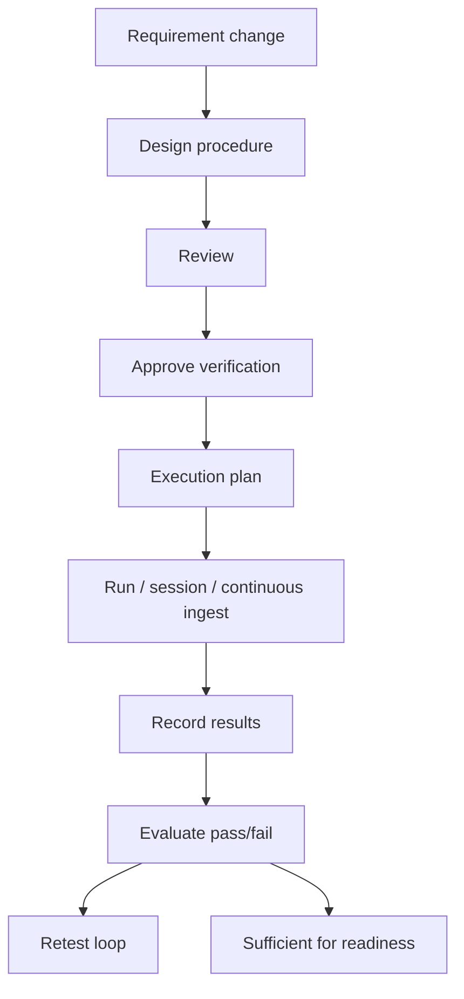
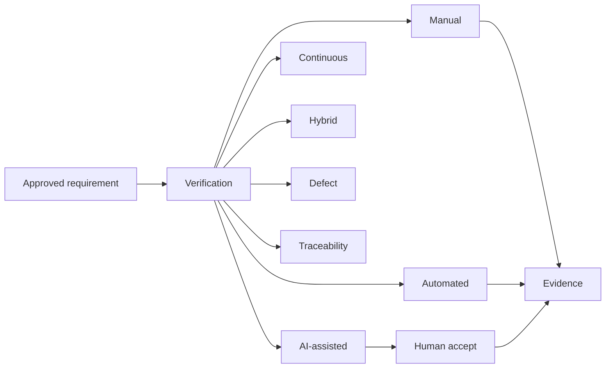

# APZ QEP — Verification Model

> **Programme:** APZQEP-DEF-002  
> **Rule:** Verification is the primary product concept (not “test case” as product identity)

## Purpose

The Verification Model defines the governed work unit through which APZ QEP proves approved requirements (or justified exceptions) are addressed — across manual, automated, AI-assisted, continuous, and hybrid methods. Verification is the semantic centre of the product; classical “test cases” are one form of procedure, not the product identity.

## Business rationale

“Test case” language ties the product to one maturity level and one method. Enterprise quality engineering requires a broader contract: procedures, sessions, runs, continuous signals, and hybrid combinations under one traceability and certification chain. A unified Verification model prevents method silos that break readiness and audit.

APZ QEP shall not require automation before delivering value. Manual verification is never temporary or inferior.

## Definition

A **Verification** is a governed work unit that proves one or more approved requirements (or justified exceptions) are addressed. It may be performed through:

| Method          | Description                                                                |
| --------------- | -------------------------------------------------------------------------- |
| **Manual**      | Human-executed procedures, exploratory sessions, checklists, observations  |
| **Automated**   | Runner/CI-produced results linked into QEP                                 |
| **AI-assisted** | AI-drafted or AI-reviewed content — human-governed before SoR accept       |
| **Continuous**  | Ongoing signals from pipelines/monitors ingested as verification instances |
| **Hybrid**      | Combination of methods against the same requirement/scope                  |

The same approved requirement may be verified through multiple methods simultaneously.

## Core concepts

| Concept                | Product meaning                                        |
| ---------------------- | ------------------------------------------------------ |
| Verification procedure | Reusable specification (includes classical test cases) |
| Verification suite     | Organised collection                                   |
| Verification template  | Pattern for rapid creation                             |
| Verification run       | Planned execution instance — often automated/batch     |
| Verification session   | Human-centred execution — manual/hybrid                |
| Execution result       | Outcome at run/session/step level                      |
| Verification maturity  | Organisational L1–L7 adoption overlay                  |

## Primary objects

| Object                          | Meaning                                                          |
| ------------------------------- | ---------------------------------------------------------------- |
| Verification procedure          | Reusable specification (includes classical test cases as a form) |
| Verification suite / collection | Organised set of procedures                                      |
| Verification template           | Reusable pattern for creation                                    |
| Verification run                | Planned execution instance (often automated/batch)               |
| Verification session            | Human-centred execution context (manual/hybrid)                  |
| Execution result                | Outcome at run/session/step level                                |
| Maturity record                 | Level L1–L7 for programme — not a gate on value                  |

## Maturity (organisational adoption)

| Level | Name                              | Value without forcing higher levels     |
| ----- | --------------------------------- | --------------------------------------- |
| L1    | Manual confirmation               | Ad-hoc/human confirmation recorded      |
| L2    | Structured manual verification    | Procedures, steps, expected outcomes    |
| L3    | Managed and reusable verification | Library, templates, ownership, versions |
| L4    | Automated verification            | Results ingested; runners external      |
| L5    | AI-assisted verification          | Drafts/reviews under human gates        |
| L6    | Continuous verification           | Ongoing signals in SoR                  |
| L7    | Continuous certification signals  | Re-cert signals; humans still decide    |

Organisations may operate at L2 while receiving full readiness/certification value; higher levels add efficiency — not legitimacy.

## Lifecycle

## Ownership

| Role                | Ownership                       |
| ------------------- | ------------------------------- |
| QA Engineer         | Procedure design                |
| QA Manager          | Approval and library hygiene    |
| Manual Tester       | Sessions                        |
| Automation Engineer | Run linkage and ingest          |
| Product Owner       | Priority scope for verification |

## Relationships

See also: [MANUAL-VERIFICATION.md](./MANUAL-VERIFICATION.md) · [AUTOMATION-MANAGEMENT.md](./AUTOMATION-MANAGEMENT.md).

## States

| State       | Applies to  | Meaning            |
| ----------- | ----------- | ------------------ |
| Draft       | Procedure   | In design          |
| In review   | Procedure   | Pending approval   |
| Approved    | Procedure   | May execute        |
| Planned     | Run/session | Scheduled          |
| In progress | Run/session | Executing          |
| Completed   | Run/session | Results recorded   |
| Superseded  | Procedure   | New version active |
| Retired     | Procedure   | No new executions  |

## Result vocabulary (manual-capable)

Pass · Fail · Blocked · Not applicable — plus comments, evidence, defect creation, retest, peer review, approval, sign-off.

| Result         | Meaning                                         |
| -------------- | ----------------------------------------------- |
| Pass           | Requirement aspect satisfied for step/scope     |
| Fail           | Not satisfied; defect typical                   |
| Blocked        | Could not execute; reason required              |
| Not applicable | Out of scope for this execution; reason typical |

## Business rules

| Rule   | Statement                                                              |
| ------ | ---------------------------------------------------------------------- |
| VER-01 | Verification must link to approved requirement or documented exception |
| VER-02 | Multiple methods may verify same requirement                           |
| VER-03 | AI-assisted content Draft until human accept                           |
| VER-04 | Continuous instances ingested — never auto-certify                     |
| VER-05 | Superseded procedures retain historical execution                      |
| VER-06 | “Test case” is not used as primary product noun in UI copy             |
| VER-07 | Hybrid records both method contributions in trace                      |

## Approval rules

Verification design approval before execution counts toward coverage (typical). Peer review optional. AI-generated procedures require full human approval path.

## Role responsibilities

| Persona             | Responsibility                            |
| ------------------- | ----------------------------------------- |
| QA Engineer         | Creates verification artefacts            |
| QA Manager          | Approves library entries                  |
| Manual Tester       | Executes sessions                         |
| Automation Engineer | Maps runs to verification                 |
| Release Manager     | Consumes verification status at readiness |
| AI Agent            | Draft only                                |

## Reporting

Verification coverage, execution progress, method mix, maturity progression, blocked/N/A analysis, retest rates, stale verification (requirement version drift).

## Search

Search procedures, runs, sessions, results, methods, linked requirements, owners. Filter by Pass/Fail/Blocked.

## Audit

Approve, execute, result change (with reason), supersede, retire — audited. Continuous ingest correlated to external signal ID.

## AI considerations

AI default **OFF**. L5 maturity: draft/review assistance with accept gate. AI never writes Approved procedure without human. See [AI-WORKFLOWS.md](./AI-WORKFLOWS.md).

## MCP considerations

Propose verification drafts via MCP; human approval before Library. Read verification context for IDE. See [MCP-WORKFLOWS.md](./MCP-WORKFLOWS.md).

## Future evolution

Stronger continuous signal taxonomy, verification reuse marketplace templates, cross-project cloning. Unified Verification identity unchanged.

## Boundary conditions

| In boundary                 | Out of boundary                         |
| --------------------------- | --------------------------------------- |
| Verification SoR            | ALM test plan import as SoR replacement |
| Run/session results         | Executing automation                    |
| Continuous ingest instances | Observability platform                  |

## Example scenarios

**Scenario 1 — L2 team:** Structured manual procedures only; full trace to cert — no automation.

**Scenario 2 — Multi-method:** Requirement has manual exploratory + ingested API regression; readiness aggregates both.

**Scenario 3 — AI draft:** AI generates procedure steps; QA edits and approves; execution manual.

**Scenario 4 — Continuous:** Pipeline signal ingested as verification instance; drift triggers re-cert request — cert unchanged until human acts.

**Scenario 5 — Blocked:** Environment unavailable; Blocked with reason; risk raised if release-critical.
