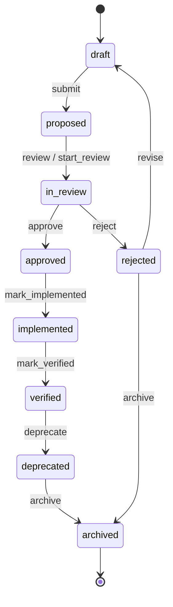

# State Machine

## States

| State         | Description                  |
| ------------- | ---------------------------- |
| `draft`       | Initial editable state       |
| `proposed`    | Submitted for consideration  |
| `in_review`   | Under active review          |
| `approved`    | Accepted requirement         |
| `rejected`    | Rejected during review       |
| `implemented` | Implementation complete      |
| `verified`    | Verification complete        |
| `deprecated`  | Superseded but retained      |
| `archived`    | Soft-archived terminal state |

## Diagram

## Terminal behaviour

`archived` has no outbound transitions. Soft-delete metadata (`archivedAt`, `archivedBy`) is set when entering `archived`.
