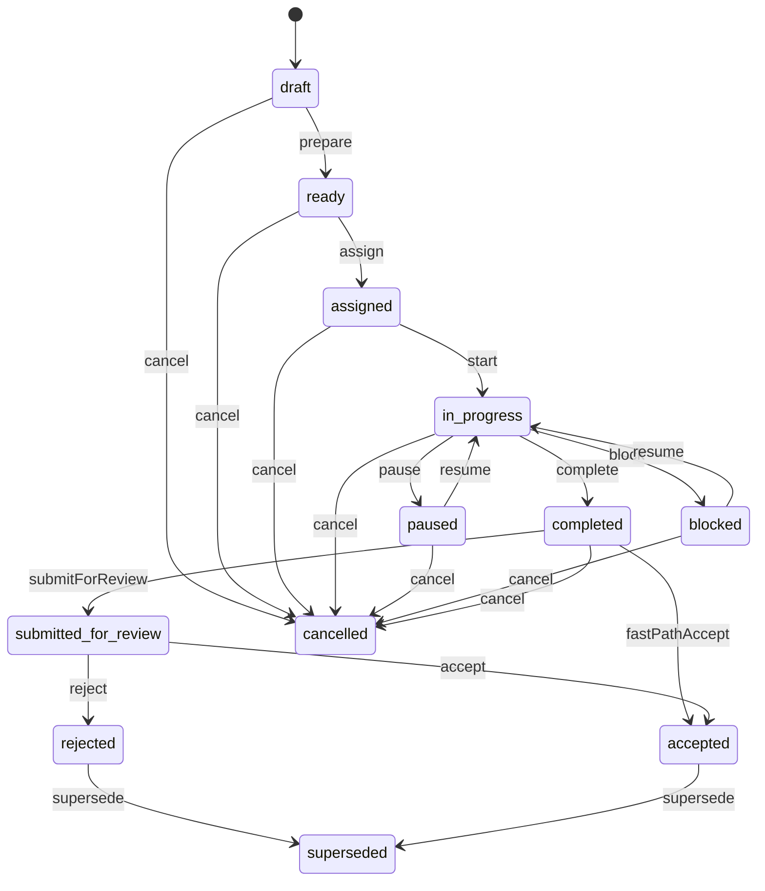

# APZQEP-OES-ARCH-015 — APPENDIX B — Lifecycle State Machine

## States

`draft` · `ready` · `assigned` · `in_progress` · `paused` · `blocked` · `completed` · `submitted_for_review` · `accepted` · `rejected` · `cancelled` · `superseded`

## Primary path

```text
draft → ready → assigned → in_progress → completed
  → submitted_for_review → accepted
```

## Control loops

```text
in_progress ⇄ paused
in_progress ⇄ blocked
```

## Review alternate

```text
submitted_for_review → rejected
completed → accepted   (fast-path when policy + availableActions allow)
```

## Terminal / lineage

```text
* → cancelled          (from non-terminal per guards)
eligible → superseded  (successor execution required)
```

## Mermaid



## Invariants

1. Explicit Domain commands only.
2. Append-only history.
3. No client-invented transitions.
4. Sealed manifest before `in_progress`.
5. No ordinary completion from `cancelled`.
