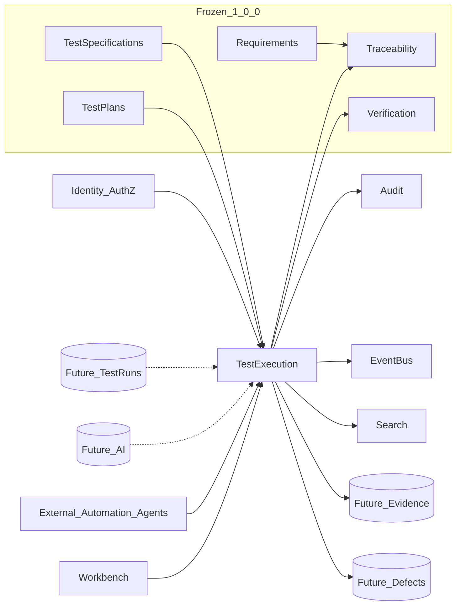
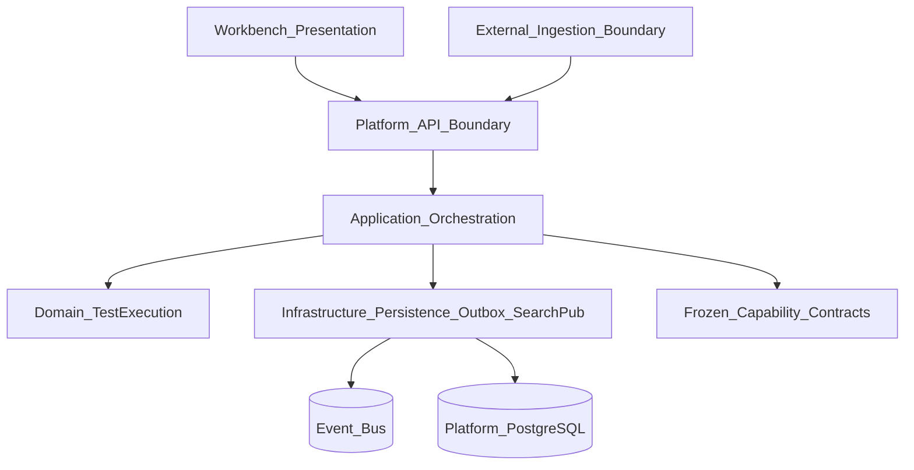

# APZQEP-OES-ARCH-015 — APPENDIX D — Context & Layer Diagrams

## Context diagram



## Layer / container diagram



## Aggregate relationship (textual)

```text
TestExecution
  ├── ExecutionManifest (1, sealed)
  ├── ExecutionContext (1)
  ├── ExecutionAssignment (1)
  ├── ExecutionStep (1..n)
  │     └── EvidenceReference (0..n)
  ├── ExecutionObservation (0..n)
  ├── EvidenceReference (0..n at execution level)
  ├── ExecutionReview (0..1)
  └── ExternalExecutionSubmission (0..n)
```
