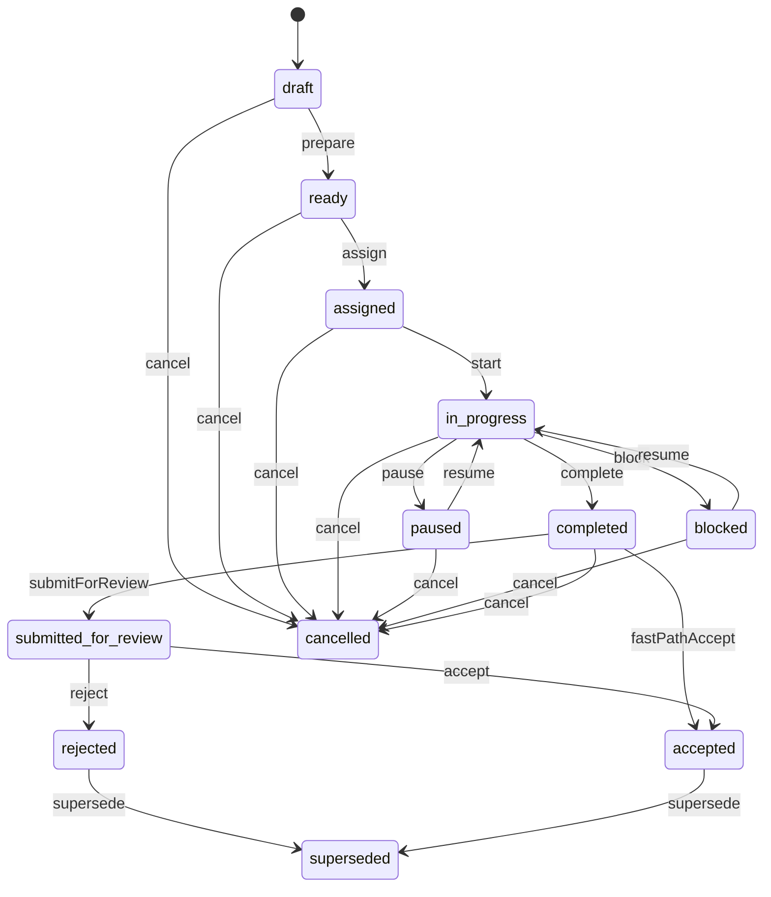

# APZQEP-OES-ENG-090A — APPENDIX B — Lifecycle Matrix

Fidelity: ARCH-015 Appendix B / Part 2 §3.

## States

`draft` · `ready` · `assigned` · `in_progress` · `paused` · `blocked` · `completed` · `submitted_for_review` · `accepted` · `rejected` · `cancelled` · `superseded`

## Transition matrix (engineering)

| Command                | From                                              | To                     | Preconditions           | Postconditions               |
| ---------------------- | ------------------------------------------------- | ---------------------- | ----------------------- | ---------------------------- |
| `createExecution`      | —                                                 | `draft`                | Valid source refs       | History + created event      |
| `prepareExecution`     | `draft`                                           | `ready`                | Sources resolvable      | Manifest sealed + hash       |
| `assignExecutor`       | `ready` (or assigned update)                      | `assigned`             | Valid executor/agent    | Assignment set               |
| `startExecution`       | `assigned`                                        | `in_progress`          | Manifest sealed         | Started timestamps           |
| `pauseExecution`       | `in_progress`                                     | `paused`               | Authorised              | History                      |
| `blockExecution`       | `in_progress`                                     | `blocked`              | Reason required         | History                      |
| `resumeExecution`      | `paused`/`blocked`                                | `in_progress`          | Authorised              | History                      |
| `recordStepResult`     | `in_progress`                                     | `in_progress`          | Step mutable            | Step outcome/result updated  |
| `completeExecution`    | `in_progress`                                     | `completed`            | Steps accounted         | Derived outcome set          |
| `submitForReview`      | `completed`                                       | `submitted_for_review` | Review required         | In review queue              |
| `acceptExecution`      | `submitted_for_review` or `completed` (fast-path) | `accepted`             | Policy + authz          | Finalised; immutable content |
| `rejectExecution`      | `submitted_for_review`                            | `rejected`             | Reason required         | Pre-review outcome retained  |
| `cancelExecution`      | Non-terminal per guards                           | `cancelled`            | Not accepted/superseded | Terminal cancel              |
| `supersedeExecution`   | Eligible                                          | `superseded`           | Successor exists        | Lineage set                  |
| `ingestExternalResult` | Policy-defined                                    | Policy-defined         | Trust checks            | Idempotent                   |

## Mermaid

## Engineering invariants on lifecycle

1. Explicit Domain commands only.
2. Append-only history.
3. No client-invented transitions.
4. Sealed manifest before `in_progress`.
5. No ordinary completion from `cancelled`.
6. Stale `revision` → conflict.
