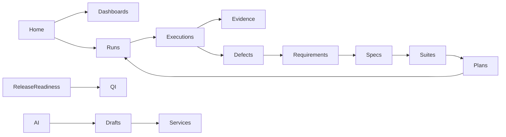

# Information Architecture — APZQEP v1.1

## Principles

- Four-level navigation (Activity Bar → Sidebar → Workspace → Context) per APZHUB 017
- Dynamic module registration; never hardcode workspaces in shell
- Permission-filtered at every level
- Deep links stable; sessions restore with re-authz

---

## Global navigation

```text
Activity Bar: QEP
  Sidebar (role-aware):
    Home
    Dashboards
    Requirements
    Traceability
    Verification
    Test Specifications
    Test Suites          ← new
    Test Plans
    Test Runs            ← new
    Test Executions
    Defects              ← new
    Evidence
    Release Readiness
    AI Workspace
    Search (entry)
    Administration (admin)
```

Stub modules without v1.1 delivery remain **hidden** until implemented (no fake nav).

---

## Product workspaces

| Workspace  | Primary entities                  | Default landing              |
| ---------- | --------------------------------- | ---------------------------- |
| Home       | Recent, pinned, assigned          | Role home                    |
| Dashboards | QI widgets                        | QA or Tester default by role |
| Authoring  | Requirements, Specs, Suites       | List + filters               |
| Execution  | Plans, Runs, Executions           | Active runs                  |
| Quality    | Defects, Evidence, Verification   | Open defects                 |
| Assurance  | Release Readiness, Certification* | Readiness MVP                |
| Assist     | AI Workspace                      | Chat / drafts inbox          |
| Admin      | Settings, prompts (admin)         | Settings                     |

\*Certification product depth primarily 1.2.

---

## Page hierarchy (canonical)

```text
/workspace/qep
  /home
  /dashboards/{qa|tester|developer|risk|project}
  /requirements[/...]
  /traceability[/...]
  /verification[/...]
  /test-specifications[/...]
  /suites[/ :id [/versions]]
  /test-plans[/...]
  /runs[/ :id [/progress|/results]]
  /test-execution[/...]
  /defects[/ :id]
  /evidence[/...]
  /release-readiness
  /ai[/chat|/drafts|/prompts]
  /search?q=
  /admin/*
```

Existing v1.0 routes remain stable; new routes additive.

---

## Search behaviour

| Query surface     | Behaviour                                                                                                                   |
| ----------------- | --------------------------------------------------------------------------------------------------------------------------- |
| Global QEP search | Permission-filtered FTS across indexed entity types                                                                         |
| Types (1.1)       | requirement, baseline, relationship, trace_link, verification, specification, plan, suite, run, execution, evidence, defect |
| Ranking           | Recency · type boost · permission · optional project scope                                                                  |
| Results           | Navigate to entity; show type badge; no raw backend IDs                                                                     |

---

## Command Palette

Register actions (examples):

- Navigate: Open Run / Defect / Requirement
- Create: New Defect from Execution · New Run from Plan
- Execute: Pass/Fail current test (context)
- AI: Draft tests from requirement · Summarise evidence
- Search: “Go to…”

Path: Command → Platform Service → (Connector) — never direct engine.

---

## Contextual actions

Context Panel shows: identity, status, availableActions (server-driven), AI suggest (optional), related links (trace/run/defect/evidence).

Cross-module navigation uses typed links (`qep://defect/{id}`) resolved by shell router.

---

## Logical navigation map


