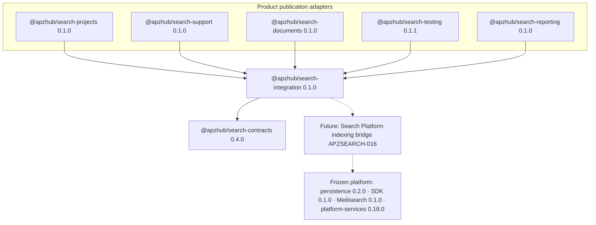

# APZSEARCH-015 — Dependency Certification

**Date:** 2026-07-15  
**Status:** **PASS**

---

## Dependency graph



ASCII:

```text
search-projects ──┐
search-support ───┤
search-documents ─┼──► search-integration ──► search-contracts
search-testing ───┤         │
search-reporting ─┘         └── (future) platform indexing / Meilisearch
```

## Allowed product contract deps

| Adapter            | Extra domain deps (allowed)                                         |
| ------------------ | ------------------------------------------------------------------- |
| Projects / Support | `platform-service-contracts`                                        |
| Documents          | `document-contracts`                                                |
| Testing            | `testing-contracts` only (not testing-services/persistence)         |
| Reporting          | `reporting-contracts` · `reporting-core` (version/diagnostics only) |

## Forbidden (all adapters + framework)

- Sibling `@apzhub/search-*` adapters
- `meilisearch` / `@apzhub/integration-meilisearch`
- `@apzhub/search-persistence`
- `@apzhub/platform-services`
- `apps/web` / `NextRequest` / EventBus / OCR

## Isolation assertions

| Rule                                                                         | Result          |
| ---------------------------------------------------------------------------- | --------------- |
| `search-reporting` must NOT depend on `testing-contracts`                    | **PASS**        |
| `search-testing` must NOT depend on `reporting-contracts` / `reporting-core` | **PASS**        |
| `search-testing` may depend on `testing-contracts`                           | **PASS** (does) |
| Adapters never depend on each other                                          | **PASS**        |

## Evidence

- `pnpm audit:search-publication`
- `testing/search-publication/apzsearch-015-boundary.test.ts`
