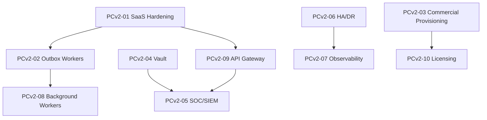

# APZHUB Platform Core v2 — Roadmap

> **Status:** Planned — **not approved for implementation**  
> **Authority:** [PC-001 Certification](../reviews/APZHUB-Platform-Core-Certification.md) · [M8-06 Completion Report](../sprint/M8-06-completion-report.md)  
> **Prerequisite:** Owner approval after PC-001

---

## Purpose

Platform Core v1 (M1–M8) is **certified** as the architectural foundation. Platform Core v2 closes the gaps between **validation-ready** and **commercially deployable** without redesigning v1 capabilities.

**No implementation** until an approved sprint guide exists for each phase.

---

## Prioritisation overview

```text
PCv2-01  Production SaaS Hardening     ← highest priority
PCv2-02  Outbox Workers & Event Replay
PCv2-03  Commercial Provisioning
PCv2-04  Vault & Secrets Integration
PCv2-05  SOC/SIEM & Security Operations
PCv2-06  High Availability & DR
PCv2-07  Observability Stack
PCv2-08  Background Workers Platform
PCv2-09  API Gateway
PCv2-10  Commercial Licensing
```

---

## PCv2-01 — Production SaaS Hardening

**Objective:** Close the highest-risk production gaps identified in M8-06 and PC-001.

| Item                        | Description                                       | Debt refs          |
| --------------------------- | ------------------------------------------------- | ------------------ |
| CSP enforcement             | Exit Report-Only; violation reporting endpoint    | M8-06 deferral     |
| Gateway rate limiting       | Auth + platform API rate limits at edge           | M8-06 foundation   |
| RLS audit                   | Full tenant isolation verification across schemas | TD-P10, TD-P09     |
| App bootstrap consolidation | Shared package for `web` + `law-platform`         | TD-M16-C01         |
| CI automation               | GitHub Actions: lint, typecheck, build, test, E2E | TD-M16-M02, TD-T04 |

**Exit criteria:** CSP enforced; CI green; bootstrap single-sourced; RLS integration tests pass.

---

## PCv2-02 — Outbox Workers & Event Replay

**Objective:** Make the event-driven architecture production-safe.

| Item                  | Description                                 | Debt refs |
| --------------------- | ------------------------------------------- | --------- |
| Outbox worker service | Process `outbox` table; idempotent handlers | TD-P18    |
| Event replay          | Recovery from consumer failure              | TD-P19    |
| Dead-letter queue     | Poison message handling                     | TD-P20    |
| Trust event delivery  | Trust outbox workers                        | TD-T07    |

**Exit criteria:** Events processed async; replay tested; DLQ operational.

---

## PCv2-03 — Commercial Provisioning

**Objective:** SaaS tenant and product onboarding beyond first-login provisioning.

| Item                          | Description                              |
| ----------------------------- | ---------------------------------------- |
| Tenant onboarding workflow    | Admin-initiated + self-service signup    |
| Product enablement automation | Governance-driven product activation     |
| Provisioning API expansion    | Webhook callbacks, status polling        |
| Usage metadata hooks          | Foundation for metering (no billing yet) |

**Exit criteria:** New tenant → product enabled without manual DB intervention.

---

## PCv2-04 — Vault Integration

**Objective:** External secret management for production deployments.

| Item                     | Description                               |
| ------------------------ | ----------------------------------------- |
| Vault-compatible adapter | Self-hosted HashiCorp Vault or equivalent |
| Secret reference model   | Platform stores refs, not plaintext       |
| Rotation hooks           | Document rotation; automation optional    |
| Env validation extension | Vault connectivity checks                 |

**Constraint:** Self-hosted OSS first; no mandatory cloud KMS.

---

## PCv2-05 — SOC/SIEM Integration

**Objective:** Security operations for enterprise customers.

| Item                     | Description                                        |
| ------------------------ | -------------------------------------------------- |
| Structured audit export  | SIEM-compatible log format                         |
| Security event streaming | Auth failures, permission denials, rate limit hits |
| Alert rules foundation   | Integration points for external SOC                |
| Pen test readiness       | Remediation tracker (scans out of scope)           |

---

## PCv2-06 — High Availability & DR

**Objective:** Production resilience beyond manual recovery guidance.

| Item                                | Description                            |
| ----------------------------------- | -------------------------------------- |
| Multi-instance deployment guide     | Stateless app + shared DB/Redis        |
| Automated backup orchestration      | PostgreSQL + Redis                     |
| Failover runbooks (automated steps) | Extend M8-06 recovery guidance         |
| Read replica support                | Query routing for read-heavy workloads |

---

## PCv2-07 — Observability Stack

**Objective:** Document 014 four pillars in production.

| Item                     | Description                                 |
| ------------------------ | ------------------------------------------- |
| Prometheus metrics       | Platform + connector metrics                |
| Grafana dashboards       | Administration workspace integration        |
| Loki log aggregation     | Structured logs with correlation IDs        |
| OpenTelemetry tracing    | End-to-end request traces                   |
| Administration telemetry | Mask backend dashboards from standard users |

**Constraint:** OSS backends behind connectors; self-hosted first.

---

## PCv2-08 — Background Workers Platform

**Objective:** Centralised job infrastructure per Document 012.

| Item              | Description                             |
| ----------------- | --------------------------------------- |
| Worker registry   | Job types, priorities, lifecycle states |
| Retry/backoff/DLQ | Standard job policies                   |
| Worker identities | Least-privilege service accounts        |
| Job admin UI      | Operations Console extension            |

---

## PCv2-09 — API Gateway

**Objective:** Document 010 dedicated gateway layer.

| Item                              | Description                       |
| --------------------------------- | --------------------------------- |
| Edge gateway (Caddy/Nginx module) | TLS, routing, rate limits         |
| API versioning policy             | Deprecation headers               |
| API keys                          | Service-to-service auth           |
| Webhook ingress                   | Signed webhook endpoints          |
| OpenAPI publish                   | Complete platform + product specs |

---

## PCv2-10 — Commercial Licensing

**Objective:** Revenue and entitlement layer on governance foundation.

| Item                        | Description                                 |
| --------------------------- | ------------------------------------------- |
| License entities            | Product entitlements per tenant             |
| Feature flag integration    | Governance flags driven by license          |
| Usage metering hooks        | Event-based usage capture                   |
| Billing connector interface | No billing logic in platform — adapter only |

**Note:** Billing engine is product/commercial layer; platform owns entitlement metadata only.

---

## Deferred beyond PCv2

| Item                        | Rationale                                                  |
| --------------------------- | ---------------------------------------------------------- |
| Financial Engine extraction | FIN-001: defer until second product validates abstractions |
| Banking product             | No approved charter                                        |
| Multi-region active-active  | Enterprise tier; after HA foundation                       |
| Vulnerability scanners      | Security ops maturity                                      |
| AI gateway implementations  | Product-driven                                             |

---

## Dependency graph



---

## Success criteria (Platform Core v2 complete)

Platform Core v2 is complete when:

1. Production SaaS hardening gate passes (PCv2-01)
2. Outbox workers process all platform and product events
3. Commercial tenant onboarding is automated
4. Secrets managed via Vault-compatible store
5. Observability four pillars operational
6. API gateway enforces auth, rate limits, versioning
7. Licensing entitlements drive governance flags
8. Commercial Assessment rates Production tier **Pilot Ready** minimum

---

## References

- [Platform Core Certification](../reviews/APZHUB-Platform-Core-Certification.md)
- [Commercial Assessment](../reviews/APZHUB-Platform-Core-Commercial-Assessment.md)
- [Technical Debt Register](../architecture/APZHUB-Platform-Technical-Debt-Register.md)
- [Platform Roadmap](../architecture/platform-roadmap.md) (M1–M8 history)
