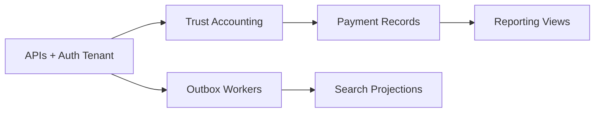

# LAW — Persistence Roadmap

> **Status:** Phase 1 persistence **closed** · LAW-014 APIs **complete** · LAW-015 Trust **milestone closed**  
> **Last updated:** 2026-07-08

---

## Phase 1 — Complete ✅

| Story      | Deliverable                                    | Status |
| ---------- | ---------------------------------------------- | ------ |
| LAW-012-01 | Persistence architecture                       | ✅     |
| LAW-012-02 | Client + Matter adapters, outbox skeleton      | ✅     |
| LAW-012-03 | Hardening — RLS, tenant context, outbox wiring | ✅     |
| LAW-012-04 | Document + Task adapters                       | ✅     |
| LAW-012-05 | Calendar + Time adapters                       | ✅     |
| LAW-012-06 | Invoice + line items                           | ✅     |
| LAW-012-07 | Closeout & readiness review                    | ✅     |
| LAW-012-08 | Quality gate remediation                       | ✅     |

**Final verdict:** PERSISTENCE FOUNDATION CLOSED WITH OBSERVATIONS — ready for next-phase planning. Not commercial GA.

Primary gates green (lint, typecheck, build, test, coverage). E2E not completed — Playwright Chromium unavailable in environment. See [LAW-012-08 completion report](../sprint/LAW-012-08-completion-report.md).

---

## Phase 2 — Recommended sequence

### Option A — APIs + tenant auth (recommended first)

**Why first:** Persistence exists but is not externally consumable. TD-P02 (tenant claim) blocks real multi-firm deployment. TD-P24 (no API layer) blocks any production integration.

| Deliverable                               | Effort |
| ----------------------------------------- | ------ |
| REST/GraphQL routes per aggregate         | L      |
| Auth middleware → `LawPersistenceContext` | M      |
| Postgres mode in staging CI               | S      |

**Validates:** Auth, Runtime, production deployment path.

---

### Option B — Outbox workers (recommended second)

**Why second:** 23 event types are recorded but never consumed. Required before search projections, reliable audit, or notification replay from database.

| Deliverable                       | Effort |
| --------------------------------- | ------ |
| Outbox polling worker             | M      |
| Idempotent event handler registry | M      |
| Dead-letter / retry policy        | S      |
| Projection table scaffolding      | L      |

**Validates:** Event-driven architecture, operational reliability.

---

### Option C — Trust Accounting (LAW-015 — **milestone closed** ✅)

**Status:** LAW-015-01 through LAW-015-14 delivered 2026-07-08. Canonical as-built architecture in [LAW-Trust-Reference-Architecture](../architecture/LAW-Trust-Reference-Architecture.md). **Milestone closed** — await owner approval before production readiness, bank integration, or Phase 2.

**Delivered:** Ledger, workflow, allocations, reconciliation, interest, transfers, reporting, approvals, REST APIs, PostgreSQL persistence, workbench UI, CSV/HTML exports, E2E validation artefacts.

**Remaining (deferred):** Bank feeds, three-way reconciliation, outbox workers, platform event wiring, production RBAC seed, commercial GA.

See [LAW-015 Backlog](../backlog/LAW-015-Trust-Accounting-Backlog.md) · [LAW-Trust-v1.0](../releases/LAW-Trust-v1.0.md).

---

### Option D — Payment records (fourth)

**Why fourth:** Completes billing lifecycle started in LAW-010/012-06. Resolves TD-L011-02 (mark paid simulation).

| Deliverable                    | Effort                |
| ------------------------------ | --------------------- |
| `law_payment` schema           | M                     |
| Payment workflow service       | M                     |
| Invoice ↔ payment linkage      | M                     |
| Trust disbursement integration | L (requires Option C) |

**Out of scope:** Payment gateway, PCI, bank feeds.

---

### Option E — Reporting (parallel / fifth)

**Why parallel:** OLTP data is sufficient for SQL views without waiting for outbox workers.

| Deliverable                                 | Effort |
| ------------------------------------------- | ------ |
| `matter_billing_summary` view               | M      |
| `matter_wip_summary` view                   | M      |
| WIP report UI (LAW-010)                     | L      |
| Event-driven aggregates (requires Option B) | L      |

---

## Phase 2 comparison

| Option               | Business value               | Technical dependency | Risk                 |
| -------------------- | ---------------------------- | -------------------- | -------------------- |
| **APIs**             | High — enables deployment    | Low                  | Medium — auth wiring |
| **Outbox workers**   | Medium — enables projections | Low                  | Low                  |
| **Trust Accounting** | High — legal requirement     | APIs recommended     | High — regulatory    |
| **Payment records**  | High — billing completeness  | Trust optional       | Medium               |
| **Reporting**        | Medium — operator insight    | Low (SQL views)      | Low                  |

---

## Phase 3 — Deferred

| Capability                                | Notes                                |
| ----------------------------------------- | ------------------------------------ |
| Invoice PDF generation                    | Requires document generation service |
| Tax engine                                | Jurisdiction-specific rules          |
| Accounting integration (Xero, QuickBooks) | External API                         |
| Payment gateway (Stripe, etc.)            | PCI scope                            |
| File blob storage                         | S3/Azure for documents               |
| Read replica / BI                         | Infrastructure                       |

---

## Owner decision required

**Recommended next story:** **APIs + tenant auth wiring** (Option A), followed by **Outbox workers** (Option B), then **Trust Accounting** (Option C).

Alternative: If regulatory trust compliance is the immediate business driver, **Trust Accounting** may precede APIs for a single-firm pilot — but multi-firm production still requires Option A.

**Stop condition:** Await owner approval before starting any Phase 2 work.

---

## Related documents

- [LAW-012-persistence-foundation-review.md](../reviews/LAW-012-persistence-foundation-review.md)
- [LAW-Persistence-Technical-Debt.md](../architecture/LAW-Persistence-Technical-Debt.md)
- [LAW-012-07 completion report](../sprint/LAW-012-07-completion-report.md)
- [LAW-012-08 completion report](../sprint/LAW-012-08-completion-report.md)
