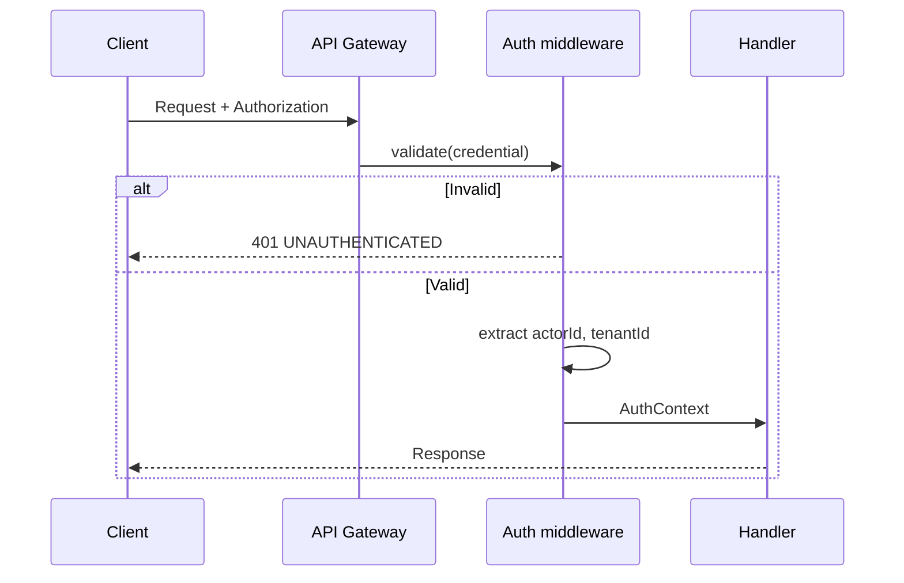
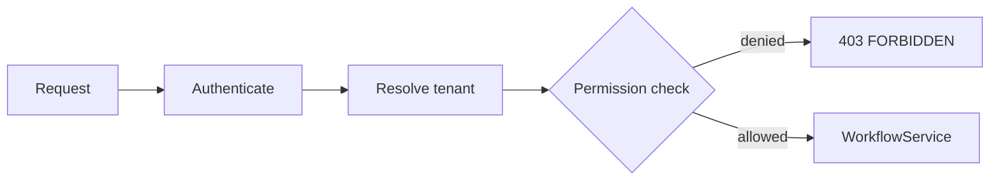

# LAW — Integration Security Model

> **Milestone:** LAW-014 — Integration Foundation (planning)  
> **Status:** **Planning authority**  
> **Depends on:** [013 Security & Zero Trust](../013-security-architecture-zero-trust-framework.md) · [007 Identity & RBAC](../007-identity-authentication-authorisation-rbac-architecture.md)  
> **Last updated:** 2026-07-06

---

## 1. Purpose

This document defines security controls for Law Platform integrations: API authentication, service-to-service auth, tenant isolation, permission enforcement, rate limiting, audit logging, secrets handling, webhook signing, replay protection, and request validation.

**No security code is implemented in LAW-014.**

---

## 2. Threat model (summary)

| Threat                   | Mitigation                                                  |
| ------------------------ | ----------------------------------------------------------- |
| Credential theft         | Short-lived tokens, API key rotation, hashed secrets        |
| Cross-tenant data access | Tenant resolver + RLS + permission checks                   |
| Privilege escalation     | Least-privilege API keys; permission adapter                |
| Replay attacks           | Idempotency keys, webhook timestamp + nonce                 |
| Injection                | Strict JSON schema validation, parameterised SQL (existing) |
| Webhook spoofing         | HMAC signatures, TLS-only endpoints                         |
| Rate abuse               | Per-key rate limits, anomaly alerting                       |
| Secret leakage           | Secrets manager, never log credentials                      |

---

## 3. API authentication

### 3.1 User Bearer tokens

| Aspect           | Design                                                        |
| ---------------- | ------------------------------------------------------------- |
| Issuer           | BetterAuth (platform)                                         |
| Format           | JWT or opaque session token (BetterAuth default)              |
| Claims           | `sub` (userId), `tenantId`, `sessionId`, `exp`                |
| Transport        | `Authorization: Bearer {token}`                               |
| Storage (client) | Secure storage only — never localStorage for partners         |
| Expiry           | Configurable; sliding session in UI, fixed expiry for API use |
| Revocation       | Session revocation via Session Service                        |

### 3.2 API keys

| Aspect   | Design                                          |
| -------- | ----------------------------------------------- |
| Format   | `key_{tenantPrefix}_{random}` + separate secret |
| Storage  | Secret bcrypt-hashed; keyId indexed             |
| Scope    | `tenantId` + explicit `permissions[]`           |
| Rotation | Create new → overlap window → revoke old        |
| Audit    | All usage logged with keyId (never secret)      |

### 3.3 Authentication flow



---

## 4. Service-to-service authentication

| Pattern                  | Use case                                    |
| ------------------------ | ------------------------------------------- |
| Signed JWT (internal CA) | Outbox workers, background jobs             |
| mTLS                     | Worker ↔ database, worker ↔ secrets manager |
| API key (elevated)       | Cross-service admin operations              |

Rules:

- Workers receive service identity — not user impersonation
- `actorId` for worker mutations = `system:{serviceName}`
- `X-Tenant-Id` header permitted only with service JWT claim `allowTenantOverride: true`

---

## 5. Tenant isolation

### 5.1 Defence layers

| Layer           | Control                                                               |
| --------------- | --------------------------------------------------------------------- |
| 1 — Auth        | Credential bound to single tenant (or explicit override for services) |
| 2 — Resolver    | Reject requests where token tenant ≠ requested resource tenant        |
| 3 — Application | `LawPersistenceContext.tenantId` on every repository call             |
| 4 — Database    | RLS `FORCE` on all `law_*` tables                                     |

### 5.2 Attack scenarios

| Scenario                                             | Outcome                                     |
| ---------------------------------------------------- | ------------------------------------------- |
| User A token + User B resource ID                    | 404 NOT_FOUND (not 403 — no existence leak) |
| API key tenant A + `X-Tenant-Id: B` without override | 403 FORBIDDEN                               |
| SQL injection on tenantId                            | Parameterised queries — existing adapters   |

### 5.3 Gap to close (from LAW-012)

**TD-P02:** Auth session does not yet supply `tenantId` claim. LAW-014-02 must wire BetterAuth session → `tenantId` before public API launch.

---

## 6. Permission enforcement



| Layer            | Responsibility                                                       |
| ---------------- | -------------------------------------------------------------------- |
| Route middleware | Coarse permission per operation                                      |
| API adapter      | Optional fine-grained field-level (future)                           |
| Workflow         | Business rules (e.g. cannot delete active matter with open invoices) |

Permission keys follow manifest namespace: `legal.client.create`, `legal.invoice.mark-paid`, etc.

API keys cannot grant permissions the issuing admin does not hold.

---

## 7. Rate limiting

| Dimension                | Limit                             |
| ------------------------ | --------------------------------- |
| Per API key              | 1000 / 15 min (configurable tier) |
| Per IP (unauthenticated) | 60 / min                          |
| Per tenant aggregate     | 10,000 / 15 min                   |
| Webhook registration     | 10 / hour                         |

Implementation options (decision deferred):

- Redis sliding window (preferred)
- In-memory (dev only)

429 responses include `Retry-After`. Repeated abuse → key suspension + alert.

---

## 8. Audit logging

### 8.1 API audit record

```json
{
  "auditId": "uuid",
  "timestamp": "ISO-8601",
  "tenantId": "uuid",
  "actorId": "user-or-key-id",
  "actorType": "user | api_key | service",
  "action": "client.create",
  "resourceType": "client",
  "resourceId": "uuid",
  "requestId": "uuid",
  "correlationId": "uuid",
  "sourceIp": "x.x.x.x",
  "userAgent": "...",
  "outcome": "success | failure",
  "statusCode": 201
}
```

### 8.2 Retention

| Class            | Retention                 |
| ---------------- | ------------------------- |
| API access log   | 90 days hot, 7 years cold |
| Mutation audit   | 7 years                   |
| Auth failure log | 1 year                    |

Audit storage: append-only table `law_audit_event` (future migration) or platform audit service.

---

## 9. Secrets handling

| Secret type             | Storage                                             |
| ----------------------- | --------------------------------------------------- |
| API key secrets         | bcrypt hash in DB; plaintext shown once at creation |
| Webhook signing secrets | AES-256 encrypted at rest                           |
| Email/SMS provider keys | AWS Secrets Manager / Vault                         |
| DB credentials          | Environment / secrets manager only                  |
| JWT signing keys        | BetterAuth key rotation                             |

Rules:

- Never commit secrets to repository
- Never log `Authorization` header
- CI uses ephemeral test credentials
- Secret access audited

---

## 10. Webhook signing

### Outbound (Law Platform → subscriber)

```http
POST https://partner.example.com/webhooks/apzhub
X-Apzhub-Signature: t=1620000000,v1=abc123...
X-Apzhub-Event-Id: evt-uuid
X-Apzhub-Delivery-Id: del-uuid
Content-Type: application/json
```

Signature computation:

```text
signed_payload = "{timestamp}.{raw_body}"
signature = HMAC-SHA256(webhook_secret, signed_payload)
header = "t={timestamp},v1={hex(signature)}"
```

Subscriber must:

1. Verify timestamp within 5-minute tolerance
2. Recompute HMAC with shared secret
3. Compare constant-time
4. Deduplicate by `X-Apzhub-Event-Id`

---

## 11. Replay protection

| Mechanism              | Applies to             |
| ---------------------- | ---------------------- |
| `X-Idempotency-Key`    | POST creates           |
| Timestamp tolerance    | Webhook signatures     |
| Event ID deduplication | Webhook deliveries     |
| JWT `exp` + `jti`      | Bearer tokens (future) |
| Optimistic `version`   | PATCH updates          |

---

## 12. Request validation

| Stage         | Validation                                         |
| ------------- | -------------------------------------------------- |
| Transport     | Content-Type, max body size (1 MB default)         |
| Schema        | JSON Schema / Zod from OpenAPI components          |
| Business      | Workflow validator (existing `*Validator` classes) |
| Authorisation | Permission + tenant                                |
| Concurrency   | `If-Match` / `version` field                       |

Reject unknown fields in strict mode (configurable per tenant for partner onboarding period).

---

## 13. Security checklist (per endpoint)

- [ ] Authentication required (or explicitly public)
- [ ] Tenant resolved and propagated
- [ ] Permission documented and enforced
- [ ] Input validated against schema
- [ ] Output DTO — no internal fields leaked
- [ ] Audit log on mutation
- [ ] Rate limit applied
- [ ] Error responses contain no stack traces
- [ ] Integration test for 401, 403, 404 cases

---

## 14. Related documents

| Document                                                                                            | Purpose            |
| --------------------------------------------------------------------------------------------------- | ------------------ |
| [LAW-Webhook-Architecture](../architecture/LAW-Webhook-Architecture.md)                             | Delivery security  |
| [LAW-Integration-Reference-Architecture](../architecture/LAW-Integration-Reference-Architecture.md) | Layer model        |
| [LAW-API-Design-Standard](../specs/LAW-API-Design-Standard.md)                                      | Headers and errors |
