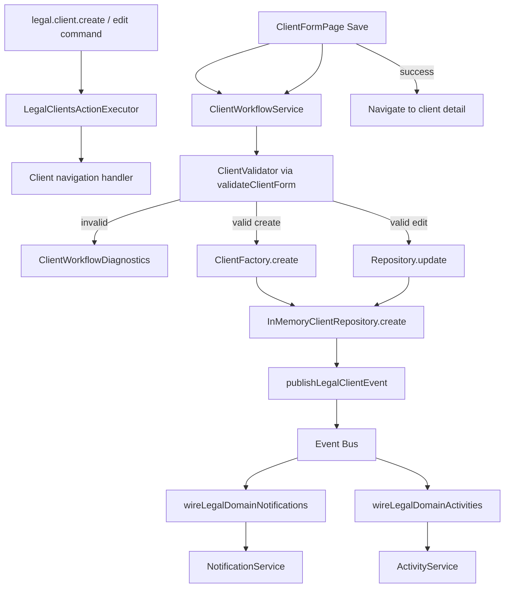
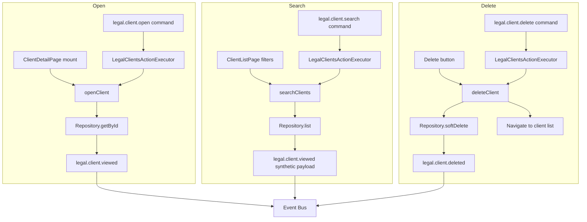
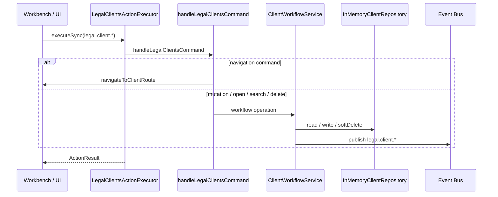

# LAW-002-03 — Client Workflow Validation Completion Report

> **Story:** LAW-002-03 — Client Workflow Validation  
> **Status:** **Complete** — await owner approval before persistence or Matter Management  
> **Platform baseline:** [Platform Version 5.0](../releases/APZHUB-Platform-v5.0.md) — **frozen**

---

## Summary

LAW-002-03 validates the complete Client Management business workflow end-to-end using the existing Platform 5.0 frameworks and `@apzhub/legal-business-core`. User interactions and Action Framework commands now flow through validation, factory, in-memory repository mutation, domain event publication, notification mapping, and activity mapping — with session-scoped diagnostics for architecture validation.

No persistence, APIs, database, server actions, external integrations, Platform 5.0 modifications, or Matter Management were introduced.

---

## Deliverables

| Deliverable                        | Location                                                       |
| ---------------------------------- | -------------------------------------------------------------- |
| Writable in-memory repository      | `apps/law-platform/lib/clients/in-memory-client-repository.ts` |
| Workflow service                   | `apps/law-platform/lib/clients/client-workflow-service.ts`     |
| Workflow diagnostics               | `apps/law-platform/lib/clients/client-workflow-diagnostics.ts` |
| React workflow context             | `apps/law-platform/lib/clients/client-workflow-context.tsx`    |
| Command handler + executor wrapper | `apps/law-platform/lib/legal-clients-command-handler.ts`       |
| Domain event publisher             | `apps/law-platform/lib/publish-legal-client-event.ts`          |
| Notification/activity wiring       | `apps/law-platform/lib/wire-legal-domain-events.ts`            |
| Executor bundle                    | `apps/law-platform/lib/create-app-action-executor.ts`          |
| Integration tests                  | `apps/law-platform/lib/client-workflow.integration.test.ts`    |
| Component test helpers             | `apps/law-platform/lib/clients/test-utils.tsx`                 |
| This completion report             | `docs/sprint/LAW-002-03-completion-report.md`                  |

---

## Workflow diagrams

### Create / Edit Client (mutation pipeline)

### Open / Search / Delete Client

### Command dispatch (Action Framework)

---

## Architecture validation report

End-to-end validation is captured by `ClientWorkflowDiagnostics.getSummary()` and exercised in `client-workflow.integration.test.ts`.

| Diagnostic            | Source                                             | Validated                                                              |
| --------------------- | -------------------------------------------------- | ---------------------------------------------------------------------- |
| Commands executed     | Runs with `commandId`                              | `legal.client.open`, `create`, `search`, `delete` via Action Framework |
| Events raised         | Runs with `eventId`                                | `legal.client.created`, `updated`, `deleted`, `viewed`                 |
| Notifications created | Event bus subscribers → notification mapper        | Unread count increases after create                                    |
| Activities created    | Event bus subscribers → activity mapper            | Activity list populated after create                                   |
| Repository mutations  | Runs with operation `create` / `update` / `delete` | Writable repo create, update, softDelete                               |
| Validation failures   | Failed runs with `validationErrors`                | Empty display name on create                                           |
| Workflow duration     | Per-run `durationMs` + average in summary          | Recorded per stage and run                                             |

### Commands wired

| Command ID            | Handler                        | Workflow                                                       |
| --------------------- | ------------------------------ | -------------------------------------------------------------- |
| `legal.client.create` | `service:legal-clients:create` | Navigate to create form; form save runs full mutation pipeline |
| `legal.client.edit`   | `service:legal-clients:edit`   | Navigate to edit form; form save runs update pipeline          |
| `legal.client.open`   | `service:legal-clients:open`   | `openClient` + navigate to detail                              |
| `legal.client.search` | `service:legal-clients:search` | `searchClients` + navigate to list (optional `?q=`)            |
| `legal.client.delete` | `service:legal-clients:delete` | `deleteClient` (soft) + navigate to list                       |

Service commands are handled at the app layer via `LegalClientsActionExecutor` — Platform 5.0 remains unchanged (`handlerKind: "service"` still returns `NOT_IMPLEMENTED` at platform level).

### Events emitted

| Event ID               | Trigger                                                        |
| ---------------------- | -------------------------------------------------------------- |
| `legal.client.created` | Successful create                                              |
| `legal.client.updated` | Successful edit                                                |
| `legal.client.deleted` | Successful soft delete                                         |
| `legal.client.viewed`  | Client detail open; search also emits synthetic viewed payload |

### Notifications (placeholder)

| Route ID                     | Event                  | Kind  |
| ---------------------------- | ---------------------- | ----- |
| `legal.client.viewed.inbox`  | `legal.client.viewed`  | inbox |
| `legal.client.created.toast` | `legal.client.created` | toast |
| `legal.client.edited.toast`  | `legal.client.updated` | toast |
| `legal.client.deleted.toast` | `legal.client.deleted` | toast |

### Activities (placeholder)

| Activity type                   | Event pattern          |
| ------------------------------- | ---------------------- |
| `legal.activity.client.opened`  | `legal.client.viewed`  |
| `legal.activity.client.created` | `legal.client.created` |
| `legal.activity.client.edited`  | `legal.client.updated` |
| `legal.activity.client.deleted` | `legal.client.deleted` |

### Knowledge

Existing LAW-002-01 help sources remain registered and discoverable:

- `legal.help.clients.list`
- `legal.help.clients.create`
- `legal.help.clients.detail`

No AI integration was added.

---

## Platform validation summary

| Constraint                    | Status                                                             |
| ----------------------------- | ------------------------------------------------------------------ |
| No persistence                | Pass — session-scoped in-memory repository only                    |
| No APIs                       | Pass                                                               |
| No database                   | Pass                                                               |
| No server actions             | Pass                                                               |
| No external integrations      | Pass                                                               |
| No Platform 5.0 modifications | Pass                                                               |
| No Matter Management          | Pass                                                               |
| Legal Business Core consumed  | Pass — `ClientFactory`, `ClientValidator`, domain types            |
| Full workflow pipeline        | Pass — validate → factory → repo → event → notification → activity |

---

## Tests added / updated

| Area                      | File                                              | Coverage                                                    |
| ------------------------- | ------------------------------------------------- | ----------------------------------------------------------- |
| End-to-end workflow       | `lib/client-workflow.integration.test.ts`         | Create, command dispatch, open, search, delete, diagnostics |
| Repository soft delete    | `lib/clients/in-memory-client-repository.test.ts` | Soft delete exclusion from list/getById                     |
| Component tests           | `components/clients/*.test.tsx`                   | Wrapped with `ClientWorkflowProvider` via test-utils        |
| Event registration        | `lib/register-law-events.test.ts`                 | Includes `legal.client.deleted`                             |
| Notification registration | `lib/register-law-notification-routes.test.ts`    | Six legal routes including delete toast                     |
| Activity registration     | `lib/register-law-activity-types.test.ts`         | Includes `legal.activity.client.deleted`                    |

**Quality gates:** 277 test files, 1391 tests passing; typecheck and lint clean.

---

## Technical debt

| Item                                                      | Notes                                                                                           |
| --------------------------------------------------------- | ----------------------------------------------------------------------------------------------- |
| Search emits `legal.client.viewed` with synthetic payload | Acceptable for workflow validation; consider dedicated `legal.client.searched` event in LAW-003 |
| Edit form fallback without `clientId`                     | Uses `searchClients` hack for failure path — should be unreachable in routed UI                 |
| Session-scoped shared repository                          | Resets on page reload; no cross-session consistency                                             |
| Placeholder notifications/activities                      | Templates only — no real delivery channels                                                      |
| Command create/edit are navigation-only                   | Mutation happens in form save, not command handler — by design for UX validation                |
| Diagnostics are in-memory                                 | No export UI; inspection via tests and developer tools only                                     |
| `ClientWorkflowProvider` fallback bus                     | Uses `createPlaceholderEventBus()` when no bus injected — events not delivered outside shell    |

---

## Recommendation for LAW-003

After owner approval, LAW-003 should introduce **persistence for Client Management only** — not Matter Management yet:

1. **Repository implementation** — Replace `InMemoryClientRepository` with a persisted adapter implementing `ClientRepository` from `@apzhub/legal-business-core`, keeping the workflow service interface unchanged.
2. **Persistence boundary** — App-level repository module (e.g. file-backed or platform-approved store) without Platform 5.0 changes.
3. **Workflow hardening** — Dedicated search event, transactional create/update/delete, idempotent command handling.
4. **Diagnostics export** — Surface `ClientWorkflowDiagnostics` summary in a developer diagnostics panel (alongside existing framework diagnostics).
5. **Integration tests** — Extend workflow integration tests to assert persistence round-trip while retaining in-memory tests for fast CI.

Defer Matter Management until Client persistence is stable and the same workflow pattern is proven repeatable.

---

## Stop condition

LAW-002-03 is complete. **Await owner approval** before introducing persistence or moving to Matter Management (LAW-003+).
