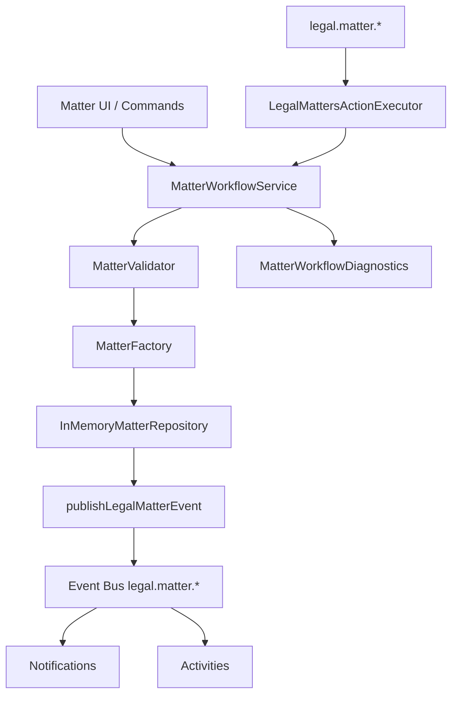

# LAW-003-01 — Matter Management UX Validation Completion Report

> **Story:** LAW-003-01 — Matter Management UX Validation  
> **Status:** **Complete** — await owner approval before LAW-003-02  
> **Platform baseline:** [Platform Version 5.0](../releases/APZHUB-Platform-v5.0.md) — **frozen**

---

## Summary

LAW-003-01 delivers the complete Matter Management user experience using the Law Platform shell, LAW-001 UX foundation, and `@apzhub/legal-business-core`. All screens consume the canonical Matter domain model, read from an in-memory repository seeded with 20 matters, and run the full in-memory workflow (validation → factory → repository → events → notifications → activities) without persisting data.

No database, API, persistence, server actions, external integrations, or Platform 5.0 modifications were introduced.

---

## Screens implemented

| Screen        | Layout                | Route                                    |
| ------------- | --------------------- | ---------------------------------------- |
| Matter list   | `LawListPageLayout`   | `/workspace/law/matters`                 |
| Matter detail | `LawDetailPageLayout` | `/workspace/law/matters/{matterId}`      |
| Create matter | `LawFormPageLayout`   | `/workspace/law/matters/new`             |
| Edit matter   | `LawFormPageLayout`   | `/workspace/law/matters/{matterId}/edit` |

### Matter relationships surfaced

| Relationship      | Source                                                |
| ----------------- | ----------------------------------------------------- |
| Client            | `clientId` → in-memory client repository display name |
| Practice Area     | `practiceAreaId` → `legalLookups.practiceArea`        |
| Matter Type       | `matterTypeId` → `legalLookups.matterType`            |
| Assigned Attorney | `leadAttorneyId` → `SEED_ATTORNEYS`                   |
| Status            | `matterStatus` → `MATTER_STATUSES` / lookup labels    |
| Priority          | `priority` → `MATTER_PRIORITIES`                      |

---

## Deliverables

| Deliverable                                                  | Location                                                       |
| ------------------------------------------------------------ | -------------------------------------------------------------- |
| Matter lib (routes, validation, repo, workflow, diagnostics) | `apps/law-platform/lib/matters/`                               |
| In-memory repository (20 seeds)                              | `apps/law-platform/lib/matters/in-memory-matter-repository.ts` |
| Matter UI screens                                            | `apps/law-platform/components/matters/`                        |
| Workbench routing                                            | `apps/law-platform/components/workbench-page.tsx`              |
| Matter commands manifest                                     | `services/legal-platform/manifests/law-matters/module.yaml`    |
| Command handler                                              | `apps/law-platform/lib/legal-matters-command-handler.ts`       |
| Event publisher                                              | `apps/law-platform/lib/publish-legal-matter-event.ts`          |
| Event / notification / activity wiring                       | `register-law-*.ts`, `wire-legal-domain-events.ts`             |
| Knowledge registration                                       | `apps/law-platform/lib/register-law-matter-knowledge.ts`       |
| Integration tests                                            | `apps/law-platform/lib/matter-workflow.integration.test.ts`    |
| This completion report                                       | `docs/sprint/LAW-003-01-completion-report.md`                  |

---

## Workflow diagram

---

## Commands registered

| Command ID             | Handler                         | Purpose                    |
| ---------------------- | ------------------------------- | -------------------------- |
| `legal.open.matters`   | workbench bridge                | Navigate to Matters module |
| `legal.matter.open`    | `service:legal-matters:open`    | Open matter + workflow     |
| `legal.matter.create`  | `service:legal-matters:create`  | Navigate to create form    |
| `legal.matter.edit`    | `service:legal-matters:edit`    | Navigate to edit form      |
| `legal.matter.search`  | `service:legal-matters:search`  | Search + navigate to list  |
| `legal.matter.archive` | `service:legal-matters:archive` | Soft archive matter        |

---

## Events, notifications, activities, knowledge

| Layer         | IDs                                                                            |
| ------------- | ------------------------------------------------------------------------------ |
| Events        | `legal.matter.viewed`, `created`, `updated`, `archived`                        |
| Notifications | `legal.matter.viewed.inbox`, `created.toast`, `edited.toast`, `archived.toast` |
| Activities    | `legal.activity.matter.opened`, `created`, `edited`, `archived`                |
| Knowledge     | `legal.help.matters.list`, `create`, `detail`                                  |

---

## Platform validation summary

| Constraint                           | Status                                                      |
| ------------------------------------ | ----------------------------------------------------------- |
| No persistence                       | Pass                                                        |
| No APIs                              | Pass                                                        |
| No database                          | Pass                                                        |
| No Platform 5.0 modifications        | Pass                                                        |
| Legal Business Core consumed         | Pass — `MatterFactory`, `MatterValidator`, lookups          |
| Client Management pattern replicated | Pass                                                        |
| Quality gates                        | Pass — 282 test files, 1402 tests; typecheck and lint clean |

---

## Technical debt

| Item                                         | Notes                                                         |
| -------------------------------------------- | ------------------------------------------------------------- |
| Search emits synthetic `legal.matter.viewed` | Consider dedicated search event in LAW-003-02                 |
| Attorney seed data is app-local              | Future stories may move to Legal Business Core reference data |
| Client link is ID-only in repository         | Display names resolved at UI layer via shared client repo     |
| Archive is soft in-memory only               | Resets on page reload                                         |

---

## Recommendation for LAW-003-02

After owner approval, LAW-003-02 should extend Matter Management with **workflow hardening and diagnostics surfacing** (mirroring LAW-002-03 for clients) or **persistence** — per backlog owner direction. Defer cross-module persistence until Client and Matter in-memory workflows are both approved.

---

## Stop condition

LAW-003-01 is complete. **Await owner approval** before LAW-003-02.
