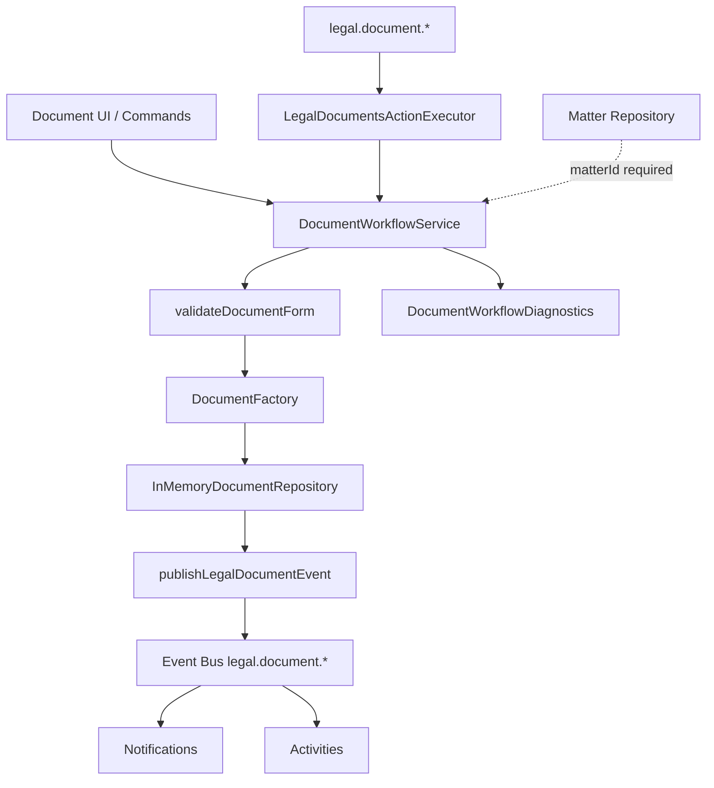
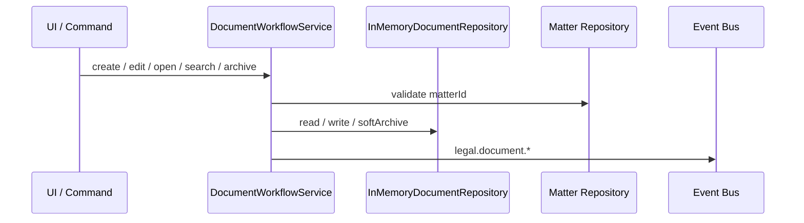

# LAW-004-01 — Document Management UX Validation Completion Report

> **Story:** LAW-004-01 — Document Management UX Validation  
> **Status:** **Complete** — await owner approval before LAW-004-02  
> **Platform baseline:** [Platform Version 5.0](../releases/APZHUB-Platform-v5.0.md) — **frozen**

---

## Summary

LAW-004-01 delivers the complete Document Management user experience using the Law Platform shell, LAW-001 UX foundation, and `@apzhub/legal-business-core`. Documents are seeded in-memory, linked to existing matters, and organized by category and folder. The full workflow pipeline (validation → factory → repository → events → notifications → activities) runs without persistence, APIs, or Platform changes.

---

## Screens implemented

| Screen                        | Layout                | Route                                        |
| ----------------------------- | --------------------- | -------------------------------------------- |
| Document list                 | `LawListPageLayout`   | `/workspace/law/documents`                   |
| Document detail               | `LawDetailPageLayout` | `/workspace/law/documents/{documentId}`      |
| Upload document (placeholder) | `LawFormPageLayout`   | `/workspace/law/documents/new`               |
| Edit metadata                 | `LawFormPageLayout`   | `/workspace/law/documents/{documentId}/edit` |

### Document relationships surfaced

| Relationship      | Source                                                   |
| ----------------- | -------------------------------------------------------- |
| Matter (required) | `matterId` → in-memory matter repository                 |
| Client (derived)  | From linked matter's `clientId`                          |
| Category          | `documentCategoryId` → `SEED_DOCUMENT_CATEGORIES`        |
| Folder            | `folderId` → `SEED_FOLDERS` (matter-scoped)              |
| File metadata     | `fileName`, `mimeType`, `sizeBytes` (upload placeholder) |

---

## Deliverables

| Deliverable                     | Location                                                           |
| ------------------------------- | ------------------------------------------------------------------ |
| Document lib                    | `apps/law-platform/lib/documents/`                                 |
| In-memory repository (20 seeds) | `apps/law-platform/lib/documents/in-memory-document-repository.ts` |
| Categories & folders            | `seed-categories.ts`, `seed-folders.ts`                            |
| Document UI                     | `apps/law-platform/components/documents/`                          |
| Manifest                        | `services/legal-platform/manifests/law-documents/module.yaml`      |
| Command handler                 | `apps/law-platform/lib/legal-documents-command-handler.ts`         |
| Event publisher                 | `apps/law-platform/lib/publish-legal-document-event.ts`            |
| Integration tests               | `apps/law-platform/lib/document-workflow.integration.test.ts`      |
| This report                     | `docs/sprint/LAW-004-01-completion-report.md`                      |

---

## Workflow diagram

### Command → event flow

---

## Architecture validation summary

| Diagnostic              | Validated                                                      |
| ----------------------- | -------------------------------------------------------------- |
| Commands executed       | `legal.document.open`, `create`, `edit`, `search`, `archive`   |
| Events raised           | `legal.document.viewed`, `created`, `updated`, `archived`      |
| Notifications           | Unread count increases after create                            |
| Activities              | Activity list populated after create                           |
| Repository mutations    | create, update, softArchive                                    |
| Matter relationship     | create requires valid `matterId`; seeds link to `SEED_MATTERS` |
| Validation failures     | Empty title / missing matter recorded in diagnostics           |
| Folder/category support | List filters + form selects; seeds include both                |

---

## Commands, events, notifications, activities, knowledge

| Layer         | IDs                                                                                 |
| ------------- | ----------------------------------------------------------------------------------- |
| Commands      | `legal.document.open`, `.create`, `.edit`, `.search`, `.archive`                    |
| Events        | `legal.document.viewed`, `.created`, `.updated`, `.archived`                        |
| Notifications | `legal.document.viewed.inbox`, `.created.toast`, `.edited.toast`, `.archived.toast` |
| Activities    | `legal.activity.document.opened`, `.created`, `.edited`, `.archived`                |
| Knowledge     | `legal.help.documents.list`, `.create`, `.detail`                                   |

---

## Platform validation summary

| Constraint                       | Status                                                      |
| -------------------------------- | ----------------------------------------------------------- |
| No persistence                   | Pass                                                        |
| No APIs                          | Pass                                                        |
| No database                      | Pass                                                        |
| No Platform 5.0 modifications    | Pass                                                        |
| Documents belong to Matters      | Pass — validation + seeds                                   |
| Client/Matter pattern replicated | Pass                                                        |
| Quality gates                    | Pass — 287 test files, 1412 tests; typecheck and lint clean |

---

## Technical debt

| Item                                           | Notes                                                                 |
| ---------------------------------------------- | --------------------------------------------------------------------- |
| Upload is metadata-only placeholder            | No binary file handling — by design for UX validation                 |
| No `DocumentValidator` in Legal Business Core  | App-level `validateDocumentForm` wraps domain enums + reference rules |
| Search emits synthetic `legal.document.viewed` | Consider dedicated search event in LAW-004-02                         |
| Folder/category seeds are app-local            | Not in `@apzhub/legal-business-core` reference data yet               |
| Session-scoped repository                      | Resets on page reload                                                 |

---

## Recommendation for LAW-004-02

After owner approval, LAW-004-02 should:

1. **Harden the document workflow** — dedicated search event, version history stub wiring, diagnostics panel export
2. **Extend matter detail Documents tab** — surface linked documents from shared in-memory repository
3. **Prepare persistence boundary** — `DocumentRepository` adapter without introducing APIs yet
4. **Defer Tasks module** until document workflow is owner-approved

Do not introduce persistence, APIs, or Tasks until LAW-004-01 is explicitly approved for production path.

---

## Stop condition

LAW-004-01 is complete. **Await owner approval** before LAW-004-02, Tasks, persistence, or APIs.
